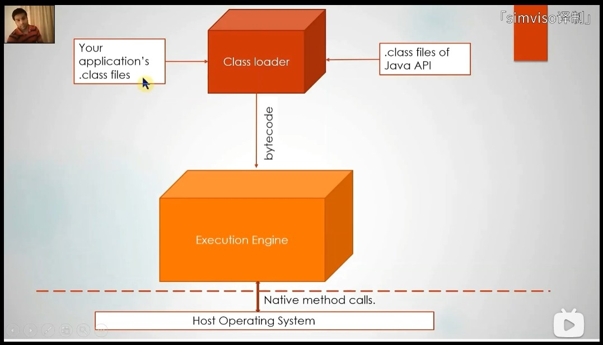
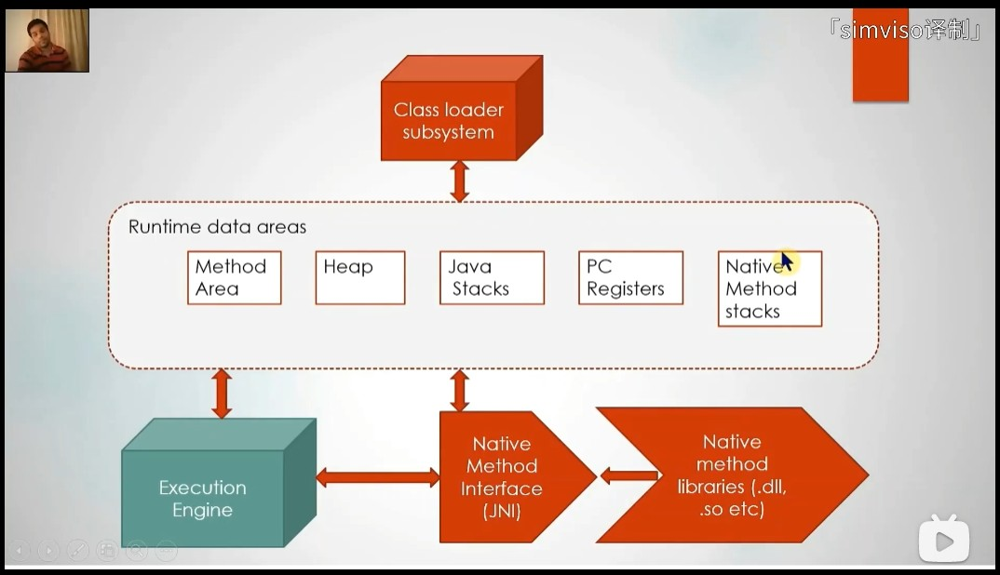
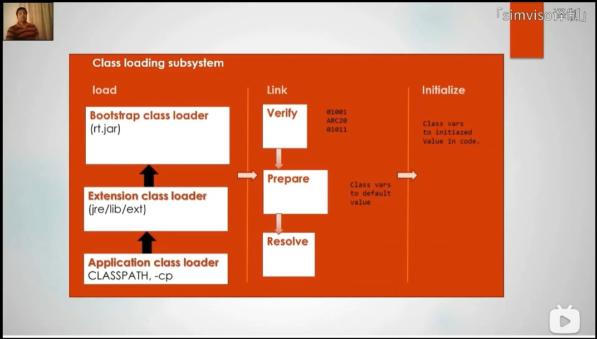
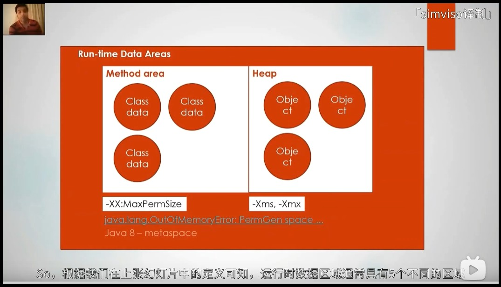
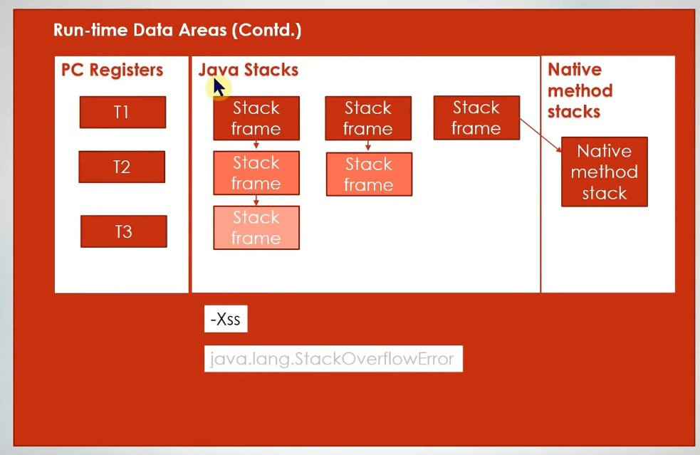
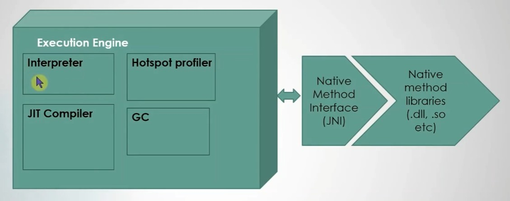

# 笔记

## To load and execute

1. `Edit MyApp.java file`
2. `javac MyApp.java`
3. `java MyApp`（此时会创建`JVM`实例）

## JVM实例如何加载并执行你的.class文件（流程)

首先是类加载器(`class loader`)，它负责加载你的`.class`文件以及系统内置的`.class`文件，比如`String.class`、`Object.class`。

类加载器将加载后的`.class`文件即字节码指令传递给执行引擎(`execution engine`)。

随后执行引擎去执行字节码，为了执行字节码或者说指令，执行引擎必须和`OS`交互才能执行指令（字节码对应的机器指令集），为此，执行引擎使用了本地方法调用(`native method calls`)，最终将字节码转化为执行操作的机器码。

## JVM架构

### 类加载子系统（class loader subsystem）

`load`阶段负责将字节码加载到内存中，它可以从任何来源读取`.class`文件，比如：`.class`文件、包含`.class`文件的`jar`包。

(面试点)`load`阶段将执行三个类加载器：

1. 启动类加载器：负责加载`Java`的内部类，内部类位于和`JVM`实现一起发行的`rt.jar`中。
2. 扩展类加载器：负责加载`jre/lib/ext`文件夹下的其它应用程序的`jar`文件。
3. 系统类加载器：负责加载类路径环境变量所指定位置的类，`CLASSPATH`变量、`-cp`指令。

`ClassNotFoundException`就是发生在这个阶段，当类加载器找不到字节码对应的类时，就会发生该异常。

`link`阶段分为三个阶段：

1. 验证：对类加载器提交的字节码进行验证，查看其是否为一个有效的`Java`字节码。
2. 准备：为类文件中的静态变量即类变量分配内存，注意这里它只进行内存"分配"，就是分配好内存，初始化为默认值，例如：`public static boolean isCorrect = true`，它将为其分配内存，并把它初始化为默认值`false`（`JVM`规范）。
3. 解析：解析当前类的符号引用，例如引用另外的其它两个类或者常量池中的两个值，这些符号会被转变为实际的引用。

以上三个阶段在执行过程上会有所重叠，例如一个类在进行解析，那么下一个类就可以进行验证。

在解析阶段可能发生`ClassDefNotFound`异常，比如我要加载一个`X`类，它通过了之前的加载阶段以及上述的验证和准备阶段，但是`X`类引用了另一个叫做`Y`的类，系统会尝试加载这个`Y`类，如果没找到，就会发生上述异常，对于`X`类来说，`ClassDefNotFound`对找不到`Y`的异常`ClassNotFoundException`进行了包装。

`initialize`阶段使用静态初始化器对类变量进行初始化，例如上述所提到的`isCorrect`变量的实际值`true`将设置到其内存区域。

### 运行时数据区（runtime data areas）

**方法区**：存放类数据（对应类的元数据`metadata`）的地方，`Class`类就用于访问方法区中的数据，静态变量、字节码、类级别的常量池等等都在该区域当中，方法区位于系统分配给`JVM`的内存中，方法区也称为永久代，默认为其分配`64MB`，可以使用`-XX MaxPermSize`来调整永久代的大小，假设加载一个包含有一百万个类的应用程序，但是没有设置永久代的大小的话，可能会遇到`OutOfMemoryError`错误。

`Java8`开始去除了方法区，现在被称为元空间（`metaspace`），具体的做法就是将方法区迁移到本地`OS`的一块单独内存里，这块内存就被称为元空间，默认情况下，`Java8`的元空间没有大小限制，只要`OS`允许，它的大小可以一直增长，直到内存满了，或者将其转移到虚拟内存或类似虚拟内存的地方。

**堆**：存放对象数据的地方，每实例化一个对象，该对象就会在堆中被创建，任何与类有关的内容，都会在堆中创建，例如：实例变量，堆是非常重要的一块内存区域，可以使用`-Xms`调整最小值，用`-Xmx`调整最大值，默认情况下，它的最小值为物理内存的四分之一。

**程序计数器**：记录每个线程将要执行的下一条指令的指针。

**`Java`虚拟机栈**：包含与每个线程所执行的当前方法相对应的栈帧，例如线程`t1`正在执行某个方法，此时会将该方法的栈帧入栈，如果途中调用了其它方法，也会将其它方法的栈帧入栈，之后栈帧根据方法返回的方式出栈，栈帧中包含了当前执行方法相关的数据，栈帧就是一块内存区域，包含了这个方法的参数、参数数组、返回值和方法中的局部变量，操作栈就是用来执行方法所指定操作的临时区域。

尝试执行一个递归方法而没有写中止条件时，此时递归方法的栈帧就会在栈上无限累加，导致的结果就是该内存区域（数据区域）将耗尽内存，此时将得到`StackOverflowError`异常。可以使用`-Xss`参数指明栈的大小。

注意是每个线程都会创建属于自己的`Java`虚拟机栈。

**本地方法栈**：如果执行的方法尝试执行一个本地方法，例如尝试加载`DLL`，此时还会创建本地方法栈。

方法区和堆区不是线程私有的，每个`JVM`实例都有一个方法区和一个堆区。

程序计数器、`Java`虚拟机栈、本地方法栈是线程独立的，互相看不到对方的内容，这样执行可以保证线程是安全的。

### 执行引擎（execution engine）

它由四个组件构成：

1. 解释器（`interpreter`）
2. `JIT`编译器（`JIT compiler`，`just-in-time compiler`）
3. `HotSpot`分析器（又叫`HotSpot VM`)
4. `GC`

**解释器**将字节码解释为机器码并执行。反复执行的代码不会被反复解释，而是直接通过`JIT`**编译器**编译成与本地平台相关的机器码后用于反复执行。这些反复执行的部分也叫`HotSpot Code`，`HotSpot`**分析器**负责监视正在运行的字节码，获取统计信息，用于各种途径，例如指出反复执行的代码，交由`JIT`编译器对这些字节码进行及时编译。`GC`则负责清理不再使用的类对象和内存。

执行就是通过调用本地方法接口（`JNI`）来完成和本地方法库的交互，`jre/bin`目录中有许多的`.dll`文件，这些是执行引擎使用的特定于平台的本地库，如果是`Unix`或`Linux`系统，则是`.so`文件或`.a`文件。
