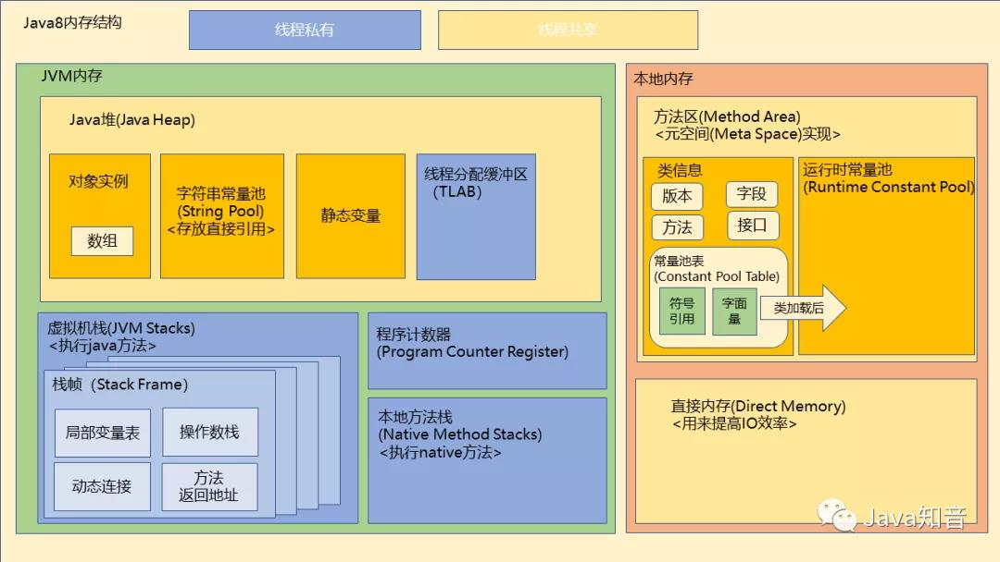

# 笔记

## 内存结构


## 字节码增强

字节码增强技术相当于是一把打开运行时JVM的钥匙，利用它可以动态地对运行中的程序做修改，也可以跟踪JVM运行中程序的状态。此外，我们平时使用的动态代理、AOP也与字节码增强密切相关，它们实质上还是利用各种手段生成符合规范的字节码文件。综上所述，掌握字节码增强后可以高效地定位并快速修复一些棘手的问题（如线上性能问题、方法出现不可控的出入参需要紧急加日志等问题），也可以在开发中减少冗余代码，大大提高开发效率。

## SPI机制

[参考](https://blog.csdn.net/qq_31854907/article/details/107610282)

里面的图非常经典，可以这样理解API和SPI的区别。

API是服务方来实现，客户方来调用；SPI是服务方来调用，客户方来实现。

服务方提供接口定义后，客户方进行实现，然后根据规则，在`META-INF/services`目录下建立名称为接口全限定类名的文件，里面填入客户方自己实现好的实现类的全限定类名，然后服务方就会通过`ServiceLoader.load(interface_name.class);`将实现类加载到程序当中，进行后续处理。

比如MySQLJAR包，在它的`META-INF/services/`目录下就有`java.sql.Driver`文件，文件内容为`com.mysql.cj.jdbc.Driver`，而Java的`DriverManager`在初始化时就已经将这类符合规则的驱动实现类都加载到程序当中，因此我们可以直接通过`getConnection`方法来获取连接对象，不需要手动进行加载。

而对于向OracleJAR包，它并没有按照规则填写上述信息，因此需要程序员手动进行加载后才能使用。

```java
// com.mysql.cj.jdbc.Driver
public class Driver extends NonRegisteringDriver implements java.sql.Driver {
    //
    // Register ourselves with the DriverManager
    //
    static {
        try {
            // 当我们使用Class.forName方法来验证包是否导入时，实际上就会触发此静态代码块的执行，
            // 它将MySQL提供的实现类本身注册到了DriverManager中:
            java.sql.DriverManager.registerDriver(new Driver());
        } catch (SQLException E) {
            throw new RuntimeException("Can't register driver!");
        }
    }

    /**
     * Construct a new driver and register it with DriverManager
     * 
     * @throws SQLException
     *             if a database error occurs.
     */
    public Driver() throws SQLException {
        // Required for Class.forName().newInstance()
    }
}
```

```java
// DriverManager的静态代码块:
static {
    loadInitialDrivers();
    println("JDBC DriverManager initialized");
}
// loadInitialDrivers内部的一些关键语句，
// 可以看到DriverManager在初始化时就完成了对符合SPI规则的实现类进行了加载:
ServiceLoader<Driver> loadedDrivers = ServiceLoader.load(Driver.class);
Iterator<Driver> driversIterator = loadedDrivers.iterator();
println("DriverManager.initialize: jdbc.drivers = " + drivers);
```

DriverManager内部的方法完全基于接口来进行调用，而接口的实现就由客户方来进行提供。

## 垃圾回收

所谓的垃圾回收实际上就是记录某段空间的起始结束地址，交给空闲队列，下次有新对象时，只要对这部分空间进行覆盖即可。

## 对象引用的等级

我们最常用的就是强引用，即`User user = new User();`，而其它引用级别也都提供有相应的方法来创建其对象。

除了强引用之外，其它的引用都是通过一个中间对象来对具体的对象进行再引用，即先强引用中间对象，再由中间对象引用具体对象。

软引用可以在一些对内存比较敏感的运行环境中使用。

软引用的引用对象在某次由于内存不足而发生的垃圾回收活动中会被全部回收，而弱引用的对象会被逐个回收直至空间满足，以上场景是发生对新生代的回收，如果触发了Full GC，则弱引用的对象也会被全部回收，再放入新的对象。

中间引用对象自身的回收需要配合引用队列。

## 直接内存

最大堆外内存可通过参数`MaxDirectMemorySize`进行设置。

直接内存是直接向系统申请的内存空间，也可称为本地内存，它受到操作系统本身的内存限制。

直接内存的出现是为了能在I/O操作中减少数据来回拷贝的次数，提升传输效率。

直接内存的回收需要程序员手动来进行回收，它不受JVM内存回收机制管理。

直接内存分配和回收的成本较高，因为需要向操作系统发出请求，由操作系统间接分配空间；但是对于堆内存，JVM本身自己就可以实行分配。

```java
// 分配本地内存空间:
ByteBuffer byteBuffer = ByteBuffer.allocateDirect​(int capacity);
// 释放本地内存空间:
byteBuffer = null;
System.gc();
```

如果禁用了`System.gc()`显式回收，那就有可能造成直接内存的`OOM`错误，此时可以考虑更底层的`unsafe`中的方法进行回收。

## 永久代

永久代的垃圾回收频率比起堆内存来说很低，而字符串常量池本身就是一个经常使用到的空间，因此如果不经常对其进行垃圾回收，会导致永久代的内存溢出，所以JDK8在替换永久代时顺便把字符串常量池从永久代中移出放到堆内存中，享受堆内存的高频率垃圾回收事件。

## 字符串常量池

字符串的intern方法在JDK6会拷贝一次再放入字符串常量池，这就导致调用方法的字符串对象和返回的字符串对象地址不一致，而JDK8会直接将调用方法的字符串对象放入常量池，这样返回的对象和调用方法的对象地址是一致的。

intern方法返回的是常量池中的对象。

也就是说JDK8会将堆中的字符串对象经过intern方法调用会转移到常量池中，而JDK6因为拷贝操作，因此堆中仍存在该字符串对象，它和常量池中的对象不是同一个对象。

字符串常量池是一个哈希表结构，因此哈希表的桶个数大小将影响入池操作的效率，太大空间占用高，太小入池操作久。

如果有大量的重复字符串，可以考虑将字符串入池减少对内存的占用。

## 字符串再解析

字符串**变量**的拼接操作(`+`号)在底层都是调用的`new StringBuilder().append("xxx").append("xxx").toString()`并返回一个新的字符串对象(JDK8)。

字符串**常量**的拼接操作会到常量池中寻找匹配对象，如果有则直接返回串池中的对象，这是JVM在编译期间的优化。

```java
String s1 = "a";       // 串池中
String s2 = "b";       // 串池中
String s3 = "ab";      // 串池中
String s4 = s1 + s2;   // 堆中
String s5 = "a" + "b"; // 串池中
String x1 = new String("a") + new String("b"); // 创建了三个堆中的字符串对象
```

## 面向客户端和面向服务端的垃圾收集器

面向客户端，表示允许暂停用户线程或者说停顿事件较长，因为客户端不像服务端那样要服务其它客户端，不能出现很严重的停顿情况。

## 代码、字节码、机器码

常见的编译型语言如C++，通常会把代码直接编译成CPU所能理解的机器码来运行。而Java为了实现“一次编译，处处运行”的特性，把编译的过程分成两部分，首先它会先由javac编译成通用的中间形式——字节码，然后再由解释器逐条将字节码解释为机器码来执行。所以在性能上，Java通常不如C++这类编译型语言。

`.java`文件即代码文件，经过`javac`编译(前端编译器)得到`.class`文件即字节码文件，每个`0xXX`(1Byte)字节码都对应一条Java指令，因此字节码文件也可称为Java虚拟机指令文件。

转为字节码文件后，就是要运行程序。有两种选择：

- 一是Java解释器逐条将字节码解释为机器码来执行；
- 二是使用JIT编译器将字节码转为本地机器代码。

这两种方式的区别在于，前者启动速度快但运行速度慢，而后者启动速度慢但运行速度快。至于为什么会这样，其原因很简单。因为解释器不需要像 JIT 编译器一样，将所有字节码都转化为机器码，**自然就少去了优化的时间**。而当 JIT 编译器完成第一次编译后，其会将字节码对应的机器码保存下来，下次可以直接使用。而我们知道，机器码的运行效率肯定是高于 Java 解释器的。所以在实际情况中，为了运行速度以及效率，**我们通常采用两者相结合的方式进行 Java 代码的编译执行**。

## 指令乱序执行

Java或者说各种语言的编译器都会在编译的时候进行一定程度上的优化，重新调整语句顺序，拆解循环等等。当然这需要打开优化功能。

对于Java来说，这步是在JVM虚拟机里做的。本身Java编译器（把.java编译成.class的那个）不会做到这点。

现代CPU都是以流水线方式，将JVM或者说操作系统送过来的优化好的**二进制指令**进一步拆解成**微指令**执行的。在这过程中CPU会进行指令重排等各种优化，这些大部分都是硬件级别的机制。

你可以简单理解为一堆人排队打疫苗，JVM会把屋子外面排队的那些人根据个体情况调整排队顺序。CPU相当于把屋子里面的人根据打疫苗的不同**步骤**进行再次重排。

**总结：虚拟机和CPU都会对造成指令乱序**。

## 逃逸分析

方法逃逸：对象被作为调用参数从一个方法传递到另外一个方法。

线程逃逸：对象被其它线程访问到，例如赋值给其它线程可以访问的实例变量。

如果能证明一个对象不会逃逸到方法或线程之外，或者逃逸程度比较低，则可能为这个对象实例采取不同程度的优化。

栈上分配：堆是用来存放对象的，这就要涉及堆内存的分配与回收。如果一个对象可以直接在栈上分配，随着栈帧入栈被创建，出栈被销毁，这就减轻了虚拟机垃圾回收的压力。如果确定一个对象不会逃逸出线程之外，那么让这个对象在栈上分配就是一个不错的选择。在一般应用中，完全不会逃逸的局部对象和不会逃逸出线程的对象所占的比例是很大的。栈上分配可以支持方法逃逸，但不支持线程逃逸。

标量替换：基本类型无法被分解，这称为标量；聚合量则是一个数据可以再度被分解，对象就是典型的聚合量。如果逃逸分析能证明一个对象不会被方法外部访问，并且这个对象可以被拆散，那么程序执行时就不会创建这个对象，而改为直接创建它的若干个被这个方法使用的成员变量来代替。对象拆分后，可以让对象的成员变量直接在栈上分配和读写。可以将标量替换视为栈上分配的一种特例，但它要求更高，不允许方法逃逸。

同步消除：一个对象如果不会发生线程逃逸，那么就不会产生竞争，施加在对象上的同步措施可以被消除。

## 自动拆装箱原理

自动拆装箱其实是Java编译器提供的语法糖之一，它会在.java文件被编译为.class文件时，自动生成和转换一些代码，减轻程序员的编码负担。

```java
// JDK5之前这段代码是无法编译通过的:
Integer x = 10;
int y = x;
```

```java
// 在JDK5之后编译器会将上述代码转换成“类似”如下形式的字节码:
Integer x = Integer.valueOf(10);
int y = x.intValue();
```

## JDK8内存结构图



## HotSpot细节

- 根节点枚举：找到所有可用于可达性分析的根节点，若是逐个检查每个变量是否为起源引用会消耗巨大时间，因此借助了名为OopMap的数据结构，虚拟机可以直接知道哪些地方存放着对象引用，可以直接到这些地方开始查找。
- 安全点：用来挂起线程，准备进行垃圾回收。
- 安全区域：不会改变对象引用的代码块，如果代码运行至该区域，虚拟机不会去注意这些线程，线程执行要离开安全区域时会等待虚拟机是否完成了垃圾回收才离开。
- 记忆集和卡表：前者是抽象，后者是具体实现，用来记录从非收集区域指向收集区域的指针集合的数据结构。卡表会标记一块固定大小的内存区域是否存在跨代引用指针，如果存在，则不允许回收，防止后续代码调用出现问题。
- 写屏障：在对象赋值时维护卡表的正确性，它属于机器码层面，把维护卡表的动作放到每一个赋值操作之中。写屏障可以看作在虚拟机层面对”引用类型字段赋值“这个动作的AOP切面，分为写前屏障和写后屏障，在写后屏障会完成卡表的更新。由于存在伪共享，两个线程中代码的写屏障刚好对同一个缓存行进行操作，在写回主内存时，就会导致卡表的重复更新，因此在更新卡表前判断卡表元素是否已经变脏，如果已经变脏则不需要更新卡表。
- ”并发“的可达性分析：为了防止可达性标记随着对象的增多，造成用户线程停顿的时间越长。首先，我们必须在保障一致性的快照上进行可达性分析，（一个原本存活的对象错误标记为已消亡，将造成致命的后果）。借助”三色法“可以将可达性分析的扫描过程比喻成一股以灰色为波峰的波纹从黑向白的推进过程。要解决并发扫描时的对象消失问题，有两种解决方案：1.增量更新，如果并发过程中，黑色对象插入新的指向白色对象的引用关系时，需要记录下来重新扫描一次（相当于将其置为灰色）。2.原始快照，当灰色对象要删除指向白色对象的引用关系时，需要记录下来重新扫描，也就是将这个时候引用关系进行快照，这样之后才能从灰色对象继续向白色对象进行扫描。

## G1

1. 基于region。
2. 停顿预测模型。
3. Mixed GC。
4. 把连续的Java堆划分为多个大小相等的独立region，每一个region可以根据需要，扮演新生代的Eden空间，survivor空间，或者老年代空间。
5. humongous区域。
6. 根据收集停顿时间回收价值收益最大的region。
7. 每个region都需要维护卡表，内存消耗更高。
8. 并发标记基于原始快照模式，设计了名为TMAS的指针，用于并发回收时的新对象分配。
9. 以衰减均值为理论基础建立可靠的停顿预测模型。

## 写屏障

通过记忆集来缩减GC Roots扫描范围的问题，而卡表是记忆集的一种具体实现，卡表的维护问题可以通过“写后屏障”技术来解决。

“写屏障”可以看作在虚拟机层面对“引用类型字段赋值”这个动作的AOP切面，在引用对象赋值时会产生一个环形通知，供程序执行额外的动作，也就是说赋值的前后都在写屏障的覆盖范畴内。

应用写屏障后，虚拟机就会在所有的引用字段赋值操作后生成相应的指令，通过该指令完成卡表状态的更新。

为了避免伪共享造成多次对同一个卡表进行更新，可以选择在更新卡表状态前进行一次判断，如果卡表已经变脏，那就不需要再次变脏。
