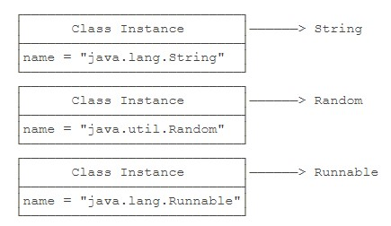
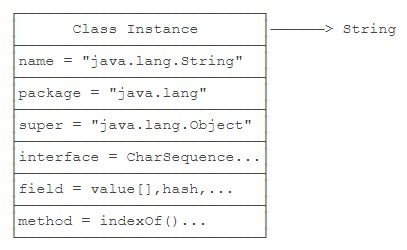

# 什么是反射

反射是为了解决在运行期，对某个实例一无所知的情况下，如何调用其方法。

## Class类

class（包括interface）的本质是**数据类型**（Type）。无继承关系的数据类型无法赋值。而class是由JVM在执行过程中动态加载的。JVM在第一次读取到一种class类型时，将其加载进内存。每加载一种class，JVM就为其创建一个Class类型的实例，并关联起来。注意：这里的Class类型是一个名叫Class的class。以String类为例，当JVM加载String类时，它首先读取String.class字节码文件到内存，然后，为String类创建一个Class实例并关联起来。

```Java
Class cls = new Class(String);
```

这个Class实例是JVM内部创建的，如果我们查看JDK源码，可以发现Class类的构造方法是private，只有JVM能创建Class实例，我们自己的Java程序是无法创建Class实例的。所以，JVM持有的每个Class实例都指向一个数据类型（class或interface）。



一个Class实例包含了该class的所有完整信息。



**由于JVM为每个加载的class创建了对应的Class实例**，并在实例中保存了该class的所有信息，包括类名、包名、父类、实现的接口、所有方法、字段等，因此，如果获取了某个Class实例，我们就可以通过这个Class实例获取到该实例对应的class的所有信息。**这种通过Class实例获取class信息的方法称为反射（Reflection）**。

```Java
// 直接通过一个class的静态变量class获取
Class cls = String.class;
// 如果我们有一个实例变量，可以通过该实例变量提供的getClass()方法获取
String s = "Hello";
Class cls = s.getClass();
// 如果知道一个class的完整类名，可以通过静态方法Class.forName()获取
Class cls = Class.forName("java.lang.String");
```

**因为Class实例在JVM中是唯一的（每一个完整类名都是唯一的）**，所以，上述方法获取的Class实例是同一个实例。可以用==比较两个Class实例。用instanceof不但匹配指定类型，还匹配指定类型的子类。而用==判断class实例可以精确地判断**数据类型**，但不能作子类型比较。**通常情况下，我们应该用instanceof判断数据类型，因为面向抽象编程的时候，我们不关心具体的子类型**。只有在需要精确判断一个类型是不是某个class的时候，我们才使用==判断class实例。因为反射的目的是为了获得某个实例的信息。因此，当我们拿到某个Object实例时，我们可以通过反射获取该Object的class信息。

```Java
public class Main {
    public static void main(String[] args) {
        printClassInfo("".getClass());
        printClassInfo(Runnable.class);
        printClassInfo(java.time.Month.class);
        printClassInfo(String[].class);
        printClassInfo(int.class);
    }

    static void printClassInfo(Class cls) {
        System.out.println("Class name: " + cls.getName());                    // 完整类名
        System.out.println("Simple name: " + cls.getSimpleName());             // 类名
        if (cls.getPackage() != null)
            System.out.println("Package name: " + cls.getPackage().getName()); // 包名
        System.out.println("is interface: " + cls.isInterface());              // 是否为接口
        System.out.println("is enum: " + cls.isEnum());                        // 是否为枚举
        System.out.println("is array: " + cls.isArray());                      // 是否为数组
        System.out.println("is primitive: " + cls.isPrimitive());              // 是否为基本类型
    }
}
```

注意到数组（例如String[]）也是一种Class，而且不同于String.class，它的类名是[Ljava.lang.String。此外，JVM为每一种基本类型如int也创建了Class，通过int.class访问。如果获取到了一个Class实例，我们就可以通过该Class实例来创建对应类型的实例。

```Java
Class cls = String.class;
String s = (String) cls.newInstance();
```

上述代码相当于new String()。通过Class.newInstance()可以创建类实例，它的局限是：**只能调用public的无参数构造方法**。带参数的构造方法，或者非public的构造方法都无法通过Class.newInstance()被调用。**JVM在执行Java程序的时候，并不是一次性把所有用到的class全部加载到内存，而是第一次需要用到class时才加载。这就是JVM动态加载class的特性**。动态加载class的特性对于Java程序非常重要。利用JVM动态加载class的特性，我们才能在**运行期**根据条件加载不同的实现类。例如，Commons Logging总是优先使用Log4j，只有当Log4j不存在时，才使用JDK的logging。这就是为什么我们只需要把Log4j的jar包放到classpath中，Commons Logging就会自动使用Log4j的原因。

```Java
// Commons Logging优先使用Log4j
LogFactory factory = null;
if (isClassPresent("org.apache.logging.log4j.Logger")) {
    factory = createLog4j();
} else {
    factory = createJdkLog();
}

boolean isClassPresent(String name) {
    try {
        // 尝试使用该class的完整类名来获取对应的Class实例
        Class.forName(name);
        return true;
    } catch (Exception e) {
        return false;
    }
}
```

## 访问字段

- Field getField(name)：根据字段名获取某个**public**的field（包括父类）。
- Field getDeclaredField(name)：根据字段名获取当前类的某个显式field（不包括父类）。**子类的private字段Field对象也可以被获取，父类的private字段本身没有被继承**。
- Field[] getFields()：获取所有**public**的field（包括父类）。
- Field[] getDeclaredFields()：获取当前类的所有显式field（不包括父类）。

```Java
public class Person {
    public String name;
}
public class Student extends Person {
    public int score;
    private int grade;
}
public static void main(String[] args) throws NoSuchFieldException {
    Class stdClass = Student.class;                         // 获取Student的Class实例
    System.out.println(stdClass.getField("score"));         // 获取public字段Field对象
    System.out.println(stdClass.getField("name"));          // 获取继承的public字段Field对象
    System.out.println(stdClass.getDeclaredField("grade")); // 获取private字段Field对象
    /*
    * 修饰符/字段数据类型/完整字段名
    * public int com.cat.reflection.Student.score
    * public java.lang.String com.cat.reflection.Person.name
    * private int com.cat.reflection.Student.grade
    */
}
```

- getName()：返回字段名称，例如，"name"。
- getType()：返回字段类型，也是一个Class实例，例如，String.class。
- getModifiers()：返回字段的修饰符，它是一个int，不同的bit表示不同的含义。

```Java
Field f = String.class.getDeclaredField("value");
System.out.println(f.getName());             // 获取字段名称
System.out.println(f.getType());             // 获取字段类型
int m = f.getModifiers();
System.out.println(Modifier.isFinal(m));     // 是否被final修饰
System.out.println(Modifier.isPublic(m));    // 是否被public修饰
System.out.println(Modifier.isProtected(m)); // 是否被protected修饰
System.out.println(Modifier.isPrivate(m));   // 是否被private修饰
System.out.println(Modifier.isStatic(m));    // 是否被static修饰
```

```Java
Person p = new Person("Ming");
Class c = p.getClass();               // 获取Class对象
Field f = c.getDeclaredField("name"); // 获取Field对象
f.setAccessible(true);                // 无视字段修饰符限制，一律允许访问
f.set(p, "Gang");                     // 调用set()方法传入指定实例及特定值修改示例中对应字段的值
Object value = f.get(p);              // 调用get()方法传入指定实例获取实例中对应字段的值
System.out.println(value);
```

正常情况下，我们总是通过p.name来访问Person的name字段，编译器会根据public、protected和private决定是否允许访问字段，这样就达到了数据封装的目的。**反射是一种非常规的用法**，使用反射，首先代码非常繁琐，**其次，它更多地是给工具或者底层框架来使用，目的是在不知道目标实例任何信息的情况下，获取特定字段的值**。此外，setAccessible(true)可能会失败。如果JVM运行期存在SecurityManager，那么它会根据规则进行检查，有可能阻止setAccessible(true)。例如，某个SecurityManager可能不允许对java和javax开头的package的类调用setAccessible(true)，这样可以保证JVM核心库的安全。

## 调用方法

- Method getMethod(name, Class...)：获取某个**public**的Method（包括父类）。
- Method getDeclaredMethod(name, Class...)：获取当前类的某个显式Method（不包括父类）。
- Method[] getMethods()：获取所有**public**的Method（包括父类）。
- Method[] getDeclaredMethods()：获取当前类的所有显式Method（不包括父类）。

```Java
Class stdClass = Student.class;
System.out.println(stdClass.getMethod("getScore", String.class));      // 获取public方法Method对象，根据后面所跟的可变数组确定参数类型及个数来区分不同方法
System.out.println(stdClass.getMethod("getName"));                     // 获取继承的public方法Method对象
System.out.println(stdClass.getDeclaredMethod("getGrade", int.class)); // 获取private方法Method对象
/*
    * 修饰符/返回值数据类型/完整方法名/参数类型列表
    * public int com.cat.reflection.Student.getScore(java.lang.String)
    * public java.lang.String com.cat.reflection.Person.getName()
    * private int com.cat.reflection.Student.getGrade(int)
    */
```

- getName()：返回方法名称，例如："getScore"。
- getReturnType()：返回方法返回值类型，也是一个Class实例，例如：String.class。
- getParameterTypes()：返回方法的参数类型，是一个Class数组，例如：{String.class, int.class}。
- getModifiers()：返回方法的修饰符，它是一个int，不同的bit表示不同的含义。

```Java
// 通过反射调用实例方法
String s = "Hello, World!";
Method m = String.class.getMethod("substring", int.class); // 根据方法名称以及参数列表获取Method对象
String r = (String) m.invoke(s, 6);                        // 对Method实例调用invoke就相当于调用该方法，第一个参数是对象实例，后面是与方法参数一致的可变参数
```

```Java
// 通过反射调用静态方法
Method m = Integer.class.getMethod("parseInt", String.class);
Integer n = (Integer) m.invoke(null, "12345");             // 静态方法不需要实例对象，因此第一个参数为null
```

```Java
// 通过反射调用private方法
Person p = new Person();
Method m = p.getClass().getDeclaredMethod("setName", String.class);
m.setAccessible(true);
m.invoke(p, "Bob");
```

使用反射调用方法时，仍然**遵循多态原则**：即总是调用**实际类型**的覆写方法（如果存在）。

## 调用构造方法

调用Class.newInstance()的局限是，它只能调用该类的public无参数构造方法。如果构造方法带有参数，或者不是public，就无法直接通过Class.newInstance()来调用。为了调用任意的构造方法，Java的反射API提供了Constructor对象，它包含一个构造方法的所有信息，可以创建一个实例。Constructor对象和Method非常类似，不同之处仅在于它是一个构造方法，并且，调用结果总是返回实例。

```Java
Constructor cons1 = Integer.class.getConstructor(int.class);
Integer n1 = (Integer) cons1.newInstance(123);
System.out.println(n1);

Constructor cons2 = Integer.class.getConstructor(String.class);
Integer n2 = (Integer) cons2.newInstance("456");
System.out.println(n2);
```

- getConstructor(Class...)：获取某个**public**的Constructor。
- getDeclaredConstructor(Class...)：获取某个Constructor。
- getConstructors()：获取所有**public**的Constructor。
- getDeclaredConstructors()：获取所有Constructor。
- 注意Constructor只包含**当前类定义的构造方法**，和父类无关，因此不存在多态的问题。
- 调用非public的Constructor时，必须首先通过setAccessible(true)设置允许访问。setAccessible(true)可能会失败。

## 获取继承关系

```Java
// 获取父类的Class
Class i = Integer.class;
Class n = i.getSuperclass();
```

```Java
// 获取父接口的Class，可能含有多个父接口
Class s = Integer.class;
Class[] is = s.getInterfaces(); // 只返回当前类直接实现的接口类型，并不包括其父类实现的接口类型
```

对所有interface的Class调用getSuperclass()返回的是null，**获取接口的父接口**要用getInterfaces()

```Java
// 当我们判断一个实例是否是某个类型时，正常情况下，使用instanceof操作符
Object n = Integer.valueOf(123);
boolean isDouble = n instanceof Double; // false
boolean isInteger = n instanceof Integer; // true
boolean isNumber = n instanceof Number; // true，可向上转型
boolean isSerializable = n instanceof java.io.Serializable; // true

// 如果是两个Class实例，要判断一个向上转型是否成立，可以调用isAssignableFrom()来代替instanceof
// Integer i = ?
Integer.class.isAssignableFrom(Integer.class); // true，因为Integer可以赋值给Integer
// Number n = ?
Number.class.isAssignableFrom(Integer.class); // true，因为Integer可以赋值给Number
// Object o = ?
Object.class.isAssignableFrom(Integer.class); // true，因为Integer可以赋值给Object
// Integer i = ?
Integer.class.isAssignableFrom(Number.class); // false，因为Number不能赋值给Integer
```

## 动态代理

Java标准库提供了一种动态代理（Dynamic Proxy）的机制：可以在运行期动态创建某个interface的实例。

所谓动态代理，是和静态相对应的。来看我们通常编写代码的方式。

```Java
// 定义接口
public interface Hello {
    void morning(String name);
}
// 编写实现类
public class HelloWorld implements Hello {
    public void morning(String name) {
        System.out.println("Good morning, " + name);
    }
}
// 创建实例，向上转型为接口并调用方法
Hello hello = new HelloWorld();
hello.morning("Bob");
```

还有一种方式是动态代理，我们仍然先定义了接口Hello，但是我们并不去编写实现类，而是直接通过JDK提供的一个Proxy.newProxyInstance()创建了一个Hello接口对象。**这种没有实现类但是在运行期动态创建了一个接口对象的方式，我们称为动态代理**。JDK提供的动态创建接口对象的方式，就叫动态代理。

```Java
public interface Hello {
    void morning(String name);
}

public static void main(String[] args) {
    InvocationHandler handler = new InvocationHandler() {
        @Override
        public Object invoke(Object proxy, Method method, Object[] args) throws Throwable {
            // 在invoke方法内实现代理接口方法的逻辑:
            System.out.println(method);
            if (method.getName().equals("morning"))
                System.out.println("Good morning, " + args[0]);
            return null;
        }
    };

    Hello hello = (Hello) Proxy.newProxyInstance(
            Hello.class.getClassLoader(),
            new Class[]{Hello.class},
            handler
    );

    hello.morning("Bob");
}
```

在运行期动态创建一个interface实例的方法如下：

1. 定义一个InvocationHandler实例，它**负责实现接口的方法调用**；
2. 通过Proxy.newProxyInstance()**创建interface实例**，它需要3个参数：
    1. 使用的ClassLoader，通常就是接口类的ClassLoader；
    2. 需要实现的接口数组，至少需要传入一个接口进去；
    3. 用来处理接口方法调用的InvocationHandler实例。
3. 将返回的Object强制转型为接口。

动态代理实际上是JDK在运行期动态创建class字节码并加载的**过程**，它并没有什么黑魔法，把上面的动态代理改写为静态实现类大概长这样。

```Java
public class HelloDynamicProxy implements Hello {
    InvocationHandler handler;

    public HelloDynamicProxy(InvocationHandler handler) {
        this.handler = handler;
    }

    @Override
    public void morning(String name) {
        // 调用接口方法时，实际上是在调用InvocationHandler的invoke方法:
        this.handler.invoke(
                this,
                Hello.class.getMethod("morning", String.class)),
                new Object[]{name};
    }
}
```

其实就是JDK帮我们**自动编写**了一个上述类（不需要源码，可以直接生成字节码），**并不存在可以直接实例化接口的黑魔法**。
