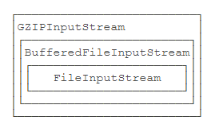
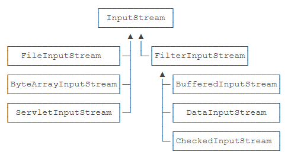
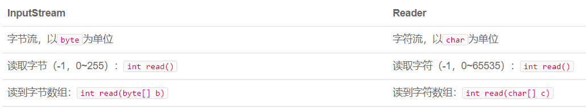
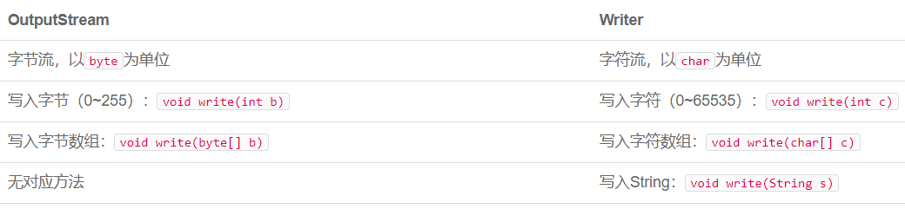

# IO

## 前言

IO是指Input/Output，即输入和输出。以**内存**为中心。因为代码是在内存中运行的，数据也必须读到内存，最终的表示方式无非是byte数组，字符串等，都必须存放在内存里。从Java代码来看，输入实际上就是从外部，例如，硬盘上的某个文件，把内容读到内存，并且以Java提供的某种数据类型表示，例如，byte数组，String，这样，后续代码才能处理这些数据。因为内存有“易失性”的特点，所以必须把处理后的数据以某种方式输出，例如，写入到文件。Output实际上就是把Java表示的数据格式，例如，byte数组，String等输出到某个地方。

IO流是一种**顺序**读写数据的模式，它的特点是单向流动。数据类似自来水一样在水管中流动，所以我们把它称为IO流。IO流以**byte**（字节）为最小单位，因此也称为**字节流**。在Java中，**InputStream代表输入字节流**，**OuputStream代表输出字节流**，这是**最基本**的两种IO流。

如果我们需要读写的是字符，并且字符不全是**单字节**表示的ASCII字符，那么，按照char来读写显然更方便，这种流称为**字符流**。Java提供了Reader和Writer表示字符流，字符流传输的最小数据单位是char。因此，Reader和Writer本质上是一个能**自动编解码**的InputStream和OutputStream。

使用Reader，数据源虽然是字节，但我们读入的数据都是char类型的字符，原因是Reader内部把读入的byte做了解码，转换成了char。使用InputStream，我们读入的数据和原始二进制数据一模一样，是byte数组，但是我们可以自己把二进制byte数组按照某种编码转换为字符串。究竟使用Reader还是InputStream，要取决于具体的使用场景。**如果数据源不是文本，就只能使用InputStream，如果数据源是文本，使用Reader更方便一些**。Writer和OutputStream是类似的。

**同步IO是指，读写IO时代码必须等待数据返回后才继续执行后续代码，它的优点是代码编写简单，缺点是CPU执行效率低。异步IO是指，读写IO时仅发出请求，然后立刻执行后续代码，它的优点是CPU执行效率高，缺点是代码编写复杂**。

IO流是一种流式的数据输入/输出模型：二进制数据以byte为最小单位在InputStream/OutputStream中单向流动；字符数据以char为最小单位在Reader/Writer中单向流动。字节byte是二进制数据的计量单位，8个二进制位bit为1个字节byte。

## FIle对象

File对象有3种形式表示的路径，一种是getPath()，返回构造方法传入的路径，一种是getAbsolutePath()，返回绝对路径，一种是getCanonicalPath()，它和绝对路径类似，但是返回的是规范路径。绝对路径可以表示成`C:\Windows\System32\..\notepad.exe`，而**规范路径**就是把`.`和`..`转换成**标准的绝对路径**后的路径`C:\Windows\notepad.exe`。

```Java
public class FileObjectTest {
    public static void main(String[] args) throws IOException {
        File f = new File(".\\test.txt");
        System.out.println(f.getPath());
        System.out.println(f.getAbsolutePath());
        System.out.println(f.getCanonicalPath());
        System.out.println(f.isFile());
        // .\test.txt
        // D:\CODE\eclipse-workspace\Tutorial\.\test.txt
        // D:\CODE\eclipse-workspace\Tutorial\test.txt
        // true

        // 可以看到在 eclipse IDE 中，当前路径是整个项目的源路径，
        // 而不是 .java 文件所在的包路径，因此为了访问到 test.txt 文件，
        // 我应该将其放置在和 src 文件夹同级的目录路径下。
    }
}
```

File对象既可以表示文件，也可以表示目录。特别要注意的是，构造一个File对象，即使传入的文件或目录不存在，代码也不会出错，因为构造一个File对象，并不会导致任何磁盘操作。**只有当我们调用File对象的某些方法的时候，才真正进行磁盘操作**。

当File对象表示一个目录时，可以使用list()和listFiles()列出目录下的文件和子目录名。listFiles()提供了一系列重载方法，可以过滤不想要的文件和目录。

```Java
public class FileObjectTest {
    public static void main(String[] args) throws IOException {
        File f = new File("C:\\Windows");
        File[] fs1 = f.listFiles();
        printFiles(fs1);
        // listFiles() 接收一个 FilenameFilter 对象，
        // 根据 accept 方法的返回值来确定需要返回的文件和目录。
        File[] fs2 = f.listFiles(new FilenameFilter() {
            @Override
            public boolean accept(File dir, String name) {
                return name.endsWith(".exe");
            }
        });
        printFiles(fs2);
    }

    static void printFiles(File[] files) {
        System.out.println("==========");
        if (files != null) {
            for (File f : files) {
                System.out.println(f);
            }
        }
        System.out.println("==========");
    }
}
```

如果需要对目录进行复杂的拼接、遍历等操作，使用Path对象更方便。它位于java.nio.file包。Path对象和File对象类似，但操作更加简单。如果需要对目录进行复杂的拼接、遍历等操作，使用Path对象更方便。

```Java
public class FileObjectTest2 {
    public static void main(String[] args) {
        Path p1 = Paths.get(".", "project", "study");
        System.out.println(p1);
        // .\project\study
        Path p2 = p1.toAbsolutePath();
        // D:\CODE\eclipse-workspace\Tutorial\.\project\study
        System.out.println(p2);
        Path p3 = p2.normalize();
        System.out.println(p3);
        // D:\CODE\eclipse-workspace\Tutorial\project\study
        File f = p3.toFile();
        System.out.println(f);
        // D:\CODE\eclipse-workspace\Tutorial\project\study
        for (Path p : Paths.get("..").toAbsolutePath()) {
            // 遍历表示上一级目录的 Path 对象，会不断打印上一级目录名，
            // 直到无上一级目录存在。
            System.out.println(" " + p);
        }
    }
}
```

方法总结

```Java
File f = new File("绝对路径/相对路径");
f.getPath(); // 返回构造方法返回的路径
f.getAbsolutePath(); // 返回绝对路径
f.getCanonicalPath(); // 返回规范后的绝对路径
File.separator; // 当前平台的系统分隔符
f.isFile(); // 当前File对象是否是一个“已存在”的文件
f.isDirectory(); // 当前File对象是否是一个“已存在”的目录
f.canRead(); // 是否可读
f.canWrite(); // 是否可写
f.canExecute(); // 是否可执行，如果是目录则表示能否列出包含的文件和子目录
f.length(); // 文件字节大小
f.createNewFile(); // 创建一个新文件
f.delete(); // 删除该文件
File f = File.createTempFile("前缀", "后缀"); // 提供临时文件的前缀和后缀创建一个临时文件
f.deleteOnExit(); // JVM退出时自动删除文件，可用于删除临时文件
f.list(); // 当 File 对象表示目录时，用字符串数组列出目录下的文件和目录名
f.listFiles(); // 用 File 对象数组列出目录下的文件和目录对象
f.listFiles(FilenameFilter); // 接收一个 FilenameFilter 对象用于过滤不想要的文件和目录对象
f.mkdir(); // 创建目录，前提是最后一级目录之前的目录都存在
f.mkdirs(); // 创建目录，父目录不存在的情况下会创建父目录
f.delete(); // 删除目录，前提是目录必须为空
Path p = Paths.get(String first, String... more); // 构造一个 Path 对象
p.toAbsolutePath(); // 转换为绝对路径
p.normalize(); // 转换为规范路径
p.toFile(); // 转换为 File 对象
```

## InputStream

InputStream并不是一个接口，而是一个抽象类，它是所有输入流的超类。

利用Java 7引入的新的try(resource)的语法，只需要编写try语句，让编译器自动为我们关闭资源。

编译器并不会特别地为InputStream加上自动关闭。编译器只看try(resource)中的对象是否实现了java.lang.AutoCloseable接口，如果实现了，就自动加上finally语句并调用close()方法。

```Java
File f = new File("src\\hello.txt");
if (f.exists() && f.isFile() && f.canRead()) {
    System.out.printf("File %s byte length is %d.\n", f.getName(), f.length());
    try (InputStream input = new FileInputStream(f)) {
        int n;
        // 此处 read() 返回值是字节表示的 int 值。可以使用 (char) 将单个字节转换为字符。
        while ((n = input.read()) != -1)
            System.out.println(n);
    } // 编译器在此自动为我们写入 finally 并调用 close() 方法
}
```

在读取流的时候，一次读取一个字节并不是最高效的方法。很多流支持一次性读取多个字节到缓冲区，对于文件和网络流来说，利用缓冲区一次性读取多个字节效率往往要高很多。

```Java
File f = new File("src\\hello.txt");
if (f.exists() && f.isFile()) {
    System.out.printf("File %s byte length is %d.\n", f.getName(), f.length());
    try (InputStream input = new FileInputStream(f)) {
        byte[] buffer = new byte[1024];
        int n;
        // 此处 read(byte[] b) 返回值是实际读取的字节数。可以使用 new String(byte[] bytes) 转换为字符串。
        while ((n = input.read(buffer)) != -1)
            System.out.printf("read %d bytes.\n", n);
    }
}
```

ByteArrayInputStream实际上是把一个byte[]数组在内存中变成一个InputStream，虽然实际应用不多，但测试的时候，可以用它来构造一个InputStream。

```Java
public static void main(String[] args) throws IOException {
    byte[] data = { 72, 101, 108, 108, 111, 33 };
    try (InputStream input = new ByteArrayInputStream(data)) {
        // 为了测试方法的正确性，我们不需要传入一个真实的 FileInputStream 即可完成测试。
        String s = readAsString(input);
        System.out.println(s);
    }
}
// 将接收到的字节转为字符后添加到 StringBuffer 对象当中，最后返回字符串表示。
static String readAsString(InputStream input) throws IOException {
    int n;
    StringBuffer sb = new StringBuffer();
    while ((n = input.read()) != -1)
        sb.append((char) n);
    return sb.toString();
}
```

方法总结：  

  1. 读取文件之前最好能先判断一下是否可读。
  2. 用缓冲区一次性读入多个字节。

```Java
InputStream input = new FileInputStream("绝对路径/相对路径");
InputStream input = new FileInputStream(File file);
input.read(); // 读取字节流中的下一个字节，返回字节表示的 int 值，返回 -1 则表示不能继续读取
input.read(byte[] b); // 读取若干字节并填充到 byte[] 数组，返回读取的字节数
input.read(byte[] b, int off, int len)); // 指定 byte[] 数组的偏移量和最大填充数
InputStream input = new ByteArrayInputStream(byte[] arg0); // 在内存中模拟一个 InputStream
```

## OutputStream

OutputStream也是抽象类，它是所有输出流的超类。

要注意的是，虽然void write(int b)传入的是int参数，但只会写入一个字节，即**只写入int最低8位表示字节的部分**（相当于b & 0xff）。

```Java
// 要求传入的文件父目录存在，且过程是对源文件的覆盖操作，即程序多次运行后文件内容都相同。
try (OutputStream output = new FileOutputStream("out\\readme.txt")) {
    output.write(72);  // H
    output.write(101); // e
    output.write(108); // l
    output.write(108); // l
    output.write(111); // o
    output.write(65);  // A 1000001 & 0xff ==> 65
    output.write(321); // A 101000001 & 0xff ==> 65
}
// 每次写入一个字节非常麻烦，更常见的方法是一次性写入若干字节。
try (OutputStream output = new FileOutputStream("out\\readme.txt")) {
    output.write("Hello".getBytes("UTF-8"));
}
```

为什么要有flush()。因为向磁盘、网络写入数据的时候，**出于效率的考虑，操作系统并不是输出一个字节就立刻写入到文件或者发送到网络**，而是把输出的字节先放到内存的一个缓冲区里（本质上就是一个byte[]数组），等到缓冲区写满了，再一次性写入文件或者网络。对于很多IO设备来说，一次写一个字节和一次写1000个字节，花费的时间几乎是完全一样的，所以OutputStream有个flush()方法，能强制把缓冲区内容输出。

通常情况下，我们不需要调用这个flush()方法，因为**缓冲区写满**了OutputStream会自动调用它，并且，在调用close()方法**关闭OutputStream之前**，也会自动调用flush()方法。

在某些情况下，我们必须手动调用flush()方法。在线聊天软件，当用户输入一句话后，就通过OutputStream的write()方法写入网络流。测试的时候发现，发送方输入后，接收方根本收不到任何信息。原因就在于写入网络流是先写入内存缓冲区，等缓冲区满了才会一次性发送到网络。如果缓冲区大小是4K，则发送方要敲几千个字符后，操作系统才会把缓冲区的内容发送出去，这个时候，接收方会一次性收到大量消息。解决办法就是每输入一句话后，立刻调用flush()，不管当前缓冲区是否已满，强迫操作系统把缓冲区的内容立刻发送出去。

实际上，InputStream也有缓冲区。例如，从FileInputStream读取一个字节时，**操作系统往往会一次性读取若干字节到缓冲区，并维护一个指针指向未读的缓冲区**。然后，每次我们调用int read()读取下一个字节时，可以直接返回缓冲区的下一个字节，**避免每次读一个字节都导致IO操作**。当缓冲区全部读完后继续调用read()，则会触发操作系统的下一次读取并再次填满缓冲区。

ByteArrayOutputStream实际上是把一个byte[]数组在内存中变成一个OutputStream，虽然实际应用不多，但测试的时候，可以用它来构造一个OutputStream。

```Java
byte[] data;
// 由于 toByteArray() 方法是子类自己的方法，因此使用子类本身作为引用。
try (ByteArrayOutputStream output = new ByteArrayOutputStream()) {
    output.write("Hello ".getBytes("UTF-8"));
    output.write("world!".getBytes("UTF-8"));
    data = output.toByteArray();
}
System.out.println(new String(data, "UTF-8"));
```

方法总结：

  1. 写文件之前最好能判断一下是否可写。
  2. 利用缓冲区一次性写入多个字节。

```Java
OutputStream output = new FileOutputStream("绝对路径/相对路径");
OutputStream output = new FileOutputStream(File file);
output.write(int b); // 输出一个字节
output.write(byte[] b); // 输出若干个字节
output.flush(); // 强制把缓冲区内容输出，该方法来自于 Flushable 接口
```

## 使用文件输入流和输出流实现复制文件操作

```Java
public class CopyFile {
    public static void main(String[] args) throws IOException {
        // 使用 try(resource) 形式先后打开文件输入流和输出流
        try(InputStream input = new FileInputStream(args[0]);
            OutputStream output = new FileOutputStream(args[1])) {
            byte[] buffer = new byte[1024];
            int n;
            // 使用缓冲区一次性读取若干个字节至内存当中
            while((n = input.read(buffer)) != -1) {
                System.out.printf("read %d bytes.\n", n);
                // System.out.println(new String(buffer)); // Java 的输出语句会对多余的字节数组内容进行优化
                // System.out.println(new String(buffer).length()); // 1024 被转换的字节数组长度
                // System.out.println(new String(buffer).getBytes("UTF-8").length); // 1024 被转换的字节数组长度
                // output.write(new String(buffer).getBytes("UTF-8")); // 会输出多余的字节数组内容
                // 使用缓冲区一次性输出若干个字节至输出流当中
                // 注意由于输入流长度和缓冲区长度的非倍数情况，可能出现最后一次读入时不能将缓冲区完全填满的情况，
                // 如果不对写入操作加以限制，那么就会输出多余的缓冲区数据，导致输出流文件的编码失败。
                // 所以正确做法应该是每次输出时都指定缓冲区的起始位置和实际读入长度。
                output.write(buffer, 0, n);
            }
        }
    }
}
```

## Filter 模式

为了解决依赖继承会导致子类数量失控的问题，JDK首先将InputStream分为两大类：一类是直接提供数据的基础InputStream，一类是提供额外附加功能的InputStream。类似的，OutputStream也是以这种模式来提供各种功能。

通过一个“基础”组件再叠加各种“附加”功能组件的模式，称之为Filter模式（或者装饰器模式：Decorator）。它可以让我们通过少量的类来实现各种功能的组合。



无论我们包装多少次，得到的对象始终是InputStream，我们直接用InputStream来引用它，就可以正常读取。

Java的IO标准库使用Filter模式为InputStream和OutputStream增加功能：可以把一个InputStream和任意个FilterInputStream组合；可以把一个OutputStream和任意个FilterOutputStream组合。



Filter模式可以在运行期动态增加功能（又称Decorator模式）。

**实现核心就是围绕着最原始的FilterInputStream当中所定义的InputStream类型的属性in，只要这个引用属性的指向不变，我们就可以在其基础上扩充功能，并且最终操控的都是最初传入的输入流对象**。

```Java
public class FilterInputStreamTest {
    public static void main(String[] args) throws IOException {
        byte[] data = "hello, world!".getBytes("UTF-8");
        // 我们将直接提供数据的输入流传给我们自己设计的额外附加功能的输入流
        // 最后得到的输入流对象操作方式和之前一致，并且还附带了记录读取字节总数的功能
        try (CountInputStream input = new CountInputStream(new ByteArrayInputStream(data))) {
            int n;
            while ((n = input.read()) != -1)
                System.out.println((char) n);
            System.out.printf("Total read %d bytes.\n", input.getBytesRead());
        }
    }
}
class CountInputStream extends FilterInputStream {
    private int count = 0;
    protected CountInputStream(InputStream in) {
        // 在 FilterInputStream 定义内部有一个 InputStream 类型的属性以及唯一构造方法 FilterInputStream(InputStream in)
        super(in);
    }
    public int getBytesRead() {
        return this.count;
    }
    @Override
    public int read() throws IOException {
        // 通过覆写父类方法来实现我们需要的计数功能，注意不要去破坏原有的返回字节表示 int 值的逻辑
        int n = in.read();
        if (n != -1)
            this.count++;
        return n;
    }
    @Override
    public int read(byte[] b, int off, int len) throws IOException {
        int n = in.read(b, off, len);
        this.count += n;
        return n;
    }
}
```

## 读取 classpath 资源

把资源存储在classpath中可以避免文件路径依赖；Class对象的getResourceAsStream()可以从classpath中读取指定资源；根据classpath读取资源时，需要检查返回的InputStream是否为null。

## 序列化 ObjectOutputStream/ObjectInputStream

序列化是指把一个Java对象变成二进制内容，本质上就是一个byte数组。序列化后可以把byte数组保存到文件中，或者把byte数组通过网络传输到远程，这样，就相当于**把Java对象存储到文件或者通过网络传输出去**了。有序列化，就有反序列化，即把一个二进制内容（也就是byte数组）变回Java对象。有了反序列化，保存到文件中的byte数组又可以“变回”Java对象，或者从网络上读取byte数组并把它“变回”Java对象。

一个Java对象要能序列化，必须实现一个特殊的java.io.Serializable接口。Serializable接口没有定义任何方法，它是一个空接口。我们把这样的空接口称为“标记接口”（Marker Interface），**实现了标记接口的类仅仅是给自身贴了个“标记”**，并没有增加任何方法。

把一个Java对象变为byte数组，需要使用ObjectOutputStream。它负责把一个Java对象写入一个字节流。和ObjectOutputStream相反，ObjectInputStream负责从一个字节流读取Java对象。除了能读取基本类型和String类型外，调用readObject()可以直接返回一个Object对象。要把它变成一个特定类型，必须强制转型。

readObject()可能抛出的异常有：ClassNotFoundException：没有找到对应的Class；InvalidClassException：Class不匹配。对于ClassNotFoundException，这种情况常见于一台电脑上的Java程序把一个Java对象，例如，Person对象序列化以后，通过网络传给另一台电脑上的另一个Java程序，但是这台电脑的Java程序并没有定义Person类，所以无法反序列化。对于InvalidClassException，这种情况常见于序列化的Person对象定义了一个int类型的age字段，但是反序列化时，Person类定义的age字段被改成了long类型，所以导致class不兼容。

为了避免这种class定义变动导致的不兼容，Java的序列化允许class定义一个特殊的serialVersionUID静态变量，用于标识Java类的序列化“版本”，通常可以由IDE自动生成。如果增加或修改了字段，可以改变serialVersionUID的值，这样就能自动阻止不匹配的class版本。

要特别注意反序列化的几个重要特点：**反序列化时，由JVM直接构造出Java对象，不调用构造方法，构造方法内部的代码，在反序列化时根本不可能执行**。

```Java
// 使用 ByteArrayOutputStream 在内存中模拟一个 OutputStream
ByteArrayOutputStream buffer = new ByteArrayOutputStream();
// ObjectOutputStream 负责将 Java 对象写入一个字节流
try (ObjectOutputStream output = new ObjectOutputStream(buffer)) {
    output.writeInt(12345); // 写入基本类型
    output.writeUTF("Hello"); // 写入字符串
    output.writeObject(Double.valueOf(123.456)); // 写入实现了 Serializable 接口的 Object
}
System.out.println(Arrays.toString(buffer.toByteArray()));
// 使用 ByteArrayInputStream 在内存中模拟一个 InputStream
try (ObjectInputStream input = new ObjectInputStream(new ByteArrayInputStream(buffer.toByteArray()))) {
    int n = input.readInt();
    String s = input.readUTF();
    // 由 JVM 直接构造出 Java 对象，不经过构造方法
    Double d = (Double) input.readObject();
    System.out.println(n);
    System.out.println(s);
    System.out.println(d);
}
```

**因为Java的序列化机制可以导致一个实例能直接从byte数组创建，而不经过构造方法，因此，它存在一定的安全隐患。一个精心构造的byte数组被反序列化后可以执行特定的Java代码，从而导致严重的安全漏洞**。

实际上，Java本身提供的基于对象的序列化和反序列化机制既存在安全性问题，也存在兼容性问题。**更好的序列化方法是通过JSON这样的通用数据结构来实现，只输出基本类型（包括String）的内容，而不存储任何与代码相关的信息**。

Java的序列化机制仅适用于Java，如果需要与其它语言交换数据，必须使用通用的序列化方法，例如JSON。

## Reader

Reader是Java的IO库提供的另一个输入流接口。和InputStream的区别是，InputStream是一个字节流，即以byte为单位读取，而Reader是一个字符流，即以char为单位读取。



Reader定义了所有字符输入流的超类：FileReader实现了文件字符流输入，使用时需要指定编码；CharArrayReader和StringReader可以在内存中模拟一个字符流输入。

Reader是基于InputStream构造的：可以通过InputStreamReader在指定编码的同时将任何InputStream转换为Reader。

```Java
char[] buffer = new char[1024];
int n;
InputStream input = new FileInputStream(".\\src\\readme.txt");
try (Reader reader = new InputStreamReader(input)) {
    while ((n = reader.read(buffer)) != -1) {
        System.out.printf("read %d chars.\n", n);
        System.out.println(new String(buffer));
    }
}
try (CharArrayReader car = new CharArrayReader("Hello".toCharArray())) {
    while ((n = car.read(buffer)) != -1) {
        System.out.printf("read %d chars.\n", n);
        System.out.println(new String(buffer));
    }
}
try (StringReader sr = new StringReader("Hello")) {
    while ((n = sr.read(buffer)) != -1) {
        System.out.printf("read %d chars.\n", n);
        System.out.println(new String(buffer));
    }
}
```

## Writer

Writer就是带编码转换器的OutputStream，它把char转换为byte并输出。



Writer定义了所有字符输出流的超类：FileWriter实现了文件字符流输出；CharArrayWriter和StringWriter在内存中模拟一个字符流输出。

Writer是基于OutputStream构造的，可以通过OutputStreamWriter将OutputStream转换为Writer，转换时需要指定编码。

```Java
OutputStream output = new FileOutputStream(".\\src\\readme.txt");
try (Writer writer = new OutputStreamWriter(output)) {
    writer.write('H');
    writer.write("Hello".toCharArray());
    writer.write("Hello");
}
try (CharArrayWriter caw = new CharArrayWriter()) {
    caw.write(65);
    caw.write(66);
    caw.write(67);
    char[] data = caw.toCharArray();
    System.out.println(new String(data));
}
try (StringWriter sw = new StringWriter()) {
    sw.write(65);
    sw.write(66);
    sw.write(67);
    System.out.println(sw.toString());
}
```

## PrintStream 和 PrintWriter

**PrintStream是一种FilterOutputStream**，它在OutputStream的接口上，额外提供了一些写入各种数据类型的方法。

我们经常使用的System.out.println()实际上就是使用PrintStream打印各种数据。其中，System.out是系统默认提供的PrintStream，表示标准输出。System.err是系统默认提供的标准错误输出。

PrintStream和OutputStream相比，除了添加了一组print()/println()方法，可以打印各种数据类型，比较方便外，它还有一个额外的优点，**就是不会抛出IOException**，这样我们在编写代码的时候，就不必捕获IOException。

PrintStream最终输出的总是byte数据，而PrintWriter则是扩展了Writer接口，它的print()/println()方法最终输出的是char数据。

**前者是对字节输出流的补充，后者是对字符输出流的补充**。

```Java
// 输出到指定文件
try (PrintStream ps = new PrintStream(".\\src\\readme.txt")) {
    ps.println(0);
    ps.println(false);
    ps.println("Hello");
    ps.println(Double.valueOf("123.456"));
}
// 输出到标准输出
try (PrintStream ps = System.out) {
    ps.println(0);
    ps.println(false);
    ps.println("Hello");
    ps.println(Double.valueOf("123.456"));
}
// 输出到标准错误输出
try (PrintStream ps = System.err) {
    ps.println(0);
    ps.println(false);
    ps.println("Hello");
    ps.println(Double.valueOf("123.456"));
}
// PrintStream 扩展了 OutputStream，而 PrintWriter 扩展了 Writer，两者用法几乎一致，只是输出数据的类型不同
// 前者是输出字节数据，后者是输出字符数据
StringWriter sw = new StringWriter();
try (PrintWriter pw = new PrintWriter(sw)) {
    pw.println("Hello");
    pw.println(12345);
    pw.println(true);
}
System.out.println(sw.toString());
```
