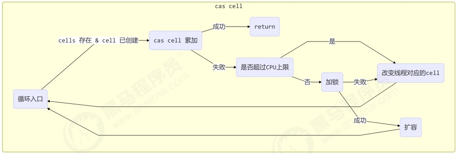

# 笔记

## 关键字段

```java
// 累加单元数组，懒惰初始化
transient volatile Cell[] cells;
// 基础值，如果没有竞争，则用CAS累加这个域
transient volatile long base;
// 在 cells 创建或扩容时，只需要一个线程来执行，置为1，表示加锁
transient volatile int cellsBusy;
```

## 如何用CAS实现锁机制

仅供演示，切勿用于生产实践。

上述关键字段中的cellsBusy就是用于CAS锁机制的变量。

```java
public class LockCAS {
    private AtomicInteger state = new AtomicInteger(0);

    public void lock() {
        while (true) {
            // 不断地尝试修改state变量，修改成功表示获得锁，修改不成功则会一直轮询:
            if (state.compareAndSet(0, 1)) {
                break;
            }
        }
    }

    public void unlock() {
        // 解锁操作因为只有加锁线程才会执行，因此不需要CAS机制来进行设置:
        state.set(0);
    }
}
```

## 缓存行伪共享

```java
// Cell数组中的Cell类定义:
@sun.misc.Contended static final class Cell {
    volatile long value;
    Cell(long x) { value = x; }
    // CAS累加:
    final boolean cas(long cmp, long val) {
        return UNSAFE.compareAndSwapLong(this, valueOffset, cmp, val);
    }

    // ...
}
```

`@sun.misc.Contended`防止缓存行伪共享，伪共享的意思是一个缓存行中存在多个Cell对象。

CPU某个核心如果对其缓存中的某个缓存行中的某个数据进行修改，那么其它核心缓存上的同一个缓存行应该**整个**失效，否则就会造成两个核心的数据不一致。

`@sun.misc.Contended`的原理是在使用此注解的对象或字段前后各增加128字节大小的padding，从而让CPU将对象预读至缓存时占用不同的缓存行，这样就不会造成对方缓存行的失效。

## add


```java
public void add(long x) {
    Cell[] as; long b, v; int m; Cell a;
    if ((as = cells) != null || !casBase(b = base, b + x)) {
        boolean uncontended = true;
        if (as == null || (m = as.length - 1) < 0 ||
            // as[getProbe() & m])表示当前线程需要累加的cell有没有被创建:
            (a = as[getProbe() & m]) == null ||
            !(uncontended = a.cas(v = a.value, v + x)))
            longAccumulate(x, null, uncontended);
    }
}
```

## cells未创建


## cell未创建


## cell已创建



## sum

```java
public long sum() {
    Cell[] as = cells; Cell a;
    long sum = base;
    if (as != null) {
        for (int i = 0; i < as.length; ++i) {
            if ((a = as[i]) != null)
                sum += a.value;
        }
    }
    return sum;
}
```
