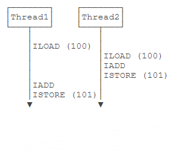
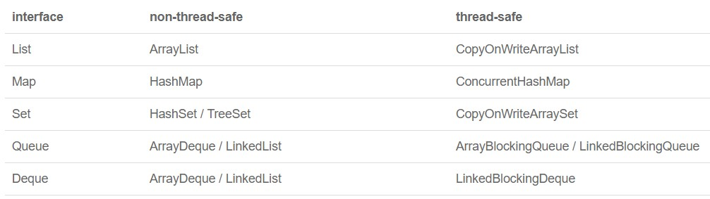

# 多线程

## 文章总结

sleep(3000)和wait(3000)的区别在于前者实打实waiting了3s，后者则是中途可以被notify，可能无法waiting到3s。

- 多线程同步(竞争)：synchronized(ReentrantLock)，后者可以尝试获取锁，无需一直等待。
- 多线程协调：wait/notifyAll(Condition)，wait/notifyAll只能用于synchronized代码块内。
- 读多写少：ReadWriteLock。
- 乐观读锁：StampedLock。
- 并发集合：ArrayBlockingQueue，队列满时放入将阻塞，队列空时取出将阻塞。
- 线程池：ThreadPoolExecutor。
- 阻塞等待异步执行的结果：Future。

## 多线程基础

在计算机中，我们把**一个任务称为一个进程**，浏览器就是一个进程，视频播放器是另一个进程，类似的，音乐播放器和Word都是进程。

某些**进程内部还需要同时执行多个子任务**。例如，我们在使用Word时，Word可以让我们一边打字，一边进行拼写检查，同时还可以在后台进行打印，我们**把子任务称为线程**。

进程和线程的关系就是：一个进程可以包含一个或多个线程，但至少会有一个线程。


**操作系统调度的最小任务单位其实不是进程，而是线程**。常用的Windows、Linux等操作系统都采用抢占式多任务，**如何调度线程完全由操作系统决定，程序自己不能决定什么时候执行，以及执行多长时间**。

因为同一个应用程序，既可以有多个进程，也可以有多个线程，因此，实现多任务的方法，有以下几种：多进程模式（每个进程只有一个线程）；多线程模式（一个进程有多个线程）；多进程＋多线程模式（复杂度最高）。

进程和线程是包含关系，但是多任务既可以由多进程实现，也可以由单进程内的多线程实现，还可以混合多进程＋多线程。

和多线程相比，多进程的缺点在于：**创建进程比创建线程开销大**，尤其是在Windows系统上；进程间通信比线程间通信要慢，因为**线程间通信就是读写同一个变量**，速度很快。多进程的优点在于：**多进程稳定性比多线程高**，因为在多进程的情况下，**一个进程崩溃不会影响其他进程**，而在多线程的情况下，**任何一个线程崩溃会直接导致整个进程崩溃**。

Java语言内置了多线程支持：**一个Java程序实际上是一个JVM进程，JVM进程用一个主线程来执行main()方法，在main()方法内部，我们又可以启动多个线程**。此外，JVM还有负责垃圾回收的其它工作线程等。

对于大多数Java程序来说，我们说多任务，实际上是说如何**使用多线程实现多任务**。

和单线程相比，多线程编程的特点在于：**多线程经常需要读写共享数据，并且需要同步**。例如，播放电影时，就必须由一个线程播放视频，另一个线程播放音频，两个线程需要协调运行，否则画面和声音就不同步。因此，多线程编程的复杂度高，调试更困难。

Java多线程编程的特点又在于：多线程模型是Java程序最基本的并发模型；后续读写网络、数据库、Web开发等都依赖Java多线程模型。

## 创建新线程

```Java
public class CreateThreadTest {
    public static void main(String[] args) {
        Thread t = new MyThread();
        t.start();
    }
}
// 从Thread派生一个自定义类，然后覆写run()方法
class MyThread extends Thread {
    @Override
    public void run() {
        System.out.println("start new thread!");
    }
}
```

```Java
public class CreateThreadTest {
    public static void main(String[] args) {
        // 实现了Runnable接口的子类
        Runnable r1 = new MyRunnable();
        // 有时候为只使用一次的子类单独创建一个.java文件过于浪费
        // 匿名内部类主要用于实现抽象类和接口，说白了就是一个子类，只不过它们new的对象是抽象类和接口
        Runnable r2 = new Runnable() {
            @Override
            public void run() {
                System.out.println("[anonymous subclass] start new thread!");
            }
        };
        // 由于Runnable本身是一个函数式接口，因此我们可以进一步地使用lambda表达式来简化实例过程
        Runnable r3 = () -> System.out.println("[lambda] start new thread!");
        List<Runnable> list = new ArrayList<Runnable>();
        list.add(r1);
        list.add(r2);
        list.add(r3);
        for (Runnable r : list) {
            // 创建Thread实例时，传入一个Runnable实例
            new Thread(r).start();
        }
    }
}
class MyRunnable implements Runnable {
    @Override
    public void run() {
        System.out.println("[subclass] start new thread!");
    }
}
```

程序本身无法确定线程的调度顺序。

直接调用run()方法，相当于调用了一个普通的Java方法，当前线程并没有任何改变，也不会启动新线程。

**如果需要传参进行处理，可以选择给线程子类定义实例字段及有参构造方法，然后在run()方法中调用处理**。

必须调用Thread实例的start()方法才能启动新线程，如果我们查看Thread类的源代码，会看到start()方法内部调用了一个private native void start0()方法，**native修饰符**表示这个方法是由JVM虚拟机内部的C代码实现的，不是由Java代码实现的。

一个线程对象只能调用一次start()方法。

可以对线程设定优先级，优先级高的线程被操作系统调度的优先级较高，操作系统对高优先级线程可能调度更频繁，但我们决不能通过设置优先级来确保高优先级的线程一定会先执行。

## 线程的状态

在Java程序中，一个线程对象只能调用一次start()方法启动新线程，并在新线程中执行run()方法。一旦run()方法执行完毕，线程就结束了。因此，Java线程的状态有以下几种：`New`：新创建的线程，尚未执行；`Runnable`：运行中的线程，正在执行run()方法的Java代码；`Blocked`：运行中的线程，因为某些操作被阻塞而挂起；`Waiting`：运行中的线程，因为某些操作在等待中；`Timed Waiting`：运行中的线程，因为执行sleep()方法正在计时等待；`Terminated`：线程已终止，因为run()方法执行完毕。


线程终止的原因有：*线程正常终止*：run()方法执行到return语句返回；*线程意外终止*：run()方法因为未捕获的异常导致线程终止；对某个线程的Thread实例调用stop()方法强制终止（强烈不推荐使用）。

通过对另一个线程对象调用join()方法可以等待其执行结束；可以指定等待时间，超过等待时间线程仍然没有结束就不再等待；对已经运行结束的线程调用join()方法会立刻返回。

```Java
Thread t = new Thread(() -> {
    System.out.println("hello");
});
System.out.println("start");
t.start();
// main线程等待t线程运行结束，才继续往下执行自身线程，可以指定等待时间
t.join();
System.out.println("end");
```

## 中断线程

中断一个线程非常简单，只需要在其它线程中对目标线程调用interrupt()方法（发送一个中断请求），目标线程需要反复检测自身状态是否是interrupted状态，如果是，就立刻结束运行。

```Java
public class CreateThreadTest {
    public static void main(String[] args) throws InterruptedException {
        Thread t = new MyThread();
        t.start();
        Thread.sleep(1);
        // interrupt()方法仅仅向t线程发出了“中断请求”，至于t线程是否能立刻响应，要看具体代码
        t.interrupt();
        // 中断过程也需要时间，为了保证打印语句在最后输出，在此等待t线程彻底结束
        t.join();
        System.out.println("end");
    }
}

class MyThread extends Thread {
    @Override
    public void run() {
        int n = 0;
        // t线程的while循环会检测isInterrupted()，能正确响应interrupt()请求，使得自身立刻结束运行run()方法。
        // 当接收到中断请求后，super.isInterrupted()的返回值为true。
        while (!super.isInterrupted()) {
            n++;
            System.out.printf("%d hello!\n", n);
        }
    }
}
```

假设需要中断的线程处于等待状态，例如，t.join()会让main线程进入等待状态，此时，如果对main线程调用interrupt()，t.join()方法会立刻抛出InterruptedException，因此，main线程只要捕获到join()方法抛出的InterruptedException，就说明有其它线程对其调用了interrupt()方法，通常情况下该线程应该立刻结束运行。

join()方法和sleep()方法抛出InterruptedException异常时的描述：如果有任何线程中断了当前线程。 抛出此异常时，**将清除当前线程的中断状态**。

```Java
public class CreateThreadTest {
    public static void main(String[] args) throws InterruptedException {
        Thread t = new MyThread();
        t.start();
        Thread.sleep(1000);
        // 在等待t线程运行10s后向t线程发送中断请求
        t.interrupt();
        // 中断过程也需要时间，为了保证打印语句在最后输出，在此等待t线程彻底结束
        t.join();
        System.out.println("end");
    }
}

class MyThread extends Thread {
    @Override
    public void run() {
        // t线程被启动时，自身内部创建了另外一个hello线程，并等待hello线程运行结束
        Thread hello = new HelloThread();
        hello.start();
        try {
            // 当join()方法抛出InterruptedException异常时，表明t线程收到了其它线程发送过来的中断请求
            // 注意虽然是hello.join()抛出异常，但这表明是t线程收到了中断请求
            // 由于抛出了异常，因此t线程自身的等待过程也随之结束
            hello.join();
        } catch (InterruptedException e) {
            System.out.println("interrupted!");
        }
        // 结束等待过程后向自身内部创建的hello线程发送一个中断请求
        hello.interrupt();
    }
}

class HelloThread extends Thread {
    @Override
    public void run() {
        // hello线程内部每隔0.1s进行一次打印输出
        int n = 0;
        while (!super.isInterrupted()) {
            n++;
            System.out.printf("%d hello!\n", n);
            try {
                // 当hello线程接收来自其它线程的中断请求时，sleep()方法会抛出InterruptedException异常，并清空中断状态，
                // 由于清空了中断状态，导致super.isInterrupted()取值仍为false，会继续进入下一次循环，
                // 但为了符合接收到中断请求就应当中断线程的运行逻辑，在捕获异常之后选择break出while循环
                Thread.sleep(100);
            } catch (InterruptedException e) {
                break;
            }
        }
    }
}
```

另一个常用的中断线程的方法是设置标志位。我们通常会用一个running标志位来标识线程是否应该继续运行，在外部线程中，通过把HelloThread.running置为false，就可以让线程结束。

```Java
public class CreateThreadTest {
    public static void main(String[] args) throws InterruptedException {
        HelloThread t = new HelloThread();
        t.start();
        Thread.sleep(1);
        // main线程在自己工作区中修改running变量后立刻回写至主内存
        t.running = false;
    }
}

class HelloThread extends Thread {
    // 用volatile进行修饰：
    // 1.读取是读取主内存中变量的最新值，而非线程自己工作区中的副本变量
    // 2.修改变量值后由虚拟机立刻回写到主内存中，而不是一个不确定的时间回写
    public volatile boolean running = true;
    @Override
    public void run() {
        int n = 0;
        // t线程读取running变量时，读取的是主内存中该变量的最新值
        while (this.running) {
            n++;
            System.out.printf("%d hello!\n", n);
        }
        System.out.println("end!");
    }
}
```

线程间共享变量需要使用volatile关键字标记，确保每个线程都能读取到更新后的变量值。

为什么要对线程间共享的变量用关键字volatile声明。这涉及到Java的内存模型。在Java虚拟机中，变量的值保存在主内存中，但是，**当线程访问变量时，它会先获取一个副本，并保存在自己的工作内存中**。如果线程修改了变量的值，虚拟机会在某个时刻把修改后的值回写到主内存，但是，**这个时间是不确定的**！  


这会导致如果一个线程更新了某个变量，另一个线程读取的值可能还是更新前的。例如，主内存的变量a = true，线程1执行a = false时，它在此刻仅仅是把变量a的**副本**变成了false，主内存的变量a还是true，在JVM把修改后的a回写到主内存之前，其它线程读取到的a的值仍然是true，这就造成了多线程之间共享的变量不一致。

volatile关键字的目的是告诉虚拟机：**每次访问变量时，总是获取主内存的最新值；每次修改变量后，立刻回写到主内存**。

volatile关键字解决的是**可见性**问题：当一个线程修改了某个共享变量的值，其它线程能够立刻看到修改后的值。

**可见性也可以理解为时效性，它不是原子性，也就是说一个线程获取到值并进行修改时，它能保证写后立即写回主内存，但是如果在读之后写之前，有其它线程也读取了这个值，此时这个值对于其它线程来说可能就是失效值，但是volatile关键字无法解决这种场景**。

[参考评论](https://www.liaoxuefeng.com/wiki/1252599548343744/1306580844806178)

如果我们去掉volatile关键字，运行上述程序，发现效果和带volatile差不多，这是因为在x86的架构下，JVM回写主内存的速度非常快，但是，换成ARM的架构，就会有显著的延迟。

## 守护线程

Java程序入口就是由JVM启动main线程，main线程又可以启动其它线程。当所有线程都运行结束时，JVM退出，进程结束。

如果有一个线程没有退出，JVM进程就不会退出。所以，**必须保证所有线程都能及时结束**。

但是有一种线程的目的就是无限循环，例如，一个定时触发任务的线程。

如果这个线程不结束，JVM进程就无法结束。问题是，由谁负责结束这个线程？

**然而这类线程经常没有负责人来负责结束它们**。但是，当其它线程结束时，JVM进程又必须要结束，怎么办？

**守护线程是指为其它线程服务的线程**。在JVM中，**所有非守护线程都执行完毕后，无论有没有守护线程，虚拟机都会自动退出**。因此，**JVM退出时，不必关心守护线程是否已结束**。

在守护线程中，编写代码要注意：**守护线程不能持有任何需要关闭的资源**，例如打开文件等，因为虚拟机退出时，守护线程没有任何机会来关闭文件，这会导致数据丢失。

```Java
public class CreateThreadTest {
    public static void main(String[] args) throws InterruptedException {
        Thread t = new TimerThread();
        // 将t线程标记为守护线程
        t.setDaemon(true);
        t.start();
        Thread.sleep(10000);
        System.out.println("main end...");
    }
}

class TimerThread extends Thread {
    @Override
    public void run() {
        while (true) {
            System.out.println(LocalTime.now());
            try {
                Thread.sleep(1000);
            } catch (InterruptedException e) {
            }
        }
    }
}
```

## 线程同步

当多个线程同时运行时，线程的调度由操作系统决定，程序本身无法决定。因此，任何一个线程都有可能在**任何指令处**被操作系统暂停，然后在某个时间段后继续执行。

这个时候，有个单线程模型下不存在的问题就来了：**如果多个线程同时读写共享变量，会出现数据不一致的问题**。

```Java
public class SynchronizedTest {
    public static void main(String[] args) throws InterruptedException {
        Thread add = new Thread(() -> {
            for (int i = 0; i < 10000; i++)
                // 读取/加/存储，一行语句三条指令
                Counter.count += 1;
        });
        Thread dec = new Thread(() -> {
            for (int i = 0; i < 10000; i++)
                // 读取/减/存储，一行语句三条指令
                Counter.count -= 1;
        });
        add.start();
        dec.start();
        add.join();
        dec.join();
        System.out.println(Counter.count);
    }
}

class Counter {
    public static int count = 0;
}
```

因为对变量进行读取和写入时，结果要正确，必须保证是原子操作。原子操作是指不能被中断的一个或一系列操作。

多线程模型下，要保证逻辑正确，对共享变量进行读写时，**必须保证一组指令以原子方式执行**：即某一个线程执行时，其它线程必须等待。  




通过加锁和解锁的操作，就能保证3条指令总是在一个线程执行期间，不会有其它线程会进入此指令区间。即使在执行期线程被操作系统中断执行，其他线程也会因为无法获得锁导致无法进入此指令区间。只有执行线程将锁释放后，其他线程才有机会获得锁并执行。**这种加锁和解锁之间的代码块我们称之为临界区（Critical Section），任何时候临界区最多只有一个线程能执行**。

可见，保证一段代码的原子性就是通过加锁和解锁实现的。Java程序使用synchronized关键字对**一个对象**进行加锁。

synchronized保证了代码块在任意时刻最多只有一个线程能执行。

```Java
public class SynchronizedTest {
    public static void main(String[] args) throws InterruptedException {
        Thread add = new Thread(() -> {
            for (int i = 0; i < 10000; i++)
                // 使用Counter.lock实例作为锁，其它线程获取时需进行等待，锁的是对象实例
                // 进入临界区前获取对象锁，离开临界区后释放对象锁
                synchronized (Counter.lock) { // 获取锁
                    Counter.count += 1;
                } // 释放锁
        });
        Thread dec = new Thread(() -> {
            for (int i = 0; i < 10000; i++)
                // 使用Counter.lock实例作为锁，其它线程获取时需进行等待，锁的是对象实例
                // 进入临界区前获取对象锁，离开临界区后释放对象锁
                synchronized (Counter.lock) { // 获取锁
                    Counter.count -= 1;
                } // 释放锁
        });
        add.start();
        dec.start();
        add.join();
        dec.join();
        System.out.println(Counter.count);
    }
}

class Counter {
    public static final Object lock = new Object();
    // 注意此处使用volatile关键字是无法解决同时读写变量数据不一致场景的
    // 摆在眼前的第一个问题就是线程一访问变量进行修改时线程二同样可以访问变量进行修改
    // 只要两者读取到自己工作区的变量值是同一个值时，立马就造成了数据不一致问题
    public static int count = 0;
}
```

使用synchronized解决了**多线程同步访问共享变量**的正确性问题。但是，它的缺点是带来了性能下降。因为synchronized代码块无法并发执行。此外，加锁和解锁需要消耗一定的时间，所以，synchronized会降低程序的执行效率。

使用synchronized：找出修改共享变量的线程代码块；选择一个**共享实例**作为锁；使用synchronized(lockObject) { ... }。

**volatile和synchronized关键字的使用场景区分：前者是一个线程在写另一个线程在读，后者是两个线程同时参与读写操作**。

在使用synchronized的时候，不必担心抛出异常。因为**无论是否有异常，都会在synchronized结束处正确释放锁**。

JVM只保证同一个锁在任意时刻只能被一个线程获取，但两个不同的锁在同一时刻可以被两个线程分别获取。

根据需要同步的共享变量数量准备对应个数的锁，针对不同的共享变量分配不同的锁。

**同步的本质就是给指定对象加锁，加锁后才能继续执行后续代码**。

不需要synchronized的操作即原子操作：基本类型（long和double除外）赋值；引用类型赋值。单条原子操作的语句不需要同步。**如果是多行赋值语句，就必须保证是同步操作**。

方法内部定义的局部变量，每个线程都会有各自的局部变量，互不影响，并且互不可见，并不需要同步。

## 同步方法

让线程自己选择锁对象往往会使得代码逻辑混乱，也不利于封装。更好的方法是把synchronized逻辑封装起来。

```Java
public class SynchronizedTest {
    public static void main(String[] args) throws InterruptedException {
        Counter c = new Counter();
        System.out.println(c.get());
        // 现在，对于Counter类，多线程可以正确调用。
        Thread add = new Thread(() -> {
            for (int i = 0; i < 10000; i++)
                c.add(1);
        });
        Thread dec = new Thread(() -> {
            for (int i = 0; i < 10000; i++)
                c.dec(1);
        });
        add.start();
        dec.start();
        add.join();
        dec.join();
        System.out.println(c.get());
    }
}

class Counter {
    private int count = 0;
    // 这样一来，线程调用add()、dec()方法时，它不必关心同步逻辑，因为synchronized代码块在add()、dec()方法内部。
    // synchronized锁住的对象是this，即当前实例，这又使得创建多个Counter实例的时候，它们之间互不影响，可以并发执行。
    public void add(int n) {
        synchronized (this) {
            this.count += n;
        }
    }

    public void dec(int n) {
        synchronized (this) {
            this.count -= n;
        }
    }
    // 读一个int变量不需要同步。
    public int get() {
        return count;
    }
}
```

如果一个类被设计为允许多线程正确访问，我们就说这个类就是“线程安全”的（thread-safe），上面的Counter类就是线程安全的。Java标准库的java.lang.StringBuffer也是线程安全的。

还有一些不变类，例如String，Integer，LocalDate，它们的所有成员变量都是final，**多线程同时访问时只能读不能写**，这些不变类也是线程安全的。

最后，类似Math这些只提供静态方法，没有成员变量的类，也是线程安全的。

除了上述几种少数情况，大部分类，例如ArrayList，都是非线程安全的类，我们不能在多线程中修改它们。但是，**如果所有线程都只读取，不写入**，那么ArrayList是可以安全地在线程间共享的。

**没有特殊说明时，一个类默认是非线程安全的**。

当我们锁住的是this实例时，实际上可以用synchronized修饰这个方法。

```Java
// 用synchronized修饰的方法就是同步方法，它表示整个方法都必须用this实例加锁。
public synchronized void add(int n) {
    this.count += n;
}
```

对于static方法，是没有this实例的，因为static方法是针对类而不是实例。但是我们注意到任何一个类都有一个由JVM自动创建的Class实例，因此，对static方法添加synchronized，锁住的是该类的Class实例。

```Java
public synchronized static void test() {}
// 等价于
public static void test() {
    synchronized (Counter.class) {}
}
```

## 死锁

Java的线程锁是可重入的锁。

**JVM允许同一个线程重复获取同一个锁，这种能被同一个线程反复获取的锁，就叫做可重入锁**。

```Java
public synchronized void add(int n) { // 获取this锁。
    if (n < 0)
        dec(-n); // 再次获取this锁。
    else
        this.count += n;
}

public synchronized void dec(int n) {
    this.count += n;
}
```

由于Java的线程锁是可重入锁，所以，获取锁的时候，不但要判断是否是第一次获取，还要记录这是第几次获取。每获取一次锁，记录+1，每退出synchronized块，记录-1，减到0的时候，才会真正释放锁。

**一个线程可以获取一个锁后，再继续获取另一个锁**。

```Java
public void add(int m) {
    synchronized(lockA) { // 获得lockA的锁
        this.value += m;
        synchronized(lockB) { // 获得lockB的锁
            this.another += m;
        } // 释放lockB的锁
    } // 释放lockA的锁
}

public void dec(int m) {
    synchronized(lockB) { // 获得lockB的锁
        this.another -= m;
        synchronized(lockA) { // 获得lockA的锁
            this.value -= m;
        } // 释放lockA的锁
    } // 释放lockB的锁
}
// 修改后
public void dec(int m) {
    synchronized(lockA) { // 获得lockA的锁
        this.value -= m;
        synchronized(lockB) { // 获得lockB的锁
            this.another -= m;
        } // 释放lockB的锁
    } // 释放lockA的锁
}
```

**在获取多个锁的时候，不同线程获取多个不同对象的锁可能导致死锁**。对于上述代码，线程1和线程2如果分别执行add()和dec()方法时：线程1：进入add()，获得lockA；线程2：进入dec()，获得lockB。随后：线程1：准备获得lockB，失败，等待中；线程2：准备获得lockA，失败，等待中。此时，两个线程**各自持有不同的锁，然后各自试图获取对方手里的锁**，造成了双方无限等待下去，这就是死锁。

死锁发生后，没有任何机制能解除死锁，只能强制结束JVM进程。

避免死锁的做法是：**线程获取锁的顺序要一致**。即严格按照先获取lockA，再获取lockB的顺序，

## 使用wait和notify

**synchronized解决了多线程竞争的问题，但是synchronized并没有解决多线程协调的问题**。

```Java
class TaskQueue {
    Queue<String> queue = new LinkedList<>();
    // 多个线程同时往队列中添加任务，可以用synchronized加锁，从而保证每个任务都被添加到了队列当中。
    public synchronized void addTask(String s) {
        this.queue.add(s);
    }
}
```

```Java
class TaskQueue {
    Queue<String> queue = new LinkedList<>();

    public synchronized void addTask(String s) {
        this.queue.add(s);
    }
    // 执行while()循环时，已经在getTask()入口获取了this锁，其它线程根本无法调用addTask()，因为addTask()执行条件也是获取this锁。
    // 理想场景是：
    // 线程1可以调用addTask()不断往队列中添加任务；
    // 线程2可以调用getTask()从队列中获取任务。如果队列为空，则getTask()应该等待，直到队列中至少有一个任务时再返回。
    public synchronized String getTask() {
        while (queue.isEmpty()) {
        }
        return queue.remove();
    }
}
```

**多线程协调**运行的原则就是：当条件不满足时，线程进入等待状态；当条件满足时，线程被唤醒，继续执行任务。

wait()方法必须在**当前获取的锁对象**上调用，如果线程获取的是this锁，那就要调用this.wait()进入等待状态。

调用wait()方法后，线程进入等待状态，wait()方法不会返回，直到将来某个时刻，线程从等待状态被其它线程唤醒后，wait()方法才会返回，然后，继续执行下一条语句。

首先，它不是一个普通的Java方法，而是定义在Object类的一个native方法，也就是由JVM的C代码实现的。其次，**必须在synchronized块中才能调用wait()方法**，因为wait()方法调用时，会**释放**线程获得的锁，wait()方法返回后，线程又会重新试图获得锁。

```Java
public synchronized String getTask() {
    while (queue.isEmpty()) {
        // 释放this锁
        this.wait(); // 线程进入等待状态
        // 重新获取this锁
    }
    return queue.remove();
}
```

如何让等待的线程被重新唤醒，然后从wait()方法返回，答案是在**相同的锁对象**上调用notify()方法。

```Java
public synchronized void addTask(String s) {
    // 往队列中添加了任务后，线程立刻对this锁对象调用notify()方法，
    // 这个方法会唤醒一个正在this锁等待的线程（就是在getTask()中位于this.wait()的线程），从而使得等待线程从this.wait()方法返回。
    this.queue.add(s);
    this.notify(); // 唤醒在this锁等待的线程
}
```

通常来说，notifyAll()更安全。有些时候，如果我们的代码逻辑考虑不周，用notify()会导致只唤醒了一个线程，而其它线程可能永远等待下去醒不过来了。

```Java
public class TaskQueue {
    Queue<String> queue = new LinkedList<>();

    public synchronized void addTask(String s) {
        this.queue.add(s);
        // 使用notifyAll()将唤醒所有当前正在this锁等待的线程，而notify()只会唤醒其中一个（具体哪个依赖操作系统，有一定的随机性）。
        // 这是因为可能有多个线程正在getTask()方法内部的wait()中等待，使用notifyAll()将一次性全部唤醒。
        // 假设当前有3个线程被唤醒，唤醒后，首先要等待执行addTask()的线程结束此方法后，才能释放this锁，随后，这3个线程中只能有一个获取到this锁，剩下两个将继续等待。
        this.notifyAll();
    }

    public synchronized String getTask() throws InterruptedException {
        // 不要使用if语句进行判断，因为即使获取了this锁仍需要进行一次队列是否为空判断，否则在移除操作时将发生错误。
        while (queue.isEmpty())
            this.wait(); // 收到中断请求会抛出InterruptedException异常
        return this.queue.remove();
    }
}

public static void main(String[] args) throws InterruptedException {
    TaskQueue q = new TaskQueue();
    List<Thread> ts = new ArrayList<>();
    // 启动5个获取任务并执行的线程
    for (int i = 0; i < 5; i++) {
        Thread t = new Thread(() -> {
            while (true) {
                try {
                    String s = q.getTask();
                    System.out.println("execute task: " + s);
                } catch (InterruptedException e) {
                    return;
                }
            }
        });
        t.start();
        ts.add(t);
    }
    // 启动1个添加任务线程，共往任务队列中添加10个任务
    Thread add = new Thread(() -> {
        for (int i = 0; i < 10; i++) {
            String s = "t-" + Math.random();
            System.out.println("add task: " + s);
            q.addTask(s);
            try {
                Thread.sleep(100);
            } catch (InterruptedException e) {
                return;
            }
        }
    });
    add.start();
    // 等待任务添加线程结束
    add.join();
    Thread.sleep(100);
    // 任务获取线程在获取任务执行后会进入等待状态，此时JVM退出需要进行线程中断操作，否则就会无限等待下去，导致JVM无法退出。
    for (Thread t : ts) {
        t.interrupt();
    }
}
```

**wait和notify用于多线程协调运行：在synchronized内部可以调用wait()使线程进入等待状态；必须在已获得的锁对象上调用wait()方法；在synchronized内部可以调用notify()或notifyAll()唤醒其它等待线程；必须在已获得的锁对象上调用notify()或notifyAll()方法；已唤醒的线程还需要重新获得锁后才能继续执行。**

## 使用ReentrantLock

- Java语言直接提供了synchronized关键字用于加锁，但这种锁一是很重，二是获取时必须一直等待，没有额外的尝试机制。
- ReentrantLock可以替代synchronized进行同步；ReentrantLock获取锁更安全；必须先获取到锁，再进入try {...}代码块，最后使用finally保证释放锁；可以使用tryLock()尝试获取锁。
- 因为synchronized是Java语言层面提供的语法，所以我们不需要考虑异常，而ReentrantLock是Java代码实现的锁，我们就必须先获取锁，然后在finally中正确释放锁。
- 顾名思义，ReentrantLock是可重入锁，它和synchronized一样，一个线程可以多次获取同一个锁。

    ```Java
    public class Counter {
        private final Lock lock = new ReentrantLock();
        private int count;

        public void add(int n) {
            this.lock.lock();
            try {
                this.count += n;
            } finally {
                this.lock.unlock();
            }
        }
    }
    ```

- **和synchronized不同的是，ReentrantLock可以尝试获取锁。**

    ```Java
    public void add(int n) throws InterruptedException {
        // 尝试获取锁的时候，最多等待1秒。如果1秒后仍未获取到锁，tryLock()返回false，程序就可以做一些额外处理，而不是无限等待下去。
        if (this.lock.tryLock(1, TimeUnit.SECONDS)) {
            try {
                this.count += n;
            } finally {
                this.lock.unlock();
            }
        }
    }
    ```

- **使用ReentrantLock比直接使用synchronized更安全，线程在tryLock()失败的时候不会导致死锁。**

## 使用Condition

- synchronized可以配合wait和notify实现线程在条件不满足时等待，条件满足时唤醒，用ReentrantLock我们怎么编写wait和notify的功能呢。答案是使用Condition对象来实现wait和notify的功能。
- 使用Condition时，引用的Condition对象必须从Lock实例的newCondition()返回，这样才能获得一个绑定了Lock实例的Condition实例。
- Condition提供的await()、signal()、signalAll()原理和synchronized锁对象的wait()、notify()、notifyAll()是一致的，并且其行为也是一样的。

    ```Java
    public class TaskQueue {
        private final Lock lock = new ReentrantLock();
        private final Condition condition = this.lock.newCondition(); // 从Lock实例的newCondition()返回
        Queue<String> queue = new LinkedList<>();

        public void addTask(String s) {
            this.lock.lock();
            try {
                this.queue.add(s);
                this.condition.signalAll();
            } finally {
                this.lock.unlock();
            }
        }

        public String getTask() throws InterruptedException {
            this.lock.lock();
            try {
                while (this.queue.isEmpty())
                    this.condition.await();
                return this.queue.remove();
            } finally {
                this.lock.unlock();
            }
        }
    }
    ```

- **此外，和tryLock()类似，await()可以在等待指定时间后，如果还没有被其它线程通过signal()或signalAll()唤醒，可以自己醒来。**

    ```Java
    if (condition.await(1, TimeUnit.SECOND)) {
        // 被其它线程唤醒
    } else {
        // 指定时间内没有被其它线程唤醒
    }
    ```

- 可见，使用Condition配合Lock，我们可以实现更灵活的线程同步。

## 使用ReadWriteLock

- ReentrantLock保证了只有一个线程可以执行临界区代码。
- 如果我们想要的是：允许多个线程同时读，但只要有一个线程在写，其它线程就必须等待。
- 使用ReadWriteLock可以解决这个问题，它保证：只允许一个线程写入（其它线程既不能写入也不能读取）；没有写入时，多个线程允许同时读（提高性能）。
- 把读写操作分别用读锁和写锁来加锁，在读取时，多个线程可以同时获得读锁，这样就大大提高了并发读的执行效率。
- 使用ReadWriteLock时，适用条件是**同一个数据，有大量线程读取，但仅有少数线程修改。**
- 例如，一个论坛的帖子，回复可以看做写入操作，它是不频繁的，但是，浏览可以看做读取操作，是非常频繁的，这种情况就可以使用ReadWriteLock。
- ReadWriteLock适合读多写少的场景。

```Java
public class Counter {
    private final ReadWriteLock rwLock = new ReentrantReadWriteLock(); // 可重入的读写锁
    private final Lock rLock = rwLock.readLock(); // 从同一个读写锁中派生出读锁
    private final Lock wLock = rwLock.writeLock(); // 从同一个读写锁中派生出写锁
    private int[] counts = new int[10];

    public void inc(int index) {
        wLock.lock();
        try {
            counts[index] += 1;
        } finally {
            wLock.unlock();
        }
    }

    public int[] get() {
        rLock.lock();
        try {
            return Arrays.copyOf(counts, counts.length);
        } finally {
            rLock.unlock();
        }
    }
}
```

## 使用StampedLock

- 深入分析ReadWriteLock，会发现它有个潜在的问题：如果有线程正在读，写线程需要等待读线程释放锁后才能获取写锁，**即读的过程中不允许写，这是一种悲观的读锁。**
- StampedLock和ReadWriteLock相比，改进之处在于：读的过程中也允许获取写锁后写入！这样一来，**我们读的数据就可能不一致，所以，需要一点额外的代码来判断读的过程中是否有写入，这种读锁是一种乐观锁。**
- **乐观锁的意思就是乐观地估计读的过程中大概率不会有写入，因此被称为乐观锁。反过来，悲观锁则是读的过程中拒绝有写入，也就是写入必须等待。显然乐观锁的并发效率更高，但一旦有小概率的写入导致读取的数据不一致，需要能检测出来，再读一遍就行。**

```Java
public class Point {
    private final StampedLock stampedLock = new StampedLock();
    private double x;
    private double y;

    public void move(double deltaX, double deltaY) {
        long stamp = this.stampedLock.writeLock();
        try {
            this.x += deltaX;
            this.y += deltaY;
        } finally {
            this.stampedLock.unlockWrite(stamp);
        }
    }

    public double distanceFromOrigin() {
        long stamp = this.stampedLock.tryOptimisticRead(); // 获得一个乐观读锁
        // 注意下面两行代码不是原子操作
        // 假设x,y = (100,200)
        double currentX = this.x;
        // 此处已读取到x=100，但x,y可能被写线程修改为(300,400)
        double currentY = this.y;
        // 此处已读取到y，如果没有写入，读取是正确的(100,200)
        // 如果有写入，读取是错误的(100,400)
        if (!this.stampedLock.validate(stamp)) { // 检查乐观读锁后是否有其它写锁发生
            stamp = this.stampedLock.readLock(); // 获取一个悲观读锁
            try {
                currentX = this.x;
                currentY = this.y;
            } finally {
                this.stampedLock.unlockRead(stamp); // 释放悲观读锁
            }
        }
        return Math.sqrt(currentX * currentX + currentY * currentY);
    }
}
```

- 和ReadWriteLock相比，写入的加锁是完全一样的，不同的是读取。注意到首先我们通过tryOptimisticRead()获取一个乐观读锁，并返回版本号。接着进行读取，读取完成后，我们通过validate()去验证版本号，如果在读取过程中没有写入，版本号不变，验证成功，我们就可以放心地继续后续操作。如果在读取过程中有写入，版本号会发生变化，验证将失败。在失败的时候，我们再通过获取悲观读锁再次读取。由于写入的概率不高，程序在绝大部分情况下可以通过乐观读锁获取数据，极少数情况下使用悲观读锁获取数据。
- 可见，StampedLock把读锁细分为乐观读和悲观读，能进一步提升并发效率。但这也是有代价的：**一是代码更加复杂，二是StampedLock是不可重入锁，不能在一个线程中反复获取同一个锁。**
- StampedLock还提供了更复杂的将悲观读锁升级为写锁的功能，它主要使用在if-then-update的场景：即先读，如果读的数据满足条件，就返回，如果读的数据不满足条件，再尝试写。

## 使用Concurrent集合

- 使用java.util.concurrent包提供的线程安全的并发集合可以大大简化多线程编程；多线程同时读写并发集合是安全的；尽量使用Java标准库提供的并发集合，避免自己编写同步代码。
- 使用这些并发集合与使用非线程安全的集合类完全相同。
- 因为所有的同步和加锁的逻辑都在集合内部实现，对外部调用者来说，只需要正常按接口引用，其它代码和原来的非线程安全代码完全一样。

    ```Java
    Map<String, String> map = new HashMap<>();
    // 需要多线程访问时，修改实例子类。
    Map<String, String> map = new ConcurrentHashMap<>();
    ```

    

## 使用Atomic

- Java的java.util.concurrent包除了提供底层锁、并发集合外，还提供了一组原子操作的封装类，它们位于java.util.concurrent.atomic包。
- 以AtomicInteger为例，它提供的主要操作有：增加值并返回新值：int addAndGet(int delta)；加1后返回新值：int incrementAndGet()；获取当前值：int get()。

```Java
// 利用AtomicLong可以编写一个多线程安全的全局唯一ID生成器
// 例如在web开发当中准备一个计数器用于统计访客人数
class IdGenerator {
    AtomicLong var = new AtomicLong(0);

    public long getNextId() {
        return var.incrementAndGet();
    }
}
```

- 在高度竞争的情况下，还可以使用Java 8提供的LongAdder和LongAccumulator。
- 使用java.util.concurrent.atomic提供的原子操作可以简化多线程编程：原子操作实现了无锁的线程安全；适用于计数器，累加器等。

## 使用线程池

- Java语言虽然内置了多线程支持，启动一个新线程非常方便，但是，创建线程需要操作系统资源（线程资源，栈空间等），频繁创建和销毁大量线程需要消耗大量时间。
- 如果可以复用一组线程，那么我们就可以把很多小任务让一组线程来执行，而不是一个任务对应一个新线程。**这种能接收大量小任务并进行分发处理的就是线程池**。
- 简单地说，线程池内部维护了若干个线程，没有任务的时候，这些线程都处于等待状态。如果有新任务，就分配一个空闲线程执行。如果所有线程都处于忙碌状态，新任务要么放入队列等待，要么增加一个新线程进行处理。
- Java标准库提供了ExecutorService接口表示线程池，它的典型用法如下：

    ```Java
    // 创建固定大小的线程池:
    ExecutorService executor = Executors.newFixedThreadPool(3);
    // 提交任务:
    executor.submit(task1);
    executor.submit(task2);
    executor.submit(task3);
    executor.submit(task4);
    executor.submit(task5);
    ```

- 因为ExecutorService只是接口，Java标准库提供的几个常用实现类有：FixedThreadPool：线程数固定的线程池；CachedThreadPool：线程数根据任务动态调整的线程池；SingleThreadExecutor：仅单线程执行的线程池。
- 创建这些线程池的方法都被封装到Executors这个类中。

    ```Java
    ExecutorService es = Executors.newFixedThreadPool(4);
    // 一次性放入6个任务，由于线程池只有固定的4个线程，因此，前4个任务会同时执行，等到有线程空闲后，才会执行后面2个任务。
    // 如果我们把线程池改为CachedThreadPool，由于这个线程池的实现会根据任务数量动态调整线程池的大小，所以6个任务可一次性全部同时执行。
    for (int i = 0; i < 6; i++) {
        es.submit(new Task("" + i));
    }
    es.shutdown();
    ```

- **线程池在程序结束的时候要关闭**。使用shutdown()方法关闭线程池的时候，它会等待正在执行的任务先完成，然后再关闭。shutdownNow()会立刻停止正在执行的任务，awaitTermination()则会等待指定的时间让线程池关闭。
- 如果我们想把线程池的大小限制在4～10个之间动态调整怎么办，我们查看Executors.newCachedThreadPool()方法的源码。

    ```Java
    public static ExecutorService newCachedThreadPool() {
        return new ThreadPoolExecutor(0, Integer.MAX_VALUE,
                                        60L, TimeUnit.SECONDS,
                                        new SynchronousQueue<Runnable>());
    }
    // 想创建指定动态范围的线程池，可以这么写
    int min = 4;
    int max = 10;
    ExecutorService es = new ThreadPoolExecutor(min, max,
            60L, TimeUnit.SECONDS, new SynchronousQueue<Runnable>());
    ```

- 还有一种任务，需要定期反复执行，例如，每秒刷新证券价格。这种任务本身固定，需要反复执行的，可以使用ScheduledThreadPool。放入ScheduledThreadPool的任务可以定期反复执行。

    ```Java
    ScheduledExecutorService ses = Executors.newScheduledThreadPool(4);
    // 1秒后执行一次性任务
    ses.schedule(new Task("one-time"), 1, TimeUnit.SECONDS);
    // 2秒后开始执行定时任务，每3秒执行
    ses.scheduleAtFixedRate(new Task("fixed-rate"), 2, 3, TimeUnit.SECONDS);
    // 2秒后开始执行定时任务，以3秒为间隔执行
    ses.scheduleWithFixedDelay(new Task("fixed-delay"), 2, 3, TimeUnit.SECONDS);
    ```

- 注意FixedRate和FixedDelay的区别。**FixedRate是指任务总是以固定时间间隔触发，不管任务执行多长时间，而FixedDelay是指，上一次任务执行完毕后，等待固定的时间间隔，再执行下一次任务**。
- 因此，使用ScheduledThreadPool时，我们要根据需要选择执行一次、FixedRate执行还是FixedDelay执行。
- Java标准库还提供了一个java.util.Timer类，这个类也可以定期执行任务，但是，一个Timer会对应一个Thread，所以，一个Timer只能定期执行一个任务，多个定时任务必须启动多个Timer，而一个ScheduledThreadPool就可以调度多个定时任务，所以，**我们完全可以用ScheduledThreadPool取代旧的Timer**。
- 如果任务抛出了异常，后续任务是否继续执行。The executor terminates, also resulting in task cancellation.
- 在FixedRate模式下，假设每秒触发，如果某次任务执行时间超过1秒，后续任务会不会并发执行。If any execution of this task takes longer than its period, then subsequent executions may start late, but will not concurrently execute.

## 使用Future

- 在执行多个任务的时候，使用Java标准库提供的线程池是非常方便的。我们提交的任务只需要实现Runnable接口，就可以让线程池去执行。
- Runnable接口有个问题，它的方法没有返回值。如果任务需要一个返回结果，那么只能保存到变量，还要提供额外的方法读取，非常不便。所以，Java标准库还提供了一个Callable接口，和Runnable接口比，它多了一个返回值。并且Callable接口是一个泛型接口，可以返回指定类型的结果。

    ```Java
    ExecutorService es = Executors.newFixedThreadPool(4);
    // 提交一个实现Callable接口的线程并获得Future对象
    Future<String> future = es.submit(new CallableTask());
    // 从Future获取异步执行返回的结果，可能阻塞
    String result = future.get();
    System.out.println(result);
    es.shutdown();
    ```

- 当我们提交一个Callable任务后，我们会同时获得一个Future对象，然后，我们在主线程某个时刻调用Future对象的get()方法，就可以获得异步执行的结果。**在调用get()时，如果异步任务已经完成，我们就直接获得结果。如果异步任务还没有完成，那么get()会阻塞，直到任务完成后才返回结果**。
- 一个Future`<V>`接口表示一个未来可能会返回的结果，它定义的方法有：get()：获取结果（可能会等待）；get(long timeout, TimeUnit unit)：获取结果，但只等待指定的时间；cancel(boolean mayInterruptIfRunning)：取消当前任务；isDone()：判断任务是否已完成。

## 使用CompletableFuture

## 使用ForkJoin

- Java 7开始引入了一种新的Fork/Join线程池，它可以执行一种特殊的任务：把一个大任务拆成多个小任务并行执行。
- Fork/Join任务的原理：判断一个任务是否足够小，如果是，直接计算，否则，就分拆成几个小任务分别计算。这个过程可以反复“裂变”成一系列小任务。
- Fork/Join是一种基于“分治”的算法：通过分解任务，并行执行，最后合并结果得到最终结果。
- ForkJoinPool线程池可以把一个大任务分拆成小任务并行执行，任务类必须继承自RecursiveTask或RecursiveAction。
- 使用Fork/Join模式可以进行并行计算以提高效率。
- Fork/Join线程池在Java标准库中就有应用。Java标准库提供的java.util.Arrays.parallelSort(array)可以进行并行排序，它的原理就是内部通过Fork/Join对大数组分拆进行并行排序，在多核CPU上就可以大大提高排序的速度。

    ```Java
    public class Main {
        public static void main(String[] args) {
            long[] array = new long[2000];
            long expectedSum = 0;
            // 创建2000个随机数组成的数组并计算它们的和
            for (int i = 0; i < array.length; i++) {
                array[i] = random();
                expectedSum += array[i];
            }
            System.out.println("Expected sum: " + expectedSum);
            // 创建一个 fork/join 任务
            ForkJoinTask<Long> task = new SumTask(array, 0, array.length);
            long startTime = System.currentTimeMillis();
            // 启用线程池执行任务并获取结果
            Long result = ForkJoinPool.commonPool().invoke(task);
            long endTime = System.currentTimeMillis();

            System.out.println("Fork/join sum: " + result + " in " + (endTime - startTime) + " ms. ");
        }

        static Random random = new Random(0);

        static long random() {
            return random.nextInt(10000);
        }
    }

    class SumTask extends RecursiveTask<Long> {
        static final int THRESHOLD = 500;
        long[] array;
        int start;
        int end;

        public SumTask(long[] array, int start, int end) {
            this.array = array;
            this.start = start;
            this.end = end;
        }

        @Override
        protected Long compute() {
            // 如果任务足够小，直接计算
            if (end - start <= THRESHOLD) {
                long sum = 0;
                for (int i = start; i < end; i++) {
                    sum += this.array[i];
                    // 故意放慢计算速度
                    try {
                        Thread.sleep(1);
                    } catch (InterruptedException e) {

                    }
                }
                return sum;
            }
            // 任务太大，一分为二
            int middle = (end + start) / 2;
            System.out.println(String.format("split %d~%d ==> %d~%d, %d~%d", start, end, start, middle, middle, end));
            // “分裂”子任务
            SumTask subTask1 = new SumTask(this.array, start, middle);
            SumTask subTask2 = new SumTask(this.array, middle, end);
            // 并行运行两个子任务
            invokeAll(subTask1, subTask2);
            // 获得子任务的结果
            Long subResult1 = subTask1.join();
            Long subResult2 = subTask2.join();
            // 汇总结果
            Long result = subResult1 + subResult2;
            System.out.println("result = " + subResult1 + " + " + subResult2 + " ==> " + result);
            return result;
        }
    }
    ```

## 使用ThreadLocal

- 多线程是Java实现多任务的基础，Thread对象代表一个线程，我们可以在代码中调用Thread.currentThread()获取当前线程。例如，打印日志时，可以同时打印出当前线程的名字。

    ```Java
    public class Main {
        public static void main(String[] args) {
            log("start main...");
            new Thread(() -> {
                log("run task...");
            }).start();
            new Thread(() -> {
                log("print...");
            }).start();
            log("end main...");
        }

        static void log(String s) {
            System.out.println(Thread.currentThread().getName() + ": " + s);
        }
    }
    ```

- 对于多任务，Java标准库提供的线程池可以方便地执行这些任务，同时复用线程。Web应用程序就是典型的多任务应用，每个用户请求页面时，我们都会创建一个任务，类似：

    ```Java
    public void process(User user) {
        checkPermission();
        doWork();
        saveStatus();
        sendResponse();
    }
    ```

- 然后，通过线程池去执行这些任务。
- 观察process()方法，它内部需要调用若干其它方法，同时，我们遇到一个问题：如何在一个线程内传递状态。
- process()方法需要传递的状态就是User实例。有的童鞋会想，简单地传入User就可以了：

    ```Java
    public void process(User user) {
        checkPermission(user);
        doWork(user);
        saveStatus(user);
        sendResponse(user);
    }
    ```

- 但是往往一个方法又会调用其它很多方法，这样会导致User传递到所有地方：

    ```Java
    void doWork(User user) {
        queryStatus(user);
        checkStatus();
        setNewStatus(user);
        log();
    }
    ```

- 这种在一个线程中，横跨若干方法调用，需要传递的对象，我们通常称之为**上下文（Context）**，它是一种状态，可以是用户身份、任务信息等。
- **给每个方法增加一个context参数非常麻烦，而且有些时候，如果调用链有无法修改源码的第三方库，User对象就传不进去了（ThreadLocal存在的意义）**。
- Java标准库提供了一个特殊的ThreadLocal，**它可以在一个线程中传递同一个对象**。

    ```Java
    // ThreadLocal实例通常总是以静态字段初始化如下：
    static ThreadLocal<User> threadLocalUser = new ThreadLocal<>();
    // 它的典型使用方式如下：
    void processUser(user) {
        try {
            threadLocalUser.set(user);
            step1();
            step2();
        } finally {
            threadLocalUser.remove();
        }
    }
    // 通过设置一个User实例关联到ThreadLocal中，在移除之前，所有方法都可以随时获取到该User实例：
    void step1() {
        User u = threadLocalUser.get();
        log();
        printUser();
    }

    void log() {
        User u = threadLocalUser.get();
        println(u.name);
    }

    void step2() {
        User u = threadLocalUser.get();
        checkUser(u.id);
    }
    ```

- 注意到普通的方法调用一定是同一个线程执行的，所以，step1()、step2()以及log()方法内，threadLocalUser.get()获取的User对象是同一个实例。
- 实际上，可以把ThreadLocal看成一个**全局**`Map<Thread, Object>`：每个线程获取ThreadLocal变量时，总是使用Thread自身作为key。

    ```Java
    Object threadLocalValue = threadLocalMap.get(Thread.currentThread());
    ```

- 因此，ThreadLocal相当于**给每个线程都开辟了一个独立的存储空间**，各个线程的ThreadLocal关联的实例互不干扰。
- **最后，特别注意ThreadLocal一定要在finally中清除**。
- **这是因为当前线程执行完相关代码后，很可能会被重新放入线程池中，如果ThreadLocal没有被清除，该线程执行其它代码时，会把上一次的状态带进去**。
- 为了保证能释放ThreadLocal关联的实例，我们可以通过AutoCloseable接口配合try (resource) {...}结构，让编译器自动为我们关闭。例如，一个保存了当前用户名的ThreadLocal可以封装为一个UserContext对象。

    ```Java
    public class UserContext implements AutoCloseable {
        static final ThreadLocal<String> ctx = new ThreadLocal<>();

        public UserContext(String user) {
            ctx.set(user);
        }

        public static String currentUser() {
            return ctx.get();
        }

        @Override
        public void close() {
            ctx.remove();
        }
    }
    // 这样就在UserContext中完全封装了ThreadLocal，外部代码在try (resource) {...}内部可以随时调用UserContext.currentUser()获取当前线程绑定的用户名。
    try (var ctx = new UserContext("Bob")) {
        // 可任意调用UserContext.currentUser():
        String currentUser = UserContext.currentUser();
    } // 在此自动调用UserContext.close()方法释放ThreadLocal关联对象
    ```

- ThreadLocal表示线程的“局部变量”，它确保每个线程的ThreadLocal变量都是各自独立的；
- ThreadLocal适合在一个线程的处理流程中保持上下文（避免了同一参数在所有方法中传递）；
- 使用ThreadLocal要用try ... finally结构，并在finally中清除。
- 个人理解：ThreadLocal为每个线程都开辟了独立的存储空间，每个线程以自身作为Key来获得这个独立的存储空间，可以选择往其中放置对象即上下文，这样只要是在这个线程内的所有方法都可以从这个存储空间中获取上下文并进行处理，最后当线程调用结束时需要对这部分独立的存储空间进行清除，否则当该线程被复用，会将上一次的对象状态带进去。

    ```Java
    public class Main {
        public static void main(String[] args) throws Exception {
            ExecutorService es = Executors.newFixedThreadPool(3);
            String[] users = new String[]{"Bob", "Alice", "Tim", "Mike", "Lily", "Jack", "Bush"};
            for (String user : users) {
                // 启动3个线程处理多个用户
                es.submit(new Task(user));
            }
            es.awaitTermination(3, TimeUnit.SECONDS);
            es.shutdown();
        }
    }
    // 将一个保存当前用户名的ThreadLocal封装为UserContext
    class UserContext implements AutoCloseable {
        private static final ThreadLocal<String> userThreadLocal = new ThreadLocal<>();

        public UserContext(String name) {
            userThreadLocal.set(name);
            System.out.printf("[%s] init user %s...\n", Thread.currentThread().getName(), UserContext.getCurrentUser());
        }

        public static String getCurrentUser() {
            return userThreadLocal.get();
        }

        @Override
        public void close() {
            System.out.printf("[%s] cleanup for user %s...\n", Thread.currentThread().getName(),
                    UserContext.getCurrentUser());
            userThreadLocal.remove();
        }
    }
    // 线程类
    class Task implements Runnable {

        final String username;

        public Task(String username) {
            this.username = username;
        }

        @Override
        public void run() {
            // 为当前线程开辟一块独立的存储空间，并向其中放置当前用户名
            // 在整个线程的运行期间，调用方法都可以从这个独立的存储空间中来获取这个当前用户名
            // 并不需要将用户名作为参数进行传递
            try (UserContext ctx = new UserContext(this.username)) {
                new Task1().process();
                new Task2().process();
                new Task3().process();
            }
        }
    }
    // 子任务1
    class Task1 {
        public void process() {
            try {
                Thread.sleep(100);
            } catch (InterruptedException e) {
            }
            System.out.printf("[%s] check user %s...\n", Thread.currentThread().getName(), UserContext.getCurrentUser());
        }
    }
    // 子任务2
    class Task2 {
        public void process() {
            try {
                Thread.sleep(100);
            } catch (InterruptedException e) {
            }
            System.out.printf("[%s] %s registered ok.\n", Thread.currentThread().getName(), UserContext.getCurrentUser());
        }
    }
    // 子任务3
    class Task3 {
        public void process() {
            try {
                Thread.sleep(100);
            } catch (InterruptedException e) {
            }
            System.out.printf("[%s] work of %s has done.\n", Thread.currentThread().getName(),
                    UserContext.getCurrentUser());
        }
    }
    ```
