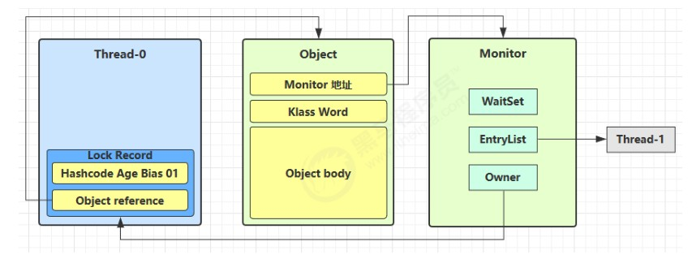

# 笔记

## synchronized

synchronized是进程OR线程互斥。

wait/notify是进程OR线程同步，且必须用于synchronized代码块内，表明是在互斥的基础上实现了同步。

## volatile

volatile不能实现互斥的原因是它不能保证原子性，即读取-修改-写回，它只能保证写回的时效性，因此在修改某变量期间仍可被其它进程OR线程所获取，从而导致数据不一致问题，它能保证在其修改完指定变量后能立即回写主内存，保证其之后读取的进程OR线程读到的必是最新的内容。

## 可见性、原子性、有序性

volatile和synchronized可以解决变量的可见性，但是前者无法解决原子性。

volatile只能保证读取和写入的字节码指令是到主存中进行操作，但是volatile不能保证从读取到写入之间的指令交错问题。

synchronized规定，线程在加锁时，先清空工作内存=>在主内存中拷贝最新变量的副本到工作内存=>执行完代码=>将更改后的共享变量的值刷新到主内存中=>释放互斥锁。

指令重排是因为这些指令的各个阶段可以通过重排序和组合来实现指令级并行，指令重排在多线程中会出现错误。

被volatile修饰的变量在其被操作的语句之前都不会发生指令的重排序，原理是在语句处加了一个写屏障。

volatile的底层实现原理是内存屏障，对volatile变量的写后会加入写屏障，对volatile变量的读前会加入读屏障。

写屏障保证在该屏障之前的，对共享变量的改动，以及其它的变量的改动，都同步到主内存中。

读屏障保证在该屏障之后，对共享变量的读取，以及之后其它变量的读取，加载的是主存中最新的数据。

上述的两种操作保证了可见性，并且写屏障同时保证了之前指令不会被重排序，读屏障保证了之后的指令不会被排到前面去。

## Double Check的单例模式

双检锁实现单例模式目的是为了在对象被实例化之后就不再进入同步代码块，而是直接获取到单例对象。

一个关键问题是new操作是分两步走：1.初始化对象放入内存地址，2.创建变量指向内存地址，这两个步骤可能会被指令重排，即先指向内存地址，然后实例化对象。

因此第二个线程在进行外层对象判空时会发现：哦！变量已经指向了一个内存地址，因此不为空，直接返回对象，但是此时对象还未被实例化，后续调用会出错。

因此实例变量还需要使用volatile进行修饰，防止指令重排，即保证先实例化对象，再对变量赋值。

**synchronized的有序性指的不是禁止指令重排，而是说因为加锁，其一个完整流程(一定要经历加锁和解锁，中间不会停止)产生的结果对后续获取锁的线程是有序的**。

**或者说如果要保证有序性，则代码块内的变量不应该在外部就被获取**。

## happens-before规则

happens-before就是一套规则，它规定了对共享变量的写操作对其它线程的读操作可见，是可见性和有序性的总结，如果抛开这个规则，JMM就不能保证一个线程对共享变量的写，对于其它线程对该变量的读可见。

就是说JMM提供了这一套规则来屏蔽底层，以帮助我们程序员快速开发并发程序。

JSR-133使用happens-before的概念来阐述操作之间的内存可见性。

在JMM中，如果一个操作执行的结果需要对另一个操作可见，那么这两个操作之间必须要存在happens-before关系，这里提到的两个操作既可以是在一个线程之内，也可以是在不同线程之间。

一个happens-before规则对应于一个或多个编译器和处理器重排序规则。

**对于程序员来说，happens-before规则简单易懂，它避免程序员为了理解JMM提供的内存可见性保证而去学习复杂的重排序规则以及这些规则的具体实现**。

1. 同一个synchronized的写对后面读是可见的。
2. volatile写线程，对后面的读线程是可见的。
3. 线程start前对变量的写，对该线程读可见。
4. 线程结束前对变量的写，对那些得知它结束的线程可见，比如isAlive()和join()方法。
5. 线程打断另一个线程前的写，对那些得知另一个线程被打断的线程读可见。
6. 默认值可见。
7. 传递性，比如volatile写屏障会将之前的对其它变量的写也同步到主存中，因此在后续读时也可以读到其它变量的最新值。

## 线程安全的定义

所谓的线程安全类指的是类中单个方法是原子的，但多个方法的组合并没有相关的机制提供原子性。

例如我们先get后put，如果没有加锁，那无法保证原子性，但是加锁又把锁的粒度给放大了，这时候应该找该类本身是否实现了这种提供多操作的单个方法，类似于Redis中的单个指令。

## 原子操作类

原子操作类借助CAS原理实现了线程安全访问，高并发情况下，原子操作类只有一个线程的CAS操作会成功，而其它竞争失败的线程会无限循环不断进行自旋尝试CAS操作，浪费CPU资源。LongAdder类将原本的一个共享变量拆分为多个变量，让同样多的线程去竞争多个资源。

## 伪共享

伪共享是因为CPU CACHE和主存交换数据是按照CACHE行大小来进行交换的，而一个CACHE行中可以存放有多个变量，当多个线程需要对一个CACHE行中的多个变量同时进行修改时，”由于只有一个线程能够操作CACHE行“，此类操作相比于将每个变量单独放到一个缓存行中，会导致性能下降，这就是”伪共享“。

因为局部性原理，读取一个CACHE行比读一个变量对后续程序运行性能的提升更有帮助。

如何避免伪共享：JDK8之前利用字节填充的方式来避免，JDK8提供了一个contended注解来避免伪共享，但只能用于Java核心类，即rt.jar包下的类，如果是用户应用程序，需要添加JVM参数。

一个CACHE行的大小一般为64个字节。

缓存的加入会造成数据副本的产生，即同一份数据会缓存在不同CPU核心的缓存行中，CPU要保证数据的一致性，如果某个核心更改了数据，其它核心对应的整个缓存行必须失效，一旦失效，CPU核心就必须到主存中获取最新的数据，降低了性能。

## 锁机制

### synchronized

Java对象头包含mark word和klass word，前者用来记录对象的一些信息，后者用于指向对象的类型信息。

每个对象自身都关联一个monitor对象，它包含waitset、entrylist、owner三个属性，当线程将某个对象作为锁对象并对其实施加锁(重量)时，就会将该对象的对象头中的前30位改为指向monitor对象的地址，并且将owner属性改为当前线程。

monitor对象是由JVM提供的，对于Java程序是不可见的。

至于前30位原来的信息(哈希码、分代年龄、是否为偏向锁)则被存放到了monitor对象中。

后续线程如果继续使用该对象作为锁对象并加锁时，会查看对象头发现已经指向了一个monitor对象，并且owner属性已经被赋予其它线程，就会将线程放到entrylist中，它可以理解为是一个等待队列。

当owner线程执行完毕，退出临界区时，将monitor对象中的原mark word中的信息重置回对象头中，并通知等待队列中的线程，由其中的线程竞争并获取锁。

### synchronized优化

synchronized重量锁太重了，JDK6之前，每次加锁解锁都要借助操作系统进行上下文切换，因此在JDK6、7对synchronized加锁进行了优化，使其不再那么“重”，因此现在很多的Java框架或工具类中，也是大量地使用到了synchronized来进行加锁。

重量锁之所以“重”，是因为Java线程是映射到OS的原生内核线程的，如果进行阻塞和唤醒操作，都需要借助操作系统来完成，并且不可避免地发生用户态到核心态之间的切换，耗费CPU时间。

无锁=》偏向锁=》轻量级锁=》重量级锁。

栈帧存储了方法的局部变量表、操作数栈、动态连接和方法返回地址等信息。

#### 轻量级锁

当锁对象处于未锁定状态时，会在执行方法的栈帧中建立一个名为lock record的空间，它存储了对象的mark word拷贝以及一个对象指针，JVM会尝试使用CAS操作将锁对象的mark word前30位改为指向lock record的指针，并将后两位修改为00，并且将lock record的对象指针指向刚刚的锁对象。

这样原锁对象的mark word信息被存放到了lock record中，并且指向了lock record，而lock record反过来也指向了锁对象，目的就是为了将来解锁时能够将原来的mark word信息复原回去。

如果发生synchronized的锁重入，则会再创建一个lock record，指向锁对象，但是此时不需要进行mark word的拷贝。

解锁时会使用CAS操作将mark word的信息给复原回去。

如果轻量级锁加锁失败，也就是尝试用CAS操作更新对象头的mark word指向lock record失败时，此时线程将关联到monitor对象，将自己加入到entrylist中去等待，并且将mark word由指向原来轻量级锁的地址修改为指向monitor的地址，此时原来lock record的地址将由monitor中的owner属性来指向，具体可以看图。

由于出现线程加锁失败，对象头中的mark word指向了重量级锁的地址，之前的轻量级锁准备还原mark word信息时会导致失败，此时会进入重量级锁的解锁流程，即通过lock record的对象指针找到对象，再找到monitor对象，将owner置为null，唤醒entrylist中的线程。

**也就是说轻量级锁借助CAS操作来避免重量级锁的开销，但是如果出现了竞争，除了重量级锁的开销外还要算上CAS操作的开销，因此有竞争时，轻量级锁反而比重量级锁更慢**。

#### 自旋优化

重量级锁竞争时，可以使用少量次数的自旋操作避免阻塞来进行优化，在多核时有意义，JDK6还可以控制是否开启，JDK7之后已经无法控制是否开启自旋优化了。

#### 偏向锁

轻量级锁的弊端就是无论当前线程是否为持有线程，即发生锁重入时，仍会发生CAS操作。

偏向锁：第一次加锁时会使用CAS操作将线程ID放到锁对象的mark word中，后续重入时，发现持有者是自己，就直接进入代码块内，不需要重新CAS。

JDK6之后，偏向锁是默认开启的，即第一次获取锁时会将标志位设为01，偏向模式设为1，利用CAS操作将线程ID记录到mark word之中，如果CAS成功，则后续线程锁重入时，不再进行任何的同步操作(加锁、解锁、对mark word的更新操作等)。

对象在偏向状态下，如果被另一个线程竞争，此时会立即结束偏向状态，转为轻量级锁。

**偏向锁和轻量级锁的一个前提是线程竞争是错开，如果是在同一个时刻竞争锁，则立马进入到重量级锁的流程**。

一个处于偏向状态的锁对象在被加解锁后，如果被非当前线程再次获取锁，则会撤销锁对象的偏向状态，进入轻量级锁的流程。

偏向状态撤销：

1. 调用hashcode方法；
2. 其它线程使用当前对象；
3. 调用wait/notify(重量级锁独有)。

批量重偏向：虽然对象被多个线程访问，但没有竞争，这时偏向了线程T1的对象仍有机会重新偏向T2，重偏向会重置对象的Thread ID。

批量撤销：当撤销偏向锁阈值超过40次后，JVM会这样觉得，自己确实偏向错了，根本就不该偏向。于是整个类的所有对象都会变为不可偏向的，新建的对象也是不可偏向的。
