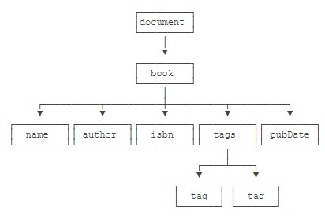

# XML与JSON

## XML简介

```XML
<?xml version="1.0" encoding="UTF-8" ?>
<!DOCTYPE note SYSTEM "book.dtd">
<book id="1">
    <name>Java核心技术</name>
    <author>Cay S. Horstmann</author>
    <isbn lang="CN">1234567</isbn>
    <tags>
        <tag>Java</tag>
        <tag>Network</tag>
    </tags>
    <pubDate/>
</book>
```

- XML有几个特点：一是纯文本，默认使用UTF-8编码，二是可嵌套，适合表示结构化数据。如果把XML内容存为文件，那么它就是一个XML文件，例如book.xml。此外，XML内容经常通过网络作为消息传输。
- XML有固定的结构，首行必定是`<?xml version="1.0"?>`，可以加上可选的编码。紧接着，如果以类似`<!DOCTYPE note SYSTEM "book.dtd">`声明的是文档定义类型（DTD：Document Type Definition），DTD是可选的。接下来是XML的文档内容，**一个XML文档有且仅有一个根元素**，根元素可以包含任意个子元素。
- 由于使用了<、>以及引号等标识符，如果内容出现了特殊符号，需要使用&???;表示转义。
- **格式正确**的XML（Well Formed）是指XML的格式是正确的，可以被解析器正常读取。而**合法**的XML是指，不但XML格式正确，而且它的数据结构可以被DTD或者XSD验证。
- DTD文档可以**指定一系列规则**，例如：根元素必须是book；book元素必须包含name，author等指定元素；isbn元素必须包含属性lang。
- 如何验证XML文件的格式正确性呢。最简单的方式是通过浏览器验证。可以直接把XML文件拖拽到浏览器窗口，如果格式错误，浏览器会报错。
- 和结构类似的HTML不同，浏览器对HTML有一定的“容错性”，缺少关闭标签也可以被解析，**但XML要求严格的格式，任何没有正确嵌套的标签都会导致错误**。

## 使用DOM

- 因为XML是一种树形结构的文档，它有两种标准的解析API：DOM：一次性读取XML，并在内存中表示为树形结构；SAX：以流的形式读取XML，使用事件回调。
- DOM是Document Object Model的缩写，DOM模型就是把XML结构作为一个树形结构处理，从根节点开始，每个节点都可以包含任意个子节点。

    

- 注意到最顶层的document代表XML文档，它是真正的“根”，而`<book>`虽然是根元素，但它是document的一个子节点。
- Java提供了DOM API来解析XML，它使用下面的**对象**来表示XML的内容：Document：代表整个XML文档；Element：代表一个XML元素；Attribute：代表一个元素的某个属性。

    ```Java
        public static void main(String[] args) throws ParserConfigurationException, IOException, SAXException {
            InputStream input = Main.class.getResourceAsStream("/book.xml");
            DocumentBuilderFactory dbf = DocumentBuilderFactory.newInstance();
            DocumentBuilder db = dbf.newDocumentBuilder();
            // DocumentBuilder.parse()用于解析一个XML，它可以接收InputStream，File或者URL，如果解析无误，我们将获得一个Document对象
            // 这个对象代表了整个XML文档的树形结构，需要遍历以便读取指定元素的值
            Document doc = db.parse(input);
            printNode(doc, 0);
        }

        static void printNode(Node n, int indent) {
            for (int i = 0; i < indent; i++) {
                System.out.print(' ');
            }
            switch (n.getNodeType()) {
                case Node.DOCUMENT_NODE:
                    System.out.println("Document: " + n.getNodeName());
                    break;
                case Node.ELEMENT_NODE:
                    System.out.println("Element: " + n.getNodeName());
                    break;
                case Node.TEXT_NODE:
                    System.out.println("Text: " + n.getNodeName() + " = " + n.getNodeValue());
                    break;
                case Node.ATTRIBUTE_NODE:
                    System.out.println("Attr: " + n.getNodeName() + " = " + n.getNodeValue());
                    break;
                case Node.CDATA_SECTION_NODE:
                    System.out.println("Comment: " + n.getNodeName() + " = " + n.getNodeValue());
                    break;
                default:
                    System.out.println("NodeType: " + n.getNodeType() + " = " + n.getNodeValue());
            }
            for (Node child = n.getFirstChild(); child != null; child = child.getNextSibling()) {
                printNode(child, indent + 1);
            }
        }
    ```

- 对于DOM API解析出来的结构，我们从根节点Document出发，可以遍历所有子节点，获取所有元素、属性、文本数据，还可以包括注释，这些节点被统称为Node，每个Node都有自己的Type，根据Type来区分一个Node到底是元素，还是属性，还是文本，等等。
- 使用DOM API时，如果要读取某个元素的文本，需要访问它的Text类型的子节点，所以使用起来还是比较繁琐的。

## 使用SAX

- 使用DOM解析XML的优点是用起来省事，但它的主要缺点是内存占用太大。另一种解析XML的方式是SAX。SAX是Simple API for XML的缩写，它是一种基于流的解析方式，边读取XML边解析，并以**事件回调**的方式让调用者获取数据。因为是一边读一边解析，所以无论XML有多大，占用的内存都很小。
- SAX解析会触发一系列事件：startDocument：开始读取XML文档；startElement：读取到了一个元素，例如`<book>`；characters：读取到了字符；endElement：读取到了一个结束的元素，例如`</book>`；endDocument：读取XML文档结束。

    ```Java
    public class Main {
        public static void main(String[] args) throws ParserConfigurationException, IOException, SAXException {
            InputStream input = Main.class.getResourceAsStream("/book.xml");
            SAXParserFactory spf = SAXParserFactory.newInstance();
            SAXParser saxParser = spf.newSAXParser();
            // 关键代码SAXParser.parse()除了需要传入一个InputStream外，还需要传入一个回调对象，这个对象要继承自DefaultHandler
            saxParser.parse(input, new MyHandler());
        }
    }

    public class MyHandler extends DefaultHandler {
        @Override
        public void startDocument() throws SAXException {
            print("start document");
        }

        @Override
        public void endDocument() throws SAXException {
            print("end document");
        }

        @Override
        public void startElement(String uri, String localName, String qName, Attributes attributes) throws SAXException {
            print("start element:", localName, qName);
        }

        @Override
        public void endElement(String uri, String localName, String qName) throws SAXException {
            print("end element:", localName, qName);
        }

        @Override
        public void characters(char[] ch, int start, int length) throws SAXException {
            print("characters:", new String(ch, start, length));
        }

        @Override
        public void error(SAXParseException e) throws SAXException {
            print("error:", e);
        }

        void print(Object... objs) {
            for (Object obj : objs) {
                System.out.print(obj);
                System.out.print(" ");
            }
            System.out.println();
        }
    }
    ```

- 如果要读取`<name>`节点的文本，我们就必须在解析过程中根据startElement()和endElement()定位当前正在读取的节点，可以使用栈结构保存，每遇到一个startElement()入栈，每遇到一个endElement()出栈，这样，读到characters()时我们才知道当前读取的文本是哪个节点的。可见，使用SAX API仍然比较麻烦。

## 使用Jackson

- 前面我们介绍了DOM和SAX两种解析XML的标准接口。但是，无论是DOM还是SAX，使用起来都不直观。
- 幸运的是，一个名叫Jackson的开源的第三方库可以轻松做到XML到JavaBean的转换。

    ```Java
    public class Book {
        public long id;
        public String name;
        public String author;
        public String isbn;
        public List<String> tags;
        public String pubDate;
    }

    public class Main {
        public static void main(String[] args) throws IOException {
            InputStream input = Main.class.getResourceAsStream("/book.xml");
            JacksonXmlModule module = new JacksonXmlModule();
            // 注意到XmlMapper就是我们需要创建的核心对象，可以用readValue(InputStream, Class)直接读取XML并返回一个JavaBean。
            XmlMapper mapper = new XmlMapper(module);
            Book book = mapper.readValue(input, Book.class);
            System.out.println(book.id);
            System.out.println(book.name);
            System.out.println(book.author);
            System.out.println(book.isbn);
            System.out.println(book.tags);
            System.out.println(book.pubDate);
        }
    }
    ```

- 如果要解析的数据格式不是Jackson内置的标准格式，那么需要编写一点额外的扩展来告诉Jackson如何自定义解析。参考[官方文档](https://github.com/FasterXML/jackson)。

## 使用JSON

- XML的特点是功能全面，但标签繁琐，格式复杂。在Web上使用XML现在越来越少，取而代之的是JSON这种数据结构。
- JSON是JavaScript Object Notation的缩写，它去除了所有JavaScript执行代码，只保留JavaScript的对象格式。

    ```JSON
    {
        "id": 1,
        "name": "Java核心技术",
        "author": {
            "firstName": "Abc",
            "lastName": "Xyz"
        },
        "isbn": "1234567",
        "tags": ["Java", "Network"]
    }
    ```

- JSON作为**数据传输**的格式，JSON只允许使用UTF-8编码，不存在编码问题；JSON只允许使用双引号作为key，特殊字符用\转义，格式简单；浏览器内置JSON支持，如果把数据用JSON发送给浏览器，可以用JavaScript直接处理。
- 仅支持以下几种数据类型：键值对：{"key": value}；数组：[1, 2, 3]；字符串："abc"；数值（整数和浮点数）：12.34；布尔值：true或false；空值：null。

    ```JavaScript
    // JSON string to JavaScript object:
    jsObj = JSON.parse(jsonStr);

    // JavaScript object to JSON string:
    jsonStr = JSON.stringify(jsObj);
    ```

- 开发Web应用的时候，使用JSON作为数据传输，在浏览器端非常方便。因为JSON天生适合JavaScript处理，所以，绝大多数REST API都选择JSON作为数据传输格式。

    ```Java
    public class Book {
        public long id;
        public String name;
        public Map<String, String> author;
        public String isbn;
        public String[] tags;
        public String pubDate;
    }

    InputStream input = Main.class.getResourceAsStream("/book.json");
    // 核心代码是创建一个ObjectMapper对象。
    ObjectMapper mapper = new ObjectMapper();
    // 关闭DeserializationFeature.FAIL_ON_UNKNOWN_PROPERTIES功能使得解析时如果JavaBean不存在该属性时解析不会报错。
    mapper.configure(DeserializationFeature.FAIL_ON_UNKNOWN_PROPERTIES, false);

    // 反序列化
    Book book = mapper.readValue(input, Book.class);

    // 序列化
    String json = mapper.writeValueAsString(book);
    System.out.println(json);
    ```

- 要把JSON的某些值解析为特定的Java对象，例如LocalDate，也是完全可以的。

    ```JSON
    {
        "name": "Java核心技术",
        "pubDate": "2016-09-01"
    }
    ```

    ```Java
    public class Book {
        public String name;
        public LocalDate pubDate;
    }
    // 引入标准的JSR 310关于JavaTime的数据格式定义至Maven
    // 创建ObjectMapper时，注册一个新的JavaTimeModule
    ObjectMapper mapper = new ObjectMapper().registerModule(new JavaTimeModule());
    ```

- 有些时候，内置的解析规则和扩展的解析规则如果都不满足我们的需求，还可以自定义解析。

    ```Java
    public class Book {
        public String name;
        public BigInteger isbn;
    }
    ```

    ```JSON
    {
        "name": "Java核心技术",
        // 不是标准的整形格式
        "isbn": "978-7-111-54742-6"
    }
    ```

    ```Java
    // 自定义一个IsbnDeserializer，用于解析含有非数字的字符串
    public class IsbnDeserializer extends JsonDeserializer<BigInteger> {
        public BigInteger deserialize(JsonParser p, DeserializationContext ctxt) throws IOException, JsonProcessingException {
            String s = p.getValueAsString();
            if (s != null) {
                try {
                    return new BigInteger(s.replace("-", ""));
                } catch (NumberFormatException e) {
                    throw new JsonParseException(p, s, e);
                }
            }
            return null;
        }
    }
    // 在Book类中使用注解标注
    public class Book {
        public String name;
        // 表示反序列化isbn时使用自定义的IsbnDeserializer:
        @JsonDeserialize(using = IsbnDeserializer.class)
        public BigInteger isbn;
    }
    ```

- 类似的，自定义序列化时我们需要自定义一个IsbnSerializer，然后在Book类中标注@JsonSerialize(using = ...)即可。
