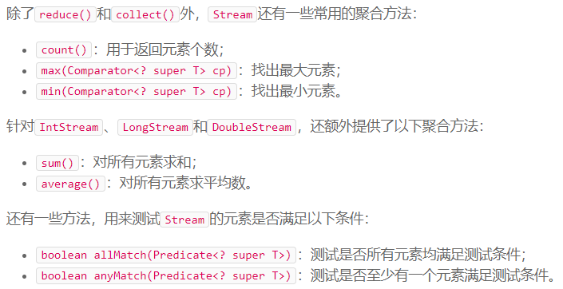
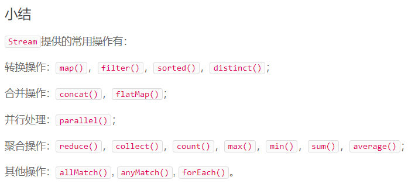

# 函数式编程

- 函数式编程（Functional Programming）是把函数作为基本运算单元，函数可以作为变量，可以接收函数，还可以返回函数。历史上研究函数式编程的理论是Lambda演算，所以我们经常把支持函数式编程的编码风格称为Lambda表达式。

## Lambda基础

- Java的方法分为实例方法以及静态方法，无论是实例方法，还是静态方法，本质上都相当于过程式语言的函数。
- **只不过Java的实例方法隐含地传入了一个this变量，即实例方法总是有一个隐含参数this。**

### Lambda表达式

- 可以用Lambda表达式替换单方法接口。

```Java
/*
 * 1.新建一个 Comparator 子类，实现 compare 方法，实例化一个对象并作为实参传入。
 * 2.匿名内部类，直接在参数位置 new Comparator 并实现 compare 方法。
 * 3.lambda 表达式，只要写出方法定义，参数类型可省略和返回值由编译器自动推断。
 */
Person[] array = new Person[] { new Person("cat", 22), new Person("dog", 23) };
Arrays.sort(array, (p1, p2) -> p2.getAge() - p1.getAge()); // 按照年龄对数组进行降序排序
```

### FunctionalInterface

- 把只定义了单方法的接口称之为FunctionalInterface，用注解@FunctionalInterface标记。

```Java
@FunctionalInterface
public interface Callable<V>
```

## 方法引用

- 所谓方法引用，是指如果某个**方法签名**和接口恰好一致，就可以直接传入方法引用。
- **在这里，方法签名只看参数类型和返回类型，不看方法名称，也不看类的继承关系。**

```Java
/*
 * Comparator<Person> -> int compare(Person, Person) 和静态方法 int cmp(Person, Person) 相比，
 * 除了方法名外，参数类型和返回类型相同，两者方法签名一致，直接把方法名当作 lambda 表达式传入。
 */
public static void main(String[] args) {
    Person[] array = new Person[] { new Person("cat", 22), new Person("dog", 23) };
    Arrays.sort(array, LambdaTest::cmp);
}
static int cmp(Person p1, Person p2) {
    return p2.getAge() - p1.getAge();
}
/*
 * Comparator<Person> -> int compare(Person, Person) 和实例方法 int compareAge(Person) 相比，
 * 后者签名只有一个参数，但由于实例方法有一个隐含的 this 参数，在实际调用的时候，第一个隐含参数总是传入 this，
 * 相当于静态方法 public static int compareAge(this, Person other)，因此也可作为方法引用传入。
 */
Arrays.sort(array, Person::compareAge);
// 来自 Person 类的实例方法 compareAge
public int compareAge(Person other) {
    return other.getAge() - this.getAge();
}
```

### 构造方法引用

```Java
public Person(String name) {
    super();
    this.name = name;
}
@FunctionalInterface
public interface Function<T, R> {
    R apply(T t);
}
/*
 * map() 需要传入的 FunctionalInterface 定义如上所示，将泛型对应之后得到方法签名 Person apply(String)，
 * 即传入参数 String，返回类型 Person。而 Person 类的构造方法恰好满足这个条件，虽然构造方法没有 return 语句，
 * 但实际上隐式地返回了 this 实例，类型就是 Person。
 */
List<String> names = new ArrayList<String>();
names.add("Bob");
names.add("Alice");
names.add("Tim");
List<Person> persons = names.stream().map(Person::new).collect(Collectors.toList());
```

### 小结

- FunctionalInterface允许传入：接口的实现类（传统写法，代码较繁琐）；Lambda表达式（只需列出参数名，由编译器推断类型）；符合方法签名的静态方法；符合方法签名的实例方法（实例类型被看做第一个参数类型）；符合方法签名的构造方法（实例类型被看做返回类型）。
- FunctionalInterface不强制继承关系，不需要方法名称相同，只要求方法参数（类型和数量）与方法返回类型相同，即认为方法签名相同。

## 使用Stream

- Stream API的基本用法就是：创建一个Stream，然后做若干次转换，最后调用一个求值方法获取真正计算的结果。
- Stream API的特点是：Stream API提供了一套新的流式处理的抽象序列；Stream API支持函数式编程和链式操作；Stream可以表示无限序列，并且大多数情况下是惰性求值的。

### 创建Stream

```Java
Stream<String> stream = Stream.of("A", "B", "C", "D"); // 指定元素创建
stream.forEach(System.out::println);
```

```Java
Stream<String> stream1 = Arrays.stream(new String[] { "A", "B", "C" }); // 指定数组创建
Stream<String> stream2 = Arrays.asList("X", "Y", "Z").stream(); // 指定 Collection 创建
```

```Java
Stream<Integer> natual = Stream.generate(new Supplier<Integer>() {
    private AtomicInteger ai = new AtomicInteger(0);

    @Override
    public Integer get() {
        return this.ai.incrementAndGet();
    }
}); // 基于 Supplier 创建，这种 Stream 保存的不是元素，而是算法，可用来表示无限序列
natual.limit(20).forEach(System.out::println); // 无限序列必须变成有限序列再调用最终求值操作
```

```Java
// 通过一些 API 提供的接口，直接获得 Stream。

// Files 类的 lines() 方法把一个文件变成一个 Stream，每个元素代表文件的一行内容。此方法对于按行遍历文本文件十分有用。
try (Stream<String> lines = Files.lines(Paths.get(".\\static\\file.txt"))) {
    lines.forEach(System.out::println);
}
// Pattern 对象有一个 splitAsStream() 方法，可以直接把一个长字符串分割成 Stream 序列而不是数组
Pattern p = Pattern.compile("\\s+");
Stream<String> s = p.splitAsStream("The quick brown fox jumps over the lazy dog");
s.forEach(System.out::println);
```

```Java
// 为了保存 int，只能使用 Stream<Integer>，但这样会产生频繁的装箱、拆箱操作。
IntStream is = Arrays.stream(new int[] { 1, 2, 3 });
// mapToLong() 调用引用方法将每个元素作为参数传入得到 Long 类型的返回值，最后返回一个 LongStream 序列。
LongStream ls = Arrays.asList("1", "2", "3").stream().mapToLong(Long::parseLong);
```

```Java
// 编写一个能输出斐波那契数列的 LongStream。
LongStream fiboStream = LongStream.generate(new LongSupplier() {
    private long t1 = 0;
    private long t2 = 1;
    private long nextTerm;

    @Override
    public long getAsLong() {
        this.nextTerm = t1 + t2;
        this.t1 = t2;
        this.t2 = nextTerm;
        return this.t1;
    }
});
fiboStream.limit(10).forEach(System.out::println);
```

### 使用map

- map()方法用于将一个Stream的每个元素映射成另一个元素并转换成一个新的Stream；可以将一种元素类型转换成另一种元素类型。

```Java
Arrays.asList("  Apple  ", " pear ", " ORANGE", " BaNaNa ")
        .stream()
        .map(String::trim) // 去空格 trim(this) -> String
        .map(String::toLowerCase) // 变小写 toLowerCase(this) -> String
        .forEach(System.out::println);
```

```Java
String[] array = new String[] { " 2019-12-31 ", "2020 - 01-09 ", "2020- 05 - 01 ", "2022 - 02 - 01",
        " 2025-01 -01" };
Arrays.stream(array)
    .map(str -> str.replaceAll("\\s+", ""))
    .map(LocalDate::parse) // static LocalDate parse​(CharSequence text). the text to parse such as "2007-12-03", not null.
    .forEach(System.out::println);
```

### 使用filter

- 使用filter()方法可以对一个Stream的每个元素进行测试，通过测试的元素被过滤后生成一个新的Stream。

```Java
// 过滤偶数
IntStream.of(1, 2, 3, 4, 5, 6, 7, 8, 9)
    .filter(n -> n % 2 != 0) // 断言型接口对象，接收一个泛型参数，返回一个 boolean 值
    .forEach(System.out::println);
```

```Java
// 从一组给定的 LocalDate 中过滤工作日，等到休息日
Stream.generate(new Supplier<LocalDate>() {
    LocalDate start = LocalDate.of(2020, 1, 1);
    int n = -1;

    @Override
    public LocalDate get() {
        this.n++;
        return start.plusDays(n);
    }
})
.limit(31)
.filter((ldt) -> ldt.getDayOfWeek() == DayOfWeek.SATURDAY || ldt.getDayOfWeek() == DayOfWeek.SUNDAY)
.forEach(System.out::println);
```

```Java
// 过滤出成绩及格的同学，并打印出名字
List<Person> persons = Arrays.asList(new Person("小明", 88), new Person("小黑", 62), new Person("小白", 45),
        new Person("小黄", 78), new Person("小红", 99), new Person("小林", 58));
persons.stream()
    .filter((person) -> person.getAge() >= 60)
    .forEach((person) -> System.out.println(person.getName()));
```

### 使用reduce

- reduce()方法将一个Stream的每个元素依次作用于BinaryOperator，并将结果合并。
- reduce()是聚合方法，聚合方法会立刻对Stream进行计算。

```Java
@FunctionalInterface
public interface BinaryOperator<T> extends BiFunction<T,T,T>
T apply(T t, T u)
```

```Java
// T reduce​(T identity, BinaryOperator<T> accumulator)
// 初始化结果为指定值（这里是0），紧接着，reduce()对每个元素依次调用(acc, n) -> acc + n，其中，acc是上次计算的结果。
int sum = Stream.of(1, 2, 3, 4, 5, 6, 7, 8, 9).reduce(0, (acc, n) -> acc + n);
System.out.println(sum);
```

```Java
// Optional<T> reduce​(BinaryOperator<T> accumulator)
// 因为Stream的元素有可能是0个，这样就没法调用reduce()的聚合函数了，因此返回Optional对象，需要进一步判断结果是否存在。
Optional<Integer> opt = Stream.of(1, 2, 3, 4, 5, 6, 7, 8, 9).reduce((acc, n) -> acc + n);
if (opt.isPresent())
    System.out.println(opt.get());
```

```Java
// 上面是求和，这里是求积，很明显需要把初始值设置为1。
int mul = Stream.of(1, 2, 3, 4, 5, 6, 7, 8, 9).reduce(1, (acc, n) -> acc * n);
System.out.println(mul);
```

```Java
// 将配置文件的每一行配置通过map()和reduce()操作聚合成一个Map<String, String>。
List<String> props = Arrays.asList("profile=native", "debug=true", "logging=warn", "interval=500");
Map<String, String> propMap = props.stream().map((propStr) -> {
    String[] propKV = propStr.split("\\=", 2); // 只要第一个等号之前的字符串作为key，之后的字符串都作为value，不管是否有等号。
    Map<String, String> retMap = new HashMap<>();
    retMap.put(propKV[0], propKV[1]);
    return retMap; // 将每一个配置字符串都转化为Map对象
}).reduce(new HashMap<String, String>(), (hm, rm) -> {
    // 指定初始值为一个HashMap，将序列中的Map对象逐一放入其中，返回这个HashMap给到下一次调用时传入
    hm.putAll(rm);
    return hm;
});
// 此处的forEach()方法来自Map接口自身
// public void forEach​(BiConsumer<? super K,? super V> action)
// 双泛型参数的消费型接口
propMap.forEach((k, v) -> {
    System.out.printf("%s = %s\n", k, v);
});
```

### 输出集合

- 这些操作对Stream来说可以分为两类，一类是转换操作，即把一个Stream转换为另一个Stream，例如map()和filter()，另一类是聚合操作，即对Stream的每个元素进行计算，得到一个确定的结果，例如reduce()。
- 区分这两种操作是非常重要的，因为对于Stream来说，对其进行转换操作**并不会触发任何计算**！
- 聚合操作是真正需要从Stream请求数据的，对一个Stream做聚合计算后，结果就不是一个Stream，而是一个其他的Java对象。
- reduce()只是一种聚合操作，如果我们希望把Stream的元素保存到集合，例如List，因为List的元素是确定的Java对象，因此，把Stream变为List不是一个转换操作，而是一个聚合操作，它会强制Stream输出每个元素。
- 把Stream的每个元素收集到List的方法是调用collect()并传入Collectors.toList()对象，它实际上是一个Collector实例，通过类似reduce()的操作，把每个元素添加到一个收集器中（实际上是ArrayList）。

    ```Java
    // 过滤非空字符串，然后把非空字符串保存到list中
    Stream<String> stream = Stream.of("Apple", "", null, "Pear", "  ", "Orange");
    List<String> list = stream.filter(s -> s != null && !StringUtils.isBlank(s)).collect(Collectors.toList());
    System.out.println(list);
    ```

- 把Stream的元素输出为数组和输出为List类似，我们只需要调用toArray()方法，并传入数组的“构造方法”。

    ```Java
    List<String> list = Arrays.asList("Apple", "Banana", "Orange");
    // toArray(IntFunction<String[]> generator)
    // String[] apply(int)
    // 生成器函数取一个整数，它是所需数组的大小，并生成所需大小的数组。
    String[] array = list.stream().toArray(String[]::new);
    System.out.println(Arrays.toString(array));
    ```

- 如果我们要把Stream的元素收集到Map中，就稍微麻烦一点。因为对于每个元素，添加到Map时需要key和value，因此，我们要指定两个映射函数，分别把元素映射为key和value。

    ```Java
    Stream<String> stream = Stream.of("APPL:Apple", "MSFT:Microsoft");
    // toMap(Function<? super String, ? extends String> keyMapper, Function<? super String, ? extends String> valueMapper)
    Map<String, String> map = stream
            .collect(Collectors.toMap(
                    s -> s.substring(0, s.indexOf(':')),
                    s -> s.substring(s.indexOf(':') + 1)));
    System.out.println(map);
    ```

- 分组输出使用Collectors.groupingBy()，它需要提供两个函数：一个是分组的key，这里使用s -> s.substring(0, 1)，表示只要首字母相同的String分到一组，第二个是分组的value，这里直接使用Collectors.toList()，表示输出为List。

    ```Java
    List<String> list = Arrays.asList("Apple", "Banana", "Blackberry", "Coconut", "Avocado", "Cherry", "Apricots");
    Map<String, List<String>> groups = list.stream()
            .collect(Collectors.groupingBy(s -> s.substring(0, 1), Collectors.toList()));
    System.out.println(groups);
    ```

### 其它操作

```Java
List<String> list = Stream.of("Orange", "apple", "Banana")
        .sorted(String::compareToIgnoreCase) // 排序
        .collect(Collectors.toList());
System.out.println(list);
```

```Java
List<String> list = Stream.of("A", "B", "A", "C", "B", "D")
        .distinct() // 去重
        .collect(Collectors.toList());
System.out.println(list);
```

```Java
List<String> list = Stream.of("A", "B", "C", "D", "E", "F")
        .skip(2) // 跳过
        .limit(3) // 截取
        .collect(Collectors.toList());
System.out.println(list);
```

```Java
Stream<String> s1 = Stream.of("A", "B", "C");
Stream<String> s2 = Stream.of("D", "E");
Stream<String> s = Stream.concat(s1, s2); // 合并
System.out.println(s.collect(Collectors.toList()));
```

```Java
// 所谓flatMap()，是指把Stream的每个元素（这里是List）映射为Stream，然后合并成一个新的Stream
// 注意是一个stream，如果用map是多个stream
Stream<List<Integer>> s = Stream.of(
        Arrays.asList(1, 2, 3),
        Arrays.asList(4, 5, 6),
        Arrays.asList(7, 8, 9)
);
Stream<Integer> i = s.flatMap(Collection::stream);
```

```Java
// 经过parallel()转换后的Stream只要可能，就会对后续操作进行并行处理。
Stream<String> s = Stream.of("apple", "Orange", "Banana");
String[] result = s.parallel().sorted().toArray(String[]::new);
System.out.println(Arrays.toString(result));
```




