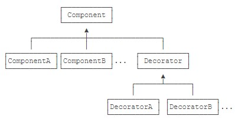
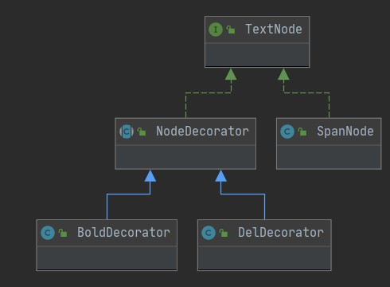

# 结构型

结构型模式主要涉及如何组合各种对象以便获得更好、更灵活的结构。虽然面向对象的继承机制提供了最基本的子类扩展父类的功能，但结构型模式不仅仅简单地使用继承，而更多地通过组合与运行期的动态组合来实现更灵活的功能。

## 适配器

> 将一个类的接口转换成客户希望的另外一个接口，使得原本由于接口不兼容而不能一起工作的那些类可以一起工作。

编写一个Adapter的步骤如下：实现目标接口；内部持有一个待转换接口的引用；在目标接口的实现方法内部，调用待转换接口的方法。

```Java
public class RunnableAdapter implements Runnable {
    private Callable<?> callable;

    public RunnableAdapter(Callable<?> callable) {
        this.callable = callable;
    }

    @Override
    public void run() {
        try {
            callable.call();
        } catch (Exception e) {
            throw new RuntimeException(e);
        }
    }
}
```

这样一来，Thread就可以接收这个RunnableAdapter，因为它实现了Runnable接口。Thread作为调用方，它会调用RunnableAdapter的run()方法，在这个run()方法内部，又调用了Callable的call()方法，相当于Thread通过一层转换，间接调用了Callable的call()方法。

```Java
String[] exist = new String[] {"Good", "morning", "Bob", "and", "Alice"};
// 注意到List<T> Arrays.asList(T[])就相当于一个转换器，它可以把数组转换为List。
Set<String> set = new HashSet<>(Arrays.asList(exist));
```

```Java
InputStream input = Files.newInputStream(Paths.get("/path/to/file"));
// InputStreamReader就是Java标准库提供的Adapter，它负责把一个InputStream适配为Reader。
Reader reader = new InputStreamReader(input, "UTF-8");
readText(reader);
```

**持有高层接口不但代码更灵活，而且把各种接口组合起来也更容易。一旦持有某个具体的子类类型，要想做一些改动就非常困难**。

```Java
// 编写Adapter实际上就是编写一个实现了B接口，并且内部持有A接口的类。
// 在Adapter内部将B接口的调用“转换”为对A接口的调用。
// 只有A、B接口均为抽象接口时，才能非常简单地实现Adapter模式。
public BAdapter implements B {
    private A a;
    public BAdapter(A a) {
        this.a = a;
    }
    public void b() {
        a.a();
    }
}
```

## 装饰器

> 动态地给一个对象添加一些额外的职责。就增加功能来说，相比生成子类更为灵活。

装饰器（Decorator）模式，是一种在**运行期**动态给某个对象的实例增加功能的方法。Decorator模式的目的就是把一个一个的附加功能，用Decorator的方式给一层一层地累加到原始数据源上，最终，通过组合获得我们想要的功能。

```Java
// 创建原始的数据源:
InputStream fis = new FileInputStream("test.gz");
// 增加缓冲功能:
InputStream bis = new BufferedInputStream(fis);
// 增加解压缩功能:
InputStream gis = new GZIPInputStream(bis);
```

```Java
InputStream input = new GZIPInputStream( // 第二层装饰
                        new BufferedInputStream( // 第一层装饰
                            new FileInputStream("test.gz") // 核心功能
                        ));
```



最顶层的Component是接口，对应到IO的就是InputStream这个抽象类。ComponentA、ComponentB是实际的子类，对应到IO的就是FileInputStream、ServletInputStream这些**数据源**。Decorator是用于实现各个附加功能的抽象装饰器，对应到IO的就是FilterInputStream。而从Decorator派生的就是一个一个的装饰器，它们每个都有独立的功能，对应到IO的就是BufferedInputStream、GZIPInputStream等。

Decorator模式有什么好处。它实际上把核心功能和附加功能给分开了。核心功能指FileInputStream这些真正读数据的源头，附加功能指加缓冲、压缩、解密这些功能。如果我们要新增核心功能，就增加Component的子类，例如ByteInputStream。如果我们要增加附加功能，就增加Decorator的子类，例如CipherInputStream。两部分都可以独立地扩展，而具体如何附加功能，由调用方自由组合，从而极大地增强了灵活性。

假设我们需要渲染一个HTML的文本，但是文本还可以附加一些效果，比如加粗、变斜体、加下划线等。为了**实现动态附加效果**，可以采用Decorator模式。

```Java
// 首先，仍然需要定义顶层接口TextNode：
public interface TextNode {
    void setText(String text);
    String getText();
}
```

```Java
// 对于核心节点，例如<span>，它需要从TextNode直接实现：
public class SpanNode implements TextNode {
    private String text;

    @Override
    public void setText(String text) {
        this.text = text;
    }

    @Override
    public String getText() {
        return "<span>" + this.text + "</span>";
    }
}
```

```Java
// 紧接着，为了实现Decorator模式，需要有一个抽象的Decorator类：
public abstract class NodeDecorator implements TextNode {
    // 核心是持有一个TextNode，即将要把功能附加到的TextNode实例。
    protected final TextNode target;

    protected NodeDecorator(TextNode target) {
        this.target = target;
    }
    // 将文本赋予起始数据源这点功能是不变的
    @Override
    public void setText(String text) {
        this.target.setText(text);
    }
}
```

```Java
// 写一个加粗功能：
public class BoldDecorator extends NodeDecorator {
    public BoldDecorator(TextNode target) {
        super(target);
    }
    // 在获取文本功能上我们获取上一级的文本内容并进行装饰
    @Override
    public String getText() {
        return "<b>" + super.target.getText() + "</b>";
    }
}
// 写一个删除功能：
public class DelDecorator extends NodeDecorator {
    public DelDecorator(TextNode target) {
        super(target);
    }

    @Override
    public String getText() {
        return "<del>" + super.target.getText() + "</del>";
    }
}
```

```Java
TextNode n1 = new BoldDecorator(new SpanNode());
TextNode n2 = new DelDecorator(new BoldDecorator(new SpanNode()));
n1.setText("Hello"); // SpanNode.setText(String text)
n2.setText("World"); // SpanNode.setText(String text)
System.out.println(n1.getText()); // <b><span>Hello</span></b>
System.out.println(n2.getText()); // <del><b><span>World</span></b></del>
```



使用Decorator模式，可以独立增加核心功能，也可以独立增加附加功能，二者互不影响；可以在运行期动态地给核心功能增加任意个附加功能。

## 代理

> 为其它对象提供一种代理以控制对这个对象的访问。

代理模式，即Proxy，它和Adapter模式很类似。Adapter模式，它用于把A接口转换为B接口。而Proxy模式不是把A接口转换成B接口，它还是转换成A接口。

```Java
// 如果我们在调用a.a()的前后，加一些额外的代码。
// 这样一来，我们就实现了权限检查，只有符合要求的用户，才会真正调用目标方法，否则，会直接抛出异常。
public void a() {
    if (getCurrentUser().isRoot()) {
        this.a.a();
    } else {
        throw new SecurityException("Forbidden");
    }
}
```

为何不把权限检查的功能直接写到目标实例A的内部。因为我们编写代码的原则有：职责清晰：一个类只负责一件事；易于测试：一次只测一个功能。用Proxy实现这个权限检查，我们可以获得更清晰、更简洁的代码：A接口：只定义接口；ABusiness类：只实现A接口的业务逻辑；APermissionProxy类：只实现A接口的权限检查代理。如果我们希望编写其它类型的代理，可以继续增加类似ALogProxy，而不必对现有的A接口、ABusiness类进行修改。

实际上权限检查只是代理模式的一种应用。Proxy还广泛应用在：**远程代理**即Remote Proxy，本地的调用者持有的接口实际上是一个代理，这个代理负责把对接口的方法访问转换成远程调用，然后返回结果。Java内置的RMI机制就是一个完整的远程代理模式。**虚代理**即Virtual Proxy，它让调用者先持有一个代理对象，但真正的对象尚未创建。如果没有必要，这个真正的对象是不会被创建的，直到客户端需要真的必须调用时，才创建真正的对象。JDBC的连接池返回的JDBC连接（Connection对象）就可以是一个虚代理，即获取连接时根本没有任何实际的数据库连接，直到第一次执行JDBC查询或更新操作时，才真正创建实际的JDBC连接。**保护代理**即Protection Proxy，它用代理对象控制对原始对象的访问，常用于鉴权。**智能引用**即Smart Reference，它也是一种代理对象，如果有很多客户端对它进行访问，通过内部的计数器可以在外部调用者都不使用后自动释放它。

Decorator模式让调用者自己创建核心类，然后组合各种功能，而Proxy模式决不能让调用者自己创建再组合，否则就失去了代理的功能。Proxy模式让调用者认为获取到的是核心类接口，但实际上是代理类。

代理模式通过封装一个已有接口，并向调用方返回相同的接口类型，能让调用方在不改变任何代码的前提下增强某些功能（例如，鉴权、延迟加载、连接池复用等）。使用Proxy模式要求调用方持有接口，作为Proxy的类也必须实现相同的接口类型。
