# 笔记

## Web基础

### HTTP协议

今天我们访问网站，使用App时，都是基于Web这种Browser/Server模式，简称BS架构，它的特点是，**客户端只需要浏览器，应用程序的逻辑和数据都存储在服务器端**。浏览器只需要请求服务器，获取Web页面，并把Web页面展示给用户即可。

浏览器发送的HTTP请求中比较常用的HTTP Header包括：

- Host: 表示请求的主机名，因为一个服务器上可能运行着多个网站，因此，Host表示浏览器正在请求的域名；
- User-Agent: 标识客户端本身，例如Chrome浏览器的标识类似`Mozilla/5.0 ... Chrome/79`，IE浏览器的标识类似`Mozilla/5.0 (Windows NT ...) like Gecko`；
- Accept：表示浏览器能接收的资源类型，如`text/*`，`image/*`或者`*/*`表示所有；
- Accept-Language：表示浏览器偏好的语言，服务器可以据此返回不同语言的网页；
- Accept-Encoding：表示浏览器可以支持的压缩类型，例如gzip, deflate, br。

常见的响应代码有：

- 200 OK：表示成功；
- 301 Moved Permanently：表示该URL已经永久重定向；
- 302 Found：表示该URL需要临时重定向；
- 304 Not Modified：表示该资源没有修改，客户端可以使用本地缓存的版本；
- 400 Bad Request：表示客户端发送了一个错误的请求，例如参数无效；
- 401 Unauthorized：表示客户端因为身份未验证而不允许访问该URL；
- 403 Forbidden：表示服务器因为权限问题拒绝了客户端的请求；
- 404 Not Found：表示客户端请求了一个不存在的资源；
- 500 Internal Server Error：表示服务器处理时内部出错，例如因为无法连接数据库；
- 503 Service Unavailable：表示服务器此刻暂时无法处理请求。

其中2xx表示成功，3xx表示重定向，4xx表示客户端引发的错误，5xx表示服务器端引发的错误。

服务器经常返回的HTTP Header包括：

- Content-Type：表示该响应内容的类型，例如text/html，image/jpeg；
- Content-Length：表示该响应内容的长度（字节数）；
- Content-Encoding：表示该响应压缩算法，例如gzip；
- Cache-Control：指示客户端应如何缓存，例如max-age=300表示可以最多缓存300秒。

HTTP请求和响应都由HTTP Header和HTTP Body构成，**其中HTTP Header每行都以\r\n结束。如果遇到两个连续的\r\n，那么后面就是HTTP Body**。

浏览器读取HTTP Body，并根据Header信息中指示的`Content-Type`、`Content-Encoding`等解压后显示网页、图像或其他内容。

通常浏览器获取的第一个资源是HTML网页，在网页中，如果嵌入了JavaScript、CSS、图片、视频等其他资源，浏览器会根据资源的URL**再次**向服务器请求对应的资源。

HTTP目前有多个版本，1.0是早期版本，浏览器每次建立TCP连接后，只发送一个HTTP请求并接收一个HTTP响应，然后就关闭TCP连接。由于创建TCP连接本身就需要消耗一定的时间，因此，HTTP 1.1允许浏览器和服务器在同一个TCP连接上反复发送、接收多个HTTP请求和响应，这样就大大提高了传输效率。

我们注意到HTTP协议是一个请求-响应协议，它总是发送一个请求，然后接收一个响应。能不能一次性发送多个请求，然后再接收多个响应呢？HTTP 2.0可以支持浏览器同时发出多个请求，但每个请求需要唯一标识，服务器可以不按请求的顺序返回多个响应，由浏览器自己把收到的响应和请求对应起来。可见，HTTP 2.0进一步提高了传输效率，因为浏览器发出一个请求后，不必等待响应，就可以继续发下一个请求。

HTTP 3.0为了进一步提高速度，将抛弃TCP协议，改为使用无需创建连接的UDP协议，目前HTTP 3.0仍然处于实验阶段。

### 编写HTTP Server

```Java
// 一个简单的HTTP服务器，本质就是一个能够处理TCP连接的应用程序
public class HTTPServer {
    public static void main(String[] args) throws IOException {
        ServerSocket ss = new ServerSocket(8080); // 监听8080端口
        System.out.println("server is running...");
        for (; ; ) {
            Socket sock = ss.accept(); // 接收到一个socket对象，表示有客户端发起连接，通过该对象进行通信
            System.out.println("connected from " + sock.getRemoteSocketAddress());
            Thread t = new HTTPHandler(sock); // 每接收一个socket对象，就启用一个线程进行处理
            t.start();
        }
    }
}

class HTTPHandler extends Thread {
    Socket sock;

    public HTTPHandler(Socket sock) {
        this.sock = sock;
    }

    @Override
    public void run() {
        // 获取socket对象的输入流和输出流，即HTTP请求和HTTP响应，传递给处理函数
        try (InputStream input = this.sock.getInputStream()) {
            try (OutputStream output = this.sock.getOutputStream()) {
                this.handle(input, output);
            }
        } catch (Exception e) {
            try {
                this.sock.close(); // 关闭socket对象的同时，输入输出流也被关闭
            } catch (IOException ioe) {
                ioe.printStackTrace();
            }
            System.out.println("client disconnected.");
        }
    }

    private void handle(InputStream input, OutputStream output) throws IOException {
        System.out.println("Process new http request...");
        // 将字节流转换为缓冲字符流，可以调用readLine()方法每次读取一行内容
        BufferedWriter writer = new BufferedWriter(new OutputStreamWriter(output, StandardCharsets.UTF_8));
        BufferedReader reader = new BufferedReader(new InputStreamReader(input, StandardCharsets.UTF_8));
        int requestFlag = -1;
        // 读取HTTP请求
        String first = reader.readLine(); // 读取HTTP请求的第一行即请求行
        if (first.startsWith("GET / HTTP/1.")) {
            // GET方法访问，URI即访问目标为路径/，HTTP版本为1.0或1.1
            requestOk = 1;
        }
        if (first.startsWith("GET /favicon.ico HTTP/1.")) {
            requestFlag = 2;
        }
        for (; ; ) {
            String header = reader.readLine(); // 循环读取HTTP请求中的HTTP header，一直读取到空行为止
            if (header.isEmpty())
                break;
            System.out.println(header);
        }
        System.out.println(requestFlag > 0 ? "Response OK" : "Response Error");
        // 根据请求行确定HTTP响应
        switch (requestFlag) {
            case 1:
                String data = "<html><body><h1>Hello, world!</h1></body></html>"; // 消息体内容
                int length = data.getBytes(StandardCharsets.UTF_8).length;
                writer.write("HTTP/1.1 200 OK\r\n"); // 状态行：HTTP版本/状态码/响应短语
                writer.write("Connection: close\r\n"); // 消息头一
                writer.write("Content-Type: text/html\r\n"); // 消息头二
                writer.write("Content-Length: " + length + "\r\n"); // 消息头三
                writer.write("\r\n"); // 空行
                writer.write(data); // 消息体
                writer.flush();
                break;
            case 2:
                byte[] b = Server.class.getResourceAsStream("/favicon.png").readAllBytes();
                writer.write("HTTP/1.1 200 OK\r\n");
                writer.write("Connection: close\r\n");
                writer.write("Content-Type: image/x-icon\r\n");
                writer.write("Content-Length: " + b.length + "\r\n");
                writer.write("\r\n");
                writer.flush();
                output.write(b); // 为了写入二进制数据切换为字节流对象
                output.flush();
                break;
            default:
                writer.write("HTTP/1.1 404 Not Found\r\n");
                writer.write("Content-Length: 0\r\n");
                writer.write("\r\n");
                writer.flush();
                break;
        }
    }
}
```

## Servlet入门

在JavaEE平台上，处理TCP连接，解析HTTP协议这些底层工作统统扔给现成的Web服务器去做，我们只需要把自己的应用程序跑在Web服务器上。**为了实现这一目的，JavaEE提供了Servlet API，我们使用Servlet API编写自己的Servlet来处理HTTP请求，Web服务器实现Servlet API接口，实现底层功能**。

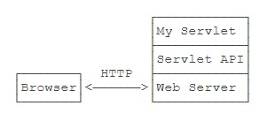

- 编写Web应用程序就是编写Servlet处理HTTP请求；
- Servlet API提供了HttpServletRequest和HttpServletResponse两个高级接口来封装HTTP请求和响应；
- Web应用程序必须按**固定结构**组织并打包为`.war(Java Web Application Archive)`文件；
- 需要启动Web服务器来加载我们的war包来运行Servlet。

一个Servlet总是继承自HttpServlet，然后覆写doGet()或doPost()方法。注意到doGet()方法传入了HttpServletRequest和HttpServletResponse两个对象，分别代表HTTP请求和响应。我们使用Servlet API时，并不直接与底层TCP交互，也不需要解析HTTP协议，因为HttpServletRequest和HttpServletResponse就已经封装好了请求和响应。以发送响应为例，我们只需要设置正确的响应类型，然后获取PrintWriter，写入响应即可。

```Java
@WebServlet(urlPatterns = "/") // WebServlet注解表示这是一个Servlet，并映射到地址/
public class HelloServlet extends HttpServlet {
    @Override
    protected void doGet(HttpServletRequest req, HttpServletResponse resp) throws ServletException, IOException {
        LocalTime t = LocalTime.now();
        resp.setContentType("text/html"); // 设置消息体类型
        PrintWriter pw = resp.getWriter(); // 获取输出流
        pw.println("<h1>Hello, World!</h1>"); // 写入消息体
        pw.print("<h1>" + t + "</h1>");
        pw.flush(); // 强制输出
    }
}
```

```xml
<packaging>war</packaging>
...
<dependency>
    <groupId>javax.servlet</groupId>
    <artifactId>javax.servlet-api</artifactId>
    <version>4.0.0</version>
    <!-- 表示编译时使用，但不会打包到.war文件中，因为运行期Web服务器本身已经提供了Servlet API相关的jar包。 -->
    <scope>provided</scope>
</dependency>
...
<build>
    <finalName>hello</finalName>
</build>
```

**为什么路径是/hello/而不是/。因为一个Web服务器允许同时运行多个Web App，而我们的Web App叫hello，因此，第一级目录/hello表示Web App的名字，后面的/才是我们在HelloServlet中映射的路径**。

类似Tomcat这样的服务器也是Java编写的，启动Tomcat服务器实际上是启动Java虚拟机，执行Tomcat的main()方法，然后由Tomcat负责加载我们的.war文件，并创建一个HelloServlet实例，最后以多线程的模式来处理HTTP请求。如果Tomcat服务器收到的请求路径是/（假定部署文件为ROOT.war），就转发到HelloServlet并传入HttpServletRequest和HttpServletResponse两个对象。

因为我们编写的Servlet并不是直接运行，而是由Web服务器加载后创建实例运行，所以，类似Tomcat这样的Web服务器也称为Servlet容器。

在Servlet容器中运行的Servlet具有如下特点：

- 无法在代码中直接通过new创建Servlet实例，必须由Servlet容器自动创建Servlet实例；
- Servlet容器只会给每个Servlet类创建**唯一实例**；
- Servlet容器会使用**多线程**执行doGet()或doPost()方法。
- 在Servlet中定义的**实例变量**会被多个线程同时访问，要注意线程安全；
- **HttpServletRequest和HttpServletResponse实例是由Servlet容器传入的局部变量，它们只能被当前线程访问，不存在多个线程访问的问题**；
- 在doGet()或doPost()方法中，如果使用了ThreadLocal，但没有清理，那么它的状态很可能会影响到下次的某个请求，因为Servlet容器很可能用线程池实现线程复用。

因此，正确编写Servlet，要清晰理解Java的多线程模型，**需要同步访问的必须同步**。

项目流程：

- 使用IDEA新建一个maven web项目，新建后删除webapp文件夹中的index.jsp文件，在WEB-INF目录中放置web.xml文件，在webapp同级目录中新建java和resources文件夹。  
- 引入servlet-api依赖，注意api版本和之后部署的tomcat版本需要对应，例如tomcat9支持的是servlet 4.0。  
- 编写servlet程序映射指定路径，在doGet()或doPost()方法中进行请求和响应的处理。  
- 使用mvn clean package将项目打包为war包，放置在tomcat安装目录中的webapps文件夹中，切换到bin目录，使用startup.bat启动tomcat服务器，使用shutdown.bat关闭tomcat服务器。

## Servlet开发

Tomcat实际上也是一个Java程序，我们看看Tomcat的启动流程：

- 启动JVM并执行Tomcat的main()方法；
- 加载war并初始化Servlet；
- 正常服务。

启动Tomcat无非就是设置好classpath并执行Tomcat某个jar包的main()方法，我们完全可以把Tomcat的jar包全部引入进来，然后自己编写一个main()方法，先启动Tomcat，然后让它加载我们的webapp就行。

引入依赖`tomcat-embed-core`和`tomcat-embed-jasper`，不必引入Servlet API，因为引入Tomcat依赖后自动引入了Servlet API。其中，`<packaging>`类型仍然为war。

```Java
public class Main {
    public static void main(String[] args) throws Exception {
        // 启动Tomcat:
        Tomcat tomcat = new Tomcat();
        tomcat.setPort(Integer.getInteger("port", 8080));
        tomcat.getConnector();
        // 创建webapp:
        Context ctx = tomcat.addWebapp("", new File("src/main/webapp").getAbsolutePath());
        WebResourceRoot resources = new StandardRoot(ctx);
        resources.addPreResources(
                new DirResourceSet(resources, "/WEB-INF/classes", new File("target/classes").getAbsolutePath(), "/"));
        ctx.setResources(resources);
        tomcat.start();
        tomcat.getServer().await();
    }
}
```

直接运行main()方法，即可启动嵌入式Tomcat服务器，然后，通过预设的`tomcat.addWebapp("", new File("src/main/webapp")`，Tomcat会自动加载当前工程作为**ROOT Web App**。

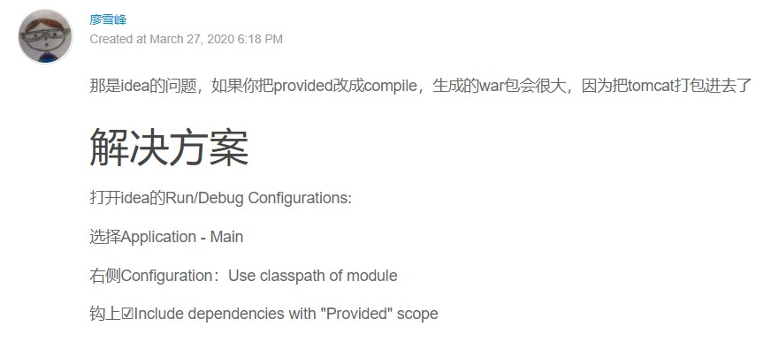

## Servlet进阶

**早期的Servlet需要在web.xml中配置映射路径，但最新Servlet版本只需要通过注解就可以完成映射**。

浏览器发出的HTTP请求总是由Web Server先接收，然后，根据Servlet配置的映射，不同的路径转发到不同的Servlet，这种根据路径转发的功能我们一般称为Dispatch。映射到/的IndexServlet比较特殊，它实际上会接收所有未匹配的路径，相当于/*。

### HttpServletRequest

HttpServletRequest封装了一个HTTP请求，它实际上是从ServletRequest继承而来。最早设计Servlet时，设计者希望Servlet不仅能处理HTTP，也能处理类似SMTP等其他协议，因此，单独抽出了ServletRequest接口，但实际上除了HTTP外，并没有其他协议会用Servlet处理，所以这是一个过度设计。

通过HttpServletRequest提供的接口方法可以拿到HTTP请求的几乎全部信息，常用的方法有：

- getMethod()：返回请求方法，例如，"GET"，"POST"；
- getRequestURI()：返回请求路径，但不包括请求参数，例如，"/hello"；
- getQueryString()：返回请求参数，例如，"name=Bob&a=1&b=2"；
- getParameter(name)：返回请求参数，**GET请求从URL读取参数，POST请求从Body中读取参数**；
- getContentType()：获取请求Body的类型，例如，"application/x-www-form-urlencoded"；
- getContextPath()：获取当前Webapp挂载的路径，对于ROOT来说，总是返回空字符串""；
- getCookies()：返回请求携带的所有Cookie；
- getHeader(name)：获取指定的Header，对Header名称不区分大小写；
- getHeaderNames()：返回所有Header名称；
- getInputStream()：**如果该请求带有HTTP Body，该方法将打开一个输入流用于读取Body**，返回`javax.servlet.ServletInputStream`；
- getReader()：和getInputStream()类似，但打开的是Reader，返回`java.io.BufferedReader`；
- getRemoteAddr()：返回客户端的IP地址；
- getScheme()：返回协议类型，例如，"http"，"https"；

其中`getInputStream()`和`getReader()`可以在多个组件之间被多次调用，反复地向同一个Socket流中写入数据，限制在于如果第一次使用`getInputStream()`打开输出流，那么后续的流操作也只能通过该方法`getInputStream()`打开输出流，但是我们可以通过IO章节中所谓的装饰器模式转换字节流为字符流。

此外，HttpServletRequest还有两个方法：setAttribute()和getAttribute()，可以给当前HttpServletRequest对象附加多个Key-Value，相当于把HttpServletRequest当作一个`Map<String, Object>`使用。

### HttpServletResponse

HttpServletResponse封装了一个HTTP响应。由于HTTP响应必须先发送Header，再发送Body，所以，操作HttpServletResponse对象时，**必须先调用设置Header的方法，最后调用发送Body的方法**。常用的设置Header的方法有：

- setStatus(sc)：设置响应代码，默认是200；
- setContentType(type)：设置Body的类型，例如，"text/html"；
- setCharacterEncoding(charset)：设置字符编码，例如，"UTF-8"；
- setHeader(name, value)：设置一个Header的值；
- addCookie(cookie)：给响应添加一个Cookie；
- addHeader(name, value)：给响应添加一个Header，因为HTTP协议允许有多个相同的Header；

写入响应时，需要通过getOutputStream()获取写入流，或者通过getWriter()获取字符流，二者只能获取其中一个。

写入响应前，无需设置setContentLength()，因为底层服务器会根据写入的字节数自动设置，如果写入的数据量很小，实际上会先写入缓冲区，如果写入的数据量很大，服务器会自动采用Chunked编码让浏览器能识别数据结束符而不需要设置Content-Length头。

但是，写入完毕后调用flush()却是必须的，因为大部分Web服务器都基于HTTP/1.1协议，会复用TCP连接。如果没有调用flush()，将导致缓冲区的内容无法及时发送到客户端。此外，写入完毕后千万不要调用close()，原因同样是因为会复用TCP连接，如果关闭写入流，将关闭TCP连接，使得Web服务器无法复用此TCP连接。

### Servlet多线程模型

一个Servlet类在服务器中只有一个实例，但对于每个HTTP请求，Web服务器会使用多线程执行请求（就像最开始我们自己写的TCP服务器那样使用多线程处理来自不同客户端的请求，想想来自不同客户端的请求同时到达服务器但是不使用多线程处理的糟糕场景）。

因此，一个Servlet的doGet()、doPost()等处理请求的方法是多线程并发执行的。如果Servlet中定义了成员字段，要注意多线程并发访问的问题。

对于每个请求，Web服务器会创建唯一的HttpServletRequest和HttpServletResponse实例，因此，HttpServletRequest和HttpServletResponse实例只有在当前处理线程中有效，它们总是局部变量，不存在多线程共享的问题（所以在doGet()、doPost()方法内部可以放心地对这两个实例进行读写操作，不用在意并发问题）。

因此，要注意在一个线程内部多个组件对封装后的请求和响应对象进行操作时，操作的是同一个实例。例如：两个组件，前一个组件向Socket流中写入数据，后一个组件也向Socket流中写入数据，由于它们写入的就是同一个Socket流，最后客户端接收到的就是两个组件共同写入的数据。

```java
public class HelloServlet extends HttpServlet {
    // 如果map一开始就被初始化并且仅用于读操作，可以不使用并发包中提供的实现类：
    private Map<String, String> map = new ConcurrentHashMap<>();

    protected void doGet(HttpServletRequest req, HttpServletResponse resp) throws ServletException, IOException {
        this.map.put(key, value);
    }
}
```

## 重定向与转发

### Redirect

重定向是指当浏览器请求一个URL时，服务器返回一个重定向指令，告诉浏览器地址已经变了，麻烦**使用新的URL**再重新发送新请求。

```Java
@WebServlet(urlPatterns = "/hi")
public class RedirectServlet extends HttpServlet {
    @Override
    protected void doGet(HttpServletRequest req, HttpServletResponse resp) throws ServletException, IOException {
        // 构造重定向路径
        String name = req.getParameter("name");
        String redirectToUrl = "/hello" + (name == null ? "" : "?name=" + name);
        // 如果浏览器发送 GET /hi 请求，将发送一个重定向响应
        resp.sendRedirect(redirectToUrl); // 临时重定向
    }
}
```

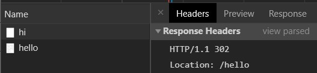

当浏览器收到302响应后，它会立刻根据Location的指示发送一个新的GET /hello请求，这个过程就是重定向。

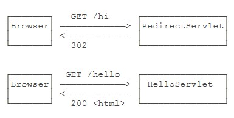

可以观察到浏览器发送了两次HTTP请求，并且浏览器的地址栏路径自动更新为/hello。

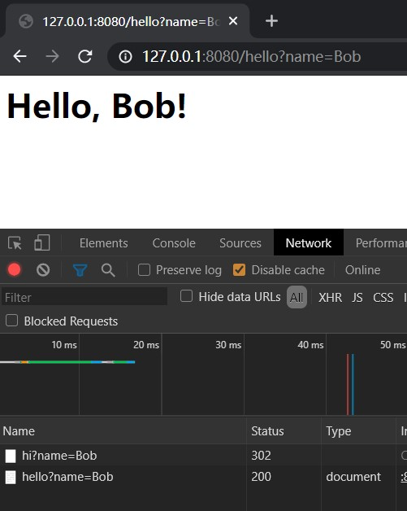

重定向有两种：一种是302响应，称为临时重定向，一种是301响应，称为永久重定向。两者的区别是，如果服务器发送301永久重定向响应，浏览器会**缓存**/hi到/hello这个重定向的关联，下次请求/hi的时候，浏览器就直接发送/hello请求了。

```Java
// 实现301永久重定向的做法
resp.setStatus(HttpServletResponse.SC_MOVED_PERMANENTLY);
resp.setHeader("Location", redirectToUrl);
```

当使用301永久重定向时的几个注意点：

  1. 第一次访问的路径会被缓存，再次访问时控制台会显示该重定向来自硬盘缓存。
  2. 启用301永久重定向时的所有请求访问过的路径都会被缓存，如果之后切换为302临时重定向，此时被缓存的路径仍然以301响应码进行返回，新的路径则以302响应码进行返回。
  3. 如果想要禁止缓存，可以在控制台中选择disable cache。
  4. 缓存的是完整路径，即`/hi?name=Bob`和`/hi?name=Cat`会被分别缓存。

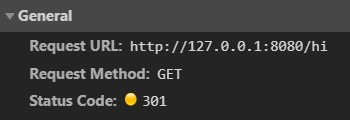

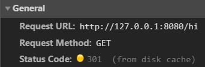

**重定向的目的是当Web应用升级后，如果请求路径发生了变化，可以将原来的路径重定向到新路径，从而避免浏览器请求原路径找不到资源。**

### Forward

Forward是指**内部转发**。当一个Servlet处理请求的时候，它可以决定自己不继续处理，而是转发给另一个Servlet处理。

**转发和重定向的区别在于，转发是在Web服务器内部完成的，对浏览器来说，它只发出了一个HTTP请求。**

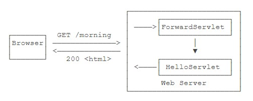

```Java
@WebServlet(urlPatterns = "/morning")
public class ForwardServlet extends HttpServlet {
    @Override
    protected void doGet(HttpServletRequest req, HttpServletResponse resp) throws ServletException, IOException {
        // 把请求和响应都转发给映射路径为/hello的Servlet。
        req.getRequestDispatcher("/hello").forward(req, resp);
    }
}
```

注意到使用转发的时候，浏览器的地址栏路径仍然是/morning，浏览器并不知道该请求在Web服务器内部实际上做了一次转发。

## 使用Session（机制/服务端）和Cookie（形式/客户端）

因为HTTP协议是一个无状态协议，即Web应用程序无法区分收到的两个HTTP请求是否是**同一个浏览器**发出的。为了跟踪用户状态，服务器可以**向浏览器分配一个唯一ID**，并以**Cookie的形式**发送到浏览器，浏览器在后续访问时总是附带此Cookie，这样，服务器就可以识别用户身份。

**同一个浏览器指的是浏览器类型，即会为chrome浏览器和edge浏览器分配两个ID，但不会为chrome和chrome无痕模式分配两个ID，即无痕模式不算是一个新的类型**。

### Session

我们把这种**基于唯一ID识别用户身份的机制**称为Session。每个用户第一次访问服务器后，会自动获得一个Session ID。如果用户在一段时间内没有访问服务器，那么Session会自动失效，下次即使带着上次分配的Session ID访问，服务器也认为这是一个新用户，会分配新的Session ID。

stackoverflow上有关session和cookie关系的回答：[参考链接](https://stackoverflow.com/questions/32563236/relation-between-sessions-and-cookies)

JavaEE的Servlet机制内建了对Session的支持。我们以登录为例，当一个用户登录成功后，我们就可以把这个用户的名字放入一个HttpSession对象，以便后续访问其他页面的时候，能直接从HttpSession取出用户名：

```java
// 判断用户登录成功后，立刻将用户名放入当前HttpSession中：
HttpSession session = req.getSession();
session.setAttribute("user", name);
// 从HttpSession获取当前用户名:
String user = (String) req.getSession().getAttribute("user");
// 从HttpSession移除用户名:
req.getSession().removeAttribute("user");
```

对于Web应用程序来说，我们总是通过HttpSession这个高级接口访问当前Session。如果要深入理解Session原理，可以认为Web服务器在**内存**中自动维护了一个ID到HttpSession的**映射表**。

**因此，当程序重启，操作系统回收之前被程序占用的内存并重新分配运行内存，在之前Session当中所存放的内容实际上已经被清理了。如果我们借助Session来存放用户的登录状态，那么在保持登录状态的情况下重启程序并刷新页面，此时会跳转到为未登录状态所准备的页面当中**。

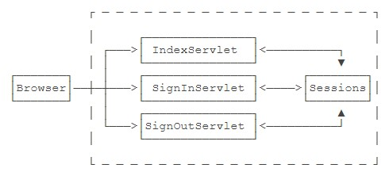

而服务器识别Session的关键就是依靠一个名为JSESSIONID的Cookie。**在Servlet中第一次调用req.getSession()时**，Servlet容器自动创建一个Session ID，然后通过一个名为JSESSIONID的Cookie发送给浏览器。

注意事项：

- **JSESSIONID是由Servlet容器自动创建的**，目的是维护一个浏览器会话，它和我们的登录逻辑没有关系；
- **登录和登出的业务逻辑是我们自己根据HttpSession是否存在一个"user"的Key判断的，登出后，Session ID并不会改变**；
- 即使没有登录功能，仍然可以使用HttpSession追踪用户，例如，放入一些用户配置信息等。

~~容器在其它情况下是否会创建JSESSIONID不是我们能够控制的，例如当你将请求和响应转发至JSP文件时~~，**这是因为在JSP页面当中内置了session变量供我们直接使用，而session变量恰恰就是通过getSession()方法获得的，可以查看JSP文件被容器编译后的Java文件的源码找到创建语句**，服务器同样会创建一个JSESSIONID发送给客户端。

除了使用Cookie机制可以实现Session外，还可以通过隐藏表单、URL末尾附加ID来追踪Session。这些机制很少使用，最常用的Session机制仍然是Cookie。**因此session机制和cookie实际上两者并没有任何联系，只是session机制可以借助cookie来实现，即使没有cookie，也可以通过其它形式来追踪session**。

使用Session时，由于服务器把所有用户的Session都存储在内存中，如果遇到内存不足的情况，就需要把部分不活动的Session序列化到磁盘上，这会大大降低服务器的运行效率，因此，放入Session的对象要小，通常我们在value放入一个简单的User对象就足够了。

**使用Session机制，会使得Web Server的集群很难扩展，因此，Session适用于中小型Web应用程序。对于大型Web应用程序来说，通常需要避免使用Session机制**。

一些使用总结：

  1. 在servlet中**第一次**调用了req.getSession()时，会创建一个HttpSession对象至sessions当中，用一个sessionID映射该对象并以一个名为JSESSIONID的cookie发送给浏览器进行存储。
  2. 有几个不同的浏览器发送请求至该服务器就会创建几个HttpSession对象，浏览器存储过cookie之后**再次访问相同的域名时**每次请求消息的消息头都会携带该cookie直至**过期或被替换**。
  3. 此后在servlet中多次调用req.getSession()时便会根据这个名为JSESSIONID的cookie到sessions中找到对应的HttpSession对象，于是开发者可以基于这个对象进行业务逻辑的编写。
  4. 服务器重启之后所有的会话对象都会消失，此时访问相同的域名会被响应一个新的JSESSIONID，sessionID是由容器创建的。

### Cookie

实际上，Servlet提供的HttpSession本质上就是通过一个名为JSESSIONID的Cookie来跟踪用户会话的。除了这个名称外，其它名称的Cookie我们可以任意使用。

```Java
@WebServlet(urlPatterns = "/pref")
public class LanguageServlet extends HttpServlet {
    private static final Set<String> LANGUAGES = Set.of("en", "zh");
    // 当客户端访问/pref?lang=xx路径时，根据参数设置一个cookie记录用户选择的语言
    @Override
    protected void doGet(HttpServletRequest req, HttpServletResponse resp) throws ServletException, IOException {
        String lang = req.getParameter("lang");
        if (LANGUAGES.contains(lang)) {
            // 创建一个新的cookie
            Cookie cookie = new Cookie("lang", lang);
            // 设置生效范围
            cookie.setPath("/");
            cookie.setMaxAge(8640000);
            // 添加到响应当中
            resp.addCookie(cookie);
        }
        resp.sendRedirect("/");
    }
}
```

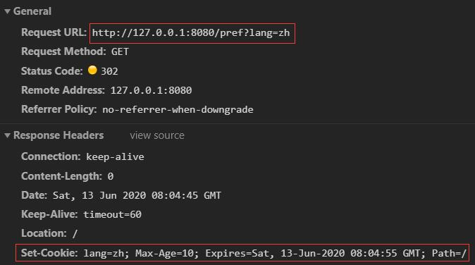

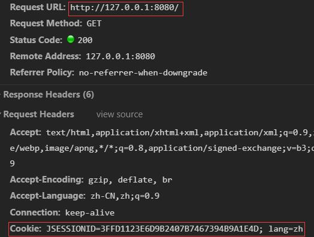

创建一个新Cookie时，除了指定名称和值以外，通常需要设置setPath("/")，浏览器根据此前缀决定是否发送Cookie。如果一个Cookie调用了setPath("/user/")，那么浏览器只有在请求以/user/开头的路径时才会附加此Cookie。通过setMaxAge()设置Cookie的有效期，单位为秒，最后通过resp.addCookie()把它添加到响应。如果访问的是https网页，还需要调用setSecure(true)，否则浏览器不会发送该Cookie。

务必注意：**浏览器在请求某个URL时，是否携带指定的Cookie，取决于Cookie是否满足以下所有要求：URL前缀是设置Cookie时的Path；Cookie在有效期内；Cookie设置了secure时必须以https访问**。

读取Cookie主要依靠遍历HttpServletRequest附带的所有Cookie：

```Java
private String parseLanguageFromCookie(HttpServletRequest req) {
    // 获取请求附带的所有Cookie
    Cookie[] cookies = req.getCookies();
    // 如果获取到Cookie
    if (cookies != null) {
        // 循环每个Cookie
        for (Cookie cookie : cookies)
            // 如果Cookie名称为lang
            if (cookie.getName().equals("lang"))
                // 返回Cookie的值
                return cookie.getValue();
    }
    return "None";
}
```

- Servlet容器提供了Session机制以跟踪用户；
- 默认的Session机制是以Cookie形式实现的，Cookie名称为JSESSIONID；
- 通过读写Cookie可以在客户端设置用户偏好等。

## JSP开发

JSP是Java Server Pages的缩写，它的文件必须放到/src/main/webapp下，文件名必须以.jsp结尾。

整个JSP的内容实际上是一个HTML，但是稍有不同：

- 包含在<%--和--%>之间的是JSP的注释，它们会被完全忽略；
- 包含在<%和%>之间的是Java代码，可以编写任意Java代码；
- 如果使用<%= xxx %>则可以快捷输出一个变量的值；
- JSP页面本身可以通过page指令<%@ page import="java.io.*" %>引入Java类。

JSP页面内置了几个变量：

- out：表示HttpServletResponse的PrintWriter；
- session：表示当前HttpSession对象；
- request：表示HttpServletRequest对象。这几个变量可以直接使用。

**访问JSP页面时，可以直接指定完整路径进行访问**。

JSP和Servlet有什么区别。其实它们没有任何区别，因为JSP在执行前首先被编译成一个Servlet。在Tomcat的临时目录下，可以找到一个hello_jsp.java的源文件，这个文件就是Tomcat把JSP自动转换成的Servlet源码。

可见JSP本质上就是一个Servlet，只不过无需配置映射路径，Web Server会根据路径查找对应的.jsp文件，如果找到了，就自动编译成Servlet再执行。在服务器运行过程中，如果修改了JSP的内容，那么服务器会自动重新编译。

JSP是一种在HTML中嵌入动态输出的文件，它和Servlet正好相反，Servlet是在Java代码中嵌入输出HTML。

## MVC开发

Servlet适合编写Java代码，实现各种复杂的业务逻辑，但不适合输出复杂的HTML；JSP适合编写HTML，并在其中插入动态内容，但不适合编写复杂的Java代码。

```java
@WebServlet(urlPatterns = "/user")
public class UserServlet extends HttpServlet {
    @Override
    protected void doGet(HttpServletRequest req, HttpServletResponse resp) throws ServletException, IOException {
        School school = new School("No.1 Middle School", "101 North Street");
        User user = new User(123, "Bob", school);
        // 将model放到HttpServletRequest中：
        req.setAttribute("user", user);
        // 将Request和Response转发给user.jsp
        req.getRequestDispatcher("/WEB-INF/user.jsp").forward(req, resp);
    }
}
```

```html
<%@ page import="com.itranswarp.learnjava.bean.*"%>
<%
    User user = (User) request.getAttribute("user");
%>
<html>
<head>
    <title>Hello World - JSP</title>
</head>
<body>
    <h1>Hello <%= user.name %>!</h1>
    <p>School Name:
    <span style="color:red">
        <%= user.school.name %>
    </span>
    </p>
    <p>School Address:
    <span style="color:red">
        <%= user.school.address %>
    </span>
    </p>
</body>
</html>
```

- 需要展示的User被放入HttpServletRequest中以便传递给JSP，因为**一个请求对应一个HttpServletRequest**，我们也无需清理它，处理完该请求后HttpServletRequest实例将被丢弃；
- **把user.jsp放到/WEB-INF/目录下，是因为WEB-INF是一个特殊目录，Web Server会阻止浏览器对WEB-INF目录下任何资源的访问，这样就防止用户通过/user.jsp路径直接访问到JSP页面**；
- JSP页面首先从request变量获取User实例，然后在页面中直接输出，此处未考虑HTML的转义问题，有潜在安全风险。

我们把UserServlet看作业务逻辑处理，把User看作模型，把user.jsp看作渲染，这种设计模式通常被称为MVC：Model-View-Controller，即UserServlet作为控制器（Controller），User作为模型（Model），user.jsp作为视图（View）。

使用MVC模式的好处是，Controller专注于业务处理，它的处理结果就是Model。Model可以是一个JavaBean，也可以是一个包含多个对象的Map，Controller只负责把Model传递给View，View只负责把Model给“渲染”出来，这样，三者职责明确，且开发更简单，**因为开发Controller时无需关注页面，开发View时无需关心如何创建Model**。

MVC模式是一种分离**业务逻辑**和**显示逻辑**的设计模式，广泛应用在Web和桌面应用程序。

## MVC高级开发

直接把MVC搭在Servlet和JSP之上还是不太好：

- **Servlet提供的接口仍然偏底层**，需要实现Servlet调用相关接口；
- JSP对页面开发不友好，更好的替代品是**模板引擎**；
- **业务逻辑最好由纯粹的Java类实现**，而不是强迫继承自Servlet。

1. 最早的开发是从socket对象中获取输入流和输出流，从输入流中分析出完整的请求消息，书写完整的响应消息到输出流中完成一次开发。
2. 后来有了servlet-api包，它在底层分别封装了输入流和输出流为request对象和response对象，我们通过在这两个对象上调用各种现成的方法来进行开发。

一个MVC框架是**基于Servlet基础抽象出更高级的接口**，使得上层基于MVC框架的开发可以**不涉及Servlet相关的HttpServletRequest等接口**，处理多个请求更加灵活，并且可以使用任意模板引擎，不必使用JSP。

我们能不能通过普通的Java类实现MVC的Controller：

```Java
public class UserController {
    // 如果是GET请求，我们希望MVC框架能直接把URL参数按方法参数对应起来然后传入。
    @GetMapping("/hello")
    public ModelAndView hello(String name) {
        ...
    }
    // 如果是POST请求，我们希望MVC框架能直接把Post参数（Body数据）变成一个JavaBean后通过方法参数传入。
    @PostMapping("/signin")
    public ModelAndView doSignin(SignInBean bean) {
        ...
    }
    // 为了增加灵活性，如果Controller的方法在处理请求时需要访问HttpServletRequest、HttpServletResponse、HttpSession这些实例时，只要方法参数有定义，就可以自动传入。
    @GetMapping("/signout")
    public ModelAndView signout(HttpSession session) {
        ...
    }
}
```

### 设计MVC框架

在上文中，我们已经定义了上层代码编写Controller的一切接口信息，并且并不要求实现特定接口，只需返回ModelAndView对象，该对象包含一个View和一个Model。实际上View就是模板的路径，而Model可以用一个`Map<String, Object>`表示，因此，ModelAndView定义非常简单。

```Java
public class ModelAndView {
    Map<String, Object> model;
    String view;
}
```

比较复杂的是我们需要在MVC框架中**创建一个接收所有请求的Servlet**，通常我们把它命名为`DispatcherServlet`，它总是映射到`/`，然后，**根据不同的Controller的方法定义的@Get或@Post的Path决定调用哪个方法**，最后，获得方法返回的ModelAndView后，渲染模板，写入HttpServletResponse，即完成了整个MVC的处理。

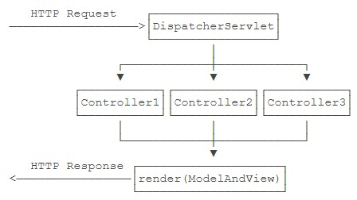

其中，DispatcherServlet以及如何渲染均由MVC框架实现，在MVC框架之上只需要编写每一个Controller，**和之前的开发相比，servlet的数量大幅减少，只有几个主要的Servlet来接收特定请求**。

使用MVC框架后，浏览器访问路径`/hello`的一个处理流程：

  0. 容器实例化了`DispatcherServlet`以及`FileServlet`，因为`/hello`路径不在`FileServlet`的映射路径内，因此容器将该请求交由`DispatcherServlet`处理。
  1. 容器实例化`DispatcherServlet`后自动调用了该`Servlet`中定义的`init()`方法，该方法内部将所有被扫描到的`Controller`类中定义的所有方法和方法使用的注解当中的映射路径进行绑定；
  2. 以`GET`方式请求`/hello`路径于是调用了`DispatcherServlet`中的`doGet`方法，`doGet`方法转而调用了`process`方法；
  3. 在`process`方法内部首先获取映射了`/hello`路径的来自`IndexController`类中的`hello()`方法封装后的`dispatcher`，这是一个`GetDispatcher`；
  4. 之后调用`GetDispatcher`的`invoke`方法，该方法内部构造了方法所需的**实参列表**，使用反射机制传入实例、实参调用`hello()`方法，获得由`hello()`方法返回的`ModelAndView`对象；
  5. 在`process`方法末尾使用模板引擎将数据渲染到模板并写入到响应当中。


**通过MVC框架的底层封装，开发者只需编写Controller类，写好注解映射路径、方法参数定义、内部逻辑即可。方法参数传入以及方法执行都是交由底层的MVC框架利用反射机制去完成的**。

**反射是为了解决在运行期，对某个实例一无所知的情况下，如何调用其方法。在上述框架中，使用反射根据请求路径寻找指定方法并进行调用**。

```java
@WebServlet(urlPatterns = "/user")
public class UserServlet extends HttpServlet {
    @Override
    protected void doGet(HttpServletRequest req, HttpServletResponse resp) throws ServletException, IOException {
        School school = new School("No.1 Middle School", "101 North Street");
        User user = new User(123, "Bob", school);
        // 将model放到HttpServletRequest中：
        req.setAttribute("user", user);
        // 将Request和Response转发给user.jsp
        req.getRequestDispatcher("/WEB-INF/user.jsp").forward(req, resp);
    }
}
public class UserController {
    // 如果是GET请求，我们希望MVC框架能直接把URL参数按方法参数对应起来然后传入。
    @GetMapping("/hello")
    public ModelAndView hello(String name) {
        ...
    }
    // 如果是POST请求，我们希望MVC框架能直接把Post参数（Body数据）变成一个JavaBean后通过方法参数传入。
    @PostMapping("/signin")
    public ModelAndView doSignin(SignInBean bean) {
        ...
    }
    // 为了增加灵活性，如果Controller的方法在处理请求时需要访问HttpServletRequest、HttpServletResponse、HttpSession这些实例时，只要方法参数有定义，就可以自动传入。
    @GetMapping("/signout")
    public ModelAndView signout(HttpSession session) {
        ...
    }
}
```

从上述两个类的对比可以看出：

  1. 使用MVC框架之后，Controller不需要再从HttpServlet继承；
  2. 使用了更高级的接口`GetMapping`、`PostMapping`代替了`WebServlet`完成了路径映射逻辑，处理多个请求更加灵活；
  3. `ModelAndView`代替了`setAttribute`和`getRequestDispatcher`完成了数据到模板的绑定逻辑;
  4. 不必使用JSP，而是使用更加灵活的模板引擎完成视图渲染。

## 使用Filter

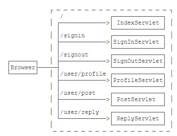

其中，ProfileServlet、PostServlet和ReplyServlet都需要用户登录后才能操作，否则，应当直接跳转到登录页面。

我们可以直接把判断登录的逻辑写到这3个Servlet中，但是，同样的逻辑重复3次没有必要，并且，如果后续继续加Servlet并且也需要验证登录时，还需要继续重复这个检查逻辑。

**为了把一些公用逻辑从各个Servlet中抽离出来，JavaEE的Servlet规范还提供了一种Filter组件**，即过滤器，它的作用是，在HTTP请求到达Servlet之前，可以被一个或多个Filter预处理，类似打印日志、登录检查等逻辑，完全可以放到Filter中。

编写Filter时，必须实现Filter接口，在doFilter()方法内部，要继续处理请求，必须调用chain.doFilter()。最后，用@WebFilter注解标注该Filter需要过滤的URL。

我们编写一个最简单的EncodingFilter，它强制把输入和输出的编码设置为UTF-8：

```Java
// 这里的/*表示所有路径:
@WebFilter(urlPatterns = "/*")
public class EncodingFilter implements Filter {
    @Override
    public void doFilter(ServletRequest request, ServletResponse response, FilterChain chain) throws IOException, ServletException {
        System.out.println("EncodingFilter:doFilter");
        // 在后续的servlet中就不需要单独配置请求和响应的编码格式:
        request.setCharacterEncoding("UTF-8");
        response.setCharacterEncoding("UTF-8");
        // 继续处理请求:
        chain.doFilter(request, response);
        // TODO: 可以继续处理request和response实例。
    }
}
```

`chain.doFilter(request, response)`是一个阻塞操作，当后续组件业务逻辑完成后，如果继续对request和response实例进行操作，例如对request实例设置新的编码格式，就会覆盖后续组件里设置的编码格式，对response实例写入数据，那么数据就会附加在Socket流的末尾，最后一期返回给客户端。

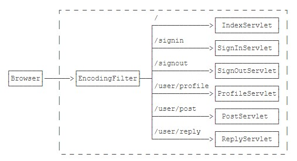

```Java
@WebFilter(urlPatterns = "/*")
public class LogFilter implements Filter {
    @Override
    public void doFilter(ServletRequest request, ServletResponse response, FilterChain chain) throws IOException, ServletException {
        // 对请求路径进行一个打印:
        System.out.println("LogFilter: process " + ((HttpServletRequest) request).getRequestURI());
        // 继续处理请求:
        chain.doFilter(request, response);
    }
}
```

多个Filter会组成一个链，每个请求都被链上的Filter依次处理：

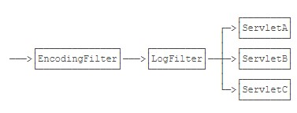

**Filter的顺序确实对处理的结果有影响。但遗憾的是，Servlet规范并没有对@WebFilter注解标注的Filter规定顺序。如果一定要给每个Filter指定顺序，就必须在web.xml文件中对这些Filter再配置一遍**。

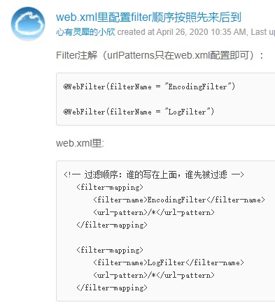

注意到上述两个Filter的过滤路径都是/*，即它们会对所有请求进行过滤。也可以编写只对特定路径进行过滤的Filter，例如AuthFilter：

```Java
// 注意到AuthFilter只过滤以/user/开头的路径:
@WebFilter(urlPatterns = "/user/*")
public class AuthFilter implements Filter {
    @Override
    public void doFilter(ServletRequest request, ServletResponse response, FilterChain chain) throws IOException, ServletException {
        System.out.println("AuthFilter: check authentication");
        HttpServletRequest req = (HttpServletRequest) request;
        HttpServletResponse resp = (HttpServletResponse) response;
        if (req.getSession().getAttribute("user") == null) {
            System.out.println("AuthFilter: not signin!");
            // 如果用户未登录，则直接向客户端发送重定向指令，让客户端请求新的路径:
            resp.sendRedirect("/signin");
        } else {
            // 用户已登录，让后续组件继续处理:
            chain.doFilter(request, response);
        }
    }
}
```

当用户没有登录时，在AuthFilter内部，直接调用resp.sendRedirect()发送重定向，且没有调用chain.doFilter()，因此，当用户没有登录时，请求到达AuthFilter后，不再继续处理，即后续的Filter和任何Servlet都没有机会处理该请求了。

**因此，Filter可以有针对性地拦截或者放行HTTP请求**。

如果一个Filter在当前请求中生效，但什么都没有做：

```Java
@WebFilter(urlPatterns = "/*")
public class MyFilter implements Filter {
    public void doFilter(ServletRequest request, ServletResponse response, FilterChain chain)
            throws IOException, ServletException {
        // TODO
    }
}
```

那么，用户将看到一个空白页，因为请求没有继续处理，默认响应是200+空白输出。

**因此，如果Filter要使请求继续被处理，就一定要调用chain.doFilter()**！

如果我们使用上一节介绍的MVC模式，即一个统一的DispatcherServlet入口，加上多个Controller，这种模式下Filter仍然是正常工作的。例如，一个处理`/user/*`的Filter实际上作用于那些处理`/user/`开头的Controller方法之前（因为Filter先于Servlet处理请求，而Controller方法是在Servlet当中被调用的）。

- Filter是一种对HTTP请求进行预处理的组件，它可以构成一个处理链，使得公共处理代码能集中到一起；
- Filter适用于日志、登录检查、全局设置等；
- 设计合理的URL映射可以让Filter链更清晰。

### 修改请求

> 借助HttpServletRequestWrapper，我们可以在Filter中实现对原始HttpServletRequest的修改。

```Java
// 在Web应用中经常需要处理用户上传文件，例如，一个UploadServlet可以简单地编写如下：
@WebServlet(urlPatterns = "/upload/file")
public class UploadServlet extends HttpServlet {
    // 上传文件使用的是POST请求！注意覆写的是doPost()方法不是doGet()方法:
    @Override
    protected void doPost(HttpServletRequest req, HttpServletResponse resp) throws ServletException, IOException {
        // 读取Request Body:
        InputStream input = req.getInputStream();
        ByteArrayOutputStream output = new ByteArrayOutputStream();
        byte[] buffer = new byte[1024];
        for (; ; ) {
            int len = input.read(buffer);
            if (len == -1)
                break;
            output.write(buffer, 0, len);
        }
        // 假设用户上传的是一份文本数据，反序列化后在页面中进行展示:
        String uploadedText = output.toString(StandardCharsets.UTF_8);
        PrintWriter pw = resp.getWriter();
        pw.write("<h1>Uploaded:</h1>");
        pw.write("<pre><code>");
        pw.write(uploadedText);
        pw.write("</code></pre>");
        pw.flush();
    }
}
```

```Java
// 我们知道，如果在上传文件的同时，把文件的哈希也传过来，服务器端做一个验证，就可以确保用户上传的文件一定是完整的。
// 也就是说服务端对上传的文件按照客户端传递的哈希方式进行哈希，之后将哈希值和客户端上传的哈希值进行比较验证。
// 这个验证逻辑非常适合写在ValidateUploadFilter中，因为它可以复用。
@WebFilter(urlPatterns = "/upload/*")
public class ValidateUploadFilter implements Filter {
    @Override
    public void doFilter(ServletRequest request, ServletResponse response, FilterChain chain) throws IOException, ServletException {
        HttpServletRequest req = (HttpServletRequest) request;
        HttpServletResponse resp = (HttpServletResponse) response;
        // 获取客户端传入的签名方法和签名:
        String digest = req.getHeader("Signature-Method");
        String signature = req.getHeader("Signature");
        if (digest == null || digest.isEmpty() || signature == null || signature.isEmpty()) {
            this.sendErrorPage(resp, "Missing signature.");
            return;
        }
        // 读取Request的Body并验证签名:
        MessageDigest md = this.getMessageDigest(digest);
        InputStream input = new DigestInputStream(request.getInputStream(), md);
        byte[] buffer = new byte[1024];
        // 读取输入流的同时也会更新摘要:
        for (; ; ) {
            int len = input.read(buffer);
            if (len == -1)
                break;
        }
        String actual = this.toHexString(md.digest());
        // 在服务端对上传文件进行哈希后和客户端上传的哈希值进行对比:
        if (!signature.equals(actual)) {
            this.sendErrorPage(resp, "Invalid signature.");
            return;
        }
        // 验证成功后继续处理:
        chain.doFilter(request, response);
    }
    // 将byte[]转换为hex string:
    private String toHexString(byte[] digest) {
        StringBuilder sb = new StringBuilder();
        for (byte b : digest) {
            sb.append(String.format("%02x", b));
        }
        return sb.toString();
    }
    // 根据名称创建MessageDigest:
    private MessageDigest getMessageDigest(String name) throws ServletException {
        try {
            return MessageDigest.getInstance(name);
        } catch (NoSuchAlgorithmException e) {
            throw new ServletException(e);
        }
    }
    // 发送一个错误响应:
    private void sendErrorPage(HttpServletResponse resp, String errorMessage) throws IOException {
        resp.setStatus(HttpServletResponse.SC_BAD_REQUEST);
        PrintWriter pw = resp.getWriter();
        pw.write("<html><body><h1>");
        pw.write(errorMessage);
        pw.write("</h1></body></html>");
        pw.flush();
    }
}
```

ValidateUploadFilter对签名进行验证的逻辑是没有问题的，但是，细心的童鞋注意到，UploadServlet并未读取到任何数据！这里的原因是**对HttpServletRequest进行读取时，只能读取一次**。如果Filter调用`getInputStream()`读取了一次数据，后续Servlet处理时，再次读取，将无法读到任何数据。

**其实就是流本身的特性决定的，在流读取的时候实际上是有一个游标在标记读取的位置，每次流被打开并读取，都是从游标的位置开始读取。而第一次读取流的时候就读取到了末尾，第二次读取流的时候当然读取不到任何数据了**。

为了重头开始读取流：

  1. 要么将游标的位置重置回开头；
  2. 要么就在第一次读取流的同时将数据保存到一个数据结构中，需要再次读取流的时候就从这个数据结构当中读取。

在这里，我们“伪造”一个的HttpServletRequest，具体做法是使用代理模式，对`getInputStream()`和`getReader()`返回一个新的流。

```Java
// public class HttpServletRequestWrapper extends ServletRequestWrapper implements HttpServletRequest
public class ReReadableHttpServletRequest extends HttpServletRequestWrapper {
    private byte[] body;
    private boolean open = false;

    /**
     * Constructs a request object wrapping the given request.
     *
     * @param request The request to wrap
     * @throws IllegalArgumentException if the request is null
     */
    public ReReadableHttpServletRequest(HttpServletRequest request, byte[] body) {
        super(request);
        // 保存了ValidateUploadFilter读取的byte[]内容，并在调用getInputStream()时通过byte[]构造了一个新的ServletInputStream。
        this.body = body;
    }
    // 返回InputStream:
    public ServletInputStream getInputStream() throws IOException {
        if (this.open) {
            throw new IllegalStateException("Cannot re-open input stream!");
        }
        this.open = true;
        return new ServletInputStream() {
            private int offset = 0;

            @Override
            public boolean isFinished() {
                return this.offset >= ReReadableHttpServletRequest.this.body.length;
            }

            @Override
            public boolean isReady() {
                return true;
            }

            @Override
            public void setReadListener(ReadListener listener) {

            }

            @Override
            public int read() throws IOException {
                if (this.offset >= ReReadableHttpServletRequest.this.body.length) {
                    return -1;
                }
                int n = ReReadableHttpServletRequest.this.body[offset];
                offset++;
                return n;
            }
        };
    }
    // 返回Reader:
    public BufferedReader getReader() throws IOException {
        if (this.open) {
            throw new IllegalStateException("Cannot re-open input reader!");
        }
        this.open = true;
        return new BufferedReader(new InputStreamReader(this.getInputStream(), StandardCharsets.UTF_8));
    }
}
```

```Java
// 在ValidateUploadFilter中，把doFilter()调用时传给下一个处理者的HttpServletRequest替换为我们自己“伪造”的ReReadableHttpServletRequest
public void doFilter(ServletRequest request, ServletResponse response, FilterChain chain)
        throws IOException, ServletException {
    ...
    ByteArrayOutputStream output = new ByteArrayOutputStream();
    byte[] buffer = new byte[1024];
    for (; ; ) {
        int len = input.read(buffer);
        if (len == -1)
            break;
        output.write(buffer, 0, len);
    }
    ...
    // 我们使用代理模式将原请求及已被读取的数据重新封装成一个新的HttpServletRequest对象供后续对象进行调用。
    // 符合代理模式的逻辑即封装一个已有接口，并向调用方返回相同的接口类型。
    // 实际就是Filter读取原始字节流后顺带读取到一个字节数组中，而后续对象读取字节流时仍感觉像是在读取原始字节流，但实际上读取的是由Filter构造的字节数组。
    chain.doFilter(new ReReadableHttpServletRequest(req, output.toByteArray()), response);
}
```

再注意到我们编写ReReadableHttpServletRequest时，是从HttpServletRequestWrapper继承，而不是直接实现HttpServletRequest接口。这是因为，Servlet的每个新版本都会对接口增加一些新方法，从HttpServletRequestWrapper继承可以确保新方法被正确地覆写了，因为HttpServletRequestWrapper是由Servlet的jar包提供的，目的就是为了让我们方便地实现对HttpServletRequest接口的**代理**。`HttpServletRequestWrapper extends ServletRequestWrapper implements HttpServletRequest`。

总结一下对HttpServletRequest接口进行代理的步骤：

  1. 从HttpServletRequestWrapper继承一个XxxHttpServletRequest，**需要传入原始的HttpServletRequest实例**；
  2. 覆写某些方法，使得新的XxxHttpServletRequest实例看上去“改变”了原始的HttpServletRequest实例；
  3. 在doFilter()中传入新的XxxHttpServletRequest实例。

虽然整个Filter的代码比较复杂，但它的好处在于：这个Filter在整个处理链中实现了灵活的“可插拔”特性，即是否启用对Web应用程序的其他组件（Filter、Servlet）完全没有影响。

总结：为什么要修改请求，因为在验证用户上传文件完整性的场景中，filter完整地读取了输入流之后，导致后续的servlet读取输入流时无法读取到任何数据，这是流的特性决定。如何解决这种问题，filter完整读取流的同时将数据存储到一个二进制数组中，我们将原始请求以及该二进制数组封装为一个“伪造”的请求实例，后续的servlet看似是从输入流中读取数据，实际是从该二进制数组中读取。

### 修改响应

> 通过HttpServletResponseWrapper构造一个“伪造”的HttpServletResponse，这样就能拦截到写入的数据。

假设我们编写了一个Servlet，但由于业务逻辑比较复杂，处理该请求需要耗费很长的时间。好消息是每次返回的**响应内容是固定的**，因此，如果我们能使用缓存将结果缓存起来，就可以大大提高Web应用程序的运行效率。

```java
@WebServlet(urlPatterns = "/slow/hello")
public class HelloServlet extends HttpServlet {
    protected void doGet(HttpServletRequest req, HttpServletResponse resp) throws ServletException, IOException {
        resp.setContentType("text/html");
        // 模拟耗时1秒:
        try {
            Thread.sleep(1000);
        } catch (InterruptedException e) {
        }
        PrintWriter pw = resp.getWriter();
        pw.write("<h1>Hello, world!</h1>");
        pw.flush();
    }
}
```

缓存逻辑最好不要在Servlet内部实现，因为我们希望能**复用**缓存逻辑，所以，编写一个CacheFilter最合适。

```Java
@WebFilter(urlPatterns = "/slow/*")
public class CacheFilter implements Filter {
    // Path到byte[]的缓存:
    private Map<String, byte[]> cache = new ConcurrentHashMap<>();

    @Override
    public void doFilter(ServletRequest request, ServletResponse response, FilterChain chain) throws IOException, ServletException {
        HttpServletRequest req = (HttpServletRequest) request;
        HttpServletResponse resp = (HttpServletResponse) response;
        // 获取Path:
        String url = req.getRequestURI();
        // 获取缓存内容:
        byte[] data = this.cache.get(url);
        resp.setHeader("X-Cache-Hit", data == null ? "No" : "Yes");
        if (data == null) {
            // 缓存未找到,构造一个伪造的Response:
            CachedHttpServletResponse wrapper = new CachedHttpServletResponse(resp);
            // 让下游组件写入数据到伪造的Response:
            chain.doFilter(request, wrapper);
            // 从伪造的Response中读取写入的内容并放入缓存:
            data = wrapper.getContent();
            this.cache.put(url, data);
        }
        // 写入到原始的Response:
        ServletOutputStream output = resp.getOutputStream();
        output.write(data);
        output.flush();
    }
}
```

**上述缓存被找到的时候，不会执行下游组件的业务逻辑，因此下游组件的业务逻辑最好是和后续业务无关的操作（自己的感想）**。

实现缓存的关键在于，调用doFilter()时，我们**不能传入原始的HttpServletResponse，因为这样就会写入Socket**，我们也就无法获取下游组件写入的内容（**因为原始输出流并没有提供读取已写入数据内容的功能**）。如果我们传入的是“伪造”的HttpServletResponse，让下游组件写入到我们预设的ByteArrayOutputStream，我们就“截获”了下游组件写入的内容，于是，就可以把内容缓存起来，再通过原始的HttpServletResponse实例写入到网络。

```Java
public class CachedHttpServletResponse extends HttpServletResponseWrapper {
    private boolean open = false;
    private ByteArrayOutputStream output = new ByteArrayOutputStream();

    /**
     * Constructs a response adaptor wrapping the given response.
     *
     * @param response The response to be wrapped
     * @throws IllegalArgumentException if the response is null
     */
    public CachedHttpServletResponse(HttpServletResponse response) {
        super(response);
    }
    // 下游组件如果获取Writer:
    public PrintWriter getWriter() throws IOException {
        if (this.open) {
            throw new IllegalStateException("Cannot re-open writer!");
        }
        this.open = true;
        // 写入的不是Socket输出流，而是我们提供的内存输出流:
        return new PrintWriter(this.output, false);
    }
    // 下游组件如果获取OutputStream:
    public ServletOutputStream getOutputStream() throws IOException {
        if (this.open) {
            throw new IllegalStateException("Cannot re-open output stream!");
        }
        this.open = true;
        return new ServletOutputStream() {
            @Override
            public boolean isReady() {
                return true;
            }

            @Override
            public void setWriteListener(WriteListener listener) {

            }

            @Override
            public void write(int b) throws IOException {
                // 写入的不是Socket输出流，而是我们提供的内存输出流:
                CachedHttpServletResponse.this.output.write(b);
            }
        };
    }
    // 返回下游组件以为是写入到Socket输入流但实际是写入到我们构造的一个byte[]数组:
    // 我们为输出流提供了一个读取已写入数据的功能:
    public byte[] getContent() {
        return this.output.toByteArray();
    }
}
```

**修改响应时，最后不要忘记把数据写入原始的HttpServletResponse实例**。

这个CacheFilter同样是一个“可插拔”组件，它是否启用不影响Web应用程序的其他组件（Filter、Servlet）。

总结：为什么要修改响应，因为在缓存响应结果的场景中，后续的servlet是通过响应实例提供的方法将数据直接写入到socket的字节流当中，但是响应实例本身并没有提供读取已输出数据的方法，为此，我们“伪造”了一个可以读取已输出数据的响应实例，仍然需要封装原始响应实例，但是修改流的输出对象从socket字节流转换为我们自己创建的一个内存输出流，这样后续组件看似是输出到字节流，但实际输出到的是我们提供的内存输出流当中，于是在filter中，我们就可以从这个内存输出流中获取到输出的数据，将数据进行缓存，最后输出到原始的字节流中。

## 使用Listener

除了Servlet和Filter外，JavaEE的Servlet规范还提供了第三种组件：Listener。

Listener顾名思义就是监听器，有好几种Listener，其中最常用的是`ServletContextListener`，我们编写一个实现了ServletContextListener接口的类如下：

```Java
// ServletContextListener按照字面意思理解就是容器上下文监听器，可用来监听WebApp是否被初始化，是否被销毁:
@WebListener
public class AppListener implements ServletContextListener {
    // 在此初始化WebApp,例如打开数据库连接池等:
    @Override
    public void contextInitialized(ServletContextEvent sce) {
        System.out.println("WebApp initialized.");
    }
    // 在此清理WebApp,例如关闭数据库连接池等:
    @Override
    public void contextDestroyed(ServletContextEvent sce) {
        System.out.println("WebApp destroyed.");
    }
}
```

任何标注为@WebListener，且实现了特定接口的类会被Web服务器自动初始化。上述AppListener实现了ServletContextListener接口，**它会在整个Web应用程序初始化完成后，以及Web应用程序关闭后获得回调通知**。我们可以把初始化数据库连接池等工作放到contextInitialized()回调方法中，把清理资源的工作放到contextDestroyed()回调方法中，**因为Web服务器保证在contextInitialized()执行后，才会接受用户的HTTP请求**。

很多第三方Web框架都会通过一个ServletContextListener接口初始化自己。

除了ServletContextListener外，还有几种Listener：

- HttpSessionListener：监听`HttpSession`的创建（req.getSession()）和销毁事件；
- ServletRequestListener：监听`ServletRequest`请求的创建（请求到达）和销毁（相关的处理方法都调用完毕）事件；
- ServletRequestAttributeListener：监听`ServletRequest`请求的属性变化事件（例如调用ServletRequest.setAttribute()方法）；
- ServletContextAttributeListener：监听`ServletContext`的属性变化事件（例如调用ServletContext.setAttribute()方法）；

### ServletContext

一个Web服务器可以运行一个或多个WebApp，**对于每个WebApp，Web服务器都会为其创建一个全局唯一的ServletContext实例**，我们在AppListener里面编写的两个回调方法实际上对应的就是ServletContext实例的创建和销毁：

```Java
public void contextInitialized(ServletContextEvent sce) {
    System.out.println("WebApp initialized: ServletContext = " + sce.getServletContext());
}
```

ServletRequest、HttpSession等很多对象也提供getServletContext()方法获取到**同一个ServletContext实例**。**ServletContext实例最大的作用就是设置和共享全局信息**。

- 通过Listener我们可以监听Web应用程序的生命周期，获取HttpSession等创建和销毁的事件；
- **ServletContext是一个WebApp运行期的全局唯一实例，可用于设置和共享配置信息**。

**ServletContext和session的区别在于，session通过cookie可以区分不同的客户端，而ServletContext是全局共享，对所有客户端都可见**。

## 部署

对一个Web应用程序来说，除了Servlet、Filter这些逻辑组件，还需要JSP这样的视图文件，外加一堆静态资源文件，如CSS、JS等。

合理组织文件结构非常重要。我们以一个具体的Web应用程序为例：

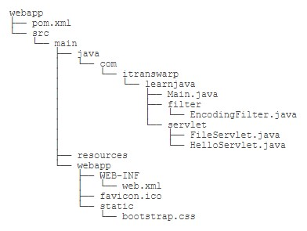

模板文件当中引用了多少静态文件就会发送多少相应的请求消息，因此WebApp中应当有相应的Servlet来处理这些请求消息。

我们把所有的静态资源文件放入/static/目录，在开发阶段，**有些Web服务器会自动为我们加一个专门负责处理静态文件的Servlet**，但如果IndexServlet映射路径为/，会屏蔽掉处理静态文件的Servlet映射。因此，我们需要自己编写一个处理静态文件的FileServlet：

```Java
@WebServlet(urlPatterns = "/static/*")
public class FileServlet extends HttpServlet {
    @Override
    protected void doGet(HttpServletRequest req, HttpServletResponse resp) throws ServletException, IOException {
        // 获取全局唯一的ServletContext实例
        ServletContext ctx = req.getServletContext();
        // RequestURI包含ContextPath，需要去掉
        String urlPath = req.getRequestURI().substring(ctx.getContextPath().length());
        // 获取文件真实路径
        String filepath = ctx.getRealPath(urlPath);
        if (filepath == null) {
            // 无法获取到路径
            resp.sendError(HttpServletResponse.SC_NOT_FOUND);
            return;
        }
        Path path = Paths.get(filepath);
        if (!path.toFile().isFile()) {
            // 文件不存在
            resp.sendError(HttpServletResponse.SC_NOT_FOUND);
            return;
        }
        // 根据文件名称猜测Content-Type
        String mime = Files.probeContentType(path);
        if (mime == null)
            mime = "application/octet-stream";
        resp.setContentType(mime);
        // 读取文件并写入Response
        OutputStream output = resp.getOutputStream();
        try (InputStream input = new BufferedInputStream(new FileInputStream(filepath))) {
            byte[] buffer = new byte[1024];
            int len;
            while ((len = input.read(buffer)) != -1) {
                output.write(buffer, 0, len);
            }
        }
        output.flush();
    }
}
```

类似Tomcat这样的Web服务器，运行的Web应用程序通常都是业务系统，因此，这类服务器也被称为应用服务器。应用服务器并不擅长处理静态文件，也不适合直接暴露给用户。通常，我们在生产环境部署时，总是使用类似Nginx这样的服务器充当反向代理和静态服务器，只有动态请求才会放行给应用服务器，所以，部署架构如下：

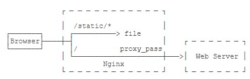

```YAML
server {
    listen 80;

    server_name www.local.liaoxuefeng.com;

    # 静态文件根目录:
    root /path/to/src/main/webapp;

    access_log /var/log/nginx/webapp_access_log;
    error_log  /var/log/nginx/webapp_error_log;

    # 处理静态文件请求:
    location /static {
    }

    # 处理静态文件请求:
    location /favicon.ico {
    }

    # 不允许请求/WEB-INF:
    location /WEB-INF {
        return 404;
    }

    # 其他请求转发给Tomcat:
    location / {
        proxy_pass       http://127.0.0.1:8080;
        proxy_set_header Host $host;
        proxy_set_header X-Real-IP $remote_addr;
        proxy_set_header X-Forwarded-Proto $scheme;
        proxy_set_header X-Forwarded-For $proxy_add_x_forwarded_for;
    }
}
```

使用Nginx配合Tomcat服务器，可以充分发挥Nginx作为网关的优势，既可以高效处理静态文件，也可以把https、防火墙、限速、反爬虫等功能放到Nginx中，使得我们自己的WebApp能专注于业务逻辑。

部署Web应用程序时，要设计合理的目录结构，**同时考虑开发模式需要便捷性，生产模式需要高性能**。
