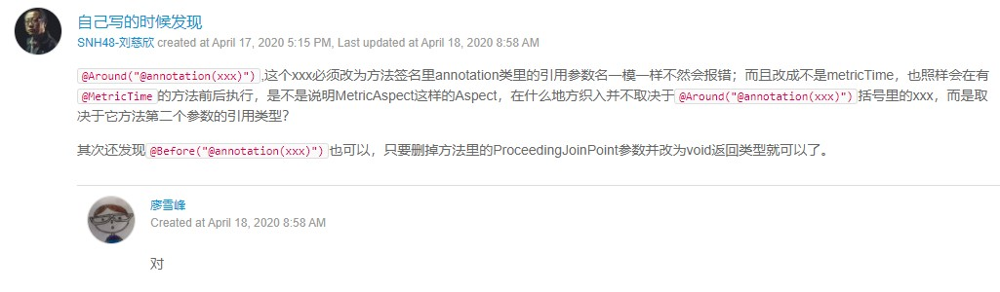

# 使用AOP

AOP是Aspect Oriented Programming，即面向切面编程。

我们先回顾一下OOP：Object Oriented Programming，OOP作为面向对象编程的模式，获得了巨大的成功，OOP的主要功能是数据封装、继承和多态。而AOP是一种新的编程方式，它和OOP不同，**OOP把系统看作多个对象的交互**，**AOP把系统分解为不同的关注点，或者称之为切面（Aspect）**。

要理解AOP的概念，我们先用OOP举例，比如一个业务组件BookService，它有几个业务方法：createBook：添加新的Book；updateBook：修改Book；deleteBook：删除Book。

个人对于AOP的理解：让我们在不改动核心业务逻辑代码片段的前提下，扩充业务逻辑的功能。这些功能指代那些公共需求：安全检查/日志记录等。本质上就是一个代理模式，在业务逻辑前后增加我们想要的逻辑。特别是对于那些第三方jar包，我们肯定是无法对里面的代码逻辑进行修改的，但我们又希望调用时能够产生日志记录，就可以使用AOP来帮助我们完成这项任务。

```Java
public class BookService {
    // 对每个业务方法，例如，createBook()，除了业务逻辑，还需要安全检查、日志记录和事务处理，它的代码像这样：
    public void createBook(Book book) {
        // 安全检查
        securityCheck();
        // 事务处理
        Transaction tx = startTransaction();
        try {
            // 核心业务逻辑
            tx.commit();
        } catch (RuntimeException e) {
            tx.rollback();
            throw e;
        }
        // 日志记录
        log("created book: " + book);
    }
    // 继续编写updateBook()，代码如下：
    public void updateBook(Book book) {
        // 安全检查
        securityCheck();
        // 事务处理
        Transaction tx = startTransaction();
        try {
            // 核心业务逻辑
            tx.commit();
        } catch (RuntimeException e) {
            tx.rollback();
            throw e;
        }
        // 日志记录
        log("updated book: " + book);
    }
}
```

对于安全检查、日志、事务等代码，它们会重复出现在每个业务方法中。使用OOP，我们很难将这些四处分散的代码模块化。考察业务模型可以发现，BookService关注的是自身的核心逻辑，但整个系统还要求关注安全检查、日志、事务等功能，这些功能实际上“横跨”多个业务方法，为了实现这些功能，不得不在每个业务方法上重复编写代码。

一种可行的方式是使用Proxy模式，将某个功能，例如，权限检查，放入Proxy中。这种方式的缺点是比较麻烦，必须先抽取接口，然后，针对每个方法实现Proxy。

```Java
public class SecurityCheckBookService implements BookService {
    private final BookService target;

    public SecurityCheckBookService(BookService target) {
        this.target = target;
    }
    // 在调用业务方法的前后为其增加功能，不修改原业务方法的逻辑
    public void createBook(Book book) {
        securityCheck();
        target.createBook(book);
    }

    public void updateBook(Book book) {
        securityCheck();
        target.updateBook(book);
    }

    public void deleteBook(Book book) {
        securityCheck();
        target.deleteBook(book);
    }

    private void securityCheck() {
        ...
    }
}
```

另一种方法是，既然SecurityCheckBookService的代码都是**标准的Proxy样板代码**，不如把权限检查视作一种切面（Aspect），把日志、事务也视为切面，然后，以某种自动化的方式，把切面织入到核心逻辑中，实现Proxy模式。

如果我们以AOP的视角来编写上述业务，可以依次实现：

  1. 核心逻辑，即BookService；
  2. 切面逻辑，即：
  3. 权限检查的Aspect；
  4. 日志的Aspect；
  5. 事务的Aspect。

然后，以某种方式，**让框架来把上述3个Aspect以Proxy的方式“织入”到BookService中，这样一来，就不必编写复杂而冗长的Proxy模式**。

如何把切面织入到核心逻辑中。这正是AOP需要解决的问题。换句话说，如果客户端获得了BookService的引用，当调用bookService.createBook()时，**如何对调用方法进行拦截，并在拦截前后进行安全检查、日志、事务等处理，就相当于完成了所有业务功能**。

在Java平台上，对于AOP的“织入”，有3种方式：

  1. 编译期：在编译时，由编译器把切面调用编译进字节码，这种方式需要定义新的关键字并扩展编译器，AspectJ就扩展了Java编译器，使用关键字aspect来实现织入；
  2. 类加载器：在目标类被装载到JVM时，通过一个特殊的类加载器，对目标类的字节码重新“增强”；
  3. 运行期：目标对象和切面都是普通Java类，通过JVM的动态代理功能或者第三方库实现运行期动态织入。

最简单的方式是第三种，Spring的AOP实现就是基于JVM的动态代理。由于JVM的动态代理要求必须实现接口，如果一个普通类没有业务接口，就需要通过CGLIB或者Javassist这些第三方库实现。

AOP技术看上去比较神秘，但实际上，它本质就是一个**动态代理(InvocationHandler/Proxy)**，让我们把一些常用功能如权限检查、日志、事务等，从每个业务方法中剥离出来。

**需要特别指出的是，AOP对于解决特定问题，例如事务管理非常有用，这是因为分散在各处的事务代码几乎是完全相同的，并且它们需要的参数（JDBC的Connection）也是固定的。另一些特定问题，如日志，就不那么容易实现，因为日志虽然简单，但打印日志的时候，经常需要捕获局部变量，如果使用AOP实现日志，我们只能输出固定格式的日志，因此，使用AOP时，必须适合特定的场景**。

## 装配AOP

> Aspect/Before/Around/EnableAspectJAutoProxy

在AOP编程中，我们经常会遇到下面的概念：

- Aspect：切面，即一个横跨多个核心逻辑的功能，或者称之为系统关注点；
- Joinpoint：连接点，即定义在应用程序流程的何处插入切面的执行；
- Pointcut：切入点，即一组连接点的集合；
- Advice：增强，指特定连接点上执行的动作；
- Introduction：引介，指为一个已有的Java对象动态地增加新的接口；
- Weaving：织入，指将切面整合到程序的执行流程中；
- Interceptor：拦截器，是一种实现增强的方式；
- Target Object：目标对象，即真正执行业务的核心逻辑对象；
- AOP Proxy：AOP代理，是客户端持有的增强后的对象引用。

看完上述术语，是不是感觉对AOP有了进一步的困惑。其实，我们不用关心AOP创造的“术语”，**只需要理解AOP本质上只是一种代理模式的实现方式**，在Spring的容器中实现AOP特别方便。

我们以UserService和MailService为例，这两个属于核心业务逻辑，现在，我们准备给UserService的每个业务方法执行前添加日志，给MailService的每个业务方法执行前后添加日志，在Spring中，需要以下步骤：

首先，我们通过Maven引入Spring对AOP的支持：

```XML
<dependency>
    <groupId>org.springframework</groupId>
    <artifactId>spring-aspects</artifactId>
    <version>${spring.version}</version>
</dependency>
```

**上述依赖会自动引入AspectJ，使用AspectJ实现AOP比较方便，因为它的定义比较简单**。

然后，我们定义一个LoggingAspect：

```Java
@Aspect
@Component
public class LoggingAspect {
    @Before("execution(public * com.cat.service.UserService.*(..))")
    public void doAccessCheck() {
        System.err.println("[Before] do access check...");
    }

    @Around("execution(public * com.cat.service.MailService.*(..))")
    public Object doLogging(ProceedingJoinPoint pjp) throws Throwable {
        System.err.println("[Around] start " + pjp.getSignature());
        Object retVal = pjp.proceed(); // 调用目标方法
        System.err.println("[Around] done " + pjp.getSignature());
        return retVal;
    }
}
```

观察doAccessCheck()方法，我们定义了一个@Before注解，后面的字符串是告诉AspectJ应该在何处执行该方法，这里写的意思是：执行UserService的每个public方法前执行doAccessCheck()代码。

再观察doLogging()方法，我们定义了一个@Around注解，它和@Before不同，@Around可以决定是否执行目标方法，因此，我们在doLogging()内部先打印日志，再调用方法，最后打印日志后返回结果。

在LoggingAspect类的声明处，除了用@Component表示它本身也是一个Bean外，我们再加上@Aspect注解，表示它的@Before标注的方法需要注入到UserService的每个public方法执行前，@Around标注的方法需要注入到MailService的每个public方法执行前后。

紧接着，我们需要给@Configuration类加上一个@EnableAspectJAutoProxy注解：

```Java
@Configuration
@ComponentScan
@EnableAspectJAutoProxy
public class AppConfig {
    ...
}
```

Spring的IoC容器看到这个注解，就会自动查找带有@Aspect的Bean，然后根据每个方法的@Before、@Around等注解把AOP注入到特定的Bean中。

其实AOP的原理非常简单。我们以LoggingAspect.doAccessCheck()为例，要把它注入到UserService的每个public方法中，最简单的方法是编写一个子类，**并持有原始实例的引用**：

```Java
public class UserServiceAopProxy extends UserService {
    private UserService target;   // 原始实例
    private LoggingAspect aspect; // 切面实例

    public UserServiceAopProxy(UserService target, LoggingAspect aspect) {
        this.target = target;
        this.aspect = aspect;
    }

    @Override
    public User login(String email, String password) {
        // 先执行切面逻辑
        this.aspect.doAccessCheck();
        // 再执行原始逻辑
        return this.target.login(email, password);
    }

    @Override
    public User register(String email, String password, String name) {
        this.aspect.doAccessCheck();
        return this.target.register(email, password, name);
    }
}
```

这些都是Spring容器启动时为我们自动创建的注入了Aspect的子类，**它取代了原始的UserService（原始的UserService实例作为内部变量隐藏在UserServiceAopProxy中）**。如果我们打印从Spring容器获取的UserService实例类型，它类似UserService$$EnhancerBySpringCGLIB$$1f44e01c，**实际上是Spring使用CGLIB动态创建的子类，但对于调用方来说，感觉不到任何区别**。

**Spring对接口类型使用JDK动态代理，对普通类使用CGLIB创建子类。如果一个Bean的class是final，Spring将无法为其创建子类**。

可见，虽然Spring容器内部实现AOP的逻辑比较复杂（需要使用AspectJ解析注解，并通过CGLIB实现代理类），但我们使用AOP非常简单，一共需要三步：

  1. 定义执行方法，并在方法上通过AspectJ的注解告诉Spring应该在何处调用此方法；
  2. 标记@Component和@Aspect；
  3. 在@Configuration类上标注@EnableAspectJAutoProxy。

[AspectJ的注入语法参考文档](https://docs.spring.io/spring/docs/current/spring-framework-reference/core.html#aop-pointcuts-examples)

Spring也提供其它方法来装配AOP，但都没有使用AspectJ注解的方式来得简洁明了。

拦截器有以下类型：

- @Before：这种拦截器先执行拦截代码，再执行目标代码。**如果拦截器抛异常，那么目标代码就不执行了**；
- @After：这种拦截器先执行目标代码，再执行拦截器代码。**无论目标代码是否抛异常，拦截器代码都会执行**；
- @AfterReturning：和@After不同的是，只有当目标代码正常返回时，才执行拦截器代码；
- @AfterThrowing：和@After不同的是，只有当目标代码抛出了异常时，才执行拦截器代码；
- @Around：能完全控制目标代码是否执行，并可以在执行前后、抛异常后执行任意拦截代码，可以说是包含了上面所有功能。

在Spring容器中使用AOP非常简单，只需要定义执行方法，并用AspectJ的注解标注应该在何处触发并执行。Spring通过CGLIB动态创建子类等方式来实现AOP代理模式，大大简化了代码。

## 使用注解装配AOP

在实际项目中，上述写法其实很少使用。我们在使用AOP时，要注意到虽然Spring容器可以把指定的方法通过AOP规则装配到指定的Bean的指定方法前后，但是，如果自动装配时，因为不恰当的范围，容易导致意想不到的结果，即很多不需要AOP代理的Bean也被自动代理了，并且，后续新增的Bean，如果不清楚现有的AOP装配规则，容易被强迫装配。

使用AOP时，被装配的Bean最好自己能清清楚楚地知道自己被安排了。例如，Spring提供的@Transactional就是一个非常好的例子。如果我们自己写的Bean希望在一个数据库事务中被调用，就标注上@Transactional：

```Java
@Component
public class UserService {
    // 有事务:
    @Transactional
    public User createUser(String name) {
        ...
    }

    // 无事务:
    public boolean isValidName(String name) {
        ...
    }

    // 有事务:
    @Transactional
    public void updateUser(User user) {
        ...
    }
}
```

或者直接在class级别注解，表示“所有public方法都被安排了”：

```Java
@Component
@Transactional
public class UserService {
    ...
}
```

通过@Transactional，某个方法是否启用了事务就一清二楚了。**因此，装配AOP的时候，使用注解是最好的方式**。

为了监控应用程序的性能，我们定义一个性能监控的注解：

```Java
@Target(ElementType.METHOD)
@Retention(RetentionPolicy.RUNTIME)
public @interface MetricTime {
    String value();
}
```

在需要被监控的关键方法上标注该注解：

```Java
@Component
public class UserService {
    // 监控UserService.register()方法性能
    @MetricTime("register")
    public User register(String email, String password, String name) {
        ...
    }
    ...
}
```

然后，我们定义MetricAspect：

```Java
@Aspect
@Component
public class MetricAspect {
    @Around("@annotation(metricTime)")
    public Object metric(ProceedingJoinPoint joinPoint, MetricTime metricTime) throws Throwable {
        String name = metricTime.value();
        long start = System.currentTimeMillis();
        try {
            // 调用原始实例逻辑
            return joinPoint.proceed();
        } finally {
            long t = System.currentTimeMillis() - start;
            // 在其之后输出日志
            System.err.println("[Metrics] " + name + ": " + t + "ms");
        }
    }
}
```

注意metric()方法标注了@Around("@annotation(metricTime)")，它的意思是，符合条件的目标方法是带有@MetricTime注解的方法，因为metric()方法参数类型是MetricTime（注意参数名是metricTime不是MetricTime），我们通过它获取性能监控的名称。



有了@MetricTime注解，再配合MetricAspect，任何Bean，只要方法标注了@MetricTime注解，就可以自动实现性能监控。

使用注解实现AOP需要先定义注解，然后使用@Around("@annotation(name)")实现装配；**使用注解既简单，又能明确标识AOP装配，是使用AOP推荐的方式**。

## AOP避坑指南（有关Spring使用CGLIB创建普通类的代理类的坑）

无论是使用AspectJ语法，还是配合Annotation，使用AOP，实际上就是让Spring自动为我们创建一个Proxy，使得调用方能无感知地调用指定方法，但运行期却动态“织入”了其它逻辑，因此，AOP本质上就是一个代理模式。

因为Spring使用了CGLIB来实现运行期动态创建普通类的Proxy，如果我们没能深入理解其运行原理和实现机制，就极有可能遇到各种诡异的问题。

```Java
@Component
public class UserService {
    // 成员变量:
    public final ZoneId zoneId = ZoneId.systemDefault();

    // 构造方法:
    public UserService() {
        System.out.println("UserService(): init...");
        System.out.println("UserService(): zoneId = " + this.zoneId);
    }

    // public方法:
    public ZoneId getZoneId() {
        return zoneId;
    }

    // public final方法:
    public final ZoneId getFinalZoneId() {
        return zoneId;
    }
}

@Component
public class MailService {
    @Autowired
    UserService userService;

    public String sendMail() {
        ZoneId zoneId = userService.zoneId; // 直接访问字段获取值
        String dt = ZonedDateTime.now(zoneId).toString();
        return "Hello, it is " + dt;
    }
}
// 由于UserService是一个普通类，因此Spring会使用CGLIB来为其创建代理类。
// 如果某个bean被装配了AOP，那么后续在注入和获取该bean时提供的都是Spring提供的代理bean。
@Aspect
@Component
public class LoggingAspect {
    @Before("execution(public * com..*.UserService.*(..))")
    public void doAccessCheck() {
        System.err.println("[Before] do access check...");
    }
}
```

深入理解Spring使用CGLIB生成普通类的Proxy的原理：

  1. 第一步，正常创建一个UserService的原始实例，这是通过反射调用构造方法实现的，它的行为和我们预期的完全一致（UserService作为组件肯定是会被容器初始化的）；
  2. 第二步，通过CGLIB创建一个UserService的子类，并引用了原始实例和LoggingAspect（可以参考装配AOP章节里UserServiceAopProxy的代码）。

如果我们观察Spring创建的AOP代理，它的类名总是类似UserService$$EnhancerBySpringCGLIB$$1c76af9d（你没看错，Java的类名实际上允许$字符）。为了让调用方获得UserService的引用，它必须继承自UserService。然后，该代理类会覆写所有public和protected方法，并在内部将调用委托给原始的UserService实例。

这里出现了两个UserService实例：一个是我们代码中定义的原始实例，它的成员变量已经按照我们预期的方式被初始化完成；第二个UserService实例实际上类型是UserService$$EnhancerBySpringCGLIB，它引用了原始的UserService实例。

```Java
// 原始实例
UserService original = new UserService();
// 引用了原始实例和切面实例的代理实例
UserService$$EnhancerBySpringCGLIB proxy = new UserService$$EnhancerBySpringCGLIB();
proxy.target = original;
proxy.aspect = ...
```

注意到这种情况仅出现在启用了AOP的情况，此刻，从ApplicationContext中获取的UserService实例是proxy，注入到MailService中的UserService实例也是proxy。

最终的问题来了：proxy实例的成员变量，也就是从UserService继承的zoneId，它的值是null。

```Java
// 原因在于，UserService成员变量的初始化在UserService$$EnhancerBySpringCGLIB中，并未执行。
// 原因是，没必要初始化proxy的成员变量，因为proxy的目的是代理方法。
public class UserService {
    public final ZoneId zoneId = ZoneId.systemDefault();
    ...
}
// 实际上，成员变量的初始化是在构造方法中完成的。这是我们看到的代码
public class UserService {
    public final ZoneId zoneId = ZoneId.systemDefault();
    public UserService() {
    }
}
// 这是编译器实际编译的代码
public class UserService {
    public final ZoneId zoneId;
    public UserService() {
        super(); // 构造方法的第一行代码总是调用super()
        zoneId = ZoneId.systemDefault(); // 继续初始化成员变量
    }
}
```

然而，对于Spring通过CGLIB动态创建的UserService$$EnhancerBySpringCGLIB代理类，它的构造方法中，并未调用super()，因此，从父类继承的成员变量，包括final类型的成员变量，统统都没有初始化。

这是因为自动加super()的功能是Java编译器实现的，它发现你没加，就自动给加上，发现你加错了，就报编译错误。但实际上，如果直接构造字节码，一个类的构造方法中，不一定非要调用super()。Spring使用CGLIB构造的Proxy类，是直接生成字节码，并没有源码-编译-字节码这个步骤，**因此：Spring通过CGLIB创建的代理类，不会初始化代理类自身继承的任何成员变量，包括final类型的成员变量**！

简单来说就是Spring通过CGLIB对普通类创建的代理类，它不会去初始化代理类自身继承的任何成员变量（包括final类型的成员变量，注意分清定义变量和初始化变量的概念），**因为代理的目的是代理方法**，另外即使说被代理类的成员变量是通过构造方法被初始化，但是在代理类的构造方法当中也不一定会去调用super()方法从而导致继承的被代理类的成员变量始终没有进行初始化操作（因为会使用代理类的实例，因此一定会调用代理类的构造方法）。

如果没有启用AOP，注入的是原始的UserService实例，那么一切正常，因为UserService实例的zoneId字段已经被正确初始化了。如果启动了AOP，注入的是代理后的UserService$$EnhancerBySpringCGLIB实例，那么问题大了：获取的UserService$$EnhancerBySpringCGLIB实例的zoneId字段，永远为null。

修复很简单，只需要把直接访问字段的代码，改为通过方法访问，**因为原始实例是正常实例化的，因此通过原始实例去访问的成员变量肯定是正常初始化完毕的**：

```Java
@Component
public class MailService {
    @Autowired
    UserService userService;

    public String sendMail() {
        // 不要直接访问UserService的字段:
        // 调用代理类覆写的getZoneId()方法，继而调用被代理类的getZoneId()方法
        ZoneId zoneId = userService.getZoneId();
        ...
    }
}
// 无论注入的UserService是原始实例还是代理实例，getZoneId()都能正常工作，因为代理类会覆写getZoneId()方法，并将其委托给原始实例。
public UserService$$EnhancerBySpringCGLIB extends UserService {
    UserService target = ...
    ...
    @Overrided
    public ZoneId getZoneId() {
        return target.getZoneId();
    }
}
```

注意到我们还给UserService添加了一个public+final的方法，如果在MailService中，调用的不是getZoneId()，而是getFinalZoneId()，又会出现NullPointerException，**这是因为，代理类无法覆写final方法（这一点绕不过JVM的ClassLoader检查），该方法返回的是代理类的zoneId字段，即null**。

```Java
// UserService
public ZoneId getZoneId() {
    return this.zoneId;
}
// UserService$$EnhancerBySpringCGLIB
public ZoneId getZoneId() {
    return this.target.getZoneId(); // 覆写后调用原始实例的方法访问被正常初始化的成员变量
}
// UserService
public final ZoneId getFinalZoneId() {
    return this.zoneId;
}
// UserService$$EnhancerBySpringCGLIB
public final ZoneId getFinalZoneId() {
    return this.zoneId; // 无法覆写从而导致访问的是自身继承下来的成员变量
}
```

实际上，如果我们加上日志，Spring在启动时会打印一个警告：日志大意就是，因为被代理的UserService有一个final方法getFinalZoneId()，这会导致其他Bean如果调用此方法，无法将其代理到真正的原始实例，从而可能发生NPE异常。

因此，正确使用AOP，我们需要一个避坑指南，这样才能保证有没有AOP，代码都能正常工作：

  1. 访问被注入的Bean时，**总是调用方法而非直接访问字段**；
  2. 编写Bean时，**如果可能会被代理，就不要编写public final方法**。

由于Spring通过CGLIB实现代理类，我们要避免直接访问Bean的字段，以及由final方法带来的“未代理”问题。遇到CglibAopProxy的相关日志，务必要仔细检查，防止因为AOP出现NPE异常。

**如果一个Bean不允许任何AOP代理，应该怎么做来“保护”自己在运行期不会被代理**。将类设置为final的防止cglib创建Proxy，并且不继承接口防止JDK自带的动态代理。

为什么Spring刻意不初始化Proxy继承的字段。[参考讨论](https://www.liaoxuefeng.com/wiki/1252599548343744/1339039378571298)
