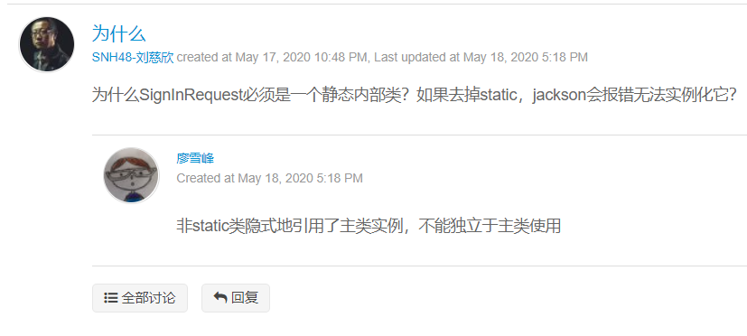
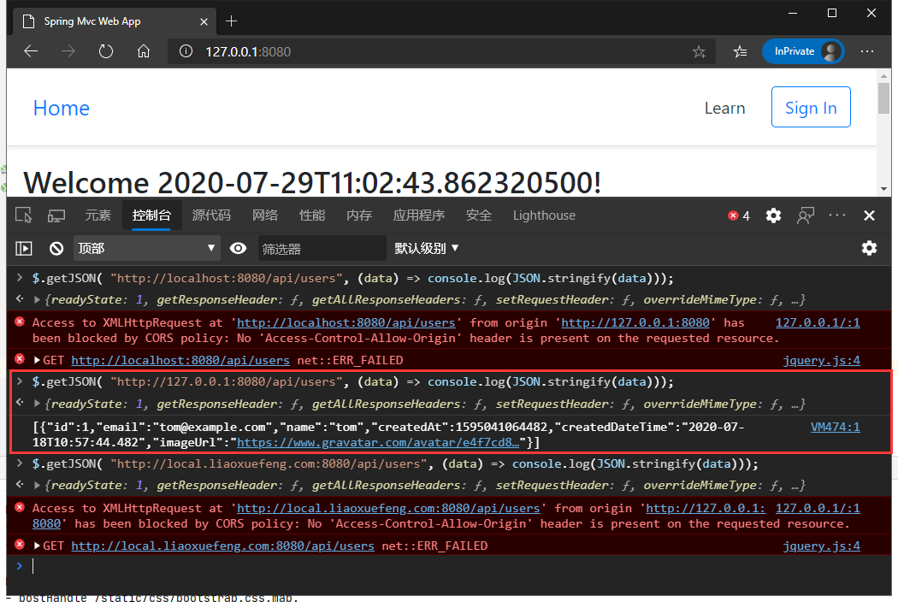
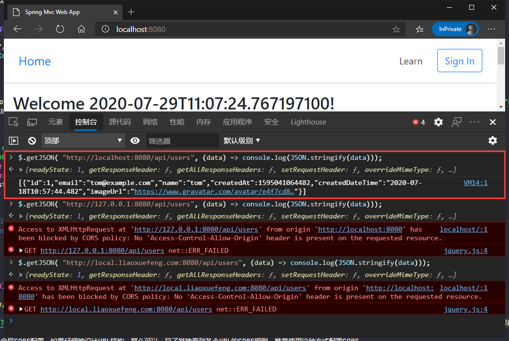
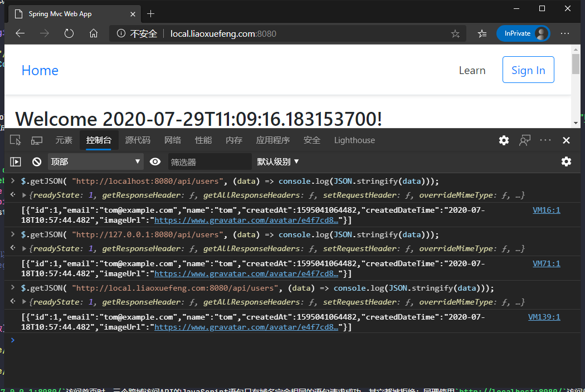
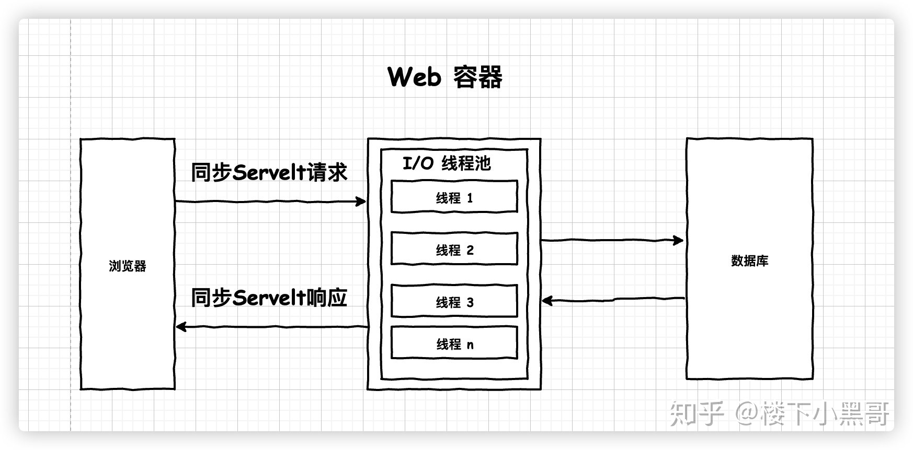
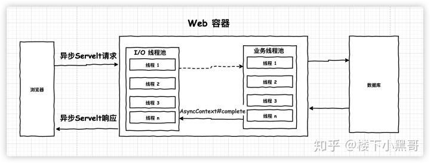
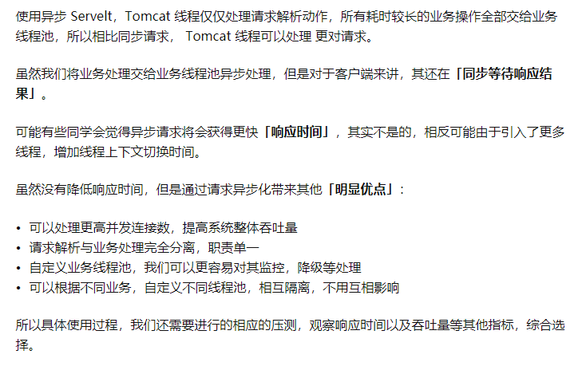

# 开发Web应用

直接使用Servlet进行Web开发好比直接在JDBC上操作数据库，比较繁琐，更好的方法是在Servlet基础上封装MVC框架，基于MVC开发Web应用，大部分时候，不需要接触Servlet API，开发省时省力。

## 使用Spring MVC

Java Web的基础：Servlet容器，以及标准的Servlet组件：

- Servlet：能处理HTTP请求并将HTTP响应返回；
- JSP：一种嵌套Java代码的HTML，将被编译为Servlet；
- Filter：能过滤指定的URL以实现拦截功能；
- Listener：监听指定的事件，如ServletContext、HttpSession的创建和销毁。

此外，Servlet容器为每个Web应用程序自动创建一个唯一的ServletContext实例，这个实例就代表了Web应用程序本身。

但是，Spring提供的是一个IoC容器，所有的Bean，包括Controller，都在Spring IoC容器中被初始化，而Servlet容器由JavaEE服务器提供（如Tomcat），Servlet容器对Spring一无所知，他们之间到底依靠什么进行联系，又是以何种顺序初始化的？

现在是Web应用程序，而Web应用程序总是由Servlet容器创建，那么，Spring容器应该由谁创建？在什么时候创建？Spring容器中的Controller又是如何通过Servlet调用的？

早期的Servlet需要在web.xml中配置映射路径，但最新Servlet版本只需要通过注解就可以完成路径映射。

我们在web.xml中配置Spring MVC提供的DispatcherServlet：

```XML
<!DOCTYPE web-app PUBLIC
        "-//Sun Microsystems, Inc.//DTD Web Application 2.3//EN"
        "http://java.sun.com/dtd/web-app_2_3.dtd" >

<web-app>
    <display-name>Archetype Created Web Application</display-name>

    <servlet>
        <servlet-name>dispatcher</servlet-name>
        <servlet-class>org.springframework.web.servlet.DispatcherServlet</servlet-class>
        <init-param>
            <param-name>contextClass</param-name>
            <param-value>org.springframework.web.context.support.AnnotationConfigWebApplicationContext</param-value>
        </init-param>
        <init-param>
            <param-name>contextConfigLocation</param-name>
            <param-value>com.cat.AppConfig</param-value>
        </init-param>
        <load-on-startup>0</load-on-startup>
    </servlet>

    <servlet-mapping>
        <servlet-name>dispatcher</servlet-name>
        <url-pattern>/*</url-pattern>
    </servlet-mapping>
</web-app>
```

初始化参数`contextClass`指定使用注解配置的`AnnotationConfigWebApplicationContext`，配置文件的位置参数`contextConfigLocation`指向`AppConfig`的完整类名，最后，把这个Servlet映射到`/*`，即处理所有URL。

**上述配置可以看作一个样板配置，有了这个配置，Servlet容器会首先初始化Spring MVC的DispatcherServlet，在DispatcherServlet启动时，它根据配置AppConfig创建了一个类型是WebApplicationContext的IoC容器，完成所有Bean的初始化，并将容器绑到ServletContext上**。

**因为DispatcherServlet持有IoC容器，能从IoC容器中获取所有@Controller的Bean，因此，DispatcherServlet接收到所有HTTP请求后，根据Controller方法配置的路径，就可以正确地把请求转发到指定方法，并根据返回的ModelAndView决定如何渲染页面**。

使用Spring MVC时，整个Web应用程序按如下顺序启动：

  1. 启动Tomcat服务器；
  2. Tomcat读取web.xml并初始化DispatcherServlet；
  3. DispatcherServlet创建IoC容器并自动注册到ServletContext中。

**启动后，浏览器发出的HTTP请求全部由DispatcherServlet接收，并根据配置转发到指定Controller的指定方法处理**。

编写Controller只需要遵循以下要点：

- Controller必须标记为@Controller；
- 一个方法对应一个HTTP请求路径，用@GetMapping或@PostMapping表示GET或POST请求；
- 需要接收的HTTP参数以@RequestParam()标注，可以设置默认值。如果方法参数需要传入HttpServletRequest、HttpServletResponse或者HttpSession，直接添加这个类型的参数即可，Spring MVC会自动按类型传入；
- 返回的ModelAndView通常包含View的路径和一个Map作为Model，但也可以没有Model；
- 返回重定向时既可以写new ModelAndView("redirect:/signin")，也可以直接返回"redirect:/signin"；
- **如果在方法内部直接操作HttpServletResponse发送响应，返回null表示无需进一步处理**；

    ```Java
    public ModelAndView download(HttpServletResponse response) {
        byte[] data = ...
        response.setContentType("application/octet-stream");
        OutputStream output = response.getOutputStream();
        output.write(data);
        output.flush();
        return null;
    }
    ```

- 对URL进行分组，每组对应一个Controller是一种很好的组织形式，并可以在Controller的class定义出添加URL前缀；

    ```Java
    @Controller
    @RequestMapping("/user")
    public class UserController {
        // 注意实际URL映射是/user/profile
        @GetMapping("/profile")
        public ModelAndView profile() {
            ...
        }

        // 注意实际URL映射是/user/changePassword
        @GetMapping("/changePassword")
        public ModelAndView changePassword() {
            ...
        }
    }
    ```

- **实际方法的URL映射总是前缀+路径，这种形式还可以有效避免不小心导致的重复的URL映射**。

在注册、登录等功能的基础上增加一个修改口令的页面：

  1. 页面上有原始密码、新密码、重复密码三个文本框。
  2. 处理GET请求的方法内部判断用户是否已登录，用户未登录则跳转至登录页面，已登录则返回修改口令的页面（渲染用户对象）。
  3. 处理POST请求的方法内部首先判断原始密码是否正确，之后再判断重复密码和新密码是否一致，这两类操作如果不正确则返回页面（渲染用户对象和错误消息），最后修改用户密码，移除用户登录记录，跳转到登录页面。

## 使用REST


在Web应用中，除了需要使用MVC给用户显示页面外，还有一类API接口，我们称之为REST，通常输入输出都是JSON，**便于第三方调用或者使用页面JavaScript与之交互**。

直接在Controller中处理JSON是可以的，因为Spring MVC的@GetMapping和@PostMapping都支持指定输入和输出的格式。如果我们想接收JSON，输出JSON，那么可以这样写：

```Java
@Controller
public class RestController {
    @PostMapping(value = "/rest",
            consumes = "application/json;charset=UTF-8",
            produces = "application/json;charset=UTF-8")
    @ResponseBody
    public String rest(@RequestBody User user) {
        logger.info("JSON to User: {}", user.getEmail());
        return "{\"restSupport\": true}";
    }
}
```

对应的Maven工程需要加入Jackson这个依赖。

**注意到@PostMapping使用consumes声明能接收的类型，使用produces声明输出的类型，并且额外加了@ResponseBody表示返回的String无需额外处理，直接作为输出内容写入HttpServletResponse。输入的JSON则根据注解@RequestBody直接被Spring反序列化为User这个JavaBean**。


直接用Spring的Controller配合一大堆注解写REST太麻烦了，因此，Spring还额外提供了一个@RestController注解，使用@RestController替代@Controller后，每个方法自动变成API接口方法。我们还是以实际代码举例，编写ApiController如下：

```Java
@PostMapping
@DeleteMapping
@PutMapping
@GetMapping

@RequestMapping(path = "/users", method = RequestMethod.POST)
@RequestMapping(path = "/users", method = RequestMethod.DELETE)
@RequestMapping(path = "/users", method = RequestMethod.PUT)
@RequestMapping(path = "/users", method = RequestMethod.GET)
```

```Java
@RestController
@RequestMapping("/api")
public class ApiController {
    @Autowired
    UserService userService;
    // GET /users 查询全部用户
    @GetMapping("/users")
    public List<User> users() {
        return this.userService.getUsers();
    }
    // GET /users/id 获取单个用户
    @GetMapping("/users/{id}")
    public User user(@PathVariable("id") long id) {
        return this.userService.getUserById(id);
    }
    // POST /signin
    // 注意此处反序列化为下方定义的静态内部类SignInRequest这个JavaBean
    @PostMapping("/signin")
    public Map<String, Object> signin(@RequestBody SignInRequest signinRequest) {
        try {
            User user = this.userService.signin(signinRequest.email, signinRequest.password);
            return Map.of("user", user);
        } catch (Exception e) {
            return Map.of("error", "SIGNIN_FAILED", "message", e.getMessage());
        }
    }

    public static class SignInRequest {
        public String email;
        public String password;
    }
}
```

使用@RestController可以方便地编写REST服务，**Spring默认使用JSON作为输入和输出**。

编写REST接口只需要定义@RestController，然后，每个方法都是一个API接口，输入和输出只要能被Jackson序列化或反序列化为JSON就没有问题。我们用浏览器测试GET请求，可直接显示JSON响应：


测试POST请求：


注意观察上述JSON的输出，User能被正确地序列化为JSON，但暴露了password属性，这是我们不期望的。要避免输出password属性，可以把User复制到另一个UserBean对象，该对象只持有必要的属性，但这样做比较繁琐。另一种简单的方法是直接在User的password属性定义处加上@JsonIgnore表示**完全忽略该属性（输入时不会被赋值，输出时不会被转换所以前端展示时也不会被显示）**：

```Java
public class User {
    ...

    @JsonIgnore
    public String getPassword() {
        return password;
    }

    ...
}
```

但是这样一来，如果写一个register(User user)方法，那么该方法的User对象也拿不到注册时用户传入的密码了（密码字段的值为null）。如果要允许输入password，但不允许输出password，即在JSON序列化和反序列化时，允许写属性，禁用读属性，可以更精细地控制如下：

```Java
public class User {
    ...

    @JsonProperty(access = Access.WRITE_ONLY)
    public String getPassword() {
        return password;
    }

    ...
}
```



## 集成Filter

简单地使用一个EncodingFilter，在全局范围内给HttpServletRequest和HttpServletResponse强制设置为UTF-8编码。

可以自己编写一个EncodingFilter，也可以直接使用Spring MVC自带的一个CharacterEncodingFilter。配置Filter时，只需在web.xml中声明即可：

```XML
<web-app>
    <display-name>Archetype Created Web Application</display-name>
    <!-- 这是由Servlet容器实例化的一个WebFilter，只不过实例化的对象是由Spring框架直接提供的。 -->
    <filter>
        <filter-name>encodingFilter</filter-name>
        <filter-class>org.springframework.web.filter.CharacterEncodingFilter</filter-class>
        <init-param>
            <param-name>encoding</param-name>
            <param-value>UTF-8</param-value>
        </init-param>
        <init-param>
            <param-name>forceEncoding</param-name>
            <param-value>true</param-value>
        </init-param>
    </filter>

    <filter-mapping>
        <filter-name>encodingFilter</filter-name>
        <url-pattern>/*</url-pattern>
    </filter-mapping>

    ...
</web-app>
```

因为这种Filter和我们业务关系不大，**注意到CharacterEncodingFilter其实和Spring的IoC容器没有任何关系，两者均互不知晓对方的存在（为何无关，请参考第一节）**，因此，配置这种Filter十分简单。

**如果想要返回包含中文内容的JSON数据，最好指定请求头`Accept`（用来表示请求发送方希望接收的数据类型）为`application/json;charset=UTF-8`，以及使用`Map.of(k, v)`来携带JSON数据进行返回**。

再考虑这样一个问题：如果允许用户使用`Basic`模式进行用户验证，即在HTTP请求中添加头`Authorization: Basic email:password`，这个需求如何实现。编写一个AuthFilter是最简单的实现方式：

```Java
// 注解是Spring的@Component注解不是Servlet的@WebFilter注解:
@Component
public class AuthFilter implements Filter {
    @Autowired
    UserService userService;

    public void doFilter(ServletRequest request, ServletResponse response, FilterChain chain)
            throws IOException, ServletException {
        HttpServletRequest req = (HttpServletRequest) request;
        // 获取Authorization头:
        String authHeader = req.getHeader("Authorization");
        if (authHeader != null && authHeader.startsWith("Basic ")) {
            // 从Header中提取email和password:
            String email = prefixFrom(authHeader);
            String password = suffixFrom(authHeader);
            // 登录:
            User user = userService.signin(email, password);
            // 放入Session:
            req.getSession().setAttribute(UserController.KEY_USER, user);
        }
        // 继续处理请求:
        chain.doFilter(request, response);
    }
}
```

问题：在Spring中创建的这个AuthFilter是一个**普通Bean**，**Servlet容器并不知道它能作为Filter组件**，所以它不会起作用。

**如果我们直接在web.xml中声明（如上述定义encodingFilter那样）这个AuthFilter，此时AuthFilter的实例将由Servlet容器而不是Spring容器初始化，因此，@Autowire根本不生效，用于登录的UserService成员变量永远是null**。

在以前学习的Web开发章节中，我们使用@WebFilter注解一个Filter，然后由Web服务器来加载它，但在这里注解@Component会使@WebFilter注解失效。**可以想象一下这个实例先后会被Web容器以及Spring容器初始化，这种初始化两次的逻辑应该是不被允许的（个人理解）**。

所以，得通过一种方式，**让Servlet容器实例化的Filter，间接引用Spring容器实例化的AuthFilter**。Spring MVC提供了一个`DelegatingFilterProxy`，专门来干这个事情：

```XML
<web-app>
    <filter>
        <filter-name>authFilter</filter-name>
        <filter-class>org.springframework.web.filter.DelegatingFilterProxy</filter-class>
    </filter>

    <filter-mapping>
        <filter-name>authFilter</filter-name>
        <url-pattern>/*</url-pattern>
    </filter-mapping>
    ...
</web-app>
```

我们来看实现原理：

  1. Servlet容器从web.xml中读取配置，实例化DelegatingFilterProxy，注意命名是authFilter；
  2. Spring容器通过扫描@Component实例化AuthFilter。

**两次实例化的对象不同，并用先实例化的DelegatingFilterProxy引用后实例化的AuthFilter**。

**当DelegatingFilterProxy生效后，它会自动查找注册在ServletContext上的Spring容器，再试图从容器中查找名为authFilter的Bean，也就是我们用@Component声明的AuthFilter**。

**DelegatingFilterProxy将请求代理给AuthFilter**，核心代码如下：

```Java
public class DelegatingFilterProxy implements Filter {
    private Filter delegate;
    public void doFilter(...) throws ... {
        if (delegate == null) {
            delegate = findBeanFromSpringContainer();
        }
        delegate.doFilter(req, resp, chain);
    }
}
```

这就是一个代理模式的简单应用。我们画个图表示它们之间的引用关系如下：


如果在web.xml中配置的Filter名字和Spring容器的Bean的名字不一致，那么需要指定Bean的名字。实际应用时，尽量保持名字一致，以减少不必要的配置。

验证AuthFilter是否生效，携带请求头`Authorization: Basic email:password`，请求`/profile`路径。

如果AuthFilter生效，则拦截所有请求，并对携带指定请求头的请求尝试执行登录逻辑，不管登录逻辑是否成功，都会让请求继续向后转发。


如果登录逻辑验证成功，则访问`/profile`路径将直接返回profile页面，因为验证逻辑会将user对象放入到session中；如果登录逻辑验证失败，则重定向至`/signin`路径。另外可以看到控制台中有关Basic模式的验证逻辑打印了两次，因为重定向实际上是让浏览器发送一个新的请求到服务端，**并且这个新的请求会携带之前请求的请求头（可以通过在doFilter()方法当中打印所有的请求头进行查看）**，因此`/signin`路径同样被过滤器所过滤，但是由于验证逻辑再次失败，只返回了signin页面。

## 使用Interceptor

Filter组件是由Servlet容器进行管理的，它在Spring MVC的Web应用程序中作用范围如下（注意在Filter组件上面的箭头）：


上图虚线框就是Filter2的拦截范围，Filter组件实际上并不知道后续内部处理是通过Spring MVC提供的DispatcherServlet还是其他Servlet组件，因为Filter是Servlet规范定义的标准组件，它可以应用在任何基于Servlet的程序中。

如果只基于Spring MVC开发应用程序，还可以使用Spring MVC提供的一种功能类似Filter的拦截器：Interceptor。和Filter相比，Interceptor拦截范围不是后续整个处理流程，而是仅针对Controller拦截：


所以，Interceptor的拦截范围其实就是Controller方法，它实际上就相当于基于AOP的方法拦截。因为Interceptor只拦截Controller方法，所以要注意，返回ModelAndView后，后续对View的**渲染**就脱离了Interceptor的拦截范围。

使用Interceptor的好处是Interceptor本身是Spring管理的Bean，因此注入任意Bean都非常简单（可以理解为在上一节我们为了使用UserService的业务，必须将其定义为一个Spring容器组件，然后在web.xml间接引用为一个Servlet组件Filter）。此外，可以应用多个Interceptor，并通过简单的@Order指定顺序（这也是个好处，可以指定顺序）。我们先写一个LoggerInterceptor：

```Java
@Order(1)
@Component
public class LoggerInterceptor implements HandlerInterceptor {
    final Logger logger = LoggerFactory.getLogger(getClass());
    // Controller方法调用前执行，顺序在前的先执行
    @Override
    public boolean preHandle(HttpServletRequest request, HttpServletResponse response, Object handler) throws Exception {
        // 打印请求路径
        this.logger.info("preHandle {}...", request.getRequestURI());
        if (request.getParameter("debug") != null) {
            // 在请求中获取到debug参数，直接处理响应，返回false表示无需调用Controller方法继续处理了，通常在认证或者安全检查失败时直接返回错误响应
            PrintWriter pw = response.getWriter();
            pw.write("<p>DEBUG MODE</p>");
            pw.flush();
            return false;
        }
        // 返回true表示将请求继续交由后续处理，可能是Controller方法也可能是另外的Interceptor
        return true;
    }
    // Controller方法正常返回后执行
    @Override
    public void postHandle(HttpServletRequest request, HttpServletResponse response, Object handler, ModelAndView modelAndView) throws Exception {
        this.logger.info("postHandle {}.", request.getRequestURI());
        // 能够捕获ModelAndView对象，继续向其添加一些通用数据，很多页面需要的全局数据如Copyright信息等都可以放到这里，无需在每个Controller方法中重复添加
        if (modelAndView != null) {
            modelAndView.addObject("__time__", LocalDateTime.now());
        }
    }
    // 无论Controller方法是否抛异常都会执行，参数ex就是Controller方法抛出的异常（未抛出异常是null）
    @Override
    public void afterCompletion(HttpServletRequest request, HttpServletResponse response, Object handler, Exception ex) throws Exception {
        // 无法捕获也无法返回ModelAndView对象
        this.logger.info("afterCompletion {}: exception = {}", request.getRequestURI(), ex);
    }
}
```

一个Interceptor必须实现HandlerInterceptor接口，要让拦截器生效，我们在WebMvcConfigurer中注册所有的Interceptor（一次注册所有拦截器，后续再写Interceptor就不需要像上一节写Filter组件时，写完一个组件要让其生效则必须在web.xml里间接引用）：

```Java
@Bean
WebMvcConfigurer createWebMvcConfigurer(@Autowired HandlerInterceptor[] interceptors) {
    return new WebMvcConfigurer() {
        public void addInterceptors(InterceptorRegistry registry) {
            for (var interceptor : interceptors) {
                registry.addInterceptor(interceptor);
            }
        }
        ...
    };
}
```

我们可以将用户数据的添加逻辑也放置在拦截器当中，只要成功进行过登录操作，那么从session当中就能获取到用户数据，否则将获取到空对象：

```java
@Override
public void postHandle(HttpServletRequest request, HttpServletResponse response, Object handler,
                        ModelAndView modelAndView) throws Exception {
    logger.info("postHandle {}.", request.getRequestURI());
    if (modelAndView != null) {
        modelAndView.addObject("user", request.getSession().getAttribute(UserController.KEY_USER));
        modelAndView.addObject("__time__", LocalDateTime.now());
    }
}
```

### 处理异常

在Controller中，Spring MVC还允许定义基于@ExceptionHandler注解的异常处理方法。我们来看具体的示例代码：

```Java
@Controller
public class UserController {
    @GetMapping("/resetPassword")
    public ModelAndView resetPassword() {
        throw new UnsupportedOperationException("Not supported yet!");
    }

    @ExceptionHandler(RuntimeException.class)
    public ModelAndView handleUnknowException(Exception ex) {
        return new ModelAndView("500.html", Map.of("error", ex.getClass().getSimpleName(), "message", ex.getMessage()));
    }
    ...
}
```

异常处理方法没有固定的方法签名，可以传入Exception、HttpServletRequest等，返回值可以是void，也可以是ModelAndView，上述代码通过@ExceptionHandler(RuntimeException.class)表示当发生RuntimeException的时候，就自动调用此方法处理。注意到我们返回了一个新的ModelAndView，这样在应用程序内部**如果发生了预料之外的异常**，可以给用户显示一个出错页面，而不是简单的500 Internal Server Error或404 Not Found。

使用ExceptionHandler时，要注意它仅作用于**当前**的Controller，即ControllerA中定义的一个ExceptionHandler方法对ControllerB不起作用。

ExceptionHandler比起afterCompletion就是它能够返回一个ModelAndView对象作为异常处理的结果（因为它也是一个Controller组件方法）。

如果我们有很多Controller，每个Controller都需要处理一些通用的异常，例如LoginException，思考一下应该怎么避免重复代码。


## 处理CORS

在开发REST应用时，很多时候，是通过页面的JavaScript和后端的REST API交互。

在JavaScript与REST交互的时候，有很多安全限制。默认情况下，浏览器按同源策略放行JavaScript调用API，即：

- 如果A站在域名a.com页面的JavaScript调用A站自己的API时，没有问题；
- 如果A站在域名a.com页面的JavaScript调用B站b.com的API时，将被浏览器拒绝访问，因为不满足同源策略。

**同源要求域名要完全相同（a.com和www.a.com不同）（域名相同URI可以不同，也就是说在同一个域名下对不同的URI发起请求），协议要相同（http和https不同），端口要相同**。

如果A站的JavaScript访问B站API的时候，B站能够返回响应头`Access-Control-Allow-Origin: http://a.com`，那么，*浏览器*就允许A站的JavaScript访问B站的API。

注意到跨域访问能否成功，取决于B站是否愿意给A站返回一个正确的`Access-Control-Allow-Origin`响应头，所以决定权永远在提供API的服务方手中。

### 使用@CrossOrigin

```Java
@CrossOrigin(origins = "http://local.liaoxuefeng.com:8080")
@RestController
@RequestMapping("/api")
public class ApiController {
    ...
}
```

上述定义在ApiController处的@CrossOrigin指定了只允许来自`local.liaoxuefeng.com`跨域访问，允许多个域访问需要写成数组形式，例如`origins = ({"http://a.com", "https://www.b.com"})`。如果要允许任何域访问，写成`origins = "*"`即可。

### 使用CorsRegistry

```Java
@Bean
WebMvcConfigurer createWebMvcConfigurer() {
    return new WebMvcConfigurer() {
        @Override
        public void addCorsMappings(CorsRegistry registry) {
            registry.addMapping("/api/**")
                    .allowedOrigins("http://local.liaoxuefeng.com:8080")
                    .allowedMethods("GET", "POST")
                    .maxAge(3600);
            // 可以继续添加其他URL规则:
            // registry.addMapping("/rest/v2/**")...
        }
    };
}
```

[路径映射中的*号个数](https://www.cnblogs.com/powerwu/articles/8079391.html)

[路径优先级](https://blog.csdn.net/elim168/article/details/88293952)

这种方式可以创建一个全局CORS配置，如果仔细地设计URL结构，那么可以一目了然地看到各个URL的CORS规则，推荐使用这种方式配置CORS。

### 测试







当使用`http://127.0.0.1:8080/`访问首页时，三个跨域访问API的JavaScript语句只有域名完全相同的语句请求成功，其它都被拒绝；同理使用`http://localhost:8080/`访问首页时，也只有域名相同的访问成功；使用全局CORS配置的映射路径`http://local.liaoxuefeng.com:8080/`访问首页时，可以看到访问语句都请求成功。

[有关local.liaoxuefeng.com域名也能访问首页的问题](https://www.liaoxuefeng.com/discuss/1279869501571105/1353230797766689)

**所以说即使域名解析后指向的IP地址相同也不能绕过CORS的控制，域名是域名，IP地址是IP地址，CORS要求的目标是域名不是IP地址**。

## 国际化

对于Web应用程序，要实现国际化功能，主要是渲染View的时候，要把各种语言的资源文件提出来，这样，不同的用户访问同一个页面时，显示的语言就是不同的。

实现国际化的第一步是获取到用户的Locale。在Web应用程序中，HTTP规范规定了浏览器会在请求中携带Accept-Language头，用来指示用户浏览器设定的语言顺序，如：

```text
Accept-Language: zh-CN,zh;q=0.8,en;q=0.2
```

上述HTTP请求头表示优先选择简体中文，其次选择中文，最后选择英文。q表示权重，解析后我们可获得一个根据优先级排序的语言列表，把它转换为Java的Locale，即获得了用户的Locale。大多数框架通常只返回权重最高的Locale。

**Spring MVC通过LocaleResolver来自动从HttpServletRequest中获取Locale**。有多种LocaleResolver的实现类，其中最常用的是CookieLocaleResolver：

```Java
@Bean
LocaleResolver createLocaleResolver() {
    var clr = new CookieLocaleResolver();
    clr.setDefaultLocale(Locale.ENGLISH);
    clr.setDefaultTimeZone(TimeZone.getDefault());
    return clr;
}
```

CookieLocaleResolver从HttpServletRequest中获取Locale时，**首先根据一个特定的Cookie判断是否指定了Locale，如果没有，就从HTTP头获取，如果还没有，就返回默认的Locale**。

当用户第一次访问网站时，CookieLocaleResolver只能从HTTP头获取Locale，即使用浏览器的默认语言。**通常网站也允许用户自己选择语言，此时，CookieLocaleResolver就会把用户选择的语言存放到Cookie中，下一次访问时，就会返回用户上次选择的语言而不是浏览器默认语言**。

- 多语言支持需要从HTTP请求中解析用户的Locale，然后针对不同Locale显示不同的语言；
- Spring MVC应用程序通过MessageSource和LocaleResolver，配合View实现国际化。

## 异步处理

> 简单来说就是在已有的线程内部启用一个新的线程来执行那些操作耗时的业务逻辑，而启用一个新的线程就体现了异步这一概念。

在Servlet模型中，每个请求都是由某个线程处理，然后，将响应写入IO流，发送给客户端。从开始处理请求，到写入响应完成，都是在同一个线程中处理的。

**实现Servlet容器的时候，只要每处理一个请求，就创建一个新线程处理它，就能保证正确实现了Servlet线程模型**。在实际产品中，例如Tomcat，**总是通过线程池来处理请求**，它仍然符合一个请求从头到尾都由某一个线程处理（**接收请求、业务处理、返回响应这三个操作都由Tomcat线程池线程来完成**）。

**这种线程模型非常重要，因为Spring的JDBC事务是基于ThreadLocal实现的，如果在处理过程中，一会由线程A处理，一会又由线程B处理，那事务就全乱套了。此外，很多安全认证，也是基于ThreadLocal实现的，可以保证在处理请求的过程中，各个线程互不影响**。

但是，如果一个请求处理的时间较长，例如几秒钟甚至更长，那么，这种基于线程池的同步模型很快就会把所有线程耗尽，导致服务器无法响应新的请求。如果把长时间处理的请求改为异步处理，那么线程池的利用率就会大大提高。Servlet从3.0规范开始添加了异步支持，允许对一个请求进行异步处理（**将业务处理交由其它线程来处理，Tomcat线程池线程只负责接收请求和返回响应**）。

[异步支持](https://zhuanlan.zhihu.com/p/126225356)



- 将请求信息解析为HttpServletRequest；
- 分发到具体Servlet处理相应的业务；
- 通过HttpServletResponse将响应结果返回给等待客户端。



- 将请求信息解析为HttpServletRequest;
- 分发到具体Servlet处理,将业务提交给自定义业务线程池，请求立刻返回，Tomcat线程立刻被释放;
- 当业务线程将任务执行结束，将会将结果转交给Tomcat线程;
- 通过HttpServletResponse将响应结果返回给等待客户端。



首先建立一个Web工程，然后编辑web.xml文件如下：

```XML
<!-- 不能再使用<!DOCTYPE ...web-app_2_3.dtd">的DTD声明，必须用新的支持Servlet 3.1规范的XSD声明 -->
<web-app xmlns="http://xmlns.jcp.org/xml/ns/javaee"
    xmlns:xsi="http://www.w3.org/2001/XMLSchema-instance"
    xsi:schemaLocation="http://xmlns.jcp.org/xml/ns/javaee http://xmlns.jcp.org/xml/ns/javaee/web-app_3_1.xsd"
    version="3.1">
    <display-name>Archetype Created Web Application</display-name>

    <servlet>
        <servlet-name>dispatcher</servlet-name>
        <servlet-class>org.springframework.web.servlet.DispatcherServlet</servlet-class>
        <init-param>
            <param-name>contextClass</param-name>
            <param-value>org.springframework.web.context.support.AnnotationConfigWebApplicationContext</param-value>
        </init-param>
        <init-param>
            <param-name>contextConfigLocation</param-name>
            <param-value>com.itranswarp.learnjava.AppConfig</param-value>
        </init-param>
        <load-on-startup>0</load-on-startup>
        <!-- 对DispatcherServlet的配置多了一个<async-supported>，默认值是false，必须明确写成true，这样Servlet容器才会支持async处理。 -->
        <async-supported>true</async-supported>
    </servlet>

    <servlet-mapping>
        <servlet-name>dispatcher</servlet-name>
        <url-pattern>/*</url-pattern>
    </servlet-mapping>
</web-app>
```

第一种async处理方式是返回一个Callable，Spring MVC自动把返回的Callable放入线程池执行，等待结果返回后再写入响应：

```Java
@GetMapping("/users")
public Callable<List<User>> users() {
    return () -> {
        // 模拟3秒耗时:
        try {
            Thread.sleep(3000);
        } catch (InterruptedException e) {
        }
        return userService.getUsers();
    };
}
```

第二种async处理方式是返回一个DeferredResult对象，然后在另一个线程中，设置此对象的值并写入响应：

```Java
@GetMapping("/users/{id}")
public DeferredResult<User> user(@PathVariable("id") long id) {
    DeferredResult<User> result = new DeferredResult<>(3000L); // 3秒超时
    new Thread(() -> {
        // 等待1秒:
        try {
            Thread.sleep(1000);
        } catch (InterruptedException e) {
        }
        try {
            User user = userService.getUserById(id);
            // 设置正常结果并由Spring MVC写入Response:
            result.setResult(user);
        } catch (Exception e) {
            // 设置错误结果并由Spring MVC写入Response:
            result.setErrorResult(Map.of("error", e.getClass().getSimpleName(), "message", e.getMessage()));
        }
    }).start();
    return result;
}
```

使用DeferredResult时，可以设置超时，**超时会自动返回超时错误响应**。在另一个线程中，可以调用setResult()写入结果，也可以调用setErrorResult()写入一个错误结果。

**异步处理的大致流程：首先用线程池线程接收请求，然后应用程序启动另外一个线程进行业务处理，注意这个线程并不属于线程池，于是前面的线程池线程可以立即返回然后去接收其它的请求，当启动的线程返回结果时，再由线程池线程将结果写入到响应当中**。

### 使用Filter

当我们使用async模式处理请求时，原有的Filter也可以工作，但我们必须在web.xml中添加`<async-supported>`并设置为true。

```XML
<web-app ...>
    ...
    <filter>
        <filter-name>sync-filter</filter-name>
        <filter-class>com.cat.web.SyncFilter</filter-class>
    </filter>

    <filter>
        <filter-name>async-filter</filter-name>
        <filter-class>com.cat.web.AsyncFilter</filter-class>
        <async-supported>true</async-supported>
    </filter>

    <filter-mapping>
        <filter-name>sync-filter</filter-name>
        <url-pattern>/api/version</url-pattern>
    </filter-mapping>
    <!-- 这里两个filter都可以过滤/api/version，并按照谁在上谁先过滤的原则进行过滤。 -->
    <filter-mapping>
        <filter-name>async-filter</filter-name>
        <url-pattern>/api/*</url-pattern>
    </filter-mapping>
    ...
</web-app>
```

一个声明为支持`<async-supported>`的Filter既可以过滤异步处理请求，**也可以过滤正常的同步处理请求**，而未声明`<async-supported>`的Filter无法支持异步请求，如果一个普通的Filter遇到异步请求时，会直接报错，因此，**务必注意普通Filter的`<url-pattern>`不要匹配处理异步请求的路径**。

**不要用不支持异步处理的Filter去匹配内部是异步处理的Controller组件方法**。

对于正常的同步请求，例如/api/version，我们可以看到如下输出，每个Filter和ApiController都是由同一个线程执行：

```text
2020-09-20 20:26:19 [http-nio-8080-exec-8] INFO  c.i.learnjava.web.SyncFilter - start SyncFilter...
2020-09-20 20:26:19 [http-nio-8080-exec-8] INFO  c.i.learnjava.web.AsyncFilter - start AsyncFilter...
2020-09-20 20:26:19 [http-nio-8080-exec-8] INFO  c.i.learnjava.web.ApiController - get version...
2020-09-20 20:26:19 [http-nio-8080-exec-8] INFO  c.i.learnjava.web.AsyncFilter - end AsyncFilter.
2020-09-20 20:26:19 [http-nio-8080-exec-8] INFO  c.i.learnjava.web.SyncFilter - end SyncFilter.
```

从上述输出可以看出请求接收、业务处理、响应返回，是在一个线程内**同步**执行的。

对于异步请求，例如/api/users，我们可以看到如下输出，AsyncFilter和ApiController是由同一个线程执行的，但是，返回响应的是另一个线程：

```text
2020-09-20 20:27:04 [http-nio-8080-exec-5] INFO  c.i.learnjava.web.AsyncFilter - start AsyncFilter...
2020-09-20 20:27:04 [http-nio-8080-exec-5] INFO  c.i.learnjava.web.AsyncFilter - end AsyncFilter.
2020-09-20 20:27:05 [Thread-3] INFO  c.i.learnjava.web.ApiController - deferred result is set.
```

从上述输出可以看出Tomcat线程池线程已经先执行完毕，随后在其内部**异步**启动的线程才执行，它的返回结果会由线程池线程来写入到响应当中返回（此处无具体输出）。

**在实际使用时，经常用到的就是DeferredResult，因为返回DeferredResult时，可以设置超时、正常结果和错误结果，易于编写比较灵活的逻辑**。

**使用async异步处理响应时，要时刻牢记，在另一个异步线程中的事务和Controller方法中执行的事务不是同一个事务，在Controller中绑定的ThreadLocal信息也无法在异步线程中获取**。

此外，Servlet 3.0规范添加的异步支持是针对同步模型打了一个“补丁”，虽然可以异步处理请求，但高并发异步请求时，它的处理效率并不高，**因为这种异步模型并没有用到真正的“原生”异步**。Java标准库提供了封装操作系统的异步IO包`java.nio`，是真正的多路复用IO模型，可以用少量线程支持大量并发。使用NIO编程复杂度比同步IO高很多，因此我们很少直接使用NIO。**相反，大部分需要高性能异步IO的应用程序会选择Netty这样的框架，它基于NIO提供了更易于使用的API，方便开发异步应用程序**。

## 使用WebSocket

WebSocket是一种基于HTTP的长链接技术。传统的HTTP协议是一种请求-响应模型，如果浏览器不发送请求，那么服务器无法主动给浏览器推送数据。如果需要定期给浏览器推送数据，例如股票行情，或者不定期给浏览器推送数据，例如在线聊天，基于HTTP协议实现这类需求，只能依靠浏览器的JavaScript定时轮询，效率很低且实时性不高。

因为HTTP本身是基于TCP连接的，所以，WebSocket在HTTP协议的基础上做了一个简单的升级，即建立TCP连接后，浏览器发送请求时，附带几个头：

```text
GET /chat HTTP/1.1
Host: www.example.com
Upgrade: websocket
Connection: Upgrade
```

就表示客户端希望升级连接，变成长连接的WebSocket，服务器返回升级成功的响应：

```text
HTTP/1.1 101 Switching Protocols
Upgrade: websocket
Connection: Upgrade
```

收到成功响应后表示WebSocket“握手”成功，这样，代表WebSocket的这个TCP连接将不会被服务器关闭，而是一直保持，服务器可随时向浏览器推送消息，浏览器也可随时向服务器推送消息。双方推送的消息既可以是文本消息，也可以是二进制消息，一般来说，绝大部分应用程序会推送基于JSON的文本消息。

现代浏览器都已经支持WebSocket协议，服务器则需要底层框架支持。Java的Servlet规范从3.1开始支持WebSocket，所以，必须选择支持Servlet 3.1或更高规范的Servlet容器，才能支持WebSocket。最新版本的Tomcat、Jetty等开源服务器均支持WebSocket。

我们需要在AppConfig中加入Spring Web对WebSocket的配置，此处我们需要创建一个WebSocketConfigurer实例：

```java
@Bean
WebSocketConfigurer createWebSocketConfigurer(
        @Autowired ChatHandler chatHandler,
        @Autowired ChatHandshakeInterceptor chatInterceptor)
{
    return new WebSocketConfigurer() {
        @Override
        public void registerWebSocketHandlers(WebSocketHandlerRegistry registry) {
            // 把URL与指定的WebSocketHandler关联，可关联多个:
            registry.addHandler(chatHandler, "/chat").addInterceptors(chatInterceptor);
        }
    };
}
```

此实例在内部通过WebSocketHandlerRegistry注册能处理WebSocket的WebSocketHandler，以及可选的WebSocket拦截器HandshakeInterceptor。我们注入的这两个类都是自己编写的业务逻辑，后面我们详细讨论如何编写它们，**这里只需关注浏览器连接到WebSocket的URL是/chat**。

### 处理WebSocket连接

**和处理普通HTTP请求不同，没法用一个方法处理一个URL**。Spring提供了TextWebSocketHandler和BinaryWebSocketHandler分别处理文本消息和二进制消息，这里我们选择文本消息作为聊天室的协议，因此，ChatHandler需要继承自TextWebSocketHandler：

```java
@Component
public class ChatHandler extends TextWebSocketHandler {
    ...
}
```

当浏览器请求一个WebSocket连接后，如果成功建立连接，Spring会自动调用afterConnectionEstablished()方法，任何原因导致WebSocket连接中断时，Spring会自动调用afterConnectionClosed方法，因此，覆写这两个方法即可处理连接成功和结束后的业务逻辑：

```java
@Component
public class ChatHandler extends TextWebSocketHandler {
    // 保存所有Client的WebSocket会话实例:
    private Map<String, WebSocketSession> clients = new ConcurrentHashMap<>();

    @Override
    public void afterConnectionEstablished(WebSocketSession session) throws Exception {
        // 新会话根据ID放入Map:
        clients.put(session.getId(), session);
        session.getAttributes().put("name", "Guest1");
    }

    @Override
    public void afterConnectionClosed(WebSocketSession session, CloseStatus status) throws Exception {
        clients.remove(session.getId());
    }
}
```

**每个WebSocket会话以WebSocketSession表示，且已分配唯一ID**。和WebSocket相关的数据，例如用户名称等，均可放入关联的getAttributes()中。

用实例变量clients持有当前所有的WebSocketSession是为了广播，即向所有用户推送同一消息时，可以这么写：

```java
String json = ...
TextMessage message = new TextMessage(json);
for (String id : clients.keySet()) {
    WebSocketSession session = clients.get(id);
    session.sendMessage(message);
}
```

我们发送的消息是序列化后的JSON，可以用ChatMessage表示：

```java
public class ChatMessage {
    public long timestamp;
    public String name;
    public String text;
}
```

每收到一个用户的消息后，我们就需要广播给所有用户：

```java
@Component
public class ChatHandler extends TextWebSocketHandler {
    ...
    @Override
    protected void handleTextMessage(WebSocketSession session, TextMessage message) throws Exception {
        String s = message.getPayload();
        String r = ... // 根据输入消息构造待发送消息
        broadcastMessage(r); // 推送给所有用户
    }
}
```

如果要推送给指定的几个用户，那就需要在clients中根据条件查找出某些WebSocketSession，然后发送消息。

注意到我们在注册WebSocket时还传入了一个ChatHandshakeInterceptor，这个类实际上可以从HttpSessionHandshakeInterceptor继承，它的主要作用是在WebSocket建立连接后，把HttpSession的一些属性复制到WebSocketSession，例如，用户的登录信息等：

```java
@Component
public class ChatHandshakeInterceptor extends HttpSessionHandshakeInterceptor {
    public ChatHandshakeInterceptor() {
        // 指定从HttpSession复制属性到WebSocketSession:
        super(List.of(UserController.KEY_USER));
    }
}
```

这样，在ChatHandler中，可以从WebSocketSession.getAttributes()中获取到复制过来的属性。

### 客户端开发

在完成了服务器端的开发后，我们还需要在页面编写一点JavaScript逻辑：

```js
// 创建WebSocket连接:
var ws = new WebSocket('ws://' + location.host + '/chat');
// 连接成功时:
ws.addEventListener('open', function (event) {
    console.log('websocket connected.');
});
// 收到消息时:
ws.addEventListener('message', function (event) {
    console.log('message: ' + event.data);
    var msgs = JSON.parse(event.data);
    // TODO:
});
// 连接关闭时:
ws.addEventListener('close', function () {
    console.log('websocket closed.');
});
// 绑定到全局变量:
window.chatWs = ws;
```

用户可以在连接成功后任何时候给服务器发送消息：

```js
var inputText = 'Hello, WebSocket.';
window.chatWs.send(JSON.stringify({text: inputText}));
```

最后，连调浏览器和服务器端，如果一切无误，可以开多个不同的浏览器测试WebSocket的推送和广播。

和上一节我们介绍的异步处理类似，Servlet的线程模型并不适合大规模的长链接。**基于NIO的Netty等框架更适合处理WebSocket长链接**。
