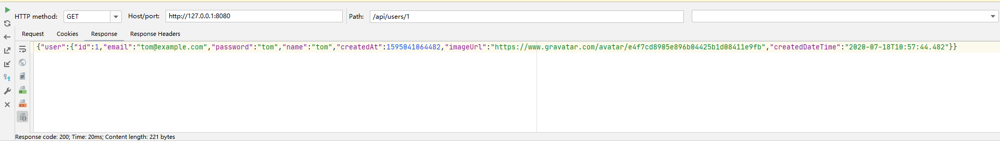

# 开发Web应用

直接使用Servlet进行Web开发好比直接在JDBC上操作数据库，比较繁琐，更好的方法是在Servlet基础上封装MVC框架，基于MVC开发Web应用，大部分时候，不需要接触Servlet API，开发省时省力。

## 使用Spring MVC

Java Web的基础：Servlet容器，以及标准的Servlet组件：

- Servlet：能处理HTTP请求并将HTTP响应返回；
- JSP：一种嵌套Java代码的HTML，将被编译为Servlet；
- Filter：能过滤指定的URL以实现拦截功能；
- Listener：监听指定的事件，如ServletContext、HttpSession的创建和销毁。

此外，Servlet容器为每个Web应用程序自动创建一个唯一的ServletContext实例，这个实例就代表了Web应用程序本身。

但是，Spring提供的是一个IoC容器，所有的Bean，包括Controller，都在Spring IoC容器中被初始化，而Servlet容器由JavaEE服务器提供（如Tomcat），Servlet容器对Spring一无所知，他们之间到底依靠什么进行联系，又是以何种顺序初始化的？

现在是Web应用程序，而Web应用程序总是由Servlet容器创建，那么，Spring容器应该由谁创建？在什么时候创建？Spring容器中的Controller又是如何通过Servlet调用的？

早期的Servlet需要在web.xml中配置映射路径，但最新Servlet版本只需要通过注解就可以完成映射。

我们在web.xml中配置Spring MVC提供的DispatcherServlet：

```XML
<!DOCTYPE web-app PUBLIC
        "-//Sun Microsystems, Inc.//DTD Web Application 2.3//EN"
        "http://java.sun.com/dtd/web-app_2_3.dtd" >

<web-app>
    <display-name>Archetype Created Web Application</display-name>

    <servlet>
        <servlet-name>dispatcher</servlet-name>
        <servlet-class>org.springframework.web.servlet.DispatcherServlet</servlet-class>
        <init-param>
            <param-name>contextClass</param-name>
            <param-value>org.springframework.web.context.support.AnnotationConfigWebApplicationContext</param-value>
        </init-param>
        <init-param>
            <param-name>contextConfigLocation</param-name>
            <param-value>com.cat.AppConfig</param-value>
        </init-param>
        <load-on-startup>0</load-on-startup>
    </servlet>

    <servlet-mapping>
        <servlet-name>dispatcher</servlet-name>
        <url-pattern>/*</url-pattern>
    </servlet-mapping>
</web-app>
```

初始化参数contextClass指定使用注解配置的AnnotationConfigWebApplicationContext，配置文件的位置参数contextConfigLocation指向AppConfig的完整类名，最后，把这个Servlet映射到/*，即处理所有URL。

**上述配置可以看作一个样板配置，有了这个配置，Servlet容器会首先初始化Spring MVC的DispatcherServlet，在DispatcherServlet启动时，它根据配置AppConfig创建了一个类型是WebApplicationContext的IoC容器，完成所有Bean的初始化，并将容器绑到ServletContext上**。

**因为DispatcherServlet持有IoC容器，能从IoC容器中获取所有@Controller的Bean，因此，DispatcherServlet接收到所有HTTP请求后，根据Controller方法配置的路径，就可以正确地把请求转发到指定方法，并根据返回的ModelAndView决定如何渲染页面**。

使用Spring MVC时，整个Web应用程序按如下顺序启动：

  1. 启动Tomcat服务器；
  2. Tomcat读取web.xml并初始化DispatcherServlet；
  3. DispatcherServlet创建IoC容器并自动注册到ServletContext中。

**启动后，浏览器发出的HTTP请求全部由DispatcherServlet接收，并根据配置转发到指定Controller的指定方法处理**。

编写Controller只需要遵循以下要点：

- Controller必须标记为@Controller；
- 一个方法对应一个HTTP请求路径，用@GetMapping或@PostMapping表示GET或POST请求；
- 需要接收的HTTP参数以@RequestParam()标注，可以设置默认值。如果方法参数需要传入HttpServletRequest、HttpServletResponse或者HttpSession，直接添加这个类型的参数即可，Spring MVC会自动按类型传入；
- 返回的ModelAndView通常包含View的路径和一个Map作为Model，但也可以没有Model；
- 返回重定向时既可以写new ModelAndView("redirect:/signin")，也可以直接返回"redirect:/signin"；
- **如果在方法内部直接操作HttpServletResponse发送响应，返回null表示无需进一步处理**；

    ```Java
    public ModelAndView download(HttpServletResponse response) {
        byte[] data = ...
        response.setContentType("application/octet-stream");
        OutputStream output = response.getOutputStream();
        output.write(data);
        output.flush();
        return null;
    }
    ```

- 对URL进行分组，每组对应一个Controller是一种很好的组织形式，并可以在Controller的class定义出添加URL前缀；

    ```Java
    @Controller
    @RequestMapping("/user")
    public class UserController {
        // 注意实际URL映射是/user/profile
        @GetMapping("/profile")
        public ModelAndView profile() {
            ...
        }

        // 注意实际URL映射是/user/changePassword
        @GetMapping("/changePassword")
        public ModelAndView changePassword() {
            ...
        }
    }
    ```

- **实际方法的URL映射总是前缀+路径，这种形式还可以有效避免不小心导致的重复的URL映射**。

## 使用REST


在Web应用中，除了需要使用MVC给用户显示页面外，还有一类API接口，我们称之为REST，通常输入输出都是JSON，便于第三方调用或者使用页面JavaScript与之交互。

直接在Controller中处理JSON是可以的，因为Spring MVC的@GetMapping和@PostMapping都支持指定输入和输出的格式。如果我们想接收JSON，输出JSON，那么可以这样写：

```Java
@Controller
public class RestController {
    final Logger logger = LoggerFactory.getLogger(getClass());

    @PostMapping(value = "/rest",
            consumes = "application/json;charset=UTF-8",
            produces = "application/json;charset=UTF-8")
    @ResponseBody
    public String rest(@RequestBody User user) {
        logger.info("JSON to User: {}", user.getEmail());
        return "{\"restSupport\": true}";
    }
}
```

对应的Maven工程需要加入Jackson这个依赖。

**注意到@PostMapping使用consumes声明能接收的类型，使用produces声明输出的类型，并且额外加了@ResponseBody表示返回的String无需额外处理，直接作为输出内容写入HttpServletResponse。输入的JSON则根据注解@RequestBody直接被Spring反序列化为User这个JavaBean**。


直接用Spring的Controller配合一大堆注解写REST太麻烦了，因此，Spring还额外提供了一个@RestController注解，使用@RestController替代@Controller后，每个方法自动变成API接口方法。我们还是以实际代码举例，编写ApiController如下：

```Java
@RestController
@RequestMapping("/api")
public class ApiController {
    @Autowired
    UserService userService;
    // GET /users 查询全部用户
    @GetMapping("/users")
    public List<User> users() {
        return this.userService.getUsers();
    }
    // GET /users/id 获取单个用户
    @GetMapping("/users/{id}")
    public User user(@PathVariable("id") long id) {
        return this.userService.getUserById(id);
    }
    // POST /signin
    // 注意此处反序列化为SignInRequest这个JavaBean
    @PostMapping("/signin")
    public Map<String, Object> signin(@RequestBody SignInRequest signinRequest) {
        try {
            User user = this.userService.signin(signinRequest.email, signinRequest.password);
            return Map.of("user", user);
        } catch (Exception e) {
            return Map.of("error", "SIGNIN_FAILED", "message", e.getMessage());
        }
    }

    public static class SignInRequest {
        public String email;
        public String password;
    }
}
```

使用@RestController可以方便地编写REST服务，Spring默认使用JSON作为输入和输出。

编写REST接口只需要定义@RestController，然后，每个方法都是一个API接口，输入和输出只要能被Jackson序列化或反序列化为JSON就没有问题。我们用浏览器测试GET请求，可直接显示JSON响应：



测试POST请求：


注意观察上述JSON的输出，User能被正确地序列化为JSON，但暴露了password属性，这是我们不期望的。要避免输出password属性，可以把User复制到另一个UserBean对象，该对象只持有必要的属性，但这样做比较繁琐。另一种简单的方法是直接在User的password属性定义处加上@JsonIgnore表示完全忽略该属性：

```Java
public class User {
    ...

    @JsonIgnore
    public String getPassword() {
        return password;
    }

    ...
}
```

但是这样一来，如果写一个register(User user)方法，那么该方法的User对象也拿不到注册时用户传入的密码了。如果要允许输入password，但不允许输出password，即在JSON序列化和反序列化时，允许写属性，禁用读属性，可以更精细地控制如下：

```Java
public class User {
    ...

    @JsonProperty(access = Access.WRITE_ONLY)
    public String getPassword() {
        return password;
    }

    ...
}
```

## 集成Filter

简单地使用一个EncodingFilter，在全局范围类给HttpServletRequest和HttpServletResponse强制设置为UTF-8编码。

可以自己编写一个EncodingFilter，也可以直接使用Spring MVC自带的一个CharacterEncodingFilter。配置Filter时，只需在web.xml中声明即可：

```XML
<web-app>
    <display-name>Archetype Created Web Application</display-name>
    <!-- 这是由Servlet容器实例化的一个WebFilter，只不过实例化的对象是由Spring框架提供的。 -->
    <filter>
        <filter-name>encodingFilter</filter-name>
        <filter-class>org.springframework.web.filter.CharacterEncodingFilter</filter-class>
        <init-param>
            <param-name>encoding</param-name>
            <param-value>UTF-8</param-value>
        </init-param>
        <init-param>
            <param-name>forceEncoding</param-name>
            <param-value>true</param-value>
        </init-param>
    </filter>

    <filter-mapping>
        <filter-name>encodingFilter</filter-name>
        <url-pattern>/*</url-pattern>
    </filter-mapping>

    ...
</web-app>
```

因为这种Filter和我们业务关系不大，**注意到CharacterEncodingFilter其实和Spring的IoC容器没有任何关系，两者均互不知晓对方的存在（为何无关，请参考第一节）**，因此，配置这种Filter十分简单。

再考虑这样一个问题：如果允许用户使用Basic模式进行用户验证，即在HTTP请求中添加头Authorization: Basic email:password，这个需求如何实现。编写一个AuthFilter是最简单的实现方式：

```Java
@Component
public class AuthFilter implements Filter {
    @Autowired
    UserService userService;

    public void doFilter(ServletRequest request, ServletResponse response, FilterChain chain)
            throws IOException, ServletException {
        HttpServletRequest req = (HttpServletRequest) request;
        // 获取Authorization头:
        String authHeader = req.getHeader("Authorization");
        if (authHeader != null && authHeader.startsWith("Basic ")) {
            // 从Header中提取email和password:
            String email = prefixFrom(authHeader);
            String password = suffixFrom(authHeader);
            // 登录:
            User user = userService.signin(email, password);
            // 放入Session:
            req.getSession().setAttribute(UserController.KEY_USER, user);
        }
        // 继续处理请求:
        chain.doFilter(request, response);
    }
}
```

在Spring中创建的这个AuthFilter是一个普通Bean，**Servlet容器并不知道它能作为Filter组件**，所以它不会起作用。在Web开发中，我们使用WebFilter注解一个Filter，然后由Web服务器来加载它，但在这里注解Component会使其WebFilter注解失效。

**如果我们直接在web.xml中声明这个AuthFilter，注意到AuthFilter的实例将由Servlet容器而不是Spring容器初始化，因此，@Autowire根本不生效，用于登录的UserService成员变量永远是null**。

所以，得通过一种方式，**让Servlet容器实例化的Filter，间接引用Spring容器实例化的AuthFilter**。Spring MVC提供了一个DelegatingFilterProxy，专门来干这个事情：

```XML
<web-app>
    <filter>
        <filter-name>authFilter</filter-name>
        <filter-class>org.springframework.web.filter.DelegatingFilterProxy</filter-class>
    </filter>

    <filter-mapping>
        <filter-name>authFilter</filter-name>
        <url-pattern>/*</url-pattern>
    </filter-mapping>
    ...
</web-app>
```

我们来看实现原理：

  1. Servlet容器从web.xml中读取配置，实例化DelegatingFilterProxy，注意命名是authFilter；
  2. Spring容器通过扫描@Component实例化AuthFilter。

**当DelegatingFilterProxy生效后，它会自动查找注册在ServletContext上的Spring容器，再试图从容器中查找名为authFilter的Bean，也就是我们用@Component声明的AuthFilter**。

**DelegatingFilterProxy将请求代理给AuthFilter**，核心代码如下：

```Java
public class DelegatingFilterProxy implements Filter {
    private Filter delegate;
    public void doFilter(...) throws ... {
        if (delegate == null) {
            delegate = findBeanFromSpringContainer();
        }
        delegate.doFilter(req, resp, chain);
    }
}
```

这就是一个代理模式的简单应用。我们画个图表示它们之间的引用关系如下：


如果在web.xml中配置的Filter名字和Spring容器的Bean的名字不一致，那么需要指定Bean的名字。实际应用时，尽量保持名字一致，以减少不必要的配置。

验证AuthFilter是否生效，携带请求头Authorization: Basic email:password，请求/profile路径。

如果AuthFilter生效，则拦截所有请求，并对携带指定请求头的请求尝试执行登录逻辑，不管登录逻辑是否成功，都会让请求继续向后转发。


如果登录逻辑验证成功，则访问/profile路径将直接返回profile页面，因为验证逻辑会将user对象放入到session中；如果登录逻辑验证失败，则重定向至/signin路径。另外可以看到控制台中有关Basic模式的验证逻辑打印了两次，因为重定向实际上是让浏览器发送一个新的请求到服务端，**并且这个新的请求会携带之前请求的请求头**，因此/signin路径同样被拦截器所拦截，但是由于验证逻辑再次失败，只返回了signin页面。

## 使用Interceptor

Filter组件是由Servlet容器进行管理的，它在Spring MVC的Web应用程序中作用范围如下：


上图虚线框就是Filter2的拦截范围，Filter组件实际上并不知道后续内部处理是通过Spring MVC提供的DispatcherServlet还是其他Servlet组件，因为Filter是Servlet规范定义的标准组件，它可以应用在任何基于Servlet的程序中。

如果只基于Spring MVC开发应用程序，还可以使用Spring MVC提供的一种功能类似Filter的拦截器：Interceptor。和Filter相比，Interceptor拦截范围不是后续整个处理流程，而是仅针对Controller拦截：


所以，Interceptor的拦截范围其实就是Controller方法，它实际上就相当于基于AOP的方法拦截。因为Interceptor只拦截Controller方法，所以要注意，返回ModelAndView后，后续对View的**渲染**就脱离了Interceptor的拦截范围。

使用Interceptor的好处是Interceptor本身是Spring管理的Bean，因此注入任意Bean都非常简单（可以理解为在上一节我们为了使用UserService的业务，必须将其定义为一个Spring容器组件，然后在web.xml间接引用为一个Servlet组件Filter）。此外，可以应用多个Interceptor，并通过简单的@Order指定顺序（这个是个好处，可以指定顺序）。我们先写一个LoggerInterceptor：

```Java
@Order(1)
@Component
public class LoggerInterceptor implements HandlerInterceptor {
    final Logger logger = LoggerFactory.getLogger(getClass());
    // Controller方法调用前执行，顺序在前的先执行
    @Override
    public boolean preHandle(HttpServletRequest request, HttpServletResponse response, Object handler) throws Exception {
        // 打印请求路径
        this.logger.info("preHandle {}...", request.getRequestURI());
        if (request.getParameter("debug") != null) {
            // 在请求中获取到debug参数，直接处理响应，返回false表示无需调用Controller方法继续处理了，通常在认证或者安全检查失败时直接返回错误响应
            PrintWriter pw = response.getWriter();
            pw.write("<p>DEBUG MODE</p>");
            pw.flush();
            return false;
        }
        // 返回true表示将请求继续交由后续处理，可能是Controller方法也可能是另外的Interceptor
        return true;
    }
    // Controller方法正常返回后执行
    @Override
    public void postHandle(HttpServletRequest request, HttpServletResponse response, Object handler, ModelAndView modelAndView) throws Exception {
        this.logger.info("postHandle {}.", request.getRequestURI());
        // 能够捕获ModelAndView对象，继续向其添加一些通用数据，很多页面需要的全局数据如Copyright信息等都可以放到这里，无需在每个Controller方法中重复添加
        if (modelAndView != null) {
            modelAndView.addObject("__time__", LocalDateTime.now());
        }
    }
    // 无论Controller方法是否抛异常都会执行，参数ex就是Controller方法抛出的异常（未抛出异常是null）
    @Override
    public void afterCompletion(HttpServletRequest request, HttpServletResponse response, Object handler, Exception ex) throws Exception {
        this.logger.info("afterCompletion {}: exception = {}", request.getRequestURI(), ex);
    }
}
```

一个Interceptor必须实现HandlerInterceptor接口，要让拦截器生效，我们在WebMvcConfigurer中注册所有的Interceptor（写一次注册所有，后面再写Interceptor就不需要像上一节写Filter组件时，要让其生效则必须在web.xml里间接引用）：

```Java
@Bean
WebMvcConfigurer createWebMvcConfigurer(@Autowired HandlerInterceptor[] interceptors) {
    return new WebMvcConfigurer() {
        public void addInterceptors(InterceptorRegistry registry) {
            for (var interceptor : interceptors) {
                registry.addInterceptor(interceptor);
            }
        }
        ...
    };
}
```

在Controller中，Spring MVC还允许定义基于@ExceptionHandler注解的异常处理方法。我们来看具体的示例代码：

```Java
@Controller
public class UserController {
    @GetMapping("/resetPassword")
    public ModelAndView resetPassword() {
        throw new UnsupportedOperationException("Not supported yet!");
    }

    @ExceptionHandler(RuntimeException.class)
    public ModelAndView handleUnknowException(Exception ex) {
        return new ModelAndView("500.html", Map.of("error", ex.getClass().getSimpleName(), "message", ex.getMessage()));
    }
    ...
}
```

异常处理方法没有固定的方法签名，可以传入Exception、HttpServletRequest等，返回值可以是void，也可以是ModelAndView，上述代码通过@ExceptionHandler(RuntimeException.class)表示当发生RuntimeException的时候，就自动调用此方法处理。注意到我们返回了一个新的ModelAndView，这样在应用程序内部**如果发生了预料之外的异常**，可以给用户显示一个出错页面，而不是简单的500 Internal Server Error或404 Not Found。

使用ExceptionHandler时，要注意它仅作用于**当前**的Controller，即ControllerA中定义的一个ExceptionHandler方法对ControllerB不起作用。

如果我们有很多Controller，每个Controller都需要处理一些通用的异常，例如LoginException，思考一下应该怎么避免重复代码。


## 处理CORS

CORS可以控制指定域的页面JavaScript能否访问API。

## 国际化

## 异步处理
