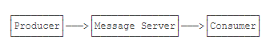
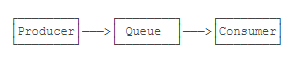
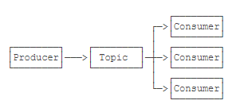
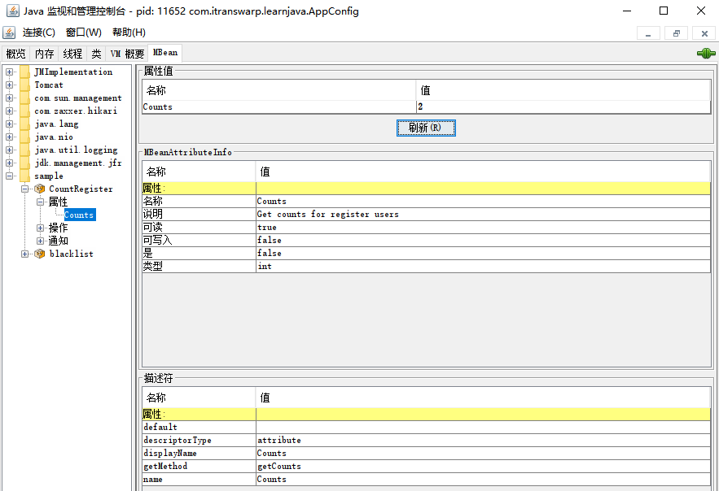

# 集成第三方组件

## 集成JavaMail

因为在服务器端，主要以发送邮件为主，例如在注册成功、登录时、购物付款后通知用户，基本上不会遇到接收用户邮件的情况，所以本节我们只讨论如何在Spring中发送邮件。

**在Spring中，发送邮件最终也是需要JavaMail，Spring只对JavaMail做了一点简单的封装，目的是简化代码**。

我们希望用户在注册成功后能收到注册邮件，为此，我们先定义一个JavaMailSender的Bean；

```Java
@Bean
JavaMailSender createJavaMailSender(
        // smtp.properties:
        @Value("${smtp.host}") String host,
        @Value("${smtp.port}") int port,
        @Value("${smtp.auth}") String auth,
        @Value("${smtp.username}") String username,
        @Value("${smtp.password}") String password,
        @Value("${smtp.debug:true}") String debug)
{
    var mailSender = new JavaMailSenderImpl();
    mailSender.setHost(host);
    mailSender.setPort(port);
    mailSender.setUsername(username);
    mailSender.setPassword(password);
    Properties props = mailSender.getJavaMailProperties();
    props.put("mail.transport.protocol", "smtp");
    props.put("mail.smtp.auth", auth);
    if (port == 587) {
        props.put("mail.smtp.starttls.enable", "true");
    }
    if (port == 465) {
        props.put("mail.smtp.socketFactory.port", "465");
        props.put("mail.smtp.socketFactory.class", "javax.net.ssl.SSLSocketFactory");
    }
    props.put("mail.debug", debug);
    return mailSender;
}
```

下一步是封装一个MailService，并定义sendRegistrationMail()方法；

```Java
@Component
public class MailService {
    @Value("${smtp.from}")
    String from;
    @Autowired
    JavaMailSender mailSender;

    public void sendRegistrationMail(User user) {
        try {
            // MimeMessage是JavaMail的邮件对象：
            MimeMessage mimeMessage = mailSender.createMimeMessage();
            // MimeMessageHelper是Spring提供的用于“简化设置”MimeMessage的类:
            MimeMessageHelper helper = new MimeMessageHelper(mimeMessage, "utf-8");
            helper.setFrom(from);
            helper.setTo(user.getEmail());
            helper.setSubject("Welcome to Java course!");
            String html = String.format("<p>Hi, %s,</p><p>Welcome to Java course!</p><p>Sent at %s</p>", user.getName(), LocalDateTime.now());
            // 设置HTML邮件就可以直接调用setText(String text, boolean html)方法，而不必再调用比较繁琐的JavaMail接口方法：
            helper.setText(html, true);
            // 调用JavaMailSender.send()方法把邮件发送出去：
            mailSender.send(mimeMessage);
        } catch (MessagingException e) {
            throw new RuntimeException(e);
        }
    }
}
```

在MVC的某个Controller方法中，当用户注册成功后，我们就启动一个新线程来异步发送邮件：

```Java
@PostMapping("/register")
public ModelAndView doRegister(@RequestParam("email") String email, @RequestParam("password") String password, @RequestParam("name") String name) {
    try {
        User user = userService.register(email, password, name);
        logger.info("user registered: {}", user.getEmail());
        // send registration mail:
        new Thread(() -> {
            mailService.sendRegistrationMail(user);
        }).start();
    } catch (RuntimeException e) {
        return new ModelAndView("register.html", Map.of("email", email, "error", "Register failed"));
    }
    return new ModelAndView("redirect:/signin");
}
```

**因为发送邮件是一种耗时的任务，从几秒到几分钟不等，因此，异步发送是保证页面能快速显示的必要措施。这里我们直接启动了一个新的线程**。但实际上还有更优化的方法，可以使用下一节中的消息服务。

Spring可以集成JavaMail，通过简单的封装，能简化邮件发送代码。**其核心是定义一个JavaMailSender的Bean，然后调用其send()方法**。

## 集成JMS

> JmsTemplate/@JmsListener

- JMS是Java消息服务，可以通过JMS服务器实现消息的异步处理。
- 消息服务主要解决Producer和Consumer生产和处理速度不匹配的问题。

JMS即Java Message Service，是JavaEE的消息服务接口。

所谓消息服务，就是两个进程之间，通过消息服务器传递消息：



使用消息服务，而不是直接调用对方的API，它的好处是：

- 双方各自无需知晓对方的存在，消息可以异步处理，因为消息服务器会在Consumer离线的时候自动缓存消息；
- 如果Producer发送的消息频率高于Consumer的处理能力，消息可以积压在消息服务器，不至于压垮Consumer；
- 通过一个消息服务器，可以连接多个Producer和多个Consumer。

因为消息服务在各类应用程序中非常有用，所以JavaEE专门定义了JMS规范。**注意到JMS是一组接口定义，如果我们要使用JMS，还需要选择一个具体的JMS产品**。

在编写JMS代码之前，我们首先得理解JMS的消息模型。JMS把生产消息的一方称为`Producer`，处理消息的一方称为`Consumer`。有两种类型的消息通道，一种是`Queue`：



一种是`Topic`：



- Queue是一种**一对一**的通道，如果Consumer离线无法处理消息时，Queue会把消息存起来，等Consumer再次连接的时候发给它。设定了持久化机制的Queue不会丢失消息。如果有多个Consumer接入同一个Queue，那么它们等效于**以集群方式处理消息**，例如，发送方发送的消息是A，B，C，D，E，F，两个Consumer可能分别收到A，C，E和B，D，F，即**每个消息只会交给其中一个Consumer**处理。

- Topic则是一种**一对多**通道。一个Producer发出的消息，会被多个Consumer同时收到，即**每个Consumer都会收到一份完整的消息流**。如果消息服务器不存储Topic消息，那么离线的Consumer会丢失部分离线时期的消息，如果消息服务器存储了Topic消息，那么离线的Consumer可以收到自上次离线时刻开始后产生的所有消息。JMS规范通过**Consumer指定一个持久化订阅**可以在上线后收取所有离线期间的消息，如果指定的是非持久化订阅，那么离线期间的消息会全部丢失。

因此，如果一个Topic的消息全部都持久化了，并且只有一个Consumer，那么它和Queue其实是一样的。实际上，很多消息服务器内部都只有Topic类型的消息架构，Queue可以通过Topic“模拟”出来。

无论是Queue还是Topic，对Producer没有什么要求。**多个Producer也可以写入同一个Queue或者Topic，此时消息服务器内部会自动排序确保消息总是有序的**。

以上是消息服务的基本模型。具体到某个消息服务器时，Producer和Consumer通常是通过TCP连接消息服务器（注意TCP连接所使用的端口，不要将其和后台管理端口弄混），在编写JMS程序时，又会遇到ConnectionFactory、Connection、Session等概念，其实这和JDBC连接是类似的：

- ConnectionFactory：代表一个到消息服务器的连接池，类似JDBC的DataSource；
- Connection：代表一个到消息服务器的连接，类似JDBC的Connection；
- Session：代表一个经过认证后的连接会话；
- Message：代表一个消息对象。

在JMS 1.1中，发送消息的典型代码如下：

```java
try {
    Connection connection = null;
    try {
        // 创建连接:
        connection = connectionFactory.createConnection();
        // 创建会话:
        Session session = connection.createSession(false, Session.AUTO_ACKNOWLEDGE);
        // 创建一个Producer并关联到某个Queue:
        MessageProducer messageProducer = session.createProducer(queue);
        // 创建一个文本消息:
        TextMessage textMessage = session.createTextMessage(text);
        // 发送消息:
        messageProducer.send(textMessage);
    } finally {
        // 关闭连接:
        if (connection != null) {
            connection.close();
        }
    }
} catch (JMSException ex) {
    // 处理JMS异常
}
```

JMS 2.0改进了一些API接口，发送消息变得更简单：

```java
try (JMSContext context = connectionFactory.createContext()) {
    context.createProducer().send(queue, text);
}
```

- 在AppConfig中，通过@EnableJms让Spring自动扫描JMS相关的Bean，并加载JMS配置文件jms.properties：

```java
@Configuration
@ComponentScan
@EnableWebMvc
@EnableJms // 启用JMS
@EnableTransactionManagement
@PropertySource({ "classpath:/jdbc.properties", "classpath:/jms.properties" })
public class AppConfig {
    ...
}
```

- 首先要创建的Bean是ConnectionFactory，即连接消息服务器的连接池：

```Java
    @Bean
    ConnectionFactory createJMSConnectionFactory(@Value("${jms.uri:tcp://localhost:61616}") String uri,
                                                 @Value("${jms.username:admin}") String username,
                                                 @Value("${jms.password:password}") String password) {
        return new ActiveMQJMSConnectionFactory(uri, username, password);
    }
```

- 再创建一个JmsTemplate，它是Spring提供的一个工具类，和JdbcTemplate类似，可以简化发送消息的代码：

```Java
    @Bean
    JmsTemplate createJmsTemplate(@Autowired ConnectionFactory connectionFactory) {
        return new JmsTemplate(connectionFactory);
    }
```

- 下一步要创建的是JmsListenerContainerFactory：

```Java
    @Bean("jmsListenerContainerFactory")
    // 必须指定Bean的名称为jmsListenerContainerFactory，不要使用默认的名称，这个Bean主要用于处理和Consumer相关的Bean:
    DefaultJmsListenerContainerFactory createJmsListenerContainerFactory(@Autowired ConnectionFactory connectionFactory) {
        var factory = new DefaultJmsListenerContainerFactory();
        factory.setConnectionFactory(connectionFactory);
        return factory;
    }
```

- 编写MessagingService来发送消息：

```Java
public class MailMessage {
    public static enum Type {
        REGISTRATION, SIGNIN;
    }

    public Type type;
    public String email;
    public String name;
    public long timestamp;

    public static MailMessage registration(String email, String name) {
        var msg = new MailMessage();
        msg.email = email;
        msg.name = name;
        msg.type = Type.REGISTRATION;
        msg.timestamp = System.currentTimeMillis();
        return msg;
    }
}

@Component
public class MessagingService {
    @Autowired
    ObjectMapper objectMapper;
    @Autowired
    JmsTemplate jmsTemplate;

    public void sendMailMessage(MailMessage msg) throws Exception {
        // 最常用的是发送基于JSON的文本消息，通过JmsTemplate创建一个TextMessage并发送到名称为jms/queue/mail的Queue，
        // MailMessage是我们自己定义的一个JavaBean，真正的JMS消息是创建的TextMessage，它的内容是JSON格式的字符串，
        // 首先使用Jackson序列化传入的自定义对象为字符串，然后用该字符串构造一个TextMessage对象:
        String text = objectMapper.writeValueAsString(msg);
        jmsTemplate.send("jms/queue/mail", new MessageCreator() {
            @Override
            public Message createMessage(Session session) throws JMSException {
                return session.createTextMessage(text);
            }
        });
    }
}
```

注意：Artemis消息服务器默认配置下会自动创建Queue，因此不必手动创建一个名为`jms/queue/mail`的Queue，但不是所有的消息服务器都会自动创建Queue，**生产环境的消息服务器通常会关闭自动创建功能，需要手动创建Queue**。

- 当用户注册成功后，我们就调用MessagingService.sendMailMessage()发送一条JMS消息：

```Java
    @PostMapping("/register")
    public ModelAndView doRegister(@RequestParam("email") String email, @RequestParam("password") String password,
                                   @RequestParam("name") String name) throws Exception {
        try {
            User user = userService.register(email, password, name);
            logger.info("user registered: {}", user.getEmail());
            // 调用MessagingService.sendMailMessage()发送一条JMS消息，
            // 注意这里不像上一节当中直接开启了一个新线程来处理邮件发送这个业务逻辑，
            // 真正的业务逻辑执行是当consumer从对应的queue中获取到该JMS消息时才开始:
            messagingService.sendMailMessage(MailMessage.registration(user.getEmail(), user.getName()));
        } catch (RuntimeException e) {
            logger.warn(e.getMessage(), e);
            return new ModelAndView("register.html", Map.of("email", email, "error", "Register failed"));
        }
        return new ModelAndView("redirect:/signin");
    }
```

从理论上讲，可以创建另一个Java进程来处理消息，但对于我们这个简单的Web程序来说没有必要，直接在同一个Web应用中接收并处理消息即可。

- 处理消息（执行实际的业务逻辑）的核心代码是编写一个Bean，并在处理方法上标注@JmsListener：

```Java
@Component
public class MailService {
    final Logger logger = LoggerFactory.getLogger(getClass());

    public void sendRegistrationMail(MailMessage mm) {
        logger.info("[send mail] sending registration mail to {}...", mm.email);
        // TODO: simulate a long-time task:
        try {
            Thread.sleep(3000);
        } catch (InterruptedException e) {
        }
        logger.info("[send mail] registration mail was sent to {}.", mm.email);
    }
}

@Component
public class MailMessageListener {
    private final Logger logger = LoggerFactory.getLogger(getClass());
    @Autowired
    ObjectMapper objectMapper;
    @Autowired
    MailService mailService;
    // 注意到@JmsListener指定了Queue的名称，因此，凡是发到此Queue的消息都会被这个onMailMessageReceived()方法处理，
    // 10表示可以最多同时并发处理10个消息，5-10表示并发处理的线程可以在5到10之间调整，
    // 可能被多线程并发执行，一定要保证线程安全:
    @JmsListener(destination = "jms/queue/mail", concurrency = "10")
    public void onMailMessageReceived(Message message) throws Exception {
        logger.info("received message: " + message);
        if (message instanceof TextMessage) {
            // 方法参数是JMS的Message接口，我们通过强制转型为TextMessage并提取JSON，反序列化后获得自定义的JavaBean，也就获得了发送邮件所需的所有信息：
            String text = ((TextMessage) message).getText();
            MailMessage mm = objectMapper.readValue(text, MailMessage.class);
            // 向用户邮箱中发送注册邮件：
            mailService.sendRegistrationMail(mm);
        } else {
            logger.error("unable to process non-text message!");
        }
    }
}
```

**Spring处理JMS消息的流程是什么**。如果我们直接调用JMS的API来处理消息，那么编写的代码大致如下：

```Java
// 创建JMS连接:
Connection connection = connectionFactory.createConnection();
// 创建会话:
Session session = connection.createSession(false, Session.AUTO_ACKNOWLEDGE);
// 创建一个Consumer关联到指定queue:
MessageConsumer consumer = session.createConsumer(queue);
// 为Consumer指定一个消息处理器，指定的好处在于消息处理器可以被复用，而不是每个consumer各自定义消息处理流程:
consumer.setMessageListener(new MessageListener() {
    public void onMessage(Message message) {
        // 在此处理消息...
    }
});
// 启动接收消息的循环:
connection.start();
```

我们自己编写的MailMessageListener.onMailMessageReceived()相当于**消息处理器**：

```Java
consumer.setMessageListener(new MessageListener() {
    public void onMessage(Message message) {
        mailMessageListener.onMailMessageReceived(message);
    }
});
```

**MessageConsumer(MessageListener(MessageProcessor))**。

所以，Spring根据AppConfig的注解@EnableJms自动扫描带有@JmsListener的Bean方法，**并为其创建一个MessageListener把它包装起来**。

注意到前面我们还创建了一个JmsListenerContainerFactory的Bean，它的作用就是**为每个MessageListener创建MessageConsumer并启动消息接收循环**。

再注意到@JmsListener还有一个concurrency参数，10表示可以最多同时并发处理10个消息，5-10表示并发处理的线程可以在5-10之间调整。

**因此，Spring在通过MessageListener接收到消息后，并不是直接调用mailMessageListener.onMailMessageReceived()，而是用线程池调用，因此，要时刻牢记，onMailMessageReceived()方法可能被多线程并发执行，一定要保证线程安全**。

总结一下Spring接收消息的步骤：

通过JmsListenerContainerFactory配合@EnableJms扫描所有@JmsListener方法，自动创建MessageConsumer、MessageListener以及线程池，启动消息循环接收处理消息，最终由我们自己编写的@JmsListener方法处理消息，可能会由多线程同时并发处理，**如果应用在发送邮件的场景那就是Consumer会同时向多个用户发送注册邮件**。

要验证消息发送和处理，我们注册一个新用户，可以看到如下日志输出：

```text
2020-09-25 21:26:03 INFO  c.i.learnjava.web.UserController - user registered: bob@example.com
2020-09-25 21:26:04 INFO  c.i.l.service.MailMessageListener - received message: ActiveMQMessage[ID:a9334a9a-ff32-11ea-b43e-6c0b840601b8]:PERSISTENT/ClientMessageImpl[messageID=62, durable=true, address=jms/queue/mail,userID=a9334a9a-ff32-11ea-b43e-6c0b840601b8,properties=TypedProperties[__AMQ_CID=a92f7a07-ff32-11ea-b43e-6c0b840601b8,_AMQ_ROUTING_TYPE=1]]
2020-09-25 21:26:04 INFO  c.i.learnjava.service.MailService - [send mail] sending registration mail to bob@example.com...
2020-09-25 21:26:07 INFO  c.i.learnjava.service.MailService - [send mail] registration mail was sent to bob@example.com.
```

可见，消息被成功发送到Artemis，然后在很短的时间内被接收处理了。

**使用消息服务对上一节中启动新线程发送Email进行改造的好处是，发送Email的能力通常是有限的，通过JMS消息服务，如果短时间内需要给大量用户发送Email，可以先把消息堆积在JMS服务器上慢慢发送，对于批量发送邮件、短信等尤其有用**。

## 集成Scheduler

- 直接在AppConfig中加上@EnableScheduling就开启了定时任务的支持。
- 在一个Bean中编写一个public void无参数方法，然后加上@Scheduled注解：

```Java
@Component
public class TaskService {
    final Logger logger = LoggerFactory.getLogger(getClass());
    // 除了可以使用fixedRate外，还可以使用fixedDelay：
    @Scheduled(initialDelay = 60_000, fixedRate = 60_000)
    public void checkSystemStatusEveryMinute() {
        logger.info("Start check system status...");
    }
}
```

- 把定时任务的配置放到配置文件中，例如task.properties，这样就可以随时修改配置文件而无需动代码。但是在代码中，我们需要用fixedDelayString取代fixedDelay：

```Java
@Component
public class TaskService {
    ...

    @Scheduled(initialDelay = 30_000, fixedDelayString = "${task.checkDiskSpace:30000}")
    public void checkDiskSpaceEveryMinute() {
        logger.info("Start check disk space...");
    }
}
```

此外，fixedDelayString还可以使用更易读的Duration，例如：

```Java
@Scheduled(initialDelay = 30_000, fixedDelayString = "${task.checkDiskSpace:PT2M30S}")
```

多个@Scheduled方法完全可以放到一个Bean中，这样便于统一管理各类定时任务。

还有一类定时任务，它不是简单的重复执行，而是按时间触发，我们把这类任务称为Cron任务，例如：每天凌晨2:15执行报表任务；每个工作日12:00执行特定任务。

Cron源自Unix/Linux系统自带的crond守护进程，以一个简洁的表达式定义任务触发时间。在Spring中，也可以使用Cron表达式来执行Cron任务，在Spring中，它的格式是：

```text
秒 分 小时 天 月份 星期 年
// 年是可以忽略的，通常不写。每天凌晨2:15执行的Cron表达式就是：
0 15 2 * * *
// 每个工作日12:00执行的Cron表达式就是：
0 0 12 * * MON-FRI
// 每个月1号，2号，3号和10号12:00执行的Cron表达式就是：
0 0 12 1-3,10 * *
// Cron表达式还可以表达每10分钟执行，这样，在每个小时的0:00，10:00，20:00，30:00，40:00，50:00均会执行任务，实际上它可以取代fixedRate类型的定时任务：
0 */10 * * * *
```

- 在Spring中，我们定义一个每天凌晨2:15执行的任务：

```Java
@Component
public class TaskService {
    ...

    @Scheduled(cron = "${task.report:0 15 2 * * *}")
    public void cronDailyReport() {
        logger.info("Start daily report task...");
    }
}
```

在Spring中使用定时任务和Cron任务都十分简单，但是要注意到，这些任务的调度都是在每个JVM**进程**中的。如果在本机启动两个进程，或者在多台机器上启动应用，这些进程的定时任务和Cron任务都是**独立**运行的，互不影响。

如果一些定时任务要以集群的方式运行，例如每天23:00执行检查任务，**只需要集群中的一台运行即可**，这个时候，可以考虑使用Quartz。Quartz可以配置一个JDBC数据源，以便存储所有的任务调度计划以及任务执行状态。也可以使用内存来调度任务，但这样配置就和使用Spring的调度没啥区别了，额外集成Quartz的意义就不大。

思考：如果不使用Quartz的JDBC配置，多个Spring应用同时运行时，如何保证某个任务只在某一台机器执行？答：分布式定时任务锁ShedLock。

## 集成JMX

JMX是Java Management Extensions，它是一个Java平台的管理和监控接口。为什么要搞JMX呢？因为在所有的应用程序中，对运行中的程序进行监控都是非常重要的，Java应用程序也不例外。我们肯定希望知道Java应用程序当前的状态，例如，占用了多少内存，分配了多少内存，当前有多少活动线程，有多少休眠线程等等。如何获取这些信息呢？

为了标准化管理和监控，Java平台使用JMX作为管理和监控的标准接口，任何程序，只要按JMX规范访问这个接口，就可以获取所有管理与监控信息。

实际上，常用的运维监控如Zabbix、Nagios等工具对JVM本身的监控都是通过JMX获取的信息。

JMX把所有被管理的资源都称为MBean（Managed Bean），这些MBean全部由MBeanServer管理，如果要访问MBean，可以通过MBeanServer对外提供的访问接口，例如通过RMI或HTTP访问。

注意到使用JMX不需要安装任何额外组件，也不需要第三方库，因为MBeanServer已经内置在JavaSE标准库中了。JavaSE还提供了一个jconsole程序，用于通过RMI连接到MBeanServer，这样就可以管理整个Java进程。

除了JVM会把自身的各种资源以MBean注册到JMX中，我们自己的配置、监控信息也可以作为MBean注册到JMX，这样，管理程序就可以直接控制我们暴露的MBean。因此，应用程序使用JMX，只需要两步：

  1. 编写MBean提供管理接口和监控数据；
  2. 注册MBean。

在Spring应用程序中，使用JMX只需要一步：

  1. 编写MBean提供管理接口和监控数据。

第二步注册的过程由Spring自动完成。我们以实际工程为例，首先在AppConfig中加上@EnableMBeanExport注解，告诉Spring自动注册MBean。

剩下的全部工作就是编写MBean。我们以实际问题为例，假设我们希望给应用程序添加一个IP黑名单功能，凡是在黑名单中的IP禁止访问，传统的做法是定义一个配置文件，启动的时候读取：

```text
# blacklist.txt
1.2.3.4
5.6.7.8
2.2.3.4
...
```

如果要修改黑名单怎么办？修改配置文件，然后重启应用程序。但是每次都重启应用程序实在是太麻烦了，能不能不重启应用程序？可以自己写一个定时读取配置文件的功能，检测到文件改动时自动重新读取。

**上述需求本质上是在应用程序运行期间对参数、配置等进行热更新并要求尽快生效。如果以JMX的方式实现，我们不必自己编写自动重新读取等任何代码，只需要提供一个符合JMX标准的MBean来存储配置即可**。

还是以IP黑名单为例，JMX的MBean通常以MBean结尾，因此我们遵循标准命名规范，首先编写一个BlacklistMBean：

```Java
public class BlacklistMBean {
    private Set<String> ips = new HashSet<>();

    public String[] getBlacklist() {
        return ips.toArray(String[]::new);
    }

    public void addBlacklist(String ip) {
        ips.add(ip);
    }

    public void removeBlacklist(String ip) {
        ips.remove(ip);
    }

    public boolean shouldBlock(String ip) {
        return ips.contains(ip);
    }
}
```

这个MBean没什么特殊的，它的逻辑和普通Java类没有任何区别。下一步，我们要使用JMX的客户端来实时热更新这个MBean，所以要给它加上一些注解，让Spring能根据注解自动把相关方法注册到MBeanServer中：

```Java
@Component
@ManagedResource(objectName = "sample:name=blacklist", description = "Blacklist of IP addresses")
public class BlacklistMBean {
    private Set<String> ips = new HashSet<>();

    @ManagedAttribute(description = "Get IP addresses in blacklist")
    public String[] getBlacklist() {
        return ips.toArray(String[]::new);
    }

    @ManagedOperation
    @ManagedOperationParameter(name = "ip", description = "Target IP address that will be added to blacklist")
    public void addBlacklist(String ip) {
        ips.add(ip);
    }

    @ManagedOperation
    @ManagedOperationParameter(name = "ip", description = "Target IP address that will be removed from blacklist")
    public void removeBlacklist(String ip) {
        ips.remove(ip);
    }

    public boolean shouldBlock(String ip) {
        return ips.contains(ip);
    }
}
```

观察上述代码，BlacklistMBean首先是一个标准的Spring管理的Bean，其次，添加了@ManagedResource表示这是一个MBean，将要被注册到JMX。objectName指定了这个MBean的名字，通常以company:name=Xxx来分类MBean。

对于属性，使用@ManagedAttribute注解标注。上述MBean只有get属性，没有set属性，说明这是一个只读属性。

对于操作，使用@ManagedOperation注解标准。上述MBean定义了两个操作：addBlacklist()和removeBlacklist()，其他方法如shouldBlock()不会被暴露给JMX。

使用MBean和普通Bean是完全一样的。例如，我们在BlacklistInterceptor对IP进行黑名单拦截：

```Java
@Order(1)
@Component
public class BlacklistInterceptor implements HandlerInterceptor {
    final Logger logger = LoggerFactory.getLogger(getClass());

    @Autowired
    BlacklistMBean blacklistMBean;

    @Override
    public boolean preHandle(HttpServletRequest request, HttpServletResponse response, Object handler)
            throws Exception {
        String ip = request.getRemoteAddr();
        logger.info("check ip address {}...", ip);
        // 是否在黑名单中:
        if (blacklistMBean.shouldBlock(ip)) {
            logger.warn("will block ip {} for it is in blacklist.", ip);
            // 发送403错误响应:
            response.sendError(403);
            return false;
        }
        return true;
    }
}
```

正常启动Web应用程序，不要关闭它，打开另一个命令行窗口，输入jconsole启动JavaSE自带的一个JMX客户端程序，在MBean页面中找到blacklist，调用addBlacklist添加IP，**相当于jconsole通过JMX接口，调用了我们自己的BlacklistMBean的addBlacklist()方法**。

编写一个MBean统计当前注册用户数量，并在jconsole中查看：

```Java
@Component
@ManagedResource(objectName = "sample:name=CountRegister", description = "Count the register users")
public class CountMBean {
    @Autowired
    UserService userService;

    @ManagedAttribute(description = "Get counts for register users")
    public int getCounts() {
        return this.userService.getUsers().size();
    }
}
```


