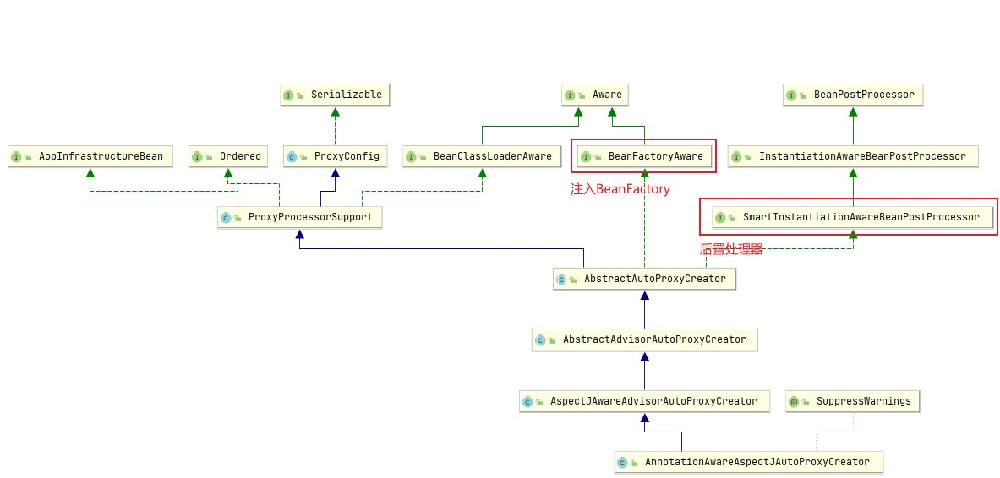

# AOP

原理解析三步骤：

1. 给容器中注册了什么组件；
2. 这个组件什么时候工作；
3. 这个组件的功能是什么。

## @EnableAspectJAutoProxy原理

```java
// 给容器当中导入了AspectJAutoProxyRegistrar组件:
@Import(AspectJAutoProxyRegistrar.class)
public @interface EnableAspectJAutoProxy {
    ...
}
// 利用AspectJAutoProxyRegistrar自定义给容器当中注册bean，此处的用法可以参考01组件注册中的笔记:
class AspectJAutoProxyRegistrar implements ImportBeanDefinitionRegistrar {
    @Override
    public void registerBeanDefinitions(AnnotationMetadata importingClassMetadata, BeanDefinitionRegistry registry) {
        // 向容器当中注册一个名称为internalAutoProxyCreator的AnnotationAwareAspectJAutoProxyCreator类型的bean:
        ...
    }
}
```

## AnnotationAwareAspectJAutoProxyCreator分析



查看继承树，发现2个要点：

1. 后置处理器(在bean初始化前后做事情)
2. xxxAware(注入Spring底层的BeanFactory组件)

```java
public abstract class AbstractAutoProxyCreator extends ProxyProcessorSupport implements SmartInstantiationAwareBeanPostProcessor, BeanFactoryAware {
    @Override
    public void setBeanFactory(BeanFactory beanFactory) {
        ...
    }
    @Override
    public Object postProcessBeforeInstantiation(Class<?> beanClass, String beanName) {
        ...
    }
    @Override
    public Object postProcessAfterInitialization(@Nullable Object bean, String beanName) {
        ...
    }
}

public abstract class AbstractAdvisorAutoProxyCreator extends AbstractAutoProxyCreator {
    @Override
    public void setBeanFactory(BeanFactory beanFactory) {
        ...
        initBeanFactory((ConfigurableListableBeanFactory) beanFactory);
    }
}

public class AspectJAwareAdvisorAutoProxyCreator extends AbstractAdvisorAutoProxyCreator {
    ...
}

public class AnnotationAwareAspectJAutoProxyCreator extends AspectJAwareAdvisorAutoProxyCreator {
    @Override
    protected void initBeanFactory(ConfigurableListableBeanFactory beanFactory) {
        ...
    }
}
```

流程：

[BeanFactory](https://www.cnblogs.com/xiaoxi/p/5846416.html)

> BeanFactory 是 Spring 的“心脏”。它就是 Spring IoC 容器的真面目。Spring 使用 BeanFactory 来实例化、配置和管理 Bean。  
如果说 BeanFactory 是 Spring 的心脏，那么 ApplicationContext 就是完整的躯体了，ApplicationContext 由 BeanFactory 派生而来，提供了更多面向实际应用的功能。

1. 传入配置类，创建IoC容器；
2. 注册配置类，调用refresh()刷新容器；
3. `registerBeanPostProcessors(beanFactory);`注册后置处理器方便拦截bean的创建；
    1. `String[] postProcessorNames = beanFactory.getBeanNamesForType(BeanPostProcessor.class, true, false);`先获取容器已经定义好的需要创建对象的BeanPostProcessor；
    2. `beanFactory.addBeanPostProcessor(new BeanPostProcessorChecker(beanFactory, beanProcessorTargetCount));`给容器中添加别的BeanPostProcessor；
    3. `registerBeanPostProcessors(beanFactory, priorityOrderedPostProcessors);`优先注册实现了PriorityOrdered接口的BeanPostProcessor；
    4. `registerBeanPostProcessors(beanFactory, orderedPostProcessors);`再注册实现了Ordered接口的BeanPostProcessor；
    5. `registerBeanPostProcessors(beanFactory, internalPostProcessors);`最后注册没实现优先级接口的BeanPostProcessor；
    6. 注册BeanPostProcessor，实际上就是创建BeanPostProcessor对象，然后保存在容器当中;
        - `instanceWrapper = createBeanInstance(beanName, mbd, args);`创建名称为`internalAutoProxyCreator`的BeanPostProcessor实例；
        - `populateBean(beanName, mbd, instanceWrapper);`为bean实例进行属性赋值；
        - `exposedObject = initializeBean(beanName, exposedObject, mbd);`初始化bean。
            - `invokeAwareMethods(beanName, bean);`处理Aware接口的方法回调；
            - `wrappedBean = applyBeanPostProcessorsBeforeInitialization(wrappedBean, beanName);`应用**所有**后置处理器的postProcessBeforeInitialization方法；
            - `invokeInitMethods(beanName, wrappedBean, mbd);`执行自定义的初始化方法；
            - `wrappedBean = applyBeanPostProcessorsAfterInitialization(wrappedBean, beanName);`应用**所有**后置处理器的postProcessAfterInitialization方法；
        - BeanPostProcessor(AnnotationAwareAspectJAutoProxyCreator)创建成功。
    7. `beanFactory.addBeanPostProcessor(postProcessor);`把BeanPostProcessor注册到BeanFactory中。
