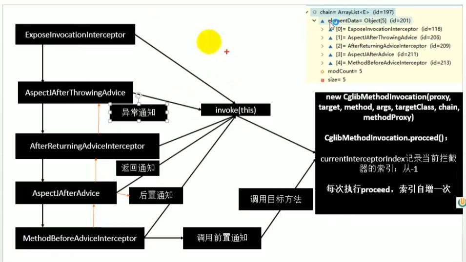

# AOP

## 配置类的代理

如果在调试过程中有留意，其实配置类也会被自动代理起来，即增强配置类，使得配置类当中的一些操作符合Spring容器的规范。

例如以下代码:

```java
// 容器会自动将和参数对应的组件注入该方法，即使不在参数前加 @Autowired 注解。
@Bean
public void JdbcTemplate getJdbcTemplate(DataSource datasource) {
    return new JdbcTemplate(datasource);
}
// 即使我们是通过调用另外一个成员方法的方式来注入对象，这个对象也会自动地从容器当中获取，而不是创建新的对象。
@Bean
public void JdbcTemplate getJdbcTemplate() {
    return new JdbcTemplate(this.datasource());
}
```

## 原理解析步骤

原理解析三步骤：

1. 给容器中注册了什么组件；
2. 这个组件什么时候工作；
3. 这个组件的功能是什么。

## @EnableAspectJAutoProxy原理

```java
// 给容器当中导入了AspectJAutoProxyRegistrar组件:
@Import(AspectJAutoProxyRegistrar.class)
public @interface EnableAspectJAutoProxy {
    ...
}
// 利用AspectJAutoProxyRegistrar自定义给容器当中注册bean，此处的用法可以参考01组件注册中的笔记:
class AspectJAutoProxyRegistrar implements ImportBeanDefinitionRegistrar {
    @Override
    public void registerBeanDefinitions(AnnotationMetadata importingClassMetadata, BeanDefinitionRegistry registry) {
        // 向容器当中注册一个名称为internalAutoProxyCreator的AnnotationAwareAspectJAutoProxyCreator类型的bean:
        ...
    }
}
```

## AnnotationAwareAspectJAutoProxyCreator分析


查看继承树，发现2个要点：

1. 后置处理器(会拦截bean的创建过程并做事情)
2. xxxAware(注入Spring底层的BeanFactory组件)

```java
public abstract class AbstractAutoProxyCreator extends ProxyProcessorSupport implements SmartInstantiationAwareBeanPostProcessor, BeanFactoryAware {
    @Override
    public void setBeanFactory(BeanFactory beanFactory) {
        ...
    }
    @Override
    public Object postProcessBeforeInstantiation(Class<?> beanClass, String beanName) {
        ...
    }
    @Override
    public Object postProcessAfterInitialization(@Nullable Object bean, String beanName) {
        ...
    }
}

public abstract class AbstractAdvisorAutoProxyCreator extends AbstractAutoProxyCreator {
    @Override
    public void setBeanFactory(BeanFactory beanFactory) {
        ...
        initBeanFactory((ConfigurableListableBeanFactory) beanFactory);
    }
}

public class AspectJAwareAdvisorAutoProxyCreator extends AbstractAdvisorAutoProxyCreator {
    ...
}

public class AnnotationAwareAspectJAutoProxyCreator extends AspectJAwareAdvisorAutoProxyCreator {
    @Override
    protected void initBeanFactory(ConfigurableListableBeanFactory beanFactory) {
        ...
    }
}
```

## 注册AnnotationAwareAspectJAutoProxyCreator

创建和注册AnnotationAwareAspectJAutoProxyCreator后置处理器的过程：

[BeanFactory](https://www.cnblogs.com/xiaoxi/p/5846416.html)

> BeanFactory 是 Spring 的“心脏”。它就是 Spring IoC 容器的真面目。Spring 使用 BeanFactory 来实例化、配置和管理 Bean。  
如果说 BeanFactory 是 Spring 的心脏，那么 ApplicationContext 就是完整的躯体了，ApplicationContext 由 BeanFactory 派生而来，提供了更多面向实际应用的功能。

1. 传入配置类，创建IoC容器；
2. 注册配置类，调用refresh()刷新容器；
3. `registerBeanPostProcessors(beanFactory);`注册后置处理器方便拦截bean的创建；
    1. `String[] postProcessorNames = beanFactory.getBeanNamesForType(BeanPostProcessor.class, true, false);`先获取容器已经定义好的需要创建对象的BeanPostProcessor；
    2. `beanFactory.addBeanPostProcessor(new BeanPostProcessorChecker(beanFactory, beanProcessorTargetCount));`给容器中添加别的BeanPostProcessor；
    3. `registerBeanPostProcessors(beanFactory, priorityOrderedPostProcessors);`优先注册实现了PriorityOrdered接口的BeanPostProcessor；
    4. `registerBeanPostProcessors(beanFactory, orderedPostProcessors);`再注册实现了Ordered接口的BeanPostProcessor；
    5. `registerBeanPostProcessors(beanFactory, internalPostProcessors);`最后注册没实现优先级接口的BeanPostProcessor；
    6. 注册BeanPostProcessor，实际上就是创建BeanPostProcessor对象，然后保存在容器当中;
        - `instanceWrapper = createBeanInstance(beanName, mbd, args);`创建名称为`internalAutoProxyCreator`的BeanPostProcessor实例；
        - `populateBean(beanName, mbd, instanceWrapper);`为bean实例进行属性赋值；
        - `exposedObject = initializeBean(beanName, exposedObject, mbd);`初始化bean。
            - `invokeAwareMethods(beanName, bean);`处理Aware接口的方法回调；
            - `wrappedBean = applyBeanPostProcessorsBeforeInitialization(wrappedBean, beanName);`应用**所有**后置处理器的postProcessBeforeInitialization方法；
            - `invokeInitMethods(beanName, wrappedBean, mbd);`执行自定义的初始化方法；
            - `wrappedBean = applyBeanPostProcessorsAfterInitialization(wrappedBean, beanName);`应用**所有**后置处理器的postProcessAfterInitialization方法；
        - BeanPostProcessor(AnnotationAwareAspectJAutoProxyCreator)创建成功。
    7. `beanFactory.addBeanPostProcessor(postProcessor);`把BeanPostProcessor注册到BeanFactory中。

因为后置处理器本身也是bean，因此它的创建过程也需要被其它已经存在的后置处理器进行拦截和处理。

该后置处理器注册到容器中后，之后创建其它bean的时候，该后置处理器就可以拦截到bean的创建过程。

## AnnotationAwareAspectJAutoProxyCreator执行时机（其作为后置处理器的工作时机）

首先，`AnnotationAwareAspectJAutoProxyCreator`是`InstantiationAwareBeanPostProcessor`类型的后置处理器，**是在创建bean实例之前先尝试用后置处理器返回对象**。

```java
public interface InstantiationAwareBeanPostProcessor extends BeanPostProcessor {
    ...
    default Object postProcessBeforeInstantiation(Class<?> beanClass, String beanName) throws BeansException {
        ...
    }
    ...
}
```

4. `finishBeanFactoryInitialization(beanFactory);`完成BeanFactory初始化工作，就是创建剩下的单实例bean；
    1. `List<String> beanNames = new ArrayList<>(this.beanDefinitionNames);`遍历获取容器中所有的bean，依次创建对象`getBean(beanName);`；
        - getBean() -> doGetBean() -> getSingleton()
    2. 创建bean；
        - `Object sharedInstance = getSingleton(beanName);`先从缓存中换取当前bean，如果能获取到，说明bean是之前被创建过的，直接使用，否则再创建；
            - 只要创建好的bean就会被缓存起来；
        - `return createBean(beanName, mbd, args);`创建bean；
            - `Object bean = resolveBeforeInstantiation(beanName, mbdToUse);`希望后置处理器在此能够返回一个代理对象，如果能返回就使用，如果不能就继续；
                - `bean = applyBeanPostProcessorsBeforeInstantiation(targetType, beanName);`InstantiationAwareBeanPostProcessor类型后置处理器先尝试返回对象；
            - `Object beanInstance = doCreateBean(beanName, mbdToUse, args);`真正去创建一个bean实例，和3.6流程一致；

## 创建AOP代理(AnnotationAwareAspectJAutoProxyCreator的作用)

围绕MathCalculator和LogAspects的创建：

1. 每一个bean创建之前，都会调用它的`postProcessBeforeInstantiation`方法；
    1. 判断当前bean是否在`advisedBeans`中，其中包含了所有需要增强的bean；
    2. 判断当前bean是否是基础类型的Advice、Pointcut、Advisor、AopInfrastructureBean或者是否注解了`@Aspect`注解；
    3. 判断当前bean是否需要跳过；
        1. 获取候选的增强器（切面里面的通知方法），每一个通知方法的增强器是InstantiationModelAwarePointcutAdvisor，然后判断它们是否是AspectJPointcutAdvisor，如果是则返回true。
2. 创建之后，还会调用它的`postProcessAfterInitialization`方法；
    - `return wrapIfNecessary(bean, beanName, cacheKey);`
        1. 获取所有增强器（通知方法）；
        2. 找到能在当前bean使用的增强器（找哪些通知方法是需要切入当前bean方法的）；
        3. 给增强器**排序**；
    - `Object[] specificInterceptors`将获取到的增强器封装成一个数组；
    - `this.advisedBeans.put(cacheKey, Boolean.TRUE);`保存当前bean在增强bean集合中；
    - 由于当前bean需要增强，因此创建当前bean的代理对象，
        - 获取增强器，保存到`proxyFactory`，创建代理对象（JDK动态代理、CGLIB动态代理），
    - 给容器中返回增强后的代理对象；
    - 之后容器中获取到的就是这个组件的代理对象，执行目标方法时，代理对象就会执行通知方法的流程；

## 获取拦截器链-MethodInterceptor（AOP对象的方法执行流程）

1. 容器中保存了组件的代理对象，这个对象里面保存了详细信息（比如增强器、目标对象等等）；
    - `CglibAopProxy`的`intercept`拦截了目标方法的执行；
    - `List<Object> chain = this.advised.getInterceptorsAndDynamicInterceptionAdvice(method, targetClass);`获取拦截器链
        - 保存所有的拦截器，其中包括默认拦截器和自定义的增强器；
        - 遍历所有增强器，将其转为方法拦截器；
    - 如果没有拦截器链，直接执行目标方法；
    - 如果有拦截器链，把需要执行的目标对象、目标方法、拦截器链等信息传入创建一个`CglibMethodInvocation`对象并调用`proceed`方法执行拦截器链得到返回值；

所谓的拦截器链就是将每一个通知方法包装为方法拦截器，利用方法拦截器机制完成方法执行。

## 链式调用通知方法

拦截器的触发过程：

1. 如果没有拦截器链就执行目标方法，或者执行最后一个拦截器方法后也会调用目标方法；
2. 链式获取每一个拦截器，拦截器执行invoke方法，每一个拦截器等待下一个拦截器执行完成返回以后再来执行，保证了通知方法和目标方法的执行顺序；

[责任链模式](https://www.liaoxuefeng.com/wiki/1252599548343744/1281319474561057)


