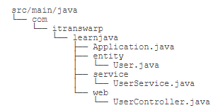
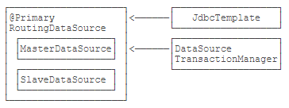

# Spring Boot开发

以汽车为例，如果我们想组装一辆汽车，我们需要发动机、传动、轮胎、底盘、外壳、座椅、内饰等各种部件，然后把它们装配起来。Spring就相当于提供了一系列这样的部件，但是要装好汽车上路，还需要我们**自己动手**。而Spring Boot则相当于已经帮我们**预装好了**一辆可以上路的汽车，如果有特殊的要求，例如把发动机从普通款换成涡轮增压款，可以通过修改配置或编写少量代码完成。

因此，Spring Boot和Spring的关系就是整车和零部件的关系，它们不是取代关系，试图跳过Spring直接学习Spring Boot是不可能的。

## 第一个Spring Boot应用


其中，在`src/main/resources`目录下，注意到几个文件：

### application.yml

这是Spring Boot默认的配置文件，它采用YAML格式而不是.properties格式，文件名必须是application.yml而不是其他名称。可以将所有的.properties配置都集中在该文件当中，就不需要在主配置类上使用注解引入.properties文件。

```yml
# application.yml

spring:
  application:
    name: ${APP_NAME:unnamed}
  datasource:
    url: jdbc:hsqldb:file:testdb
    username: sa
    password:
    dirver-class-name: org.hsqldb.jdbc.JDBCDriver
    hikari:
      auto-commit: false
      connection-timeout: 3000
      validation-timeout: 3000
      max-lifetime: 60000
      maximum-pool-size: 20
      minimum-idle: 1
```

### 使用环境变量

在配置文件中，我们经常使用如下的格式对某个key进行配置：

```yml
app:
  db:
    host: ${DB_HOST:localhost}
    user: ${DB_USER:root}
    password: ${DB_PASSWORD:password}
```

这种`${DB_HOST:localhost}`意思是，首先从环境变量查找DB_HOST，如果环境变量定义了，那么使用环境变量的值，否则，使用默认值localhost。

这使得我们在开发和部署时更加方便，因为开发时无需设定任何环境变量，直接使用默认值即本地数据库，而实际线上运行的时候，只需要传入环境变量即可：

```bash
DB_HOST=10.0.1.123 DB_USER=prod DB_PASSWORD=xxxx java -jar xxx.jar
```

### logback-spring.xml

```xml
<?xml version="1.0" encoding="UTF-8"?>
<configuration>
    <!-- 通过<include resource="..." />引入了Spring Boot的一个缺省配置，这样我们就可以引用类似${CONSOLE_LOG_PATTERN}这样的变量。 -->
    <include resource="org/springframework/boot/logging/logback/defaults.xml" />

    <appender name="CONSOLE" class="ch.qos.logback.core.ConsoleAppender">
        <encoder>
            <pattern>${CONSOLE_LOG_PATTERN}</pattern>
            <charset>utf8</charset>
        </encoder>
    </appender>

    <appender name="APP_LOG" class="ch.qos.logback.core.rolling.RollingFileAppender">
        <encoder>
            <pattern>${FILE_LOG_PATTERN}</pattern>
            <charset>utf8</charset>
        </encoder>
          <file>app.log</file>
        <rollingPolicy class="ch.qos.logback.core.rolling.FixedWindowRollingPolicy">
            <maxIndex>1</maxIndex>
            <fileNamePattern>app.log.%i</fileNamePattern>
        </rollingPolicy>
        <triggeringPolicy class="ch.qos.logback.core.rolling.SizeBasedTriggeringPolicy">
            <MaxFileSize>1MB</MaxFileSize>
        </triggeringPolicy>
    </appender>

    <root level="INFO">
        <appender-ref ref="CONSOLE" />
        <appender-ref ref="APP_LOG" />
    </root>
</configuration>
```

static是静态文件目录，templates是模板文件目录，注意它们不再存放在src/main/webapp下，而是直接放到src/main/resources这个classpath目录，因为在Spring Boot中已经不需要专门的webapp目录了。

以上就是Spring Boot的标准目录结构，它完全是一个基于Java应用的普通Maven项目。

再来看源码目录结构：



在存放源码的src/main/java目录中，Spring Boot对Java包的层级结构有一个要求。注意到我们的根package是com.itranswarp.learnjava，下面还有entity、service、web等子package。Spring Boot要求main()方法所在的启动类必须放到根package下，命名不做要求，这里我们以Application.java命名，它的内容如下：

```java
@SpringBootApplication
public class Application {
    public static void main(String[] args) throws Exception {
        SpringApplication.run(Application.class, args);
    }
}
```

启动Spring Boot应用程序只需要一行代码加上一个注解@SpringBootApplication，该注解实际上又包含了：

- @SpringBootConfiguration
  - @Configuration
- @EnableAutoConfiguration
  - @AutoConfigurationPackage
- @ComponentScan

**这样一个注解@SpringBootApplication就相当于启动了自动配置和自动扫描**。

再观察pom.xml，它的内容如下：

```xml
<project xmlns="http://maven.apache.org/POM/4.0.0"
         xmlns:xsi="http://www.w3.org/2001/XMLSchema-instance"
         xsi:schemaLocation="http://maven.apache.org/POM/4.0.0 http://maven.apache.org/xsd/maven-4.0.0.xsd">
    <!-- 强烈推荐从spring-boot-starter-parent继承，因为这样就可以引入Spring Boot的预置配置。 -->
    <parent>
        <groupId>org.springframework.boot</groupId>
        <artifactId>spring-boot-starter-parent</artifactId>
        <version>2.3.0.RELEASE</version>
    </parent>

    ...

    <dependencies>
        <dependency>
            <groupId>org.springframework.boot</groupId>
            <artifactId>spring-boot-starter-web</artifactId>
        </dependency>
        <!-- 无需指定版本号，因为引入的<parent>内已经指定了，只有我们自己引入的某些第三方jar包需要指定版本号。 -->
        <dependency>
            <groupId>org.springframework.boot</groupId>
            <artifactId>spring-boot-starter-jdbc</artifactId>
        </dependency>

        <!-- 集成Pebble View -->
        <dependency>
            <groupId>io.pebbletemplates</groupId>
            <artifactId>pebble-spring-boot-starter</artifactId>
            <version>${pebble.version}</version>
        </dependency>

        <!-- JDBC驱动 -->
        <!-- hsqldb已在spring-boot-starter-jdbc中预置了版本号2.5.0，因此此处无需指定版本号。 -->
        <dependency>
            <groupId>org.hsqldb</groupId>
            <artifactId>hsqldb</artifactId>
        </dependency>
    </dependencies>
</project>
```

根据`pebble-spring-boot-starter`的[文档](https://pebbletemplates.io/wiki/guide/spring-boot-integration/)，加入如下配置到application.yml：

```yml
pebble:
  # 默认为".pebble"，改为"":
  suffix:
  # 开发阶段禁用模板缓存:
  cache: false
```

对Application稍作改动，添加WebMvcConfigurer这个Bean：

```java
@SpringBootApplication
public class Application {
    ...

    @Bean
    WebMvcConfigurer createWebMvcConfigurer(@Autowired HandlerInterceptor[] interceptors) {
        return new WebMvcConfigurer() {
            @Override
            public void addResourceHandlers(ResourceHandlerRegistry registry) {
                // 映射路径`/static/`到classpath路径:
                registry.addResourceHandler("/static/**")
                        .addResourceLocations("classpath:/static/");
            }
        };
    }
}
```

前面我们定义的数据源、声明式事务、JdbcTemplate在哪创建的？怎么就可以直接注入到自己编写的UserService中呢？这些自动创建的Bean就是Spring Boot的特色：AutoConfiguration。

当我们引入spring-boot-starter-jdbc时，启动时会自动扫描所有的XxxAutoConfiguration：

- DataSourceAutoConfiguration：自动创建一个DataSource，其中配置项从application.yml的spring.datasource读取；
- DataSourceTransactionManagerAutoConfiguration：自动创建了一个基于JDBC的事务管理器；
- JdbcTemplateAutoConfiguration：自动创建了一个JdbcTemplate。

因此，我们自动得到了一个DataSource、一个DataSourceTransactionManager和一个JdbcTemplate。

类似的，当我们引入spring-boot-starter-web时，自动创建了：

- ServletWebServerFactoryAutoConfiguration：自动创建一个嵌入式Web服务器，默认是Tomcat；
- DispatcherServletAutoConfiguration：自动创建一个DispatcherServlet；
- HttpEncodingAutoConfiguration：自动创建一个CharacterEncodingFilter；
- WebMvcAutoConfiguration：自动创建若干与MVC相关的Bean。
- ...

引入第三方pebble-spring-boot-starter时，自动创建了：

- PebbleAutoConfiguration：自动创建了一个PebbleViewResolver。

**Spring Boot大量使用XxxAutoConfiguration来使得许多组件被自动化配置并创建，而这些创建过程又大量使用了Spring的Conditional功能**。例如，我们观察JdbcTemplateAutoConfiguration，它的代码如下：

```java
@Configuration(proxyBeanMethods = false)
@ConditionalOnClass({ DataSource.class, JdbcTemplate.class })
@ConditionalOnSingleCandidate(DataSource.class)
@AutoConfigureAfter(DataSourceAutoConfiguration.class)
@EnableConfigurationProperties(JdbcProperties.class)
@Import({ JdbcTemplateConfiguration.class, NamedParameterJdbcTemplateConfiguration.class })
public class JdbcTemplateAutoConfiguration {
}
```

当满足条件：

- @ConditionalOnClass：在classpath中能找到DataSource和JdbcTemplate；
- @ConditionalOnSingleCandidate(DataSource.class)：在当前Bean的定义中能找到唯一的DataSource；

该`JdbcTemplateAutoConfiguration`就会起作用。实际创建由导入的`JdbcTemplateConfiguration`完成：

```java
@Configuration(proxyBeanMethods = false)
@ConditionalOnMissingBean(JdbcOperations.class)
class JdbcTemplateConfiguration {
    @Bean
    @Primary
    JdbcTemplate jdbcTemplate(DataSource dataSource, JdbcProperties properties) {
        JdbcTemplate jdbcTemplate = new JdbcTemplate(dataSource);
        JdbcProperties.Template template = properties.getTemplate();
        jdbcTemplate.setFetchSize(template.getFetchSize());
        jdbcTemplate.setMaxRows(template.getMaxRows());
        if (template.getQueryTimeout() != null) {
            jdbcTemplate.setQueryTimeout((int) template.getQueryTimeout().getSeconds());
        }
        return jdbcTemplate;
    }
}
```

创建JdbcTemplate之前，要满足@ConditionalOnMissingBean(JdbcOperations.class)，即不存在JdbcOperations的Bean。

如果我们自己创建了一个JdbcTemplate，例如，在Application中自己写个方法：

```java
@SpringBootApplication
public class Application {
    ...
    @Bean
    JdbcTemplate createJdbcTemplate(@Autowired DataSource dataSource) {
        return new JdbcTemplate(dataSource);
    }
}
```

**那么根据条件@ConditionalOnMissingBean(JdbcOperations.class)，Spring Boot就不会再创建一个重复的JdbcTemplate（因为JdbcOperations是JdbcTemplate的父类）**。

可见，Spring Boot自动装配功能是通过**自动扫描**➕**条件装配**实现的，这一套机制在默认情况下工作得很好，**但是，如果我们要手动控制某个Bean的创建，就需要详细地了解Spring Boot自动创建的原理，很多时候还要跟踪XxxAutoConfiguration，以便设定条件使得某个Bean不会被自动创建**。

## 开发者工具

Spring Boot提供了一个开发者工具，可以监控classpath路径上的文件。只要源码或配置文件发生修改，Spring Boot应用可以自动重启。在开发阶段，这个功能比较有用。

```xml
<dependency>
    <groupId>org.springframework.boot</groupId>
    <artifactId>spring-boot-devtools</artifactId>
</dependency>
```

默认配置下，针对/static、/public和/templates目录中的文件修改，不会自动重启，**因为禁用缓存后，这些文件的修改可以实时更新**。

## 打包Spring Boot应用

```xml
<project ...>
    <dependencies>
        ...
    </dependencies>

    <build>
        <finalName>awesome-app</finalName>
        <plugins>
            <plugin>
                <groupId>org.springframework.boot</groupId>
                <artifactId>spring-boot-maven-plugin</artifactId>
            </plugin>
        </plugins>
    </build>
</project>
```

## 使用Actuator

> Spring Boot提供了一个Actuator，可以方便地实现监控，并可通过Web访问特定类型的监控。

JMX对Java应用程序包括JVM进行监控，使用JMX需要**把一些监控信息以MBean的形式**暴露给JMX Server。

Spring Boot已经内置了一个监控功能，它叫Actuator，使用Actuator非常简单，只需添加如下依赖：

```xml
<dependency>
    <groupId>org.springframework.boot</groupId>
    <artifactId>spring-boot-starter-actuator</artifactId>
</dependency>
```

然后正常启动应用程序，**Actuator会把它能收集到的所有信息都暴露给JMX**。此外，Actuator还可以通过URL`/actuator/`挂载一些监控点，例如，输入`http://localhost:8080/actuator/health`，我们可以查看应用程序当前状态：

```text
{
    "status": "UP"
}
```

**许多网关作为反向代理需要一个URL来探测后端集群应用是否存活，这个URL就可以提供给网关使用**。

**Actuator默认把所有访问点暴露给JMX，但处于安全原因，只有`health`和`info`会暴露给Web**。Actuator提供的所有访问点均在官方文档列出，要暴露更多的访问点给Web，需要在application.yml中加上配置：

```yml
management:
  endpoints:
    web:
      exposure:
        include: info, health, beans, env, metrics
```

**要特别注意暴露的URL的安全性，例如，`/actuator/env`可以获取当前机器的所有环境变量，不可暴露给公网**。

## 使用Profiles

- Spring Boot允许在一个配置文件中针对不同Profile进行配置；
- Spring Boot在未指定Profile时默认为default。

Profile本身是Spring提供的功能，我们在使用条件装配中已经讲到了，Profile表示一个环境的概念，如开发、测试和生产这3个环境，或者按git分支定义master、dev这些环境。

在启动一个Spring应用程序的时候，可以传入一个或多个环境，例如：

```text
-Dspring.profiles.active=test,master
```

在前面的Spring使用条件装配的章节当中，我们通过@Profile配置不同的Bean。**Spring Boot对Profiles的支持在于，还可以在application.yml中为每个环境进行配置**。下面是一个示例配置：

```yml
server:
  port: ${APP_PORT:8080}

spring:
  application:
    name: ${APP_NAME:unnamed}
  datasource:
    url: jdbc:hsqldb:file:testdb
    username: sa
    password:
    driver-class-name: org.hsqldb.jdbc.JDBCDriver
    hikari:
      auto-commit: false
      connection-timeout: 3000
      validation-timeout: 3000
      max-lifetime: 60000
      maximum-pool-size: 20
      minimum-idle: 1

pebble:
  suffix:
  cache: false

---

spring:
  profiles: test

server:
  port: 8000

---

spring:
  profiles: production

server:
  port: 80

pebble:
  cache: true
```

注意到分隔符`---`，最前面的配置是默认配置，不需要指定Profile，后面的每段配置都必须以spring.profiles: xxx开头，表示一个Profile。上述配置默认使用8080端口，但是在test环境下，使用8000端口，在production环境下，使用80端口，并且启用Pebble的缓存。

如果我们不指定任何Profile，直接启动应用程序，那么Profile实际上就是default，可以从Spring Boot启动日志看出：

```test
2020-09-27 21:01:23.650  INFO 14980 --- [  restartedMain] com.itranswarp.learnjava.Application     : No active profile set, falling back to default profiles: default
```

要以test环境启动，可输入如下命令：

```test
java -Dspring.profiles.active=test -jar springboot-profiles-1.0-SNAPSHOT.jar
```

```test
2020-09-27 21:02:59.462  INFO 9908 --- [  restartedMain] com.itranswarp.learnjava.Application     : The following profiles are active: test
```

从日志看到活动的Profile是test，Tomcat的监听端口是8000。

**IDEA可以直接在启动配置中指定环境变量`VM options: -Dspring.profiles.active=test`，切换环境时，会覆盖default环境中的相同配置，其余配置仍按照default环境中的配置**。

通过Profile可以实现一套代码在不同环境启用不同的配置和功能。假设我们需要一个存储服务，在本地开发时，直接使用文件存储即可，但是，在测试和生产环境，需要存储到云端如S3上，如何通过Profile实现该功能（这其实在Spring的条件装配章节当中已经实践过了）？

```java
// 定义存储接口StorageService：
public interface StorageService {

    // 根据URI打开InputStream:
    InputStream openInputStream(String uri) throws IOException;

    // 根据扩展名+InputStream保存并返回URI:
    String store(String extName, InputStream input) throws IOException;
}
// 本地存储可通过LocalStorageService实现：
@Component
@Profile("default")
public class LocalStorageService implements StorageService {
    @Value("${storage.local:/var/static}")
    String localStorageRootDir;

    final Logger logger = LoggerFactory.getLogger(getClass());

    private File localStorageRoot;

    @PostConstruct
    public void init() {
        logger.info("Intializing local storage with root dir: {}", this.localStorageRootDir);
        this.localStorageRoot = new File(this.localStorageRootDir);
    }

    @Override
    public InputStream openInputStream(String uri) throws IOException {
        File targetFile = new File(this.localStorageRoot, uri);
        return new BufferedInputStream(new FileInputStream(targetFile));
    }

    @Override
    public String store(String extName, InputStream input) throws IOException {
        String fileName = UUID.randomUUID().toString() + "." + extName;
        File targetFile = new File(this.localStorageRoot, fileName);
        try (OutputStream output = new BufferedOutputStream(new FileOutputStream(targetFile))) {
            input.transferTo(output);
        }
        return fileName;
    }
}
// 云端存储可通过CloudStorageService实现：
@Component
@Profile("!default")
public class CloudStorageService implements StorageService {
    @Value("${storage.cloud.bucket:}")
    String bucket;

    @Value("${storage.cloud.access-key:}")
    String accessKey;

    @Value("${storage.cloud.access-secret:}")
    String accessSecret;

    final Logger logger = LoggerFactory.getLogger(getClass());

    @PostConstruct
    public void init() {
        // TODO:
        logger.info("Initializing cloud storage...");
    }

    @Override
    public InputStream openInputStream(String uri) throws IOException {
        // TODO:
        throw new IOException("File not found: " + uri);
    }

    @Override
    public String store(String extName, InputStream input) throws IOException {
        // TODO:
        throw new IOException("Unable to access cloud storage.");
    }
}
```

注意到LocalStorageService使用了条件装配@Profile("default")，即默认启用LocalStorageService，而CloudStorageService使用了条件装配@Profile("!default")，即非default环境时，自动启用CloudStorageService。这样，一套代码，就实现了不同环境启用不同的配置。

## 使用Conditional

- Spring Boot提供了几个非常有用的条件装配注解，可实现灵活的条件装配。

使用Profile能根据不同的Profile进行条件装配，但是Profile控制比较糙，如果想要**精细控制**，例如，配置本地存储，AWS存储和阿里云存储，将来很可能会增加Azure存储等，用Profile就很难实现。

Spring本身提供了条件装配@Conditional，但是要**自己编写**比较复杂的Condition来做判断，比较麻烦。Spring Boot则为我们准备好了几个非常有用的条件，可直接在注解当中实现**条件判断**：

- @ConditionalOnProperty：如果有指定的配置，条件生效；
- @ConditionalOnBean：如果有指定的Bean，条件生效；
- @ConditionalOnMissingBean：如果没有指定的Bean，条件生效；
- @ConditionalOnMissingClass：如果没有指定的Class，条件生效；
- @ConditionalOnWebApplication：在Web环境中条件生效；
- @ConditionalOnExpression：根据表达式判断条件是否生效。

```yml
# 尝试从环境变量当中获取STORAGE_TYPE:
storage:
  type: ${STORAGE_TYPE:local}
```

```Java
// 当指定配置为local，或者配置不存在，均启用LocalStorageService：
@Component
@ConditionalOnProperty(value = "storage.type", havingValue = "local", matchIfMissing = true)
public class LocalStorageService implements StorageService {
    ...
}
@Component
@ConditionalOnProperty(value = "storage.type", havingValue = "aws")
public class AwsStorageService implements StorageService {
    ...
}
@Component
@ConditionalOnProperty(value = "storage.type", havingValue = "aliyun")
public class AliyunStorageService implements StorageService {
    ...
}
```

## 加载配置文件

- Spring Boot提供了@ConfigurationProperties注解，可以非常方便地把一段配置加载到一个Bean中（Spring的@Value是将配置一一放到属性上）。

加载配置文件可以直接使用注解@Value，例如，我们定义了一个最大允许上传的文件大小配置：

```yml
storage:
  local:
    max-size: 102400
```

在某个FileUploader里，需要获取该配置，可使用@Value注入：

```java
@Component
public class FileUploader {
    @Value("{storage.local.max-size:102400}")
    int maxSize;

    ...
}
```

在另一个UploadFilter中，因为要检查文件的MD5，同时也要检查输入流的大小，因此，也需要该配置：

```java
@Component
public class UploadFilter implements Filter {
    @Value("{storage.local.max-size:100000}")
    int maxSize;

    ...
}
```

**多次使用@Value引用同一个配置项不但麻烦，而且@Value使用字符串，缺少编译器检查，容易造成多处引用不一致**。

**为了更好地管理配置，Spring Boot允许创建一个Bean，持有一组配置，并由Spring Boot自动注入**。

假设我们在application.yml中添加了如下配置：

```yml
storage:
  local:
    # 文件存储根目录:
    root-dir: ${STORAGE_LOCAL_ROOT:/var/storage}
    # 最大文件大小，默认100K:
    max-size: ${STORAGE_LOCAL_MAX_SIZE:102400}
    # 是否允许空文件:
    allow-empty: false
    # 允许的文件类型:
    allow-types: jpg, png, gif
```

定义一个Java Bean，持有该组配置，保证Java Bean的属性名称与配置一致即可：

```Java
// 注意这里不是@Component:
@Configuration
@ConfigurationProperties("storage.local")
public class StorageConfiguration {

    private String rootDir;
    private int maxSize;
    private boolean allowEmpty;
    private List<String> allowTypes;

    // TODO: getters and setters
}
```

注意到`@ConfigurationProperties("storage.local")`表示将从配置项storage.local读取该项的所有子项配置，并且，`@Configuration`表示StorageConfiguration也是一个Spring管理的Bean，可直接注入到其他Bean中：

```java
@Component
public class StorageService {
    final Logger logger = LoggerFactory.getLogger(getClass());

    @Autowired
    StorageConfiguration storageConfig;

    @PostConstruct
    public void init() {
        logger.info("Load configuration: root-dir = {}", storageConfig.getRootDir());
        logger.info("Load configuration: max-size = {}", storageConfig.getMaxSize());
        logger.info("Load configuration: allowed-types = {}", storageConfig.getAllowTypes());
    }
}
```

这样一来，引入storage.local的相关配置就很容易了，因为只需要注入StorageConfiguration这个Bean，这样可以由编译器检查类型，无需编写重复的@Value注解。

## 禁用自动配置并配置多数据源

- 可以通过@EnableAutoConfiguration(exclude = {...})指定禁用的自动配置；
- 可以通过@Import({...})导入自定义配置。

Spring Boot大量使用自动配置和默认配置，极大地减少了代码，通常只需要加上几个注解，并按照默认规则设定一下必要的配置即可。例如，配置JDBC，默认情况下，只需要配置一个spring.datasource（其中包含对应的数据源JDBC驱动），Spring Boot就会自动创建出DataSource、JdbcTemplate、DataSourceTransactionManager，非常方便。

但是，有时候，我们又必须要禁用某些自动配置。例如，系统有**主从**两个数据库，而Spring Boot的自动配置只能配一个。这个时候，针对DataSource相关的自动配置，就必须关掉。

[主从数据库目的](https://zhuanlan.zhihu.com/p/50597960)

我们需要用exclude指定需要关掉的自动配置：

```java
@SpringBootApplication
// 启动自动配置，但禁用指定的自动配置:
@EnableAutoConfiguration(exclude = DataSourceAutoConfiguration.class)
public class Application {
    ...
}
```

现在，Spring Boot不再给我们自动创建DataSource、JdbcTemplate和DataSourceTransactionManager了，后面两者需要依赖前者才能创建，现在前者现在不创建了，后面两者也不会创建，要实现主从数据库支持，怎么办？

让我们一步一步开始编写支持主从数据库的功能。首先，我们需要把主从数据库配置写到application.yml中，仍然按照Spring Boot默认的格式写，但datasource改为datasource-master和datasource-slave：

```yml
spring:
  datasource-master:
    url: jdbc:hsqldb:file:testdb
    username: sa
    password:
    driver-class-name: org.hsqldb.jdbc.JDBCDriver
  datasource-slave:
    url: jdbc:hsqldb:file:testdb
    # 可替换为只有SELECT权限的只读用户:
    username: sa
    password:
    driver-class-name: org.hsqldb.jdbc.JDBCDriver
```

注意到两个数据库实际上是同一个库。如果使用MySQL，可以创建一个只读用户，作为datasource-slave的用户来模拟一个从库。

```Java
// 创建两个HikariCP的DataSource：
public class MasterDataSourceConfiguration {
    @Bean("masterDataSourceProperties")
    // 从此处可以看出@ConfigurationProperties注解还可以为返回的bean注解注入属性:
    @ConfigurationProperties("spring.datasource-master")
    DataSourceProperties dataSourceProperties() {
        return new DataSourceProperties();
    }

    @Bean("masterDataSource")
    DataSource dataSource(@Autowired @Qualifier("masterDataSourceProperties") DataSourceProperties props) {
        return props.initializeDataSourceBuilder().build();
    }
}

public class SlaveDataSourceConfiguration {
    @Bean("slaveDataSourceProperties")
    @ConfigurationProperties("spring.datasource-slave")
    DataSourceProperties dataSourceProperties() {
        return new DataSourceProperties();
    }

    @Bean("slaveDataSource")
    DataSource dataSource(@Autowired @Qualifier("slaveDataSourceProperties") DataSourceProperties props) {
        return props.initializeDataSourceBuilder().build();
    }
}
// 注意到上述class并未添加@Configuration和@Component，要使之生效，可以使用@Import导入：
@SpringBootApplication
@EnableAutoConfiguration(exclude = DataSourceAutoConfiguration.class)
// 导入自定义配置：
@Import({ MasterDataSourceConfiguration.class, SlaveDataSourceConfiguration.class})
public class Application {
    ...
}
```

此外，上述两个DataSource的Bean名称分别为masterDataSource和slaveDataSource，我们还需要一个最终的@Primary标注的DataSource，它采用Spring提供的AbstractRoutingDataSource，代码实现如下：

```java
class RoutingDataSource extends AbstractRoutingDataSource {
    @Override
    protected Object determineCurrentLookupKey() {
        // 从ThreadLocal中取出key:
        return RoutingDataSourceContext.getDataSourceRoutingKey();
    }
}
```

RoutingDataSource本身并不是真正的DataSource，它通过Map关联一组DataSource，下面的代码创建了包含两个DataSource的RoutingDataSource，关联的key分别为masterDataSource和slaveDataSource：

```java
public class RoutingDataSourceConfiguration {
    @Primary
    @Bean
    DataSource dataSource(
            @Autowired @Qualifier("masterDataSource") DataSource masterDataSource,
            @Autowired @Qualifier("slaveDataSource") DataSource slaveDataSource) {
        var ds = new RoutingDataSource();
        // 关联两个DataSource:
        ds.setTargetDataSources(Map.of(
                "masterDataSource", masterDataSource,
                "slaveDataSource", slaveDataSource));
        // 默认使用masterDataSource:
        ds.setDefaultTargetDataSource(masterDataSource);
        return ds;
    }

    @Bean
    JdbcTemplate jdbcTemplate(@Autowired DataSource dataSource) {
        return new JdbcTemplate(dataSource);
    }

    @Bean
    DataSourceTransactionManager dataSourceTransactionManager(@Autowired DataSource dataSource) {
        return new DataSourceTransactionManager(dataSource);
    }
}
```

仍然需要自己创建JdbcTemplate和PlatformTransactionManager，注入的是标记为@Primary的RoutingDataSource。

这样，我们通过如下的代码就可以切换RoutingDataSource底层使用的真正的DataSource：

```java
RoutingDataSourceContext.setDataSourceRoutingKey("slaveDataSource");
jdbcTemplate.query(...);
```

只不过写代码切换DataSource即麻烦又容易出错，更好的方式是通过注解配合AOP实现自动切换，这样，客户端代码实现如下：

```java
@Controller
public class UserController {
    @RoutingWithSlave // <-- 指示在此方法中使用slave数据库
    @GetMapping("/profile")
    public ModelAndView profile(HttpSession session) {
        ...
    }
}
```

实现上述功能需要编写一个@RoutingWithSlave注解，一个AOP织入和一个ThreadLocal来保存key。由于代码比较简单，这里我们不再详述。

如果我们想要确认是否真的切换了DataSource，可以覆写determineTargetDataSource()方法并打印出DataSource的名称：

```java
class RoutingDataSource extends AbstractRoutingDataSource {
    ...

    @Override
    protected DataSource determineTargetDataSource() {
        DataSource ds = super.determineTargetDataSource();
        logger.info("determin target datasource: {}", ds);
        return ds;
    }
}
```

访问不同的URL，可以在日志中看到两个DataSource，分别是HikariPool-1和hikariPool-2：

```text
```

我们用一个图来表示创建的DataSource以及相关Bean的关系：



注意到DataSourceTransactionManager和JdbcTemplate引用的都是RoutingDataSource，所以，这种设计的一个限制就是：在一个请求中，一旦切换了内部数据源，在同一个事务中，不能再切到另一个，否则，DataSourceTransactionManager和JdbcTemplate操作的就不是同一个数据库连接。

## 添加Filter

> 在Spring Boot中添加Filter更加方便，并且支持对多个Filter进行排序。

Spring Boot会自动扫描所有的FilterRegistrationBean类型的Bean，然后，将它们返回的Filter自动注册到Servlet容器中，无需任何配置。

```java
@Order(10)
@Component
public class AuthFilterRegistrationBean extends FilterRegistrationBean<Filter> {
    @Autowired
    UserService userService;

    @Override
    public Filter getFilter() {
        return new AuthFilter();
    }
    // 内部类：
    class AuthFilter implements Filter {
        ...
    }
}
```

FilterRegistrationBean本身不是Filter，它实际上是Filter的工厂。Spring Boot会调用getFilter()，把返回的Filter注册到Servlet容器中。因为我们可以在FilterRegistrationBean中注入需要的资源，然后，在返回的AuthFilter中，**这个内部类可以引用外部类的所有字段，自然也包括注入的UserService**，所以，整个过程完全基于Spring的IoC容器完成。

再注意到AuthFilterRegistrationBean标记了一个@Order(10)，因为Spring Boot支持给多个Filter排序，数字小的在前面，所以，多个Filter的顺序是可以固定的。

```java
@Order(20)
@Component
public class ApiFilterRegistrationBean extends FilterRegistrationBean<Filter> {
    @PostConstruct
    public void init() {
        // 调用继承的方法：
        setFilter(new ApiFilter());
        setUrlPatterns(List.of("/api/*"));
    }

    class ApiFilter implements Filter {
        ...
    }
}
```

这个ApiFilterRegistrationBean和AuthFilterRegistrationBean又有所不同。因为我们要过滤URL，而不是针对所有URL生效，因此，在@PostConstruct方法中，通过setFilter()设置一个Filter实例后，再调用setUrlPatterns()传入要过滤的URL列表。

## 集成Open API

Open API是一个标准，它的主要作用是描述REST API，既可以作为文档给开发者阅读，又可以让机器根据这个文档自动生成客户端代码等。

```xml
<dependency>
    <groupId>org.springdoc</groupId>
    <artifactId>springdoc-openapi-ui</artifactId>
</dependency>
```

启动应用，打开浏览器输入`http://localhost:8080/swagger-ui.html`。

引入springdoc-openapi-ui这个依赖后，它自动引入Swagger UI用来创建API文档。可以给API加入一些描述信息，例如：

```java
@RestController
@RequestMapping("/api")
public class ApiController {
    ...
    @Operation(summary = "Get specific user object by it's id.")
    @GetMapping("/users/{id}")
    public User user(@Parameter(description = "id of the user.") @PathVariable("id") long id) {
        return userService.getUserById(id);
    }
    ...
}
```

@Operation可以对API进行描述，@Parameter可以对参数进行描述，它们的目的是用于生成API文档的描述信息。

## 访问Redis

用户只要有过登录成功操作，那么用户数据就会被存放在Redis中，但是，在判断用户是否登录过即session是否存在用户记录，仍然是以用户ID作为第一判断条件。

之前是将用户对象放到session中，现在将用户ID放到session，用户数据放到Redis中，假如用户数据很大，这样做便可以减轻服务器负担。

```yml
spring:
  redis:
    host: ${REDIS_HOST:localhost}
    port: ${REDIS_PORT:6379}
    password: ${REDIS_PASSWORD:}
    ssl: ${REDIS_SSL:false}
    database: ${REDIS_DATABASE:0}
```

```java
// 通过RedisConfiguration来加载它：
// 这样做的目的是可以进行类型检查以及方便注入配置：
@ConfigurationProperties("spring.redis")
public class RedisConfiguration {
    private String host;
    private int port;
    private String password;
    private int database;

    // getters and setters...

    // 再编写一个@Bean方法来创建RedisClient：
    @Bean
    RedisClient redisClient() {
        RedisURI uri = RedisURI.Builder.redis(this.host, this.port)
                .withPassword(this.password)
                .withDatabase(this.database)
                .build();
        return RedisClient.create(uri);
    }
}
// 用一个RedisService来封装所有的Redis操作：
@Component
public class RedisService {
    @Autowired
    RedisClient redisClient;
    // 引入了Commons Pool的一个对象池，用于缓存Redis连接：
    // 因为Lettuce本身是基于Netty的异步驱动，在异步访问时并不需要创建连接池，但基于Servlet模型的同步访问时，连接池是有必要的：
    GenericObjectPool<StatefulRedisConnection<String, String>> redisConnectionPool;

    @PostConstruct
    public void init() {
        // 初始化连接池：
        GenericObjectPoolConfig<StatefulRedisConnection<String, String>> poolConfig = new GenericObjectPoolConfig<>();
        poolConfig.setMaxTotal(20);
        poolConfig.setMaxIdle(5);
        poolConfig.setTestOnReturn(true);
        poolConfig.setTestWhileIdle(true);
        this.redisConnectionPool = ConnectionPoolSupport.createGenericObjectPool(() -> redisClient.connect(), poolConfig);
    }

    @PreDestroy
    public void shutdown() {
        // 关闭连接池：
        this.redisConnectionPool.close();
        this.redisClient.shutdown();
    }
}
```

下一步，是在RedisService中添加Redis访问方法。为了简化代码，我们仿照JdbcTemplate.execute(ConnectionCallback)方法，传入回调函数，可大幅减少样板代码。

```java
// 首先定义回调函数接口SyncCommandCallback：
@FunctionalInterface
public interface SyncCommandCallback<T> {
    // 在此操作Redis:
    T doInConnection(RedisCommands<String, String> commands);
}
// 编写executeSync方法，在该方法中，获取Redis连接，利用callback操作Redis，最后释放连接，并返回操作结果：
public <T> T executeSync(SyncCommandCallback<T> callback) {
    try (StatefulRedisConnection<String, String> connection = redisConnectionPool.borrowObject()) {
        connection.setAutoFlushCommands(true);
        RedisCommands<String, String> commands = connection.sync();
        return callback.doInConnection(commands);
    } catch (Exception e) {
        logger.warn("executeSync redis failed.", e);
        throw new RuntimeException(e);
    }
}
// 针对常用操作把它封装一下，例如set和get命令：
public String set(String key, String value) {
    return executeSync(commands -> commands.set(key, value));
}

public String get(String key) {
    return executeSync(commands -> commands.get(key));
}
// 类似的，hget和hset操作如下：
public boolean hset(String key, String field, String value) {
    return executeSync(commands -> commands.hset(key, field, value));
}

public String hget(String key, String field) {
    return executeSync(commands -> commands.hget(key, field));
}

public Map<String, String> hgetall(String key) {
    return executeSync(commands -> commands.hgetall(key));
}
```

常用命令可以提供方法接口，如果要执行任意复杂的操作，就可以通过`executeSync(SyncCommandCallback<T>)`来完成。

从Redis读写Java对象时，序列化和反序列化是应用程序的工作，代码使用JSON作为序列化方案，简单可靠。也可将相关序列化操作封装到RedisService中，这样可以提供更加通用的方法：

```java
public <T> T get(String key, Class<T> clazz) {
    ...
}

public <T> T set(String key, T value) {
    ...
}
```

Spring Boot默认使用Lettuce作为Redis客户端，同步使用时，应通过连接池提高效率。

## 集成Artemis

在Spring Boot中使用Artemis作为JMS服务时，只需引入spring-boot-starter-artemis依赖，即可直接使用JMS。

## 集成RabbitMQ

Spring Boot提供了AMQP的集成，默认使用RabbitMQ作为AMQP消息服务器。

**使用RabbitMQ发送消息时，理解Exchange如何路由至一个或多个Queue至关重要**。

## 集成Kafka
