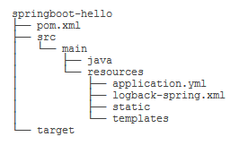

# Spring Boot开发

以汽车为例，如果我们想组装一辆汽车，我们需要发动机、传动、轮胎、底盘、外壳、座椅、内饰等各种部件，然后把它们装配起来。Spring就相当于提供了一系列这样的部件，但是要装好汽车上路，还需要我们**自己动手**。而Spring Boot则相当于已经帮我们**预装好了**一辆可以上路的汽车，如果有特殊的要求，例如把发动机从普通款换成涡轮增压款，可以通过修改配置或编写少量代码完成。

因此，Spring Boot和Spring的关系就是整车和零部件的关系，它们不是取代关系，试图跳过Spring直接学习Spring Boot是不可能的。

## 第一个Spring Boot应用



```yml
# application.yml

server:
  port: ${APP_PORT:8080}

spring:
  application:
    name: ${APP_NAME:unnamed}
  datasource:
    url: jdbc:hsqldb:file:testdb
    username: sa
    password:
    driver-class-name: org.hsqldb.jdbc.JDBCDriver
    hikari:
      auto-commit: false
      connection-timeout: 3000
      validation-timeout: 3000
      max-lifetime: 60000
      maximum-pool-size: 20
      minimum-idle: 1
# https://pebbletemplates.io/wiki/guide/spring-boot-integration/
pebble:
  # 默认为".pebble"，改为"":
  suffix:
  # 开发阶段禁用模板缓存:
  cache: false
```

这种${APP_PORT:8080}意思是，首先从环境变量查找APP_PORT，如果环境变量定义了，那么使用环境变量的值，否则，使用默认值8080。这使得我们在开发和部署时更加方便，因为开发时无需设定任何环境变量，直接使用默认值即8080端口，而实际线上运行的时候，只需要传入环境变量即可：

```bash
APP_PORT=80 java -jar xxx.jar
```

```xml
<!-- logback-spring.xml -->

<?xml version="1.0" encoding="UTF-8"?>
<configuration>
    <!-- 通过<include resource="..." />引入了Spring Boot的一个缺省配置 -->
    <include resource="org/springframework/boot/logging/logback/defaults.xml"/>

    <appender name="CONSOLE" class="ch.qos.logback.core.ConsoleAppender">
        <encoder>
            <!-- 就可以引用类似${CONSOLE_LOG_PATTERN}这样的变量 -->
            <pattern>${CONSOLE_LOG_PATTERN}</pattern>
            <charset>utf8</charset>
        </encoder>
    </appender>

    <appender name="APP_LOG" class="ch.qos.logback.core.rolling.RollingFileAppender">
        <encoder>
            <pattern>${FILE_LOG_PATTERN}</pattern>
            <charset>utf8</charset>
        </encoder>
        <file>app.log</file>
        <rollingPolicy class="ch.qos.logback.core.rolling.FixedWindowRollingPolicy">
            <maxIndex>1</maxIndex>
            <fileNamePattern>app.log.%i</fileNamePattern>
        </rollingPolicy>
        <triggeringPolicy class="ch.qos.logback.core.rolling.SizeBasedTriggeringPolicy">
            <MaxFileSize>1MB</MaxFileSize>
        </triggeringPolicy>
    </appender>

    <root level="INFO">
        <appender-ref ref="CONSOLE"/>
        <appender-ref ref="APP_LOG"/>
    </root>
</configuration>
```

Spring Boot要求main()方法所在的启动类必须放到根package下，命名不做要求，这里我们以Application.java命名，它的内容如下：

```java
// 一个注解就相当于启动了自动配置和自动扫描：
@SpringBootApplication
public class Application {
    public static void main(String[] args) {
        SpringApplication.run(Application.class, args);
    }

    // -- Mvc configuration ---------------------------------------------------

    @Bean
    WebMvcConfigurer createWebMvcConfigurer() {
        return new WebMvcConfigurer() {
            @Override
            public void addResourceHandlers(ResourceHandlerRegistry registry) {
                // 因为static文件夹放在了resources目录下，因此路径前缀加上了classpath：
                registry.addResourceHandler("/static/**").addResourceLocations("classpath:/static/");
            }
        };
    }
}
```

```xml
<project xmlns="http://maven.apache.org/POM/4.0.0"
         xmlns:xsi="http://www.w3.org/2001/XMLSchema-instance"
         xsi:schemaLocation="http://maven.apache.org/POM/4.0.0 http://maven.apache.org/xsd/maven-4.0.0.xsd">
    <!-- 强烈推荐从spring-boot-starter-parent继承，因为这样就可以引入Spring Boot的预置配置。 -->
    <parent>
        <groupId>org.springframework.boot</groupId>
        <artifactId>spring-boot-starter-parent</artifactId>
        <version>2.3.0.RELEASE</version>
    </parent>

    ...

    <dependencies>
        <dependency>
            <groupId>org.springframework.boot</groupId>
            <artifactId>spring-boot-starter-web</artifactId>
        </dependency>
        <!-- 无需指定版本号，因为引入的<parent>内已经指定了，只有我们自己引入的某些第三方jar包需要指定版本号。 -->
        <dependency>
            <groupId>org.springframework.boot</groupId>
            <artifactId>spring-boot-starter-jdbc</artifactId>
        </dependency>

        <!-- 集成Pebble View -->
        <dependency>
            <groupId>io.pebbletemplates</groupId>
            <artifactId>pebble-spring-boot-starter</artifactId>
            <version>${pebble.version}</version>
        </dependency>

        <!-- JDBC驱动 -->
        <!-- hsqldb已在spring-boot-starter-jdbc中预置了版本号2.5.0，因此此处无需指定版本号。 -->
        <dependency>
            <groupId>org.hsqldb</groupId>
            <artifactId>hsqldb</artifactId>
        </dependency>
    </dependencies>
</project>
```

前面我们定义的数据源、声明式事务、JdbcTemplate在哪创建的？怎么就可以直接注入到自己编写的UserService中呢？这些自动创建的Bean就是Spring Boot的特色：AutoConfiguration。

当我们引入spring-boot-starter-jdbc时，启动时会自动扫描所有的XxxAutoConfiguration：

- DataSourceAutoConfiguration：自动创建一个DataSource，其中配置项从application.yml的spring.datasource读取；
- DataSourceTransactionManagerAutoConfiguration：自动创建了一个基于JDBC的事务管理器；
- JdbcTemplateAutoConfiguration：自动创建了一个JdbcTemplate。

因此，我们自动得到了一个DataSource、一个DataSourceTransactionManager和一个JdbcTemplate。

类似的，当我们引入spring-boot-starter-web时，自动创建了：

- ServletWebServerFactoryAutoConfiguration：自动创建一个嵌入式Web服务器，默认是Tomcat；
- DispatcherServletAutoConfiguration：自动创建一个DispatcherServlet；
- HttpEncodingAutoConfiguration：自动创建一个CharacterEncodingFilter；
- WebMvcAutoConfiguration：自动创建若干与MVC相关的Bean。
- ...

引入第三方pebble-spring-boot-starter时，自动创建了：

- PebbleAutoConfiguration：自动创建了一个PebbleViewResolver。

**Spring Boot大量使用XxxAutoConfiguration来使得许多组件被自动化配置并创建，而这些创建过程又大量使用了Spring的Conditional功能**。例如，我们观察JdbcTemplateAutoConfiguration，它的代码如下：

```java
@Configuration(proxyBeanMethods = false)
@ConditionalOnClass({ DataSource.class, JdbcTemplate.class })
@ConditionalOnSingleCandidate(DataSource.class)
@AutoConfigureAfter(DataSourceAutoConfiguration.class)
@EnableConfigurationProperties(JdbcProperties.class)
@Import({ JdbcTemplateConfiguration.class, NamedParameterJdbcTemplateConfiguration.class })
public class JdbcTemplateAutoConfiguration {
}
```

当满足条件：

- @ConditionalOnClass：在classpath中能找到DataSource和JdbcTemplate；
- @ConditionalOnSingleCandidate(DataSource.class)：在当前Bean的定义中能找到唯一的DataSource；

该`JdbcTemplateAutoConfiguration`就会起作用。实际创建由导入的`JdbcTemplateConfiguration`完成：

```java
@Configuration(proxyBeanMethods = false)
@ConditionalOnMissingBean(JdbcOperations.class)
class JdbcTemplateConfiguration {
    @Bean
    @Primary
    JdbcTemplate jdbcTemplate(DataSource dataSource, JdbcProperties properties) {
        JdbcTemplate jdbcTemplate = new JdbcTemplate(dataSource);
        JdbcProperties.Template template = properties.getTemplate();
        jdbcTemplate.setFetchSize(template.getFetchSize());
        jdbcTemplate.setMaxRows(template.getMaxRows());
        if (template.getQueryTimeout() != null) {
            jdbcTemplate.setQueryTimeout((int) template.getQueryTimeout().getSeconds());
        }
        return jdbcTemplate;
    }
}
```

创建JdbcTemplate之前，要满足@ConditionalOnMissingBean(JdbcOperations.class)，即不存在JdbcOperations的Bean。

如果我们自己创建了一个JdbcTemplate，例如，在Application中自己写个方法：

```java
@SpringBootApplication
public class Application {
    ...
    @Bean
    JdbcTemplate createJdbcTemplate(@Autowired DataSource dataSource) {
        return new JdbcTemplate(dataSource);
    }
}
```

那么根据条件@ConditionalOnMissingBean(JdbcOperations.class)，Spring Boot就不会再创建一个重复的JdbcTemplate（因为JdbcOperations是JdbcTemplate的父类）。

可见，Spring Boot自动装配功能是通过自动扫描➕**条件装配**实现的，这一套机制在默认情况下工作得很好，**但是，如果我们要手动控制某个Bean的创建，就需要详细地了解Spring Boot自动创建的原理，很多时候还要跟踪XxxAutoConfiguration，以便设定条件使得某个Bean不会被自动创建**。

## 开发者工具

Spring Boot提供了一个开发者工具，可以监控classpath路径上的文件。只要源码或配置文件发生修改，Spring Boot应用可以自动重启。在开发阶段，这个功能比较有用。

```xml
<dependency>
    <groupId>org.springframework.boot</groupId>
    <artifactId>spring-boot-devtools</artifactId>
</dependency>
```

默认配置下，针对/static、/public和/templates目录中的文件修改，不会自动重启，**因为禁用缓存后，这些文件的修改可以实时更新**。

## 打包Spring Boot应用

```xml
<project ...>
    ...
    <build>
        <finalName>awesome-app</finalName>
        <plugins>
            <plugin>
                <groupId>org.springframework.boot</groupId>
                <artifactId>spring-boot-maven-plugin</artifactId>
            </plugin>
        </plugins>
    </build>
</project>
```

如果IDEA无法自动根据parent版本导入该插件，那就需要手动指定版本。

## 使用Actuator
