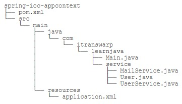

# IoC容器

**容器**是一种为某种特定组件的运行提供必要支持的一个软件**环境**。例如，Tomcat就是一个Servlet容器，它可以为Servlet的运行提供运行环境。类似Docker这样的软件也是一个容器，它提供了必要的Linux环境以便运行一个特定的Linux进程。

通常来说，**使用容器运行组件，除了提供一个组件运行环境之外，容器还提供了许多底层服务**。例如，Servlet容器底层实现了TCP连接，解析HTTP协议等非常复杂的服务，如果没有容器来提供这些服务，我们就无法编写像Servlet这样代码简单，功能强大的组件。早期的JavaEE服务器提供的EJB容器最重要的功能就是通过声明式事务服务，使得EJB组件的开发人员不必自己编写冗长的事务处理代码，所以极大地简化了事务处理。

Spring的核心就是提供了一个**IoC容器**，**它可以管理所有轻量级的JavaBean组件，提供的底层服务包括组件的生命周期管理、配置和组装服务、AOP支持，以及建立在AOP基础上的声明式事务服务等**。

## IoC原理

IoC全称Inversion of Control，直译为控制反转。在理解IoC之前，我们先看看通常的Java组件是如何协作的。

```Java
// 假定一个在线书店，通过BookService获取书籍：
public class BookService {
    // 为了从数据库查询书籍，BookService持有一个DataSource。为了实例化一个HikariDataSource，又不得不实例化一个HikariConfig。
    private HikariConfig config = new HikariConfig();
    private DataSource dataSource = new HikariDataSource(config);

    public Book getBook(long bookId) {
        try (Connection conn = dataSource.getConnection()) {
            ...
            return book;
        }
    }
}
```

```Java
// 编写UserService获取用户：
public class UserService {
    // 因为UserService也需要访问数据库，因此，我们不得不也实例化一个HikariDataSource。
    private HikariConfig config = new HikariConfig();
    private DataSource dataSource = new HikariDataSource(config);

    public User getUser(long userId) {
        try (Connection conn = dataSource.getConnection()) {
            ...
            return user;
        }
    }
}
```

```Java
// 在处理用户购买的CartServlet中，我们需要实例化UserService和BookService：
public class CartServlet extends HttpServlet {
    private BookService bookService = new BookService();
    private UserService userService = new UserService();

    protected void doGet(HttpServletRequest req, HttpServletResponse resp) throws ServletException, IOException {
        long currentUserId = getFromCookie(req);
        User currentUser = userService.getUser(currentUserId);
        Book book = bookService.getBook(req.getParameter("bookId"));
        cartService.addToCart(currentUser, book);
        ...
    }
}
```

```Java
// 在购买历史HistoryServlet中，也需要实例化UserService和BookService：
public class HistoryServlet extends HttpServlet {
    private BookService bookService = new BookService();
    private UserService userService = new UserService();
}
```

上述每个组件都采用了一种简单的通过new创建实例并持有的方式。仔细观察，会发现以下缺点：

  1. 实例化一个组件其实很难，例如，BookService和UserService要创建HikariDataSource，实际上需要读取配置，才能先实例化HikariConfig，再实例化HikariDataSource。
  2. 没有必要让BookService和UserService分别创建DataSource实例，完全可以共享同一个DataSource，但谁负责创建DataSource，谁负责获取其它组件已经创建的DataSource，不好处理。类似的，CartServlet和HistoryServlet也应当共享BookService实例和UserService实例，但也不好处理。
  3. 很多组件需要销毁以便释放资源，例如DataSource，但如果该组件被多个组件共享，如何确保它的使用方都已经全部被销毁。
  4. 随着更多的组件被引入，例如，书籍评论，需要共享的组件写起来会更困难，这些组件的依赖关系会越来越复杂。
  5. 测试某个组件，例如BookService，是复杂的，因为必须要在真实的数据库环境下执行。

从上面的例子可以看出，如果一个系统有大量的组件，其生命周期和相互之间的依赖关系如果**由组件自身来维护**，不但大大增加了系统的复杂度，而且会导致组件之间极为紧密的耦合，继而给测试和维护带来了极大的困难。

因此，核心问题是：**谁负责创建组件**；**谁负责根据依赖关系组装组件**；**销毁时，如何按依赖顺序正确销毁**。解决这一问题的核心方案就是IoC。

传统的应用程序中，**控制权在程序本身，程序的控制流程完全由开发者控制**，例如：CartServlet创建了BookService，在创建BookService的过程中，又创建了DataSource组件。这种模式的缺点是，**一个组件如果要使用另一个组件，必须先知道如何正确地创建它（例如创建时需要传入特定参数）**。

**在IoC模式下，控制权发生了反转，即从应用程序转移到了IoC容器，所有组件不再由应用程序自己创建和配置，而是由IoC容器负责**，这样，应用程序只需要直接使用**已经创建好并且配置好**的组件。为了能让组件在IoC容器中被“装配”出来，需要某种“注入”机制，例如，BookService自己并不会创建DataSource，而是等待外部通过setDataSource()方法来注入一个DataSource：

```Java
public class BookService {
    private DataSource dataSource;

    public void setDataSource(DataSource dataSource) {
        this.dataSource = dataSource;
    }
}
```

不直接**new**一个DataSource，而是**注入**一个DataSource，这个小小的改动虽然简单，却带来了一系列好处：

  1. BookService不再关心如何创建DataSource，因此，不必编写读取数据库配置之类的代码；
  2. DataSource实例被注入到BookService，同样也可以注入到UserService，因此，共享一个组件非常简单；
  3. 测试BookService更容易，因为注入的是DataSource，测试时可以使用内存数据库，而不是真实的MySQL配置。

因此，IoC又称为依赖注入（DI：Dependency Injection），它解决了一个最主要的问题：**将组件的创建➕配置与组件的使用相分离**，并且，由IoC容器负责管理组件的生命周期。

**因为IoC容器要负责实例化所有的组件，因此，有必要告诉容器如何创建组件，以及各组件的依赖关系**。一种最简单的配置是通过XML文件来实现，例如：

```XML
<beans>
    <bean id="dataSource" class="HikariDataSource" />
    <bean id="bookService" class="BookService">
        <property name="dataSource" ref="dataSource" />
    </bean>
    <bean id="userService" class="UserService">
        <property name="dataSource" ref="dataSource" />
    </bean>
</beans>
```

上述XML配置文件指示IoC容器创建3个JavaBean组件，并把id为dataSource的组件通过属性dataSource（即调用setDataSource()方法）注入到另外两个组件中。在Spring的IoC容器中，我们把所有**组件**统称为**JavaBean**，即配置一个组件就是配置一个Bean。

我们从上面的代码可以看到，依赖注入可以通过set()方法实现。但依赖注入也可以通过构造方法实现。很多Java类都具有带参数的构造方法，如果我们把BookService改造为通过构造方法注入，那么实现代码如下：

```Java
public class BookService {
    private DataSource dataSource;

    public BookService(DataSource dataSource) {
        this.dataSource = dataSource;
    }
}
```

Spring的IoC容器同时支持属性注入和构造方法注入，并允许混合使用。

在设计上，Spring的IoC容器是一个高度可扩展的**无侵入容器**。所谓无侵入，是指应用程序的组件无需实现Spring的特定接口，或者说，组件根本不知道自己在Spring的容器中运行。这种无侵入的设计有以下好处：

  1. 应用程序组件既可以在Spring的IoC容器中运行，也可以自己编写代码自行组装配置；
  2. 测试的时候并不依赖Spring容器，可单独进行测试，大大提高了开发效率。

## 装配Bean



我们用Maven创建工程并引入spring-context依赖。

```Java
// 编写一个MailService，用于在用户登录和注册成功后发送邮件通知。
public class MailService {
    private ZoneId zoneId = ZoneId.systemDefault();

    public void setZoneId(ZoneId zoneId) {
        this.zoneId = zoneId;
    }

    public String getTime() {
        return ZonedDateTime.now(this.zoneId).format(DateTimeFormatter.ISO_ZONED_DATE_TIME);
    }

    public void sendLoginMail(User user) {
        System.err.println(String.format("Hi, %s! You are Logged in at %s.", user.getName(), this.getTime()));
    }

    public void sendRegistrationMail(User user) {
        System.err.println(String.format("Welcome, %s!", user.getName()));
    }
}
```

```Java
// 编写一个UserService，实现用户注册和登录。
public class UserService {
    private MailService mailService;
    // 注意到UserService通过setMailService()注入了一个MailService。
    public void setMailService(MailService mailService) {
        this.mailService = mailService;
    }

    private List<User> users = new ArrayList<>(List.of( // users:
            new User(1, "bob@example.com", "password", "Bob"), // bob
            new User(2, "alice@example.com", "password", "Alice"), // alice
            new User(3, "tom@example.com", "password", "Tom"))); // tom

    public User login(String email, String password) {
        for (User user : users) {
            if (user.getEmail().equalsIgnoreCase(email) && user.getPassword().equals(password)) {
                mailService.sendLoginMail(user);
                return user;
            }
        }
        throw new RuntimeException("login failed.");
    }

    public User getUser(long id) {
        return this.users.stream().filter(user -> user.getId() == id).findFirst().orElseThrow();
    }

    public User register(String email, String password, String name) {
        users.forEach((user) -> {
            if (user.getEmail().equalsIgnoreCase(email)) {
                throw new RuntimeException("email exist.");
            }
        });
        User user = new User(users.stream().mapToLong(u -> u.getId()).max().orElse(0L) + 1, email, password, name);
        users.add(user);
        mailService.sendRegistrationMail(user);
        return user;
    }
}
```

```XML
<!-- 编写一个特定的application.xml配置文件，告诉Spring的IoC容器应该如何创建并组装Bean。 -->
<?xml version="1.0" encoding="UTF-8"?>
<beans xmlns="http://www.springframework.org/schema/beans"
       xmlns:xsi="http://www.w3.org/2001/XMLSchema-instance"
       xsi:schemaLocation="http://www.springframework.org/schema/beans
        https://www.springframework.org/schema/beans/spring-beans.xsd">

    <bean id="userService" class="com.cat.service.UserService">
        <property name="mailService" ref="mailService"/>
        <property name="userDAO" ref="userDAO"/>
    </bean>

    <bean id="mailService" class="com.cat.service.MailService"/>
</beans>
```

- 每个`<bean ...>`都有一个id标识，相当于Bean的唯一ID；
- 在userServiceBean中，通过`<property name="..." ref="..." />`注入了另一个Bean；
- **Bean的顺序不重要**，Spring根据依赖关系会自动正确初始化。

```Java
// 把上述XML配置文件用Java代码写出来，就像这样。
UserService userService = new UserService();
MailService mailService = new MailService();
userService.setMailService(mailService);
```

**只不过Spring容器是通过读取XML文件后使用反射完成的**。

```XML
<!-- 如果注入的不是Bean，而是boolean、int、String这样的数据类型，则通过value注入，例如，创建一个HikariDataSource。 -->
<bean id="dataSource" class="com.zaxxer.hikari.HikariDataSource">
    <property name="jdbcUrl" value="jdbc:mysql://localhost:3306/test" />
    <property name="username" value="root" />
    <property name="password" value="password" />
    <property name="maximumPoolSize" value="10" />
    <property name="autoCommit" value="true" />
</bean>
```

```Java
// 最后一步，我们需要创建一个Spring的IoC容器实例，然后加载配置文件，让Spring容器为我们创建并装配好配置文件中指定的所有Bean，这只需要一行代码。
ApplicationContext context = new ClassPathXmlApplicationContext("application.xml");
```

```Java
// 接下来，我们就可以从Spring容器中“取出”装配好的Bean然后使用它。
// 获取Bean:
UserService userService = context.getBean(UserService.class);
// 正常调用:
User user = userService.login("bob@example.com", "password");
```

可以看到，Spring容器就是ApplicationContext，它是一个接口，有很多实现类，这里我们选择ClassPathXmlApplicationContext，表示它会自动从classpath中查找指定的XML配置文件。

获得了ApplicationContext的实例，就获得了IoC容器的引用。从ApplicationContext中我们可以根据Bean的ID获取Bean，但更多的时候我们**根据Bean的类型获取Bean的引用**。

```Java
// Spring还提供另一种IoC容器叫BeanFactory，使用方式和ApplicationContext类似。
BeanFactory factory = new XmlBeanFactory(new ClassPathResource("application.xml"));
MailService mailService = factory.getBean(MailService.class);
```

BeanFactory和ApplicationContext的区别在于，BeanFactory的实现是按需创建，即第一次获取Bean时才创建这个Bean，而ApplicationContext会一次性创建所有的Bean。实际上，ApplicationContext接口是从BeanFactory接口继承而来的，并且，ApplicationContext提供了一些额外的功能，包括国际化支持、事件和通知机制等。**通常情况下，我们总是使用ApplicationContext，很少会考虑使用BeanFactory**。按需创建的时候，发现依赖有问题再报个错，还不如启动就报错。

## 使用Annotation配置

使用Spring的IoC容器，实际上就是通过类似XML这样的配置文件，**把我们自己的Bean的依赖关系描述出来，然后让容器来创建并装配Bean**。一旦容器初始化完毕，我们就直接从容器中获取Bean使用它们。

使用XML配置的优点是所有的Bean都能一目了然地列出来，并通过配置注入能直观地看到每个Bean的依赖。它的缺点是写起来非常繁琐，每增加一个组件，就必须把新的Bean配置到XML中。我们可以使用Annotation配置，可以完全不需要XML，让Spring自动扫描Bean并组装它们。

```Java
// 首先，我们给MailService添加一个@Component注解：
@Component
public class MailService {
    ...
}
```

这个@Component注解就相当于定义了一个Bean，它有一个可选的名称，默认是mailService，即小写开头的类名。

```Java
// 然后，我们给UserService添加一个@Component注解和一个@Autowired注解：
@Component
public class UserService {
    @Autowired
    MailService mailService;

    ...
}
```

使用@Autowired就相当于把指定类型的Bean注入到指定的字段中。和XML配置相比，@Autowired大幅简化了注入，因为它不但可以写在set()方法上，还可以直接写在字段上，甚至可以写在构造方法中。

```Java
@Component
public class UserService {
    MailService mailService;
    // 写在构造方法中
    public UserService(@Autowired MailService mailService) {
        this.mailService = mailService;
    }
    ...
}
```

我们一般把@Autowired写在字段上，**通常使用package权限的字段，便于测试**。

```Java
// 最后，编写一个AppConfig类启动容器：
@Configuration
@ComponentScan
public class AppConfig {
    public static void main(String[] args) {
        ApplicationContext context = new AnnotationConfigApplicationContext(AppConfig.class);
        UserService userService = context.getBean(UserService.class);
        User user = userService.login("bob@example.com", "password");
        System.out.println(user.getName());
    }
}
```

AppConfig标注了@Configuration，表示它是一个配置类，因为我们创建ApplicationContext时，**使用的实现类是AnnotationConfigApplicationContext，必须传入一个标注了@Configuration的类名**。

此外，AppConfig还标注了@ComponentScan，它告诉容器，**自动搜索当前类所在的包以及子包**，把所有标注为@Component的Bean自动创建出来，并根据@Autowired进行装配。

使用Annotation配合自动扫描能大幅简化Spring的配置，我们只需要保证：每个Bean被标注为@Component并正确使用@Autowired注入；配置类被标注为@Configuration和@ComponentScan；所有Bean均在指定包以及子包内。

使用@ComponentScan非常方便，但是，我们也要特别注意包的层次结构。通常来说，**启动配置AppConfig位于自定义的顶层包，其它Bean按类别放入子包**。

## 定制Bean

- Spring默认使用Singleton创建Bean，也可指定Scope为Prototype；
- 可将相同类型的Bean注入List；
- 可用@Autowired(required=false)允许可选注入；
- 可用带@Bean标注的方法创建Bean；
- 可使用@PostConstruct和@PreDestroy对Bean进行初始化和清理；
- 相同类型的Bean只能有一个指定为@Primary，其它必须用@Quanlifier("beanName")指定别名；
- 注入时，可通过别名@Quanlifier("beanName")指定某个Bean；
- 可以定义FactoryBean来使用工厂模式创建Bean。

对于Spring容器来说，当我们把一个Bean标记为@Component后，它就会自动为我们创建一个单例（Singleton），即容器初始化时创建Bean，容器关闭前销毁Bean。在容器运行期间，我们调用getBean(Class)获取到的Bean总是同一个实例。还有一种Bean，我们每次调用getBean(Class)，容器都返回一个新的实例，这种Bean称为Prototype（原型），它的生命周期显然和Singleton不同。声明一个Prototype的Bean时，需要添加一个额外的@Scope注解。

```Java
@Component
@Scope(ConfigurableBeanFactory.SCOPE_PROTOTYPE) // @Scope("prototype")
public class MailSession {
    ...
}
```

有些时候，我们会有一系列接口相同，不同实现类的Bean。例如，注册用户时，我们要对email、password和name这3个变量进行验证。为了便于扩展，我们先定义验证接口。然后，分别使用3个Validator对用户参数进行验证。最后，我们通过一个Validators作为入口进行验证。注意到Validators被注入了一个`List<Validator>`，Spring会自动把所有类型为Validator的Bean装配为一个List注入进来，这样一来，我们每新增一个Validator类型，就自动被Spring装配到Validators中了，非常方便。

```Java
public interface Validator {
    void validate(String email, String password, String name);
}

@Component
public class EmailValidator implements Validator {
    public void validate(String email, String password, String name) {
        if (!email.matches("^[a-z0-9]+\\@[a-z0-9]+\\.[a-z]{2,10}$")) {
            throw new IllegalArgumentException("invalid email: " + email);
        }
    }
}

@Component
public class PasswordValidator implements Validator {
    public void validate(String email, String password, String name) {
        if (!password.matches("^.{6,20}$")) {
            throw new IllegalArgumentException("invalid password");
        }
    }
}

@Component
public class NameValidator implements Validator {
    public void validate(String email, String password, String name) {
        if (name == null || name.isBlank() || name.length() > 20) {
            throw new IllegalArgumentException("invalid name: " + name);
        }
    }
}

@Component
public class Validators {
    @Autowired
    List<Validator> validators;

    public void validate(String email, String password, String name) {
        for (var validator : this.validators) {
            validator.validate(email, password, name);
        }
    }
}
```

因为Spring是通过扫描classpath获取到所有的Bean，而List是有序的，要指定List中Bean的顺序，可以加上@Order注解。

```Java
@Component
@Order(1)
public class EmailValidator implements Validator {
    ...
}

@Component
@Order(2)
public class PasswordValidator implements Validator {
    ...
}

@Component
@Order(3)
public class NameValidator implements Validator {
    ...
}
```

默认情况下，当我们标记了一个@Autowired后，Spring如果没有找到对应类型的Bean，它会抛出NoSuchBeanDefinitionException异常。可以给@Autowired增加一个required = false的参数。这个参数告诉Spring容器，如果找到一个类型为ZoneId的Bean，就注入，如果找不到，就忽略。**这种方式非常适合有定义就使用定义，没有就使用默认值的情况**。

```Java
@Component
public class MailService {
    @Autowired(required = false)
    ZoneId zoneId = ZoneId.systemDefault();
    ...
}
```

如果一个Bean不在我们自己的package管理之类，例如ZoneId，如何创建它。答案是我们自己在@Configuration类中编写一个Java方法创建并返回它，**注意给方法标记一个@Bean注解**。**Spring对标记为@Bean的方法只调用一次，因此返回的Bean仍然是单例**。

```Java
@Configuration
@ComponentScan
public class AppConfig {
    // 创建一个Bean:
    @Bean
    ZoneId createZoneId() {
        return ZoneId.of("Z");
    }
}
```

有些时候，一个Bean在注入必要的依赖后，需要进行初始化（监听消息等）。在容器关闭时，有时候还需要清理资源（关闭连接池等）。我们通常会定义一个init()方法进行初始化，定义一个shutdown()方法进行清理，然后，引入JSR-250定义的Annotation。在Bean的初始化和清理方法上标记@PostConstruct和@PreDestroy。Spring容器会对下述Bean做如下初始化流程：调用构造方法创建MailService实例；根据@Autowired进行注入；调用标记有@PostConstruct的init()方法进行初始化。而销毁时，容器会首先调用标记有@PreDestroy的shutdown()方法。Spring只根据Annotation查找**无参数**方法，对方法名不作要求。

```XML
<dependency>
    <groupId>javax.annotation</groupId>
    <artifactId>javax.annotation-api</artifactId>
    <version>1.3.2</version>
</dependency>
```

```Java
@Component
public class MailService {
    @Autowired(required = false)
    ZoneId zoneId = ZoneId.systemDefault();

    @PostConstruct
    public void init() {
        System.out.println("Init mail service with zoneId = " + this.zoneId);
    }

    @PreDestroy
    public void shutdown() {
        System.out.println("Shutdown mail service");
    }
}
```
