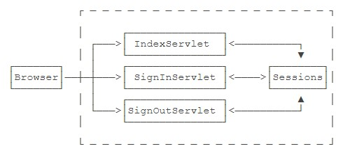
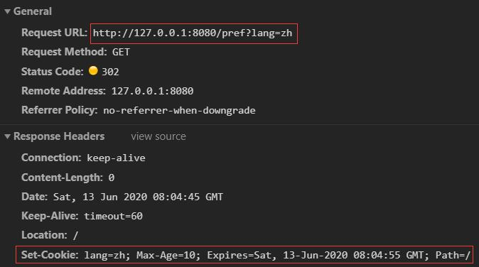
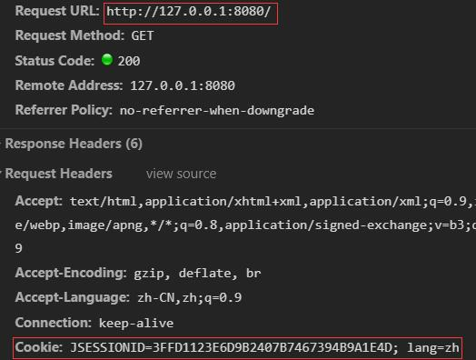
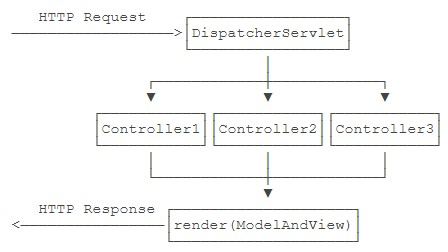

# 开发

## Web基础

```Java
public class HTTPServer {
    public static void main(String[] args) throws IOException {
        // 一个简单的HTTP服务器，本质就是一个TCP服务器
        ServerSocket ss = new ServerSocket(8080); // 监听8080端口
        System.out.println("server is running...");
        for (; ; ) {
            Socket sock = ss.accept(); // 接收到一个socket对象，表示有客户端发起链接，通过该对象进行通信
            System.out.println("connected from " + sock.getRemoteSocketAddress());
            Thread t = new HTTPHandler(sock); // 每接收一个socket对象，就启用一个线程进行处理
            t.start();
        }
    }
}

class HTTPHandler extends Thread {
    Socket sock;

    public HTTPHandler(Socket sock) {
        this.sock = sock;
    }

    @Override
    public void run() {
        // 获取socket对象的输入流和输出流，即HTTP请求和HTTP响应，传递给处理函数
        try (InputStream input = this.sock.getInputStream()) {
            try (OutputStream output = this.sock.getOutputStream()) {
                this.handle(input, output);
            }
        } catch (Exception e) {
            try {
                this.sock.close(); // 关闭socket对象的同时，输入输出流也被关闭
            } catch (IOException ioe) {
                ioe.printStackTrace();
            }
            System.out.println("client disconnected.");
        }
    }

    private void handle(InputStream input, OutputStream output) throws IOException {
        System.out.println("Process new http request...");
        // 将字节流转换为缓冲字符流，方便进行处理
        BufferedWriter writer = new BufferedWriter(new OutputStreamWriter(output, StandardCharsets.UTF_8));
        BufferedReader reader = new BufferedReader(new InputStreamReader(input, StandardCharsets.UTF_8));
        boolean requestOk = false;
        String first = reader.readLine(); // 读取请求消息的第一行即请求行
        if (first.startsWith("GET / HTTP/1.")) {
            // GET方法访问，URI即访问目标为路径/，HTTP版本为1.0或1.1
            requestOk = true;
        }
        for (; ; ) {
            String header = reader.readLine(); // 读取请求消息中的消息头，一直读取到空行为止
            if (header.isEmpty())
                break;
            System.out.println(header);
        }
        // 根据请求行确定响应消息
        System.out.println(requestOk ? "Response OK" : "Response Error");
        if (!requestOk) {
            writer.write("404 Not Found\r\n"); // 状态行
            writer.write("Content-Length: 0\r\n"); // 消息头
            writer.write("\r\n"); // 空行之后是消息体，无内容
            writer.flush();
        } else {
            String data = "<html><body><h1>Hello, World!</h1></body></html>"; // 消息体内容
            int length = data.getBytes(StandardCharsets.UTF_8).length;
            writer.write("HTTP/1.0 200 OK\r\n"); // 状态行，HTTP版本/状态码/响应短语
            writer.write("Connection: close\r\n"); // 消息头一
            writer.write("Content-Type: text/html\r\n"); // 消息头二
            writer.write("Content-Length: " + length + "\r\n"); // 消息头三
            writer.write("\r\n"); // 空行
            writer.write(data); // 消息体
            writer.flush();
        }
    }
}
```


## Servlet入门

- 在JavaEE平台上，处理TCP连接，解析HTTP协议这些底层工作统统扔给现成的Web服务器去做，我们只需要把自己的应用程序跑在Web服务器上。为了实现这一目的，JavaEE提供了Servlet API，我们使用Servlet API编写自己的Servlet来处理HTTP请求，Web服务器实现Servlet API接口，实现底层功能。  
    
- 编写Web应用程序就是编写Servlet处理HTTP请求；Servlet API提供了HttpServletRequest和HttpServletResponse两个高级接口来封装HTTP请求和响应；Web应用程序必须按**固定结构**组织并打包为.war文件；需要启动Web服务器来加载我们的war包来运行Servlet。
- 一个Servlet总是继承自HttpServlet，然后覆写doGet()或doPost()方法。注意到doGet()方法传入了HttpServletRequest和HttpServletResponse两个对象，分别代表HTTP请求和响应。我们使用Servlet API时，并不直接与底层TCP交互，也不需要解析HTTP协议，因为HttpServletRequest和HttpServletResponse就已经封装好了请求和响应。以发送响应为例，我们只需要设置正确的响应类型，然后获取PrintWriter，写入响应即可。

    ```Java
    @WebServlet(urlPatterns = "/") // WebServlet注解表示这是一个Servlet，并映射到地址/
    public class HelloServlet extends HttpServlet {
        @Override
        protected void doGet(HttpServletRequest req, HttpServletResponse resp) throws ServletException, IOException {
            LocalTime t = LocalTime.now();
            resp.setContentType("text/html"); // 设置消息体类型
            PrintWriter pw = resp.getWriter(); // 获取输出流
            pw.println("<h1>Hello, World!</h1>"); // 写入消息体
            pw.print("<h1>" + t + "</h1>");
            pw.flush(); // 强制输出
        }
    }
    ```

    

- **为啥路径是/hello/而不是/。因为一个Web服务器允许同时运行多个Web App，而我们的Web App叫hello，因此，第一级目录/hello表示Web App的名字，后面的/才是我们在HelloServlet中映射的路径。**
- 类似Tomcat这样的服务器也是Java编写的，启动Tomcat服务器实际上是启动Java虚拟机，执行Tomcat的main()方法，然后由Tomcat负责加载我们的.war文件，并创建一个HelloServlet实例，最后以多线程的模式来处理HTTP请求。如果Tomcat服务器收到的请求路径是/（假定部署文件为ROOT.war），就转发到HelloServlet并传入HttpServletRequest和HttpServletResponse两个对象。
- 因为我们编写的Servlet并不是直接运行，而是由Web服务器加载后创建实例运行，所以，类似Tomcat这样的Web服务器也称为Servlet容器。
- 在Servlet容器中运行的Servlet具有如下特点：无法在代码中直接通过new创建Servlet实例，必须由Servlet容器自动创建Servlet实例；Servlet容器只会给每个Servlet类创建**唯一实例**；Servlet容器会使用**多线程**执行doGet()或doPost()方法。
- 因此，在Servlet中定义的**实例变量**会被多个线程同时访问，要注意线程安全；**HttpServletRequest和HttpServletResponse实例是由Servlet容器传入的局部变量，它们只能被当前线程访问，不存在多个线程访问的问题**；在doGet()或doPost()方法中，如果使用了ThreadLocal，但没有清理，那么它的状态很可能会影响到下次的某个请求，因为Servlet容器很可能用线程池实现线程复用。
- 正确编写Servlet，要清晰理解Java的多线程模型，需要同步访问的必须同步。

### 小结

> 使用idea新建一个maven web项目，新建后删除webapp文件夹中的index.jsp文件，在WEB-INF目录中放置web.xml文件，在webapp同级目录中新建java和resources文件夹。  
> 引入servlet-api依赖，注意api版本和之后部署的tomcat版本需要对应，例如tomcat9支持的是servlet 4.0。  
> 编写servlet程序映射指定路径，在doGet()或doPost()方法中进行请求和响应的处理。  
> 使用mvn clean package将项目打包为war包，放置在tomcat安装目录中的webapps文件夹中，切换到bin目录，使用startup.bat启动tomcat服务器，使用shutdown.bat关闭tomcat服务器。

## Servlet开发

- Tomcat实际上也是一个Java程序，我们看看Tomcat的启动流程：启动JVM并执行Tomcat的main()方法；加载war并初始化Servlet；正常服务。
- 启动Tomcat无非就是设置好classpath并执行Tomcat某个jar包的main()方法，我们完全可以把Tomcat的jar包全部引入进来，然后自己编写一个main()方法，先启动Tomcat，然后让它加载我们的webapp就行。
- 引入依赖tomcat-embed-core和tomcat-embed-jasper，不必引入Servlet API，因为引入Tomcat依赖后自动引入了Servlet API。

```Java
public class Main {
    public static void main(String[] args) throws Exception {
        // 启动Tomcat:
        Tomcat tomcat = new Tomcat();
        tomcat.setPort(Integer.getInteger("port", 8080));
        tomcat.getConnector();
        // 创建webapp:
        Context ctx = tomcat.addWebapp("", new File("src/main/webapp").getAbsolutePath());
        WebResourceRoot resources = new StandardRoot(ctx);
        resources.addPreResources(
                new DirResourceSet(resources, "/WEB-INF/classes", new File("target/classes").getAbsolutePath(), "/"));
        ctx.setResources(resources);
        tomcat.start();
        tomcat.getServer().await();
    }
}
```

- 直接运行main()方法，即可启动嵌入式Tomcat服务器，然后，通过预设的tomcat.addWebapp("", new File("src/main/webapp")，Tomcat会自动加载当前工程作为**根webapp**。
- 通过main()方法启动Tomcat服务器并加载我们自己的webapp有如下好处：启动简单，无需下载Tomcat或安装任何IDE插件；调试方便，可在IDE中使用断点调试；使用Maven创建war包后，也可以正常部署到独立的Tomcat服务器中。
- 开发Servlet时，推荐使用main()方法启动嵌入式Tomcat服务器并加载当前工程的webapp，便于开发调试，且不影响打包部署，能极大地提升开发效率。


## Servlet进阶

- 早期的Servlet需要在web.xml中配置映射路径，但最新Servlet版本只需要通过注解就可以完成映射。
- 一个Webapp中的多个Servlet依靠路径映射来处理不同的请求；
- **映射为/的Servlet可处理所有“未匹配”的请求**；
- 如何处理请求取决于Servlet覆写的对应方法；
- Web服务器通过多线程处理HTTP请求，**一个Servlet的处理方法可以由多线程并发执行**。
- 一个Servlet类在服务器中只有一个实例，但对于每个HTTP请求，Web服务器会使用多线程执行请求。因此，一个Servlet的doGet()、doPost()等处理请求的方法是多线程并发执行的。**如果Servlet中定义了字段**，要注意多线程并发访问的问题。
- **对于每个请求，Web服务器会创建唯一的HttpServletRequest和HttpServletResponse实例，因此，HttpServletRequest和HttpServletResponse实例只有在当前处理线程中有效，它们总是局部变量，不存在多线程共享的问题**。

### 重定向与转发

#### Redirect

- 重定向是指当浏览器请求一个URL时，服务器返回一个重定向指令，告诉浏览器地址已经变了，麻烦使用新的URL再重新发送新请求。

    ```Java
    @WebServlet(urlPatterns = "/hi")
    public class RedirectServlet extends HttpServlet {
        @Override
        protected void doGet(HttpServletRequest req, HttpServletResponse resp) throws ServletException, IOException {
            // 构造重定向路径
            String name = req.getParameter("name");
            String redirectToUrl = "/hello" + (name == null ? "" : "?name=" + name);
            // 如果浏览器发送 GET /hi 请求，将发送一个重定向响应
            resp.sendRedirect(redirectToUrl); // 临时重定向
        }
    }
    ```

    

- 当浏览器收到302响应后，它会立刻根据Location的指示发送一个新的GET /hello请求，这个过程就是重定向。

    

- 可以观察到浏览器发送了两次HTTP请求，并且浏览器的地址栏路径自动更新为/hello。

    

- 重定向有两种：一种是302响应，称为临时重定向，一种是301响应，称为永久重定向。两者的区别是，如果服务器发送301永久重定向响应，浏览器会**缓存**/hi到/hello这个重定向的关联，下次请求/hi的时候，浏览器就直接发送/hello请求了。

    ```Java
    // 实现301永久重定向的做法
    resp.setStatus(HttpServletResponse.SC_MOVED_PERMANENTLY);
    resp.setHeader("Location", redirectToUrl);
    ```

- 当使用301永久重定向时的几个注意点：1.第一次访问的路径会被缓存，再次访问时控制台会显示该重定向来自缓存。2.启用301永久重定向时的所有访问路径都会被缓存，如果之后切换为302临时重定向，此时被缓存的路径仍然以301响应码进行返回，新的路径则以302响应码进行返回。3.如果想要禁止路径缓存，可以在控制台中选择disable cache。

    

    

- **重定向的目的是当Web应用升级后，如果请求路径发生了变化，可以将原来的路径重定向到新路径，从而避免浏览器请求原路径找不到资源。**

#### Forward

- Forward是指内部转发。当一个Servlet处理请求的时候，它可以决定自己不继续处理，而是转发给另一个Servlet处理。
- **转发和重定向的区别在于，转发是在Web服务器内部完成的，对浏览器来说，它只发出了一个HTTP请求。**

    

    ```Java
    @WebServlet(urlPatterns = "/morning")
    public class ForwardServlet extends HttpServlet {
        @Override
        protected void doGet(HttpServletRequest req, HttpServletResponse resp) throws ServletException, IOException {
            // 把请求和响应都转发给映射路径为/hello的Servlet。
            req.getRequestDispatcher("/hello").forward(req, resp);
        }
    }
    ```

- 注意到使用转发的时候，浏览器的地址栏路径仍然是/morning，浏览器并不知道该请求在Web服务器内部实际上做了一次转发。

### 使用Session和Cookie

- 在Web应用程序中，我们经常要跟踪用户身份。当一个用户登录成功后，如果他继续访问其它页面，Web程序如何才能识别出该用户身份。
- 因为HTTP协议是一个无状态协议，即Web应用程序无法区分收到的两个HTTP请求是否是**同一个浏览器**发出的。为了跟踪用户状态，服务器可以向浏览器分配一个唯一ID，并以Cookie的**形式**发送到浏览器，浏览器在后续访问时总是附带此Cookie，这样，服务器就可以识别用户身份。
- 会向本地的Chrome和Edge分配两个ID，但不会给Chrome和Chrome无痕模式分配两个ID，即无痕模式不能当作是一个新的客户端。
- 我们把这种基于唯一ID识别用户身份的**机制**称为Session。每个用户第一次访问服务器后，会自动获得一个Session ID。如果用户在一段时间内没有访问服务器，那么Session会自动失效，下次即使带着上次分配的Session ID访问，服务器也认为这是一个新用户，会分配新的Session ID。
- stackoverflow上有关session和cookie关系的回答：[参考链接](https://stackoverflow.com/questions/32563236/relation-between-sessions-and-cookies)
- 对于Web应用程序来说，我们总是通过HttpSession这个高级接口访问当前Session。如果要深入理解Session原理，**可以认为Web服务器在内存中自动维护了一个ID到HttpSession的映射表**。

    

- 而服务器识别Session的关键就是依靠一个名为JSESSIONID的Cookie。**在Servlet中第一次调用req.getSession()时**，Servlet容器自动创建一个Session ID，然后通过一个名为JSESSIONID的Cookie发送给浏览器。
- 注意事项：**JSESSIONID是由Servlet容器自动创建的**，目的是维护一个浏览器会话，它和我们的登录逻辑没有关系；**登录和登出的业务逻辑是我们自己根据HttpSession是否存在一个"user"的Key判断的，登出后，Session ID并不会改变**；即使没有登录功能，仍然可以使用HttpSession追踪用户，例如，放入一些用户配置信息等。
- 容器在其它情况下是否会创建JSESSIONID不是我们能够控制的，例如当你将请求和响应转发至JSP文件时，服务器同样会创建一个JSESSIONID发送给客户端。
- 除了使用Cookie机制可以实现Session外，还可以通过隐藏表单、URL末尾附加ID来追踪Session。这些机制很少使用，最常用的Session机制仍然是Cookie。
- 使用Session时，由于服务器把所有用户的Session都存储在内存中，如果遇到内存不足的情况，就需要把部分不活动的Session序列化到磁盘上，这会大大降低服务器的运行效率，因此，放入Session的对象要小，通常我们在value放入一个简单的User对象就足够了。

    ```Java
    public class User {
        public long id; // 唯一标识
        public String email;
        public String name;
    }
    ```

- **使用Session机制，会使得Web Server的集群很难扩展，因此，Session适用于中小型Web应用程序。对于大型Web应用程序来说，通常需要避免使用Session机制。**
- 一些使用总结：

    > 在servlet中**第一次**调用了req.getSession()时，会创建一个HttpSession对象至sessions当中，用一个sessionID映射该对象并以一个名为JSESSIONID的cookie发送给浏览器进行存储。  
    > 有几个不同的浏览器发送请求至该服务器就会创建几个HttpSession对象，浏览器存储过cookie之后**再次访问相同的域名时**每次请求消息的消息头都会携带该cookie直至过期或被替换。  
    > 此后在servlet中多次调用req.getSession()时便会根据这个名为JSESSIONID的cookie到sessions中找到对应的HttpSession对象，于是开发者可以基于这个对象进行业务逻辑的编写。  
    > 服务器重启之后所有的会话对象都会消失，sessionID是由容器创建的。  

- 实际上，Servlet提供的HttpSession本质上就是通过一个名为JSESSIONID的Cookie来跟踪用户会话的。除了这个名称外，其它名称的Cookie我们可以任意使用。

    ```Java
    @WebServlet(urlPatterns = "/pref")
    public class LanguageServlet extends HttpServlet {
        private final Set<String> LANGUAGES;

        public LanguageServlet() {
            this.LANGUAGES = new CopyOnWriteArraySet<>();
            this.LANGUAGES.add("en");
            this.LANGUAGES.add("zh");
        }
        // 当客户端访问/pref?lang=xx路径时，根据参数设置一个cookie记录用户选择的语言
        @Override
        protected void doGet(HttpServletRequest req, HttpServletResponse resp) throws ServletException, IOException {
            String lang = req.getParameter("lang");
            if (this.LANGUAGES.contains(lang)) {
                Cookie cookie = new Cookie("lang", lang);
                // 设置生效范围
                cookie.setPath("/");
                // 设置有效日期
                cookie.setMaxAge(8640000);
                // 添加到响应当中
                resp.addCookie(cookie);
            }
            resp.sendRedirect("/");
        }
    }
    ```

    

    

- 创建一个新Cookie时，除了指定名称和值以外，通常需要设置setPath("/")，浏览器根据此前缀决定是否发送Cookie。如果一个Cookie调用了setPath("/user/")，那么浏览器只有在请求以/user/开头的路径时才会附加此Cookie。通过setMaxAge()设置Cookie的有效期，单位为秒，最后通过resp.addCookie()把它添加到响应。
- 如果访问的是https网页，还需要调用setSecure(true)，否则浏览器不会发送该Cookie。
- 务必注意：**浏览器在请求某个URL时，是否携带指定的Cookie，取决于Cookie是否满足以下所有要求：URL前缀是设置Cookie时的Path；Cookie在有效期内；Cookie设置了secure时必须以https访问**。
- 读取Cookie主要依靠遍历HttpServletRequest附带的所有Cookie。

    ```Java
    private String parseLanguageFromCookie(HttpServletRequest req) {
        // 获取请求附带的所有Cookie
        Cookie[] cookies = req.getCookies();
        // 如果获取到Cookie
        if (cookies != null) {
            // 循环每个Cookie
            for (Cookie cookie : cookies)
                // 如果Cookie名称为lang
                if (cookie.getName().equals("lang"))
                    // 返回Cookie的值
                    return cookie.getValue();
        }
        return "None";
    }
    ```

## JSP开发

- JSP是Java Server Pages的缩写，它的文件必须放到/src/main/webapp下，文件名必须以.jsp结尾，整个文件与HTML并无太大区别，但需要插入变量，或者动态输出的地方，使用特殊指令<% ... %>。
- 整个JSP的内容实际上是一个HTML，但是稍有不同：包含在<%--和--%>之间的是JSP的注释，它们会被完全忽略；包含在<%和%>之间的是Java代码，可以编写任意Java代码；如果使用<%= xxx %>则可以快捷输出一个变量的值。
- JSP页面内置了几个变量：out：表示HttpServletResponse的PrintWriter；session：表示当前HttpSession对象；request：表示HttpServletRequest对象。这几个变量可以直接使用。
- 访问JSP页面时，可以直接指定完整路径进行访问。
- JSP和Servlet有什么区别。其实它们没有任何区别，因为JSP在执行前首先被编译成一个Servlet。在Tomcat的临时目录下，可以找到一个hello_jsp.java的源文件，这个文件就是Tomcat把JSP自动转换成的Servlet源码。
- 可见JSP本质上就是一个Servlet，只不过无需配置映射路径，Web Server会根据路径查找对应的.jsp文件，如果找到了，就自动编译成Servlet再执行。在服务器运行过程中，如果修改了JSP的内容，那么服务器会自动重新编译。
- JSP是一种在HTML中嵌入动态输出的文件，它和Servlet正好相反，Servlet是在Java代码中嵌入输出HTML。

## MVC开发

- Servlet适合编写Java代码，实现各种复杂的业务逻辑，但不适合输出复杂的HTML；JSP适合编写HTML，并在其中插入动态内容，但不适合编写复杂的Java代码。
- 需要展示的User被放入HttpServletRequest中以便传递给JSP，因为**一个请求对应一个HttpServletRequest**，我们也无需清理它，处理完该请求后HttpServletRequest实例将被丢弃；
- **把user.jsp放到/WEB-INF/目录下，是因为WEB-INF是一个特殊目录，Web Server会阻止浏览器对WEB-INF目录下任何资源的访问，这样就防止用户通过/user.jsp路径直接访问到JSP页面**；
- JSP页面首先从request变量获取User实例，然后在页面中直接输出，此处未考虑HTML的转义问题，有潜在安全风险。
- 我们把UserServlet看作业务逻辑处理，把User看作模型，把user.jsp看作渲染，这种设计模式通常被称为MVC：Model-View-Controller，即UserServlet作为控制器（Controller），User作为模型（Model），user.jsp作为视图（View）。
- 使用MVC模式的好处是，Controller专注于业务处理，它的处理结果就是Model。Model可以是一个JavaBean，也可以是一个包含多个对象的Map，Controller只负责把Model传递给View，View只负责把Model给“渲染”出来，这样，三者职责明确，且开发更简单，**因为开发Controller时无需关注页面，开发View时无需关心如何创建Model**。
- MVC模式是一种分离**业务逻辑**和**显示逻辑**的设计模式，广泛应用在Web和桌面应用程序。

## MVC高级开发

- 直接把MVC搭在Servlet和JSP之上还是不太好：**Servlet提供的接口仍然偏底层**，需要实现Servlet调用相关接口；JSP对页面开发不友好，更好的替代品是**模板引擎**；**业务逻辑最好由纯粹的Java类实现**，而不是强迫继承自Servlet。
- 最早的开发是从套接字的通讯流分别获取输入流和输出流，从输入流中分析出完整的请求消息，书写完整的响应消息到输出流中完成一次开发。后来有了servlet-api包，它在底层分别封装了输入流和输出流为request对象和response对象，我们通过在这两个对象上调用各种现成的方法来进行开发。
- 一个MVC框架是**基于Servlet基础抽象出更高级的接口**，使得上层基于MVC框架的开发可以**不涉及Servlet相关的HttpServletRequest等接口**，处理多个请求更加灵活，并且可以使用任意模板引擎，不必使用JSP。
- 能不能通过普通的Java类实现MVC的Controller。

    ```Java
    public class UserController {
        // 如果是GET请求，我们希望MVC框架能直接把URL参数按方法参数对应起来然后传入。
        @GetMapping("/hello")
        public ModelAndView hello(String name) {
            ...
        }
        // 如果是POST请求，我们希望MVC框架能直接把Post参数变成一个JavaBean后通过方法参数传入。
        @PostMapping("/signin")
        public ModelAndView doSignin(SignInBean bean) {
            ...
        }
        // 为了增加灵活性，如果Controller的方法在处理请求时需要访问HttpServletRequest、HttpServletResponse、HttpSession这些实例时，只要方法参数有定义，就可以自动传入。
        @GetMapping("/signout")
        public ModelAndView signout(HttpSession session) {
            ...
        }
    }
    ```

- 在上文中，我们已经定义了上层代码编写Controller的一切接口信息，并且并不要求实现特定接口，只需返回ModelAndView对象，该对象包含一个View和一个Model。实际上View就是模板的路径，而Model可以用一个`Map<String, Object>`表示，因此，ModelAndView定义非常简单。

    ```Java
    public class ModelAndView {
        Map<String, Object> model;
        String view;
    }
    ```

- 比较复杂的是我们需要在MVC框架中**创建一个接收所有请求的Servlet**，通常我们把它命名为DispatcherServlet，它总是映射到/，然后，**根据不同的Controller的方法定义的@Get或@Post的Path决定调用哪个方法**，最后，获得方法返回的ModelAndView后，渲染模板，写入HttpServletResponse，即完成了整个MVC的处理。

    

- 其中，DispatcherServlet以及如何渲染均由MVC框架实现，**在MVC框架之上只需要编写每一个Controller**。
- [MVC高级开发](https://www.liaoxuefeng.com/wiki/1252599548343744/1337408645759009)。
- 一个MVC框架是基于Servlet基础抽象出更高级的接口，使得上层基于MVC框架的开发可以不涉及Servlet相关的HttpServletRequest等接口，处理多个请求更加灵活，并且可以使用任意模板引擎，不必使用JSP。
- 使用MVC框架后浏览器访问路径/hello的一个处理流程：容器实例化了映射路径为/的Servlet-`DispatcherServlet`，实例化后自动调用了该Servlet中定义的`init()`方法，该方法内部将所有被扫描到的controller类中定义的所有方法和方法使用的注解当中的映射路径进行绑定；以GET方式请求/hello路径于是调用了DispatcherServlet中的`doGet`方法，doGet方法转而调用了`process`方法；在process方法内部首先获取映射了/hello路径的来自IndexController类中的hello()方法封装后的`dispatcher`，这是一个GetDispatcher；之后调用GetDispatcher的`invoke`方法，该方法内部构造了方法所需的实参列表，并再次通过反射传入实参调用`hello()`方法，获得由hello()方法返回的`ModelAndView`对象；在process方法末尾将模板引擎渲染后的数据写入到响应当中。

    

- 基于上述MVC框架的底层封装，开发者只需编写Controller类，写好注解映射路径，以及Model和View之间的绑定关系。
