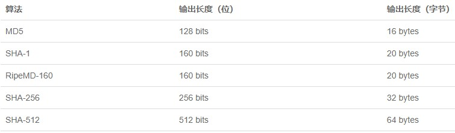
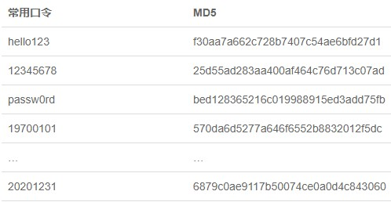
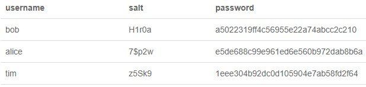

# 加密与安全

## 哈希算法

哈希算法（Hash）又称摘要算法（Digest），它的作用是：对任意一组输入数据进行计算，得到一个固定长度的输出摘要。哈希算法最重要的特点就是：相同的输入一定得到相同的输出；不同的输入大概率得到不同的输出。哈希算法的目的就是为了验证原始数据是否被篡改。

Java字符串的hashCode()就是一个哈希算法，它的输入是任意字符串，输出是固定的4字节int整数。两个相同的字符串永远会计算出相同的hashCode，否则基于hashCode定位的HashMap就无法正常工作。这也是为什么当我们自定义一个class时，覆写equals()方法时我们必须正确覆写hashCode()方法。

哈希碰撞是指，两个不同的输入得到了相同的输出。碰撞是一定会出现的，因为输出的字节长度是固定的，String的hashCode()输出是4字节整数，最多只有4294967296种输出，但输入的数据长度是不固定的，有无数种输入。所以，哈希算法是把一个**无限的输入集合映射到一个有限的输出集合**，必然会产生碰撞。

碰撞不可怕，我们担心的不是碰撞，而是碰撞的概率，因为碰撞概率的高低关系到哈希算法的安全性。一个安全的哈希算法必须满足：碰撞概率低；不能猜测输出。不能猜测输出是指，输入的任意一个bit的变化会造成输出完全不同，这样就很难从输出反推输入（只能依靠暴力穷举）。**安全的哈希算法从输出是看不出任何规律的**。



根据碰撞概率，**哈希算法的输出长度越长，就越难产生碰撞，也就越安全**。

Java标准库提供了常用的哈希算法，并且有一套统一的接口。使用MessageDigest时，我们首先根据哈希算法获取一个MessageDigest实例，然后，反复调用update()输入数据。当输入结束后，调用digest()方法获得byte[]数组表示的摘要，最后，把它转换为十六进制的字符串。

```Java
MessageDigest md = MessageDigest.getInstance("MD5");
md.update("Hello".getBytes(StandardCharsets.UTF_8));
md.update("World".getBytes(StandardCharsets.UTF_8));
byte[] result = md.digest(); // 16 Bytes
System.out.println(new BigInteger(1, result).toString(16));
```

因为相同的输入永远会得到相同的输出，因此，如果输入被修改了，得到的输出就会不同。我们只需要自己计算一下本地文件的哈希值，再与官网公开的哈希值对比，如果相同，说明文件下载正确，否则，说明文件已被篡改。哈希算法的另一个重要用途是存储用户口令。如果直接将用户的原始口令存放到数据库中，会产生极大的安全风险：数据库管理员能够看到用户明文口令；数据库数据一旦泄漏，黑客即可获取用户明文口令。

不存储用户的原始口令。存储用户口令的哈希。在用户输入原始口令后，系统计算用户输入的原始口令的MD5并与数据库存储的MD5对比，如果一致，说明口令正确，否则，口令错误。这样一来，数据库管理员看不到用户的原始口令。即使数据库泄漏，黑客也无法拿到用户的原始口令。想要拿到用户的原始口令，必须用暴力穷举的方法，一个口令一个口令地试，直到某个口令计算的MD5恰好等于指定值。

**使用哈希口令时，还要注意防止彩虹表攻击**。上面讲到了，如果只拿到MD5，从MD5反推明文口令，只能使用暴力穷举的方法。然而黑客并不笨，暴力穷举会消耗大量的算力和时间。但是，如果有**一个预先计算好的常用口令和它们的MD5的对照表**。这个表就是彩虹表。如果用户使用了常用口令，黑客从MD5一下就能反查到原始口令。这就是为什么不要使用常用密码，以及不要使用生日作为密码的原因。

即使用户使用了常用口令，我们也可以采取措施来抵御彩虹表攻击，方法是对每个口令额外添加随机数，这个方法称之为**加盐（salt）**。





加盐的目的在于使黑客的彩虹表失效，即使用户使用常用口令，也无法从MD5反推原始口令。

**MD5因为输出长度较短，短时间内破解是可能的，目前已经不推荐使用**。

```Java
MessageDigest md = MessageDigest.getInstance("SHA-1");
md.update("Hello".getBytes(StandardCharsets.UTF_8));
md.update("World".getBytes(StandardCharsets.UTF_8));
byte[] result = md.digest(); //  20 Bytes
System.out.println(new BigInteger(1, result).toString(16));
```

哈希算法可用于验证数据完整性，具有防篡改检测的功能；常用的哈希算法有MD5、SHA-1等；用哈希存储口令时要考虑彩虹表攻击。
