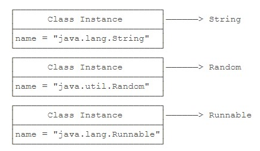
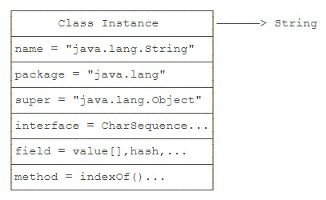

# 什么是反射

- 反射是为了解决在运行期，对某个实例一无所知的情况下，如何调用其方法。

## Class类

- 仔细思考，我们可以得出结论：class（包括interface）的本质是数据类型（Type）。无继承关系的数据类型无法赋值。
- 而class是由JVM在执行过程中动态加载的。JVM在第一次读取到一种class类型时，将其加载进内存。
- 每加载一种class，JVM就为其创建一个Class类型的实例，并关联起来。注意：这里的Class类型是一个名叫Class的class。

    ```Java
    public final class Class {
        private Class() {}
    }
    ```

- 以String类为例，当JVM加载String类时，它首先读取String.class文件到内存，然后，为String类创建一个Class实例并关联起来。

    ```Java
    Class cls = new Class(String);
    ```

- 这个Class实例是JVM内部创建的，如果我们查看JDK源码，可以发现Class类的构造方法是private，只有JVM能创建Class实例，我们自己的Java程序是无法创建Class实例的。
- 所以，JVM持有的每个Class实例都指向一个数据类型（class或interface）。

    

- 一个Class实例包含了该class的所有完整信息。

    

- **由于JVM为每个加载的class创建了对应的Class实例**，并在实例中保存了该class的所有信息，包括类名、包名、父类、实现的接口、所有方法、字段等，因此，如果获取了某个Class实例，我们就可以通过这个Class实例获取到该实例对应的class的所有信息。**是获取已经被定义好的class信息，不是获取实例化后的对象信息**。
- **这种通过Class实例获取class信息的方法称为反射（Reflection）**。

    ```Java
    // 直接通过一个class的静态变量class获取
    Class cls = String.class;
    // 如果我们有一个实例变量，可以通过该实例变量提供的getClass()方法获取
    String s = "Hello";
    Class cls = s.getClass();
    // 如果知道一个class的完整类名，可以通过静态方法Class.forName()获取
    Class cls = Class.forName("java.lang.String");
    ```

- **因为Class实例在JVM中是唯一的**，所以，上述方法获取的Class实例是同一个实例。可以用==比较两个Class实例。
- 用instanceof不但匹配指定类型，还匹配指定类型的子类。而用==判断class实例可以精确地判断数据类型，但不能作子类型比较。
- **通常情况下，我们应该用instanceof判断数据类型，因为面向抽象编程的时候，我们不关心具体的子类型**。只有在需要精确判断一个类型是不是某个class的时候，我们才使用==判断class实例。
- 因为反射的目的是为了获得某个实例的信息。因此，当我们拿到某个Object实例时，我们可以通过反射获取该Object的class信息。

    ```Java
    public class Main {
        public static void main(String[] args) {
            printClassInfo("".getClass());
            printClassInfo(Runnable.class);
            printClassInfo(java.time.Month.class);
            printClassInfo(String[].class);
            printClassInfo(int.class);
        }

        static void printClassInfo(Class cls) {
            System.out.println("Class name: " + cls.getName());                    // 完整类名
            System.out.println("Simple name: " + cls.getSimpleName());             // 类名
            if (cls.getPackage() != null)
                System.out.println("Package name: " + cls.getPackage().getName()); // 包名
            System.out.println("is interface: " + cls.isInterface());              // 是否为接口
            System.out.println("is enum: " + cls.isEnum());                        // 是否为枚举
            System.out.println("is array: " + cls.isArray());                      // 是否为数组
            System.out.println("is primitive: " + cls.isPrimitive());              // 是否为基本类型
        }
    }
    ```

- 注意到数组（例如String[]）也是一种Class，而且不同于String.class，它的类名是[Ljava.lang.String。此外，JVM为每一种基本类型如int也创建了Class，通过int.class访问。
- 如果获取到了一个Class实例，我们就可以通过该Class实例来创建对应类型的实例。

    ```Java
    Class cls = String.class;
    String s = (String) cls.newInstance();
    ```

- 上述代码相当于new String()。通过Class.newInstance()可以创建类实例，它的局限是：**只能调用public的无参数构造方法**。带参数的构造方法，或者非public的构造方法都无法通过Class.newInstance()被调用。
- JVM在执行Java程序的时候，并不是一次性把所有用到的class全部加载到内存，而是第一次需要用到class时才加载。这就是JVM**动态加载**class的特性。。
- 动态加载class的特性对于Java程序非常重要。利用JVM动态加载class的特性，我们才能在**运行期**根据条件加载不同的实现类。例如，Commons Logging总是优先使用Log4j，只有当Log4j不存在时，才使用JDK的logging。这就是为什么我们只需要把Log4j的jar包放到classpath中，Commons Logging就会自动使用Log4j的原因。

    ```Java
    // Commons Logging优先使用Log4j
    LogFactory factory = null;
    if (isClassPresent("org.apache.logging.log4j.Logger")) {
        factory = createLog4j();
    } else {
        factory = createJdkLog();
    }

    boolean isClassPresent(String name) {
        try {
            // 尝试使用该class的完整类名来获取对应的Class实例
            Class.forName(name);
            return true;
        } catch (Exception e) {
            return false;
        }
    }
    ```

## 访问字段

- Field getField(name)：根据字段名获取某个public的field（包括父类）。
- Field getDeclaredField(name)：根据字段名获取当前类的某个field（不包括父类）。
- Field[] getFields()：获取所有public的field（包括父类）。
- Field[] getDeclaredFields()：获取当前类的所有field（不包括父类）。

```Java
public class Person {
    public String name;
}
public class Student extends Person {
    public int score;
    private int grade;
}
public static void main(String[] args) throws NoSuchFieldException {
    Class stdClass = Student.class;                         // 获取Student的Class实例
    System.out.println(stdClass.getField("score"));         // 获取public字段
    System.out.println(stdClass.getField("name"));          // 获取继承的public字段
    System.out.println(stdClass.getDeclaredField("grade")); // 获取private字段
    /*
     * 修饰符/数据类型/完整字段名
     * public int com.cat.reflection.Student.score
     * public java.lang.String com.cat.reflection.Person.name
     * private int com.cat.reflection.Student.grade
     */
}
```

- getName()：返回字段名称，例如，"name"。
- getType()：返回字段类型，也是一个Class实例，例如，String.class。
- getModifiers()：返回字段的修饰符，它是一个int，不同的bit表示不同的含义。

```Java
Field f = String.class.getDeclaredField("value");
System.out.println(f.getName());
System.out.println(f.getType());
int m = f.getModifiers();
System.out.println(Modifier.isFinal(m));
System.out.println(Modifier.isPublic(m));
System.out.println(Modifier.isProtected(m));
System.out.println(Modifier.isPrivate(m));
System.out.println(Modifier.isStatic(m));
```
