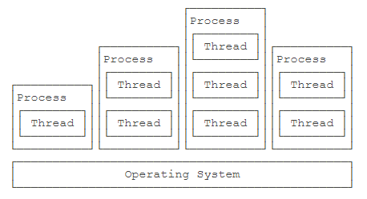
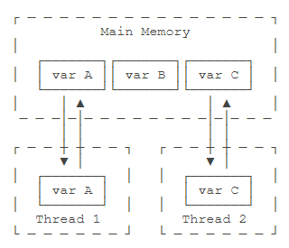

# 多线程

## 多线程基础

- CPU执行代码都是一条一条顺序执行的，但是，即使是单核cpu，也可以同时运行多个任务。因为操作系统执行多任务实际上就是让CPU对多个任务轮流交替执行。即使是多核CPU，因为通常任务的数量远远多于CPU的核数，所以任务也是交替执行的。
- 在计算机中，我们把**一个任务称为一个进程**，浏览器就是一个进程，视频播放器是另一个进程，类似的，音乐播放器和Word都是进程。
- 某些**进程内部还需要同时执行多个子任务**。例如，我们在使用Word时，Word可以让我们一边打字，一边进行拼写检查，同时还可以在后台进行打印，我们**把子任务称为线程**。
- 进程和线程的关系就是：一个进程可以包含一个或多个线程，但至少会有一个线程。  
    
- **操作系统调度的最小任务单位其实不是进程，而是线程**。常用的Windows、Linux等操作系统都采用抢占式多任务，**如何调度线程完全由操作系统决定，程序自己不能决定什么时候执行，以及执行多长时间**。
- 因为同一个应用程序，既可以有多个进程，也可以有多个线程，因此，实现多任务的方法，有以下几种：多进程模式（每个进程只有一个线程）；多线程模式（一个进程有多个线程）；多进程＋多线程模式（复杂度最高）。
- 进程和线程是包含关系，但是多任务既可以由多进程实现，也可以由单进程内的多线程实现，还可以混合多进程＋多线程。
- 和多线程相比，多进程的缺点在于：**创建进程比创建线程开销大**，尤其是在Windows系统上；进程间通信比线程间通信要慢，因为**线程间通信就是读写同一个变量**，速度很快。多进程的优点在于：**多进程稳定性比多线程高**，因为在多进程的情况下，**一个进程崩溃不会影响其他进程**，而在多线程的情况下，**任何一个线程崩溃会直接导致整个进程崩溃**。
- Java语言内置了多线程支持：**一个Java程序实际上是一个JVM进程，JVM进程用一个主线程来执行main()方法，在main()方法内部，我们又可以启动多个线程**。此外，JVM还有负责垃圾回收的其他工作线程等。
- 对于大多数Java程序来说，我们说多任务，实际上是说如何**使用多线程实现多任务**。
- 和单线程相比，多线程编程的特点在于：**多线程经常需要读写共享数据，并且需要同步**。例如，播放电影时，就必须由一个线程播放视频，另一个线程播放音频，两个线程需要协调运行，否则画面和声音就不同步。因此，多线程编程的复杂度高，调试更困难。
- Java多线程编程的特点又在于：多线程模型是Java程序最基本的并发模型；后续读写网络、数据库、Web开发等都依赖Java多线程模型。

## 创建新线程

```Java
public class CreateThreadTest {
    public static void main(String[] args) {
        Thread t = new MyThread();
        t.start();
    }
}
// 从Thread派生一个自定义类，然后覆写run()方法
class MyThread extends Thread {
    @Override
    public void run() {
        System.out.println("start new thread!");
    }
}
```

```Java
public class CreateThreadTest {
    public static void main(String[] args) {
        // 实现了Runnable接口的子类
        Runnable r1 = new MyRunnable();
        // 有时候为只使用一次的子类单独创建一个.java文件过于浪费
        // 匿名内部类主要用于实现抽象类和接口，说白了就是一个子类，只不过它们new的对象是抽象类和接口
        Runnable r2 = new Runnable() {
            @Override
            public void run() {
                System.out.println("[anonymous subclass] start new thread!");
            }
        };
        // 由于Runnable本身是一个函数式接口，因此我们可以进一步地使用lambda表达式来简化实例过程
        Runnable r3 = () -> System.out.println("[lambda] start new thread!");
        List<Runnable> list = new ArrayList<Runnable>();
        list.add(r1);
        list.add(r2);
        list.add(r3);
        for (Runnable r : list) {
            // 创建Thread实例时，传入一个Runnable实例
            new Thread(r).start();
        }
    }
}
class MyRunnable implements Runnable {
    @Override
    public void run() {
        System.out.println("[subclass] start new thread!");
    }
}
```

- 程序本身无法确定线程的调度顺序。
- 直接调用run()方法，相当于调用了一个普通的Java方法，当前线程并没有任何改变，也不会启动新线程。
- 必须调用Thread实例的start()方法才能启动新线程，如果我们查看Thread类的源代码，会看到start()方法内部调用了一个private native void start0()方法，**native修饰符**表示这个方法是由JVM虚拟机内部的C代码实现的，不是由Java代码实现的。
- 一个线程对象只能调用一次start()方法。
- 可以对线程设定优先级，优先级高的线程被操作系统调度的优先级较高，操作系统对高优先级线程可能调度更频繁，但我们决不能通过设置优先级来确保高优先级的线程一定会先执行。

## 线程的状态

- 在Java程序中，一个线程对象只能调用一次start()方法启动新线程，并在新线程中执行run()方法。一旦run()方法执行完毕，线程就结束了。因此，Java线程的状态有以下几种：`New`：新创建的线程，尚未执行；`Runnable`：运行中的线程，正在执行run()方法的Java代码；`Blocked`：运行中的线程，因为某些操作被阻塞而挂起；`Waiting`：运行中的线程，因为某些操作在等待中；`Timed Waiting`：运行中的线程，因为执行sleep()方法正在计时等待；`Terminated`：线程已终止，因为run()方法执行完毕。  
    
- 线程终止的原因有：*线程正常终止*：run()方法执行到return语句返回；*线程意外终止*：run()方法因为未捕获的异常导致线程终止；对某个线程的Thread实例调用stop()方法强制终止（强烈不推荐使用）。
- 通过对另一个线程对象调用join()方法可以等待其执行结束；可以指定等待时间，超过等待时间线程仍然没有结束就不再等待；对已经运行结束的线程调用join()方法会立刻返回。

    ```Java
    Thread t = new Thread(() -> {
        System.out.println("hello");
    });
    System.out.println("start");
    t.start();
    // main线程等待t变量表示的线程运行结束，才继续往下执行自身线程，可以指定等待时间
    t.join();
    System.out.println("end");
    ```

## 中断线程

- 中断一个线程非常简单，只需要在其它线程中对目标线程调用interrupt()方法（发送一个中断请求），目标线程需要反复检测自身状态是否是interrupted状态，如果是，就立刻结束运行。
- isInterrupted()方法来自于父类Thread类，而函数式接口Runnable仅含有一个run()方法。

    ```Java
    public class CreateThreadTest {
        public static void main(String[] args) throws InterruptedException {
            Thread t = new MyThread();
            t.start();
            Thread.sleep(1);
            // interrupt()方法仅仅向t线程发出了“中断请求”，至于t线程是否能立刻响应，要看具体代码
            t.interrupt();
            // 中断过程也需要时间，为了保证打印语句在最后输出，在此等待t线程彻底结束
            t.join();
            System.out.println("end");
        }
    }
    class MyThread extends Thread {
        @Override
        public void run() {
            int n = 0;
            // t线程的while循环会检测isInterrupted()，能正确响应interrupt()请求，使得自身立刻结束运行run()方法。
            // 当接收到中断请求后，super.isInterrupted()的返回值为true。
            while (!super.isInterrupted()) {
                n++;
                System.out.printf("%d hello!\n", n);
            }
        }
    }
    ```

- 假设需要中断的线程处于等待状态，例如，t.join()会让main线程进入等待状态，此时，如果对main线程调用interrupt()，t.join()方法会立刻抛出InterruptedException，因此，main线程只要捕获到join()方法抛出的InterruptedException，就说明有其它线程对其调用了interrupt()方法，通常情况下该线程应该立刻结束运行。
- join()方法和sleep()方法抛出InterruptedException异常时的描述：如果有任何线程中断了当前线程。 抛出此异常时，**将清除当前线程的中断状态**。

    ```Java
    public class CreateThreadTest {
        public static void main(String[] args) throws InterruptedException {
            Thread t = new MyThread();
            t.start();
            Thread.sleep(1000);
            // 在等待t线程运行10s后向t线程发送中断请求
            t.interrupt();
            // 中断过程也需要时间，为了保证打印语句在最后输出，在此等待t线程彻底结束
            t.join();
            System.out.println("end");
        }
    }
    class MyThread extends Thread {
        @Override
        public void run() {
            // t线程被启动时，自身内部创建了另外一个hello线程，并等待hello线程运行结束
            Thread hello = new HelloThread();
            hello.start();
            try {
                // 当join()方法抛出InterruptedException异常时，表明t线程收到了其它线程发送过来的中断请求
                // 注意虽然是hello.join()抛出异常，但这表明是t线程收到了中断请求
                // 由于抛出了异常，因此t线程自身的等待过程也随之结束
                hello.join();
            } catch (InterruptedException e) {
                System.out.println("interrupted!");
            }
            // 结束等待过程后向自身内部创建的hello线程发送一个中断请求
            hello.interrupt();
        }
    }
    class HelloThread extends Thread {
        @Override
        public void run() {
            // hello线程内部每隔0.1s进行一次打印输出
            int n = 0;
            while (!super.isInterrupted()) {
                n++;
                System.out.printf("%d hello!\n", n);
                try {
                    // 当hello线程接收来自其它线程的中断请求时，sleep()方法会抛出InterruptedException异常，并清空中断状态，
                    // 由于清空了中断状态，导致super.isInterrupted()取值仍为false，会继续进入下一次循环，
                    // 但为了符合接收到中断请求就应当中断线程的运行逻辑，在捕获异常之后选择break出while循环
                    Thread.sleep(100);
                } catch (InterruptedException e) {
                    break;
                }
            }
        }
    }
    ```

- 另一个常用的中断线程的方法是设置标志位。我们通常会用一个running标志位来标识线程是否应该继续运行，在外部线程中，通过把HelloThread.running置为false，就可以让线程结束。

    ```Java
    public class CreateThreadTest {
        public static void main(String[] args) throws InterruptedException {
            HelloThread t = new HelloThread();
            t.start();
            Thread.sleep(1);
            t.running = false;
        }
    }
    class HelloThread extends Thread {
        // 将标志位设置为外部可见，让其它线程能够直接对其进行修改
        public volatile boolean running = true;
        @Override
        public void run() {
            int n = 0;
            while (this.running) {
                n++;
                System.out.printf("%d hello!\n", n);
            }
            System.out.println("end!");
        }
    }
    ```

- 线程间共享变量需要使用volatile关键字标记，确保每个线程都能读取到更新后的变量值。
- 为什么要对线程间共享的变量用关键字volatile声明。这涉及到Java的内存模型。在Java虚拟机中，变量的值保存在主内存中，但是，当线程访问变量时，**它会先获取一个副本，并保存在自己的工作内存中**。如果线程修改了变量的值，虚拟机会在某个时刻把修改后的值回写到主内存，但是，**这个时间是不确定的**！  
    
- 这会导致如果一个线程更新了某个变量，另一个线程读取的值可能还是更新前的。例如，主内存的变量a = true，线程1执行a = false时，它在此刻仅仅是把变量a的副本变成了false，主内存的变量a还是true，在JVM把修改后的a回写到主内存之前，其他线程读取到的a的值仍然是true，这就造成了多线程之间共享的变量不一致。
- volatile关键字的目的是告诉虚拟机：**每次访问变量时，总是获取主内存的最新值；每次修改变量后，立刻回写到主内存**。
- volatile关键字解决的是**可见性**问题：当一个线程修改了某个共享变量的值，其他线程能够立刻看到修改后的值。
- **不保证该共享变量的值是否被正确修改，即volatile保证的是时效性而不是原子性**。可以想象这样一个场景：某线程对主内存中的某变量共经过二次修改，volatile能保证每次修改变量后立刻回写到主存，但是不能保证其它线程获取的是第一次修改的变量值还是第二次修改的变量值，假设变量值在经过二次修改后才是其它线程所需要的值，这样就造成了类似“脏读”的场景。
- 如果我们去掉volatile关键字，运行上述程序，发现效果和带volatile差不多，这是因为在x86的架构下，JVM回写主内存的速度非常快，但是，换成ARM的架构，就会有显著的延迟。
