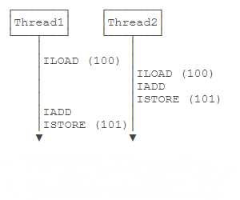
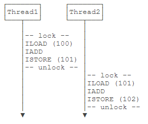

# 多线程

## 多线程基础

- CPU执行代码都是一条一条顺序执行的，但是，即使是单核cpu，也可以同时运行多个任务。因为操作系统执行多任务实际上就是让CPU对多个任务轮流交替执行。即使是多核CPU，因为通常任务的数量远远多于CPU的核数，所以任务也是交替执行的。
- 在计算机中，我们把**一个任务称为一个进程**，浏览器就是一个进程，视频播放器是另一个进程，类似的，音乐播放器和Word都是进程。
- 某些**进程内部还需要同时执行多个子任务**。例如，我们在使用Word时，Word可以让我们一边打字，一边进行拼写检查，同时还可以在后台进行打印，我们**把子任务称为线程**。
- 进程和线程的关系就是：一个进程可以包含一个或多个线程，但至少会有一个线程。  
    
- **操作系统调度的最小任务单位其实不是进程，而是线程**。常用的Windows、Linux等操作系统都采用抢占式多任务，**如何调度线程完全由操作系统决定，程序自己不能决定什么时候执行，以及执行多长时间**。
- 因为同一个应用程序，既可以有多个进程，也可以有多个线程，因此，实现多任务的方法，有以下几种：多进程模式（每个进程只有一个线程）；多线程模式（一个进程有多个线程）；多进程＋多线程模式（复杂度最高）。
- 进程和线程是包含关系，但是多任务既可以由多进程实现，也可以由单进程内的多线程实现，还可以混合多进程＋多线程。
- 和多线程相比，多进程的缺点在于：**创建进程比创建线程开销大**，尤其是在Windows系统上；进程间通信比线程间通信要慢，因为**线程间通信就是读写同一个变量**，速度很快。多进程的优点在于：**多进程稳定性比多线程高**，因为在多进程的情况下，**一个进程崩溃不会影响其他进程**，而在多线程的情况下，**任何一个线程崩溃会直接导致整个进程崩溃**。
- Java语言内置了多线程支持：**一个Java程序实际上是一个JVM进程，JVM进程用一个主线程来执行main()方法，在main()方法内部，我们又可以启动多个线程**。此外，JVM还有负责垃圾回收的其他工作线程等。
- 对于大多数Java程序来说，我们说多任务，实际上是说如何**使用多线程实现多任务**。
- 和单线程相比，多线程编程的特点在于：**多线程经常需要读写共享数据，并且需要同步**。例如，播放电影时，就必须由一个线程播放视频，另一个线程播放音频，两个线程需要协调运行，否则画面和声音就不同步。因此，多线程编程的复杂度高，调试更困难。
- Java多线程编程的特点又在于：多线程模型是Java程序最基本的并发模型；后续读写网络、数据库、Web开发等都依赖Java多线程模型。

## 创建新线程

```Java
public class CreateThreadTest {
    public static void main(String[] args) {
        Thread t = new MyThread();
        t.start();
    }
}
// 从Thread派生一个自定义类，然后覆写run()方法
class MyThread extends Thread {
    @Override
    public void run() {
        System.out.println("start new thread!");
    }
}
```

```Java
public class CreateThreadTest {
    public static void main(String[] args) {
        // 实现了Runnable接口的子类
        Runnable r1 = new MyRunnable();
        // 有时候为只使用一次的子类单独创建一个.java文件过于浪费
        // 匿名内部类主要用于实现抽象类和接口，说白了就是一个子类，只不过它们new的对象是抽象类和接口
        Runnable r2 = new Runnable() {
            @Override
            public void run() {
                System.out.println("[anonymous subclass] start new thread!");
            }
        };
        // 由于Runnable本身是一个函数式接口，因此我们可以进一步地使用lambda表达式来简化实例过程
        Runnable r3 = () -> System.out.println("[lambda] start new thread!");
        List<Runnable> list = new ArrayList<Runnable>();
        list.add(r1);
        list.add(r2);
        list.add(r3);
        for (Runnable r : list) {
            // 创建Thread实例时，传入一个Runnable实例
            new Thread(r).start();
        }
    }
}
class MyRunnable implements Runnable {
    @Override
    public void run() {
        System.out.println("[subclass] start new thread!");
    }
}
```

- 程序本身无法确定线程的调度顺序。
- 直接调用run()方法，相当于调用了一个普通的Java方法，当前线程并没有任何改变，也不会启动新线程。
- 必须调用Thread实例的start()方法才能启动新线程，如果我们查看Thread类的源代码，会看到start()方法内部调用了一个private native void start0()方法，**native修饰符**表示这个方法是由JVM虚拟机内部的C代码实现的，不是由Java代码实现的。
- 一个线程对象只能调用一次start()方法。
- 可以对线程设定优先级，优先级高的线程被操作系统调度的优先级较高，操作系统对高优先级线程可能调度更频繁，但我们决不能通过设置优先级来确保高优先级的线程一定会先执行。

## 线程的状态

- 在Java程序中，一个线程对象只能调用一次start()方法启动新线程，并在新线程中执行run()方法。一旦run()方法执行完毕，线程就结束了。因此，Java线程的状态有以下几种：`New`：新创建的线程，尚未执行；`Runnable`：运行中的线程，正在执行run()方法的Java代码；`Blocked`：运行中的线程，因为某些操作被阻塞而挂起；`Waiting`：运行中的线程，因为某些操作在等待中；`Timed Waiting`：运行中的线程，因为执行sleep()方法正在计时等待；`Terminated`：线程已终止，因为run()方法执行完毕。  
    
- 线程终止的原因有：*线程正常终止*：run()方法执行到return语句返回；*线程意外终止*：run()方法因为未捕获的异常导致线程终止；对某个线程的Thread实例调用stop()方法强制终止（强烈不推荐使用）。
- 通过对另一个线程对象调用join()方法可以等待其执行结束；可以指定等待时间，超过等待时间线程仍然没有结束就不再等待；对已经运行结束的线程调用join()方法会立刻返回。

    ```Java
    Thread t = new Thread(() -> {
        System.out.println("hello");
    });
    System.out.println("start");
    t.start();
    // main线程等待t变量表示的线程运行结束，才继续往下执行自身线程，可以指定等待时间
    t.join();
    System.out.println("end");
    ```

## 中断线程

- 中断一个线程非常简单，只需要在其它线程中对目标线程调用interrupt()方法（发送一个中断请求），目标线程需要反复检测自身状态是否是interrupted状态，如果是，就立刻结束运行。

    ```Java
    public class CreateThreadTest {
        public static void main(String[] args) throws InterruptedException {
            Thread t = new MyThread();
            t.start();
            Thread.sleep(1);
            // interrupt()方法仅仅向t线程发出了“中断请求”，至于t线程是否能立刻响应，要看具体代码
            t.interrupt();
            // 中断过程也需要时间，为了保证打印语句在最后输出，在此等待t线程彻底结束
            t.join();
            System.out.println("end");
        }
    }
    class MyThread extends Thread {
        @Override
        public void run() {
            int n = 0;
            // t线程的while循环会检测isInterrupted()，能正确响应interrupt()请求，使得自身立刻结束运行run()方法。
            // 当接收到中断请求后，super.isInterrupted()的返回值为true。
            while (!super.isInterrupted()) {
                n++;
                System.out.printf("%d hello!\n", n);
            }
        }
    }
    ```

- 假设需要中断的线程处于等待状态，例如，t.join()会让main线程进入等待状态，此时，如果对main线程调用interrupt()，t.join()方法会立刻抛出InterruptedException，因此，main线程只要捕获到join()方法抛出的InterruptedException，就说明有其它线程对其调用了interrupt()方法，通常情况下该线程应该立刻结束运行。
- join()方法和sleep()方法抛出InterruptedException异常时的描述：如果有任何线程中断了当前线程。 抛出此异常时，**将清除当前线程的中断状态**。

    ```Java
    public class CreateThreadTest {
        public static void main(String[] args) throws InterruptedException {
            Thread t = new MyThread();
            t.start();
            Thread.sleep(1000);
            // 在等待t线程运行10s后向t线程发送中断请求
            t.interrupt();
            // 中断过程也需要时间，为了保证打印语句在最后输出，在此等待t线程彻底结束
            t.join();
            System.out.println("end");
        }
    }
    class MyThread extends Thread {
        @Override
        public void run() {
            // t线程被启动时，自身内部创建了另外一个hello线程，并等待hello线程运行结束
            Thread hello = new HelloThread();
            hello.start();
            try {
                // 当join()方法抛出InterruptedException异常时，表明t线程收到了其它线程发送过来的中断请求
                // 注意虽然是hello.join()抛出异常，但这表明是t线程收到了中断请求
                // 由于抛出了异常，因此t线程自身的等待过程也随之结束
                hello.join();
            } catch (InterruptedException e) {
                System.out.println("interrupted!");
            }
            // 结束等待过程后向自身内部创建的hello线程发送一个中断请求
            hello.interrupt();
        }
    }
    class HelloThread extends Thread {
        @Override
        public void run() {
            // hello线程内部每隔0.1s进行一次打印输出
            int n = 0;
            while (!super.isInterrupted()) {
                n++;
                System.out.printf("%d hello!\n", n);
                try {
                    // 当hello线程接收来自其它线程的中断请求时，sleep()方法会抛出InterruptedException异常，并清空中断状态，
                    // 由于清空了中断状态，导致super.isInterrupted()取值仍为false，会继续进入下一次循环，
                    // 但为了符合接收到中断请求就应当中断线程的运行逻辑，在捕获异常之后选择break出while循环
                    Thread.sleep(100);
                } catch (InterruptedException e) {
                    break;
                }
            }
        }
    }
    ```

- 另一个常用的中断线程的方法是设置标志位。我们通常会用一个running标志位来标识线程是否应该继续运行，在外部线程中，通过把HelloThread.running置为false，就可以让线程结束。

    ```Java
    public class CreateThreadTest {
        public static void main(String[] args) throws InterruptedException {
            HelloThread t = new HelloThread();
            t.start();
            Thread.sleep(1);
            // main线程在自己工作区中修改running变量后立刻回写至主内存
            t.running = false;
        }
    }
    class HelloThread extends Thread {
        // 用volatile进行修饰：1.读取是读取主内存中变量的最新值，而非线程自己工作区中的副本变量
        // 2.修改变量值后由虚拟机立刻回写到主内存中，而不是一个不确定的时间回写
        public volatile boolean running = true;
        @Override
        public void run() {
            int n = 0;
            // t线程读取running变量时，读取的是主内存中该变量的最新值
            while (this.running) {
                n++;
                System.out.printf("%d hello!\n", n);
            }
            System.out.println("end!");
        }
    }
    ```

- 线程间共享变量需要使用volatile关键字标记，确保每个线程都能读取到更新后的变量值。
- 为什么要对线程间共享的变量用关键字volatile声明。这涉及到Java的内存模型。在Java虚拟机中，变量的值保存在主内存中，但是，**当线程访问变量时，它会先获取一个副本，并保存在自己的工作内存中**。如果线程修改了变量的值，虚拟机会在某个时刻把修改后的值回写到主内存，但是，**这个时间是不确定的**！  
    
- 这会导致如果一个线程更新了某个变量，另一个线程读取的值可能还是更新前的。例如，主内存的变量a = true，线程1执行a = false时，它在此刻仅仅是把变量a的**副本**变成了false，主内存的变量a还是true，在JVM把修改后的a回写到主内存之前，其他线程读取到的a的值仍然是true，这就造成了多线程之间共享的变量不一致。
- volatile关键字的目的是告诉虚拟机：**每次访问变量时，总是获取主内存的最新值；每次修改变量后，立刻回写到主内存**。
- volatile关键字解决的是**可见性**问题：当一个线程修改了某个共享变量的值，其它线程能够立刻看到修改后的值。
- 如果我们去掉volatile关键字，运行上述程序，发现效果和带volatile差不多，这是因为在x86的架构下，JVM回写主内存的速度非常快，但是，换成ARM的架构，就会有显著的延迟。

## 守护线程

- Java程序入口就是由JVM启动main线程，main线程又可以启动其它线程。当所有线程都运行结束时，JVM退出，进程结束。
- 如果有一个线程没有退出，JVM进程就不会退出。所以，**必须保证所有线程都能及时结束**。
- 但是有一种线程的目的就是无限循环，例如，一个定时触发任务的线程。
- 如果这个线程不结束，JVM进程就无法结束。问题是，由谁负责结束这个线程？
- **然而这类线程经常没有负责人来负责结束它们**。但是，当其它线程结束时，JVM进程又必须要结束，怎么办？
- **守护线程是指为其它线程服务的线程**。在JVM中，**所有非守护线程都执行完毕后，无论有没有守护线程，虚拟机都会自动退出**。因此，**JVM退出时，不必关心守护线程是否已结束**。
- 在守护线程中，编写代码要注意：**守护线程不能持有任何需要关闭的资源**，例如打开文件等，因为虚拟机退出时，守护线程没有任何机会来关闭文件，这会导致数据丢失。

```Java
public class CreateThreadTest {
    public static void main(String[] args) throws InterruptedException {
        Thread t = new TimerThread();
        // 将t线程标记为守护线程
        t.setDaemon(true);
        t.start();
        Thread.sleep(10000);
        System.out.println("main end...");
    }
}
class TimerThread extends Thread {
    @Override
    public void run() {
        while (true) {
            System.out.println(LocalTime.now());
            try {
                Thread.sleep(1000);
            } catch (InterruptedException e) {
            }
        }
    }
}
```

## 线程同步

- 当多个线程同时运行时，线程的调度由操作系统决定，程序本身无法决定。因此，任何一个线程都有可能在**任何指令处**被操作系统暂停，然后在某个时间段后继续执行。
- 这个时候，有个单线程模型下不存在的问题就来了：**如果多个线程同时读写共享变量，会出现数据不一致的问题**。

    ```Java
    public class SynchronizedTest {
        public static void main(String[] args) throws InterruptedException {
            Thread add = new Thread(() -> {
                for (int i = 0; i < 10000; i++)
                    // 读取/加/存储，一行语句三条指令
                    Counter.count += 1;
            });
            Thread dec = new Thread(() -> {
                for (int i = 0; i < 10000; i++)
                    // 读取/减/存储，一行语句三条指令
                    Counter.count -= 1;
            });
            add.start();
            dec.start();
            add.join();
            dec.join();
            System.out.println(Counter.count);
        }
    }
    class Counter {
        public static int count = 0;
    }
    ```

- 因为对变量进行读取和写入时，结果要正确，必须保证是原子操作。原子操作是指不能被中断的一个或一系列操作。
- 多线程模型下，要保证逻辑正确，对共享变量进行读写时，**必须保证一组指令以原子方式执行**：即某一个线程执行时，其他线程必须等待。  
     
- 通过加锁和解锁的操作，就能保证3条指令总是在一个线程执行期间，不会有其它线程会进入此指令区间。即使在执行期线程被操作系统中断执行，其他线程也会因为无法获得锁导致无法进入此指令区间。只有执行线程将锁释放后，其他线程才有机会获得锁并执行。**这种加锁和解锁之间的代码块我们称之为临界区（Critical Section），任何时候临界区最多只有一个线程能执行**。
- 可见，保证一段代码的原子性就是通过加锁和解锁实现的。Java程序使用synchronized关键字对**一个对象**进行加锁。
- synchronized保证了代码块在任意时刻最多只有一个线程能执行。

    ```Java
    public class SynchronizedTest {
        public static void main(String[] args) throws InterruptedException {
            Thread add = new Thread(() -> {
                for (int i = 0; i < 10000; i++)
                    // 使用Counter.lock实例作为锁，其它线程获取时需进行等待，锁的是对象实例
                    // 进入临界区前获取对象锁，离开临界区后释放对象锁
                    synchronized (Counter.lock) { // 获取锁
                        Counter.count += 1;
                    } // 释放锁
            });
            Thread dec = new Thread(() -> {
                for (int i = 0; i < 10000; i++)
                    // 使用Counter.lock实例作为锁，其它线程获取时需进行等待，锁的是对象实例
                    // 进入临界区前获取对象锁，离开临界区后释放对象锁
                    synchronized (Counter.lock) { // 获取锁
                        Counter.count -= 1;
                    } // 释放锁
            });
            add.start();
            dec.start();
            add.join();
            dec.join();
            System.out.println(Counter.count);
        }
    }
    class Counter {
        public static final Object lock = new Object();
        // 注意此处使用volatile关键字是无法解决同时读写变量数据不一致场景的
        // 摆在眼前的第一个问题就是线程一访问变量进行修改时线程二同样可以访问变量进行修改
        // 只要两者读取到自己工作区的变量值是同一个值时，立马就造成了数据不一致问题
        public static int count = 0;
    }
    ```

- 使用synchronized解决了**多线程同步访问共享变量**的正确性问题。但是，它的缺点是带来了性能下降。因为synchronized代码块无法并发执行。此外，加锁和解锁需要消耗一定的时间，所以，synchronized会降低程序的执行效率。
- 使用synchronized：找出修改共享变量的线程代码块；选择一个**共享实例**作为锁；使用synchronized(lockObject) { ... }。
- **volatile和synchronized关键字的使用场景区分：前者是一个线程在写另一个线程在读，后者是两个线程同时参与读写操作**。
- 在使用synchronized的时候，不必担心抛出异常。因为**无论是否有异常，都会在synchronized结束处正确释放锁**。
- JVM只保证同一个锁在任意时刻只能被一个线程获取，但两个不同的锁在同一时刻可以被两个线程分别获取。
- 根据需要同步的共享变量数量准备对应个数的锁，针对不同的共享变量分配不同的锁。
- **同步的本质就是给指定对象加锁，加锁后才能继续执行后续代码**。
- 不需要synchronized的操作即原子操作：基本类型（long和double除外）赋值；引用类型赋值。单条原子操作的语句不需要同步。**如果是多行赋值语句，就必须保证是同步操作**。
- 方法内部定义的局部变量，每个线程都会有各自的局部变量，互不影响，并且互不可见，并不需要同步。

## 同步方法

- 让线程自己选择锁对象往往会使得代码逻辑混乱，也不利于封装。更好的方法是把synchronized逻辑封装起来。

    ```Java
    public class SynchronizedTest {
        public static void main(String[] args) throws InterruptedException {
            Counter c = new Counter();
            System.out.println(c.get());
            // 现在，对于Counter类，多线程可以正确调用。
            Thread add = new Thread(() -> {
                for (int i = 0; i < 10000; i++)
                    c.add(1);
            });
            Thread dec = new Thread(() -> {
                for (int i = 0; i < 10000; i++)
                    c.dec(1);
            });
            add.start();
            dec.start();
            add.join();
            dec.join();
            System.out.println(c.get());
        }
    }

    class Counter {
        private int count = 0;
        // 这样一来，线程调用add()、dec()方法时，它不必关心同步逻辑，因为synchronized代码块在add()、dec()方法内部。
        // synchronized锁住的对象是this，即当前实例，这又使得创建多个Counter实例的时候，它们之间互不影响，可以并发执行。
        public void add(int n) {
            synchronized (this) {
                this.count += n;
            }
        }

        public void dec(int n) {
            synchronized (this) {
                this.count -= n;
            }
        }
        // 读一个int变量不需要同步。
        public int get() {
            return count;
        }
    }
    ```

- 如果一个类被设计为允许多线程正确访问，我们就说这个类就是“线程安全”的（thread-safe），上面的Counter类就是线程安全的。Java标准库的java.lang.StringBuffer也是线程安全的。
- 还有一些不变类，例如String，Integer，LocalDate，它们的所有成员变量都是final，**多线程同时访问时只能读不能写**，这些不变类也是线程安全的。
- 最后，类似Math这些只提供静态方法，没有成员变量的类，也是线程安全的。
- 除了上述几种少数情况，大部分类，例如ArrayList，都是非线程安全的类，我们不能在多线程中修改它们。但是，**如果所有线程都只读取，不写入**，那么ArrayList是可以安全地在线程间共享的。
- **没有特殊说明时，一个类默认是非线程安全的**。
- 当我们锁住的是this实例时，实际上可以用synchronized修饰这个方法。

    ```Java
    // 用synchronized修饰的方法就是同步方法，它表示整个方法都必须用this实例加锁。
    public synchronized void add(int n) {
        this.count += n;
    }
    ```

- 对于static方法，是没有this实例的，因为static方法是针对类而不是实例。但是我们注意到任何一个类都有一个由JVM自动创建的Class实例，因此，对static方法添加synchronized，锁住的是该类的Class实例。

    ```Java
    public synchronized static void test() {}
    // 等价于
    public static void test() {
        synchronized (Counter.class) {}
    }
    ```

## 死锁

- Java的线程锁是可重入的锁。
- **JVM允许同一个线程重复获取同一个锁，这种能被同一个线程反复获取的锁，就叫做可重入锁**。

    ```Java
    public synchronized void add(int n) { // 获取this锁。
        if (n < 0)
            dec(-n); // 再次获取this锁。
        else
            this.count += n;
    }

    public synchronized void dec(int n) {
        this.count += n;
    }
    ```

- 由于Java的线程锁是可重入锁，所以，获取锁的时候，不但要判断是否是第一次获取，还要记录这是第几次获取。每获取一次锁，记录+1，每退出synchronized块，记录-1，减到0的时候，才会真正释放锁。
- **一个线程可以获取一个锁后，再继续获取另一个锁**。

    ```Java
    public void add(int m) {
        synchronized(lockA) { // 获得lockA的锁
            this.value += m;
            synchronized(lockB) { // 获得lockB的锁
                this.another += m;
            } // 释放lockB的锁
        } // 释放lockA的锁
    }

    public void dec(int m) {
        synchronized(lockB) { // 获得lockB的锁
            this.another -= m;
            synchronized(lockA) { // 获得lockA的锁
                this.value -= m;
            } // 释放lockA的锁
        } // 释放lockB的锁
    }
    // 修改后
    public void dec(int m) {
        synchronized(lockA) { // 获得lockA的锁
            this.value -= m;
            synchronized(lockB) { // 获得lockB的锁
                this.another -= m;
            } // 释放lockB的锁
        } // 释放lockA的锁
    }
    ```

- **在获取多个锁的时候，不同线程获取多个不同对象的锁可能导致死锁**。对于上述代码，线程1和线程2如果分别执行add()和dec()方法时：线程1：进入add()，获得lockA；线程2：进入dec()，获得lockB。随后：线程1：准备获得lockB，失败，等待中；线程2：准备获得lockA，失败，等待中。此时，两个线程**各自持有不同的锁，然后各自试图获取对方手里的锁**，造成了双方无限等待下去，这就是死锁。
- 死锁发生后，没有任何机制能解除死锁，只能强制结束JVM进程。
- 避免死锁的做法是：**线程获取锁的顺序要一致**。即严格按照先获取lockA，再获取lockB的顺序，

## 使用wait和notify
