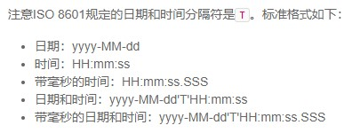
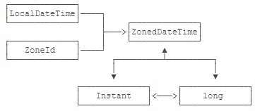
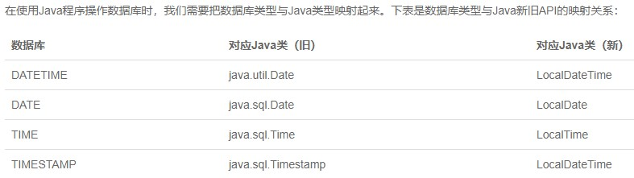

# 日期与时间

带日期的时间能唯一确定某个时刻。

## LocalDateTime

- Month的范围用1~12表示1月到12月。
- Week的范围用1~7表示周一到周日。

```Java
// 通过now()获取到的总是以当前默认时区返回的
LocalDate d = LocalDate.now();          // 当前日期
LocalTime t = LocalTime.now();          // 当前时间
LocalDateTime dt = LocalDateTime.now(); // 当前日期时间
System.out.println(d);   // 严格按照ISO 8601格式打印
System.out.println(t);   // 严格按照ISO 8601格式打印
System.out.println(dt);  // 严格按照ISO 8601格式打印
```

```Java
// 为了保证获取到同一时刻的日期和时间，可以使用to方法
LocalDateTime dt = LocalDateTime.now();
LocalDate d = dt.toLocalDate();
LocalTime t = dt.toLocalTime();
```

```Java
// 使用of方法创建
LocalDate d = LocalDate.of(2020, 7, 1);
LocalTime t = LocalTime.of(18, 50, 30);
LocalDateTime dt = LocalDateTime.of(2020, 7, 1, 18, 50, 30);
LocalDateTime dt = LocalDateTime.of(d, t);
```

```Java
// 传入标准格式的字符串进行转换
LocalDateTime dt = LocalDateTime.parse("2020-07-01T18:50:30");
LocalDate d = LocalDate.parse("2020-07-01");
LocalTime t = LocalTime.parse("18:50:30");
```



```Java
// 使用DateTimeFormatter来自定义输出格式
DateTimeFormatter dtf = DateTimeFormatter.ofPattern("yyyy/MM/dd HH:mm:ss");
System.out.println(dtf.format(LocalDateTime.now()));
// 使用自定义格式对非标准格式字符串进行解析
DateTimeFormatter dtf = DateTimeFormatter.ofPattern("yyyy/MM/dd HH:mm:ss");
LocalDateTime dt = LocalDateTime.parse("2020/07/01 18:50:30", dtf);
```

```Java
// 提供了进行加减的非常简单的链式调用
LocalDateTime dt = LocalDateTime.of(2020, 7, 1, 19, 50, 30);
System.out.println(dt);
System.out.println(dt.plusDays(5).minusHours(3)); // 加5天减3小时
System.out.println(dt.minusMonths(1));            // 减1月
```

**注意到月份加减会自动调整日期**，例如从2019-10-31减去1个月得到的结果是2019-09-30，因为9月没有31日。

```java
// 使用withXxx方法来调整日期和时间
LocalDateTime dt = LocalDateTime.of(2020, 7, 1, 19, 50, 30);
System.out.println(dt);
System.out.println(dt.withDayOfMonth(31));
System.out.println(dt.withMonth(9));
```

**同样注意到调整月份时，会相应地调整日期**，即把2019-10-31的月份调整为9时，日期也自动变为30。

```Java
// 使用通用的with方法来做更复杂的运算
// 本月第一天00:00时刻
LocalDateTime firstDay = LocalDate.now().withDayOfMonth(1).atStartOfDay();
System.out.println(firstDay);
// 本月最后1天
LocalDate lastDay = LocalDate.now().with(TemporalAdjusters.lastDayOfMonth());
System.out.println(lastDay);
// 下月第1天
LocalDate nextMonthFirstDay = LocalDate.now().with(TemporalAdjusters.firstDayOfNextMonth());
System.out.println(nextMonthFirstDay);
// 本月第1个周一
LocalDate firstWeekday = LocalDate.now().with(TemporalAdjusters.firstInMonth(DayOfWeek.MONDAY));
System.out.println(firstWeekday);
```

对于计算某个月第1个周日这样的问题，新的API可以轻松完成。

```Java
// 判断日期和时间的先后可以使用isBefore和isAfter方法来完成
LocalDateTime now = LocalDateTime.now();
LocalDateTime target = LocalDateTime.of(2020, 8, 1, 20, 30, 40);
System.out.println(now.isBefore(target));
```

注意到LocalDateTime无法与时间戳进行转换，因为LocalDateTime没有时区，无法确定某一时刻。后面我们要介绍的ZonedDateTime相当于LocalDateTime加时区的组合，它具有时区，可以与long表示的时间戳进行转换。

```Java
// Duration表示两个时刻之间的时间间隔。另一个类似的Period表示两个日期之间的天数。
LocalDateTime start = LocalDateTime.of(2019, 11, 19, 8, 15, 0);
LocalDateTime end = LocalDateTime.of(2020, 1, 9, 19, 25, 30);
Duration d = Duration.between(start, end);
System.out.println(d); // PT1235H10M30S 1235小时10分钟30秒
Period p = LocalDate.of(2019, 11, 19).until(LocalDate.of(2020, 1, 9));
System.out.println(p); // P1M21D 1个月21天
```

注意到两个LocalDateTime之间的差值使用Duration表示，类似PT1235H10M30S，表示1235小时10分钟30秒。而两个LocalDate之间的差值用Period表示，类似P1M21D，表示1个月21天。

Duration和Period的表示方法也符合ISO 8601的格式，它以P...T...的形式表示，P...T之间表示日期间隔，T后面表示时间间隔。如果是PT...的格式表示仅有时间间隔。利用ofXxx()或者parse()方法也可以直接创建Duration。

```Java
Duration d1 = Duration.ofHours(10);
Duration d2 = Duration.parse("P1DT2H3M");
System.out.println(d1); // PT10H
System.out.println(d2); // PT26H3M
```

## ZonedDateTime

LocalDateTime总是表示本地日期和时间，要表示一个带时区的日期和时间，我们就需要ZonedDateTime。

可以简单地把ZonedDateTime理解成LocalDateTime加ZoneId。ZoneId是java.time引入的新的时区类，注意和旧的java.util.TimeZone区别。

```Java
// 通过now()方法创建对象
ZonedDateTime zbj = ZonedDateTime.now();
ZonedDateTime zny = ZonedDateTime.now(ZoneId.of("America/New_York"));
System.out.println(zbj); // 2020-07-02T10:09:18.813+08:00[Asia/Shanghai]
System.out.println(zny); // 2020-07-01T22:09:18.817-04:00[America/New_York]
```

```Java
// 通过LocalDateTime对象atZone()方法创建对象
LocalDateTime ldt = LocalDateTime.of(2020, 7, 2, 10, 11, 20);
ZonedDateTime zbj = ldt.atZone(ZoneId.systemDefault());
ZonedDateTime zny = ldt.atZone(ZoneId.of("America/New_York"));
```

要转换时区，首先我们需要有一个ZonedDateTime对象，然后，通过withZoneSameInstant()将关联时区转换到另一个时区，转换后日期和时间都会相应调整。

```Java
ZonedDateTime zbj = ZonedDateTime.now(ZoneId.of("Asia/Shanghai"));
ZonedDateTime zny = zbj.withZoneSameInstant(ZoneId.of("America/New_York"));
```

要特别注意，时区转换的时候，由于夏令时的存在，不同的日期转换的结果很可能是不同的。**涉及到时区时，千万不要自己计算时差，否则难以正确处理夏令时**。

**不要直接从LocalDateTime使用atZone()方法来得到其它时区的ZonedDateTime对象，转换时区就使用withZoneSameInstant()方法**。

有了ZonedDateTime，将其转换为本地时间就非常简单，转换为LocalDateTime时，直接丢弃了时区信息。**因此是转换成当地时区的本地时间**。

```Java
ZonedDateTime zbj = ZonedDateTime.now(ZoneId.of("Asia/Shanghai"));
LocalDateTime ldt = zbj.toLocalDateTime();
```

ZonedDateTime仍然提供了plusDays()等加减操作。

## DateTimeFormatter

和SimpleDateFormat不同的是，DateTimeFormatter不但是不变对象，它还是线程安全的。线程的概念我们会在后面涉及到。现在我们只需要记住：因为SimpleDateFormat不是线程安全的，使用的时候，只能在方法内部创建新的局部变量。而DateTimeFormatter可以只创建一个实例，到处引用。

```Java
// 创建DateTimeFormatter时，我们仍然通过传入格式化字符串实现：
DateTimeFormatter formatter = DateTimeFormatter.ofPattern("yyyy-MM-dd HH:mm");
// 另一种创建DateTimeFormatter的方法是，传入格式化字符串时，同时指定Locale：
DateTimeFormatter formatter = DateTimeFormatter.ofPattern("E, yyyy-MMMM-dd HH:mm", Locale.US);
```

```Java
// 上述第二种方式可以按照Locale默认习惯格式化。
// 在格式化字符串中，如果需要输出固定字符，可以用'xxx'表示，例如'T'。
// 分别以默认方式、中国地区和美国地区对当前时间进行显示。
ZonedDateTime zdt = ZonedDateTime.now();
DateTimeFormatter formatter = DateTimeFormatter.ofPattern("yyyy-MM-dd'T'HH:mm ZZZZ");
System.out.println(formatter.format(zdt));   // 2020-07-02T10:46 GMT+08:00
DateTimeFormatter zhFormatter = DateTimeFormatter.ofPattern("yyyy MMM dd EE HH:mm", Locale.CHINA);
System.out.println(zhFormatter.format(zdt)); // 2020 七月 02 星期四 10:46
DateTimeFormatter usFormatter = DateTimeFormatter.ofPattern("E, MMMM/dd/yyyy HH:mm", Locale.US);
System.out.println(usFormatter.format(zdt)); // Thu, July/02/2020 10:46
```

当我们直接调用System.out.println()对一个ZonedDateTime或者LocalDateTime实例进行打印的时候，实际上，调用的是它们的toString()方法，默认的toString()方法显示的字符串就是按照ISO 8601格式显示的，我们可以通过DateTimeFormatter预定义的几个静态变量来引用。

```Java
LocalDateTime ldt = LocalDateTime.now();
// 使用不同格式对LocalDateTime进行输出
System.out.println(DateTimeFormatter.ISO_DATE.format(ldt));
System.out.println(DateTimeFormatter.ISO_DATE_TIME.format(ldt));
```

## Instant

计算机存储的当前时间，本质上只是一个不断递增的整数。Java提供的System.currentTimeMillis()返回的就是以毫秒表示的当前时间戳。

这个当前时间戳在java.time中以Instant类型表示，我们用Instant.now()获取当前时间戳，效果和System.currentTimeMillis()类似。

```Java
Instant now = Instant.now();
System.out.println(now.getEpochSecond()); // 秒
System.out.println(now.toEpochMilli());   // 毫秒
```

实际上，Instant内部只有两个核心字段。一个是以秒为单位的时间戳，一个是更精确的纳秒精度。它和System.currentTimeMillis()返回的long相比，只是多了更高精度的纳秒。

```Java
public final class Instant implements ... {
    private final long seconds;
    private final int nanos;
}
```

既然Instant就是时间戳，那么，给它附加上一个时区，就可以创建出ZonedDateTime。

```Java
Instant ins = Instant.ofEpochSecond(1568568760);
ZonedDateTime zdt = ins.atZone(ZoneId.systemDefault());
System.out.println(zdt); // 2019-09-16T01:32:40+08:00[Asia/Shanghai]
```

**可见，对于某一个时间戳，给它关联上指定的ZoneId，就得到了ZonedDateTime，继而可以获得了对应时区的LocalDateTime**。

所以，LocalDateTime，ZoneId，Instant，ZonedDateTime和long都可以互相转换，转换的时候，只需要留意long类型以毫秒还是秒为单位即可。



## 最佳实践



**实际上，在数据库中，我们需要存储的最常用的是时刻（Instant），因为有了时刻信息，就可以根据用户自己选择的时区，显示出正确的本地时间。所以，最好的方法是直接用长整数long表示，在数据库中存储为BIGINT类型**。

**处理日期和时间时，尽量使用新的java.time包；在数据库中存储时间戳时，尽量使用long型时间戳，它具有省空间，效率高，不依赖数据库的优点**。

```Java
// 通过存储一个long型时间戳，我们可以编写一个timestampToString()的方法，非常简单地为不同用户以不同的偏好来显示不同的本地时间：
public class Main {
    public static void main(String[] args) {
        long ts = 1574208900000L;
        System.out.println(timestampToString(ts, Locale.CHINA, "Asia/Shanghai")); // 2019-11-20 上午8:15
        System.out.println(timestampToString(ts, Locale.US, "America/New_York")); // Nov 19, 2019 7:15 PM
    }

    static String timestampToString(long epochMilli, Locale lo, String zoneId) {
        Instant ins = Instant.ofEpochMilli(epochMilli);
        DateTimeFormatter f = DateTimeFormatter.ofLocalizedDateTime(FormatStyle.MEDIUM, FormatStyle.SHORT);
        return f.withLocale(lo).format(ZonedDateTime.ofInstant(ins, ZoneId.of(zoneId)));
    }
}
```
