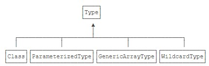

# 泛型

泛型是一种“代码模板”，可以用一套代码**套用各种类型**。

## 什么是泛型

在Java标准库中的`ArrayList<T>`实现了`List<T>`接口，它可以向上转型为`List<T>`，即类型`ArrayList<T>`可以向上转型为`List<T>`。但是，不能把`ArrayList<Integer>`向上转型为`ArrayList<Number>`或`List<Number>`。

```Java
// 创建ArrayList<Integer>类型：
ArrayList<Integer> integerList = new ArrayList<Integer>();
// 添加一个Integer：
integerList.add(new Integer(123));
// “向上转型”为ArrayList<Number>：
ArrayList<Number> numberList = integerList;
// 添加一个Float，因为Float也是Number：
numberList.add(new Float(12.34));
// 从ArrayList<Integer>获取索引为1的元素（即添加的Float）：
Integer n = integerList.get(1); // ClassCastException!
```

**`ArrayList<Integer>`和`ArrayList<Number>`两者完全没有继承关系**。

## 使用泛型

使用ArrayList时，如果不定义泛型类型时，泛型类型实际上就是Object，此时，只能把`<T>`当作Object使用，没有发挥泛型的优势。

除了`ArrayList<T>`使用了泛型，还可以在接口中使用泛型。例如，Arrays.sort(Object[])可以对任意数组进行排序，但待排序的元素必须实现`Comparable<T>`这个泛型接口。

## 编写泛型

编写泛型类比普通类要复杂。通常来说，**泛型类一般用在集合类中**，例如`ArrayList<T>`，**我们很少需要编写泛型类**。

可以按照以下步骤来编写一个泛型类。

```Java
// 首先，按照某种类型，例如：String，来编写类：
public class Pair {
    private String first;
    private String last;
    public Pair(String first, String last) {
        this.first = first;
        this.last = last;
    }
    public String getFirst() {
        return first;
    }
    public String getLast() {
        return last;
    }
}
// 然后，标记所有的特定类型，这里是String：
// 最后，把特定类型String替换为T，并申明<T>（在IDEA中，选中String，Ctrl+R，替换内容为T，全部替换）：
public class Pair<T> {
    private T first;
    private T last;
    public Pair(T first, T last) {
        this.first = first;
        this.last = last;
    }
    public T getFirst() {
        return first;
    }
    public T getLast() {
        return last;
    }
}
```

编写泛型类时，要特别注意，泛型类型`<T>`不能用于静态方法。我们无法在静态方法create()的**方法参数**和**返回类型**上使用泛型类型T。

```Java
public class Pair<T> {
    ...
    // 对静态方法使用<T>：
    // 编译错误：'xxx.Pair.this' cannot be referenced from a static context：
    public static Pair<T> create(T first, T last) {
        return new Pair<T>(first, last);
    }
}
public class Pair<T> {
    ...
    // 在static修饰符后面加一个<T>，编译就能通过：
    // 但实际上，这个<T>和Pair<T>类型的<T>已经没有任何关系了：
    public static <T> Pair<T> create(T first, T last) {
        return new Pair<T>(first, last);
    }
}
public class Pair<T> {
    ...
    // 对于静态方法，我们可以单独改写为“泛型”方法，只需要使用另一个类型即可：
    // 静态泛型方法应该使用其它类型区分:
    public static <K> Pair<K> create(K first, K last) {
        return new Pair<K>(first, last);
    }
}
```

泛型还可以定义多种类型。Java标准库的`Map<K, V>`就是使用两种泛型类型的例子。它对Key使用一种类型，对Value使用另一种类型。

## 擦拭法

Java语言的泛型实现方式是**擦拭法**。所谓擦拭法是指，虚拟机对泛型其实一无所知，所有的工作都是编译器做的。

```Java
// 这是编译器看到的代码：
public class Pair<T> {
    private T first;
    private T last;
    public Pair(T first, T last) {
        this.first = first;
        this.last = last;
    }
    public T getFirst() {
        return first;
    }
    public T getLast() {
        return last;
    }
}
// 这是虚拟机执行的代码：
public class Pair {
    private Object first;
    private Object last;
    public Pair(Object first, Object last) {
        this.first = first;
        this.last = last;
    }
    public Object getFirst() {
        return first;
    }
    public Object getLast() {
        return last;
    }
}
```

因此，Java使用擦拭法实现泛型，导致了：

- **编译器把类型`<T>`视为Object**；
- **编译器根据`<T>`实现安全的强制转型**。

```Java
// 使用泛型的时候，我们编写的代码也是编译器看到的代码：
Pair<String> p = new Pair<>("Hello", "world");
String first = p.getFirst();
String last = p.getLast();
// 而虚拟机执行的代码并没有泛型：
Pair p = new Pair("Hello", "world");
String first = (String) p.getFirst();
String last = (String) p.getLast();
```

所以，Java的泛型是由编译器在编译时实行的，编译器内部永远把所有类型T视为Object处理，但是，在需要转型的时候，编译器会根据T的类型自动为我们实行安全的强制转型。

了解了Java泛型的实现方式——擦拭法，我们就知道了Java泛型的局限：

```Java
// 局限一：<T>不能是基本类型，例如int，因为实际类型是Object，Object类型无法持有基本类型：
Pair<int> p = new Pair<>(1, 2); // compile error!

// 局限二：无法取得带泛型的Class，所有泛型实例，无论T的类型是什么，getClass()返回同一个Class实例，因为编译后它们全部都是Pair<Object>：
public class Main {
    public static void main(String[] args) {
        Pair<String> p1 = new Pair<>("hello", "world");
        Pair<Integer> p2 = new Pair<>(123, 456);
        Class c1 = p1.getClass();
        Class c2 = p2.getClass();
        System.out.println(c1 == c2);         // true
        System.out.println(c1 == Pair.class); // true
    }
}

// 局限三：无法判断带泛型的类型，原因和前面一样，并不存在Pair<String>.class，而是只有唯一的Pair.class：
Pair<Integer> p = new Pair<>(123, 456);
// Compile error:
if (p instanceof Pair<String>) {
}

// 局限四：不能实例化T类型，创建new Pair<String>()和创建new Pair<Integer>()就全部成了Object，显然编译器要阻止这种类型不对的代码。：
public class Pair<T> {
    private T first;
    private T last;
    public Pair() {
        // Compile error:
        first = new T(); // 擦拭后变成了new Object()
        last = new T();  // 擦拭后变成了new Object()
    }
}
// 要实例化T类型，我们必须借助额外的Class<T>参数：
public Pair(Class<T> clazz) {
    this.first = clazz.newInstance();
    this.last = clazz.newInstance();
}
// 上述代码借助Class<T>参数并通过反射来实例化T类型，使用的时候，也必须传入Class<T>。例如：
// 因为传入了Class<String>的实例，所以我们借助String.class就可以实例化String类型：
Pair<String> pair = new Pair<>(String.class);
```

有些时候，一个看似正确定义的方法会无法通过编译，编译器会**阻止一个实际上会变成覆写的泛型方法定义**。

```Java
public class Pair<T> {
    public boolean equals(T t) {
        return this == t;
    }
}
// 这是因为，定义的equals(T t)方法实际上会被擦拭成equals(Object t)，而这个方法是继承自Object的，编译器会阻止一个实际上会变成覆写的泛型方法定义。
// 换个方法名，避开与Object.equals(Object)的冲突就可以成功编译：
public class Pair<T> {
    public boolean same(T t) {
        return this == t;
    }
}
```

一个类可以继承自一个泛型类。

```Java
// 例如：父类的类型是Pair<Integer>，子类的类型是IntPair，可以这么继承：
public class IntPair extends Pair<Integer> {
}
// 使用的时候，因为子类IntPair并没有泛型类型，所以，正常使用即可：
IntPair ip = new IntPair(1, 2);
```

前面讲了，我们无法获取`Pair<T>`的T类型，即给定一个变量`Pair<Integer> p`，无法从p中获取到Integer类型。但是，**在父类是泛型类型的情况下，编译器就必须把类型T（对IntPair来说，也就是Integer类型）保存到子类的class文件中，不然编译器就不知道IntPair只能存取Integer这种类型**。

在继承了泛型类型的情况下，子类可以获取父类的泛型类型。

```Java
public class Main {
    public static void main(String[] args) {
        Class<IntPair> clazz = IntPair.class;
        Type t = clazz.getGenericSuperclass();
        if (t instanceof ParameterizedType) {
            ParameterizedType pt = (ParameterizedType) t;
            Type[] types = pt.getActualTypeArguments(); // 可能有多个泛型类型
            Type firstType = types[0];                  // 取第一个泛型类型
            Class<?> typeClass = (Class<?>) firstType;
            System.out.println(typeClass);              // Integer
        }
    }
}
```

因为Java引入了泛型，所以，只用Class来标识类型已经不够了。实际上，Java的类型系统结构如下：



## extends通配符

我们前面已经讲到了泛型的继承关系：`Pair<Integer>`不是`Pair<Number>`的子类。

```Java
public class PairHelper {
    static int add(Pair<Number> p) {
        Number first = p.getFirst();
        Number last = p.getLast();
        return first.intValue() + last.intValue();
    }
}
// 编译成功：
// 注意：传入的类型是Pair<Number>，实际参数类型是(Integer, Integer)：
Pair<Number> p = new Pair<>(1, 2);
int sum = PairHelper.add(p);
// 编译错误：
// 因为Pair<Integer>不是Pair<Number>的子类，因此，add(Pair<Number>)不接受参数类型Pair<Integer>：
Pair<Integer> p = new Pair<>(1, 2);
int sum = PairHelper.add(p);
```

但是从add()方法的代码可知，传入`Pair<Integer>`是完全符合内部代码的类型规范，因为语句：

```Java
Number first = p.getFirst();
Number last = p.getLast();
```

实际类型是Integer，引用类型是Number，没有问题。**问题在于方法参数类型定死了只能传入`Pair<Number>`**。

使用`Pair<? extends Number>`使得方法接收所有泛型类型为Number或Number子类的Pair类型。

```Java
static int add(Pair<? extends Number> p) {
    Number first = p.getFirst();
    Number last = p.getLast();
    return first.intValue() + last.intValue();
}
```

这样一来，给方法传入`Pair<Integer>`类型时，它符合参数Pair<? extends Number>类型。这种使用<? extends Number>的泛型定义称之为**上界通配符**（Upper Bounds Wildcards），即把泛型类型T的上界限定在Number了。

```Java
// 如果我们考察对Pair<? extends Number>类型调用getFirst()方法，实际的方法签名变成了：
<? extends Number> getFirst();
// 即返回值是Number或Number的子类，因此，可以安全赋值给Number类型的变量：
Number x = p.getFirst();
// 然后，我们不可预测实际类型就是Integer，例如，下面的代码是无法通过编译的：
Integer x = p.getFirst();
// 这是因为实际的返回类型可能是Integer，也可能是Double或者其他类型，编译器只能确定类型一定是Number的子类（包括Number类型本身），但具体类型无法确定。
```

```Java
// 考察Pair<T>的set方法：
static int add(Pair<? extends Number> p) {
    Number first = p.getFirst();
    Number last = p.getLast();
    // 编译错误：
    p.setFirst(new Integer(first.intValue() + 100));
    p.setLast(new Integer(last.intValue() + 100));
    // 唯一的例外是可以传入null：
    // 但是获取时会抛出空指针异常：
    return p.getFirst().intValue() + p.getLast().intValue();
}
```

编译错误发生在p.setFirst()传入的参数是Integer类型。有些童鞋会问了，既然p的定义是Pair<? extends Number>，那么setFirst(? extends Number)为什么不能传入Integer。

原因还在于擦拭法。如果我们传入的p是`Pair<Double>`，显然它满足参数定义Pair<? extends Number>，然而，`Pair<Double>`的setFirst()显然无法接受Integer类型。

这就是<? extends Number>通配符的一个重要限制：**方法参数签名setFirst(? extends Number)无法传递任何Number类型给setFirst(? extends Number)**。

```Java
// 如果我们考察Java标准库的java.util.List<T>接口，它实现的是一个类似“可变数组”的列表，主要功能包括：
public interface List<T> {
    int size(); // 获取个数
    T get(int index); // 根据索引获取指定元素
    void add(T t); // 添加一个新元素
    void remove(T t); // 删除一个已有元素
}
// 现在，让我们定义一个方法来处理列表的每个元素：
int sumOfList(List<? extends Integer> list) {
    int sum = 0;
    for (int i=0; i<list.size(); i++) {
        Integer n = list.get(i);
        sum = sum + n;
    }
    return sum;
}
```

为什么我们定义的方法参数类型是List<? extends Integer>而不是`List<Integer>`？从方法内部代码看，传入List<? extends Integer>或者`List<Integer>`是完全一样的，但是，注意到List<? extends Integer>的限制：

- 允许调用get()方法获取Integer的引用；
- 不允许调用set(? extends Integer)方法并传入任何Integer的引用（null除外）。

因此，方法参数类型List<? extends Integer>表明了该方法内部只会读取List的元素，不会修改List的元素（因为无法调用add(? extends Integer)、remove(? extends Integer)这些方法。**换句话说，这是一个对参数List<? extends Integer>进行只读的方法（恶意调用set(null)除外）**。

```Java
// 在定义泛型类型Pair<T>的时候，也可以使用extends通配符来限定T的类型：
public class Pair<T extends Number> { ... }
// 现在，我们只能定义：
Pair<Number> p1 = null;
Pair<Integer> p2 = new Pair<>(1, 2);
Pair<Double> p3 = null;
// 非Number类型将无法通过编译：
Pair<String> p1 = null; // compile error!
Pair<Object> p2 = null; // compile error!
```

使用类似<? extends Number>通配符作为**方法参数**时表示：

- 方法内部可以调用获取Number引用的方法，例如：Number n = obj.getFirst();；
- 方法内部无法调用传入Number引用的方法（null除外），例如：obj.setFirst(Number n);。

即一句话总结：**使用extends通配符表示可以读，不能写**。

使用类似`<T extends Number>`**定义泛型类**时表示：泛型类型限定为Number以及Number的子类。

## super通配符
