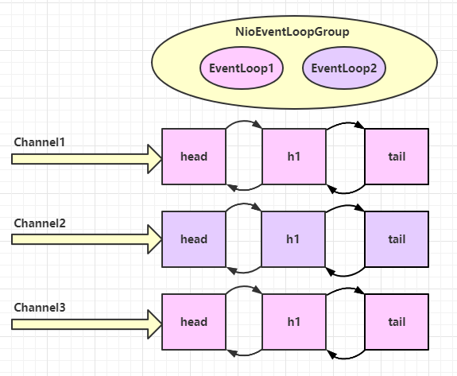
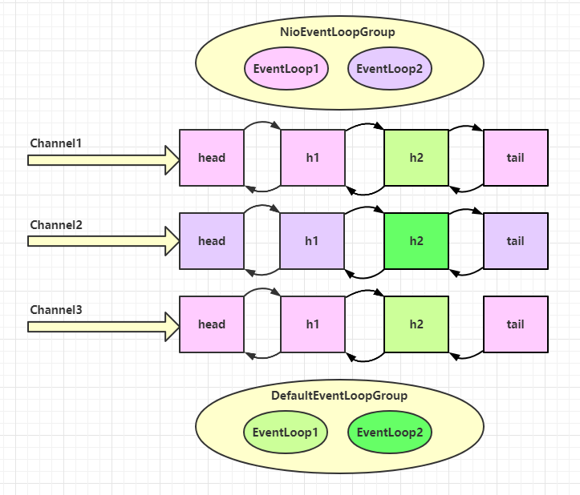

# 笔记

## 传统阻塞I/O的缺点

1. 并发量大时，创建大量线程，占用大量的系统资源。
2. 连接创建后，如果当前线程暂时**没有数据可读**，该线程会阻塞在read操作，造成线程资源浪费。

## Netty异步概念

netty所谓的异步和实际的异步I/O编程模型并不相同，netty的异步是指netty采用了多线程的机制将调用方法和处理结果的过程相分离。

## 正确观念

- 把 channel 理解为数据的通道；
- 把 msg 理解为流动的数据，最开始输入是 ByteBuf，但经过 pipeline 的加工，会变成其它类型对象，最后输出又变成 ByteBuf；
- 把 handler 理解为数据的处理工序；
    - 工序有多道，合在一起就是 pipeline，pipeline 负责发布事件（读、读取完成...）传播给每个 handler， handler 对自己感兴趣的事件进行处理（重写了相应事件处理方法）；
    - handler 分 Inbound 和 Outbound 两类，即读入数据时如何处理，写出数据时如何处理；
- 把 eventLoop 理解为处理数据的工人，底层是一个**单线程线程池**；
    - 工人可以管理多个 channel 的 I/O 操作，并且一旦工人负责了某个 channel，就要负责到底（绑定）；
    - 工人既可以执行 I/O 操作，也可以进行任务处理，每位工人有任务队列，队列里可以堆放多个 channel 的待处理任务，任务分为普通任务、定时任务；
    - 工人按照 pipeline 顺序，依次按照 handler 的规划（代码）处理数据，可以为每道工序指定不同的工人；

## eventLoop细分

EventLoopGroup拥有多个eventLoop，每个eventLoop底层都是一个单线程的线程池，它基于I/O多路复用模型来监听多个与之关联的channel上所发生的事件。

这里没有展示bossGroup，bossGroup在不指定线程数量(eventLoop数量)的情况下，也只会有一个eventLoop创建，因为ServerSocketChannel需要关联一个eventLoop，而ServerSocketChannel一个服务端只需要一个来处理**accept事件**，因此不会多创建其它的eventLoop。

这里展示的是workerGroup，它有两个eventLoop对象，每个eventLoop可以关联多个channel，负责**处理read/write事件**。

**当一个eventLoop上多个channel有事件发生时，会遍历选择一个channel的事件，在当前eventLoop的线程当中按顺序调用handler进行处理，处理完毕后，才处理下一个channel上的事件**。

如果出现某个handler处理事件过长，将导致后续channel事件被延迟处理，对于这类handler可以选择在另外的eventLoop中去处理。

即bossGroup中的eventLoop关联一个ServerSocketChannel负责accept事件，workerGroup中的eventLoop关联多个SocketChannel负责根据事件类型按序**调用**handler进行处理。

对于调用时间即业务逻辑时间过长的handler可以交给defaultGroup中的eventLoop来进行处理。
