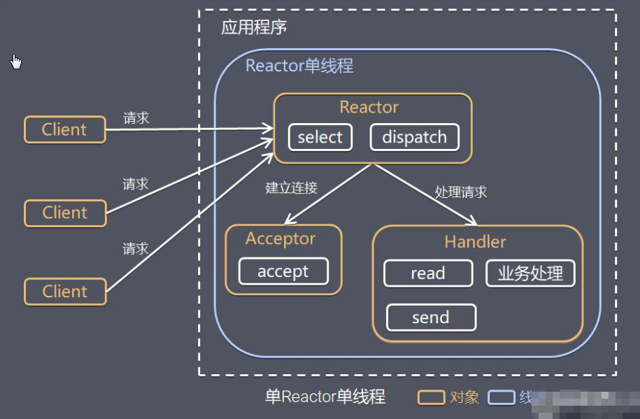
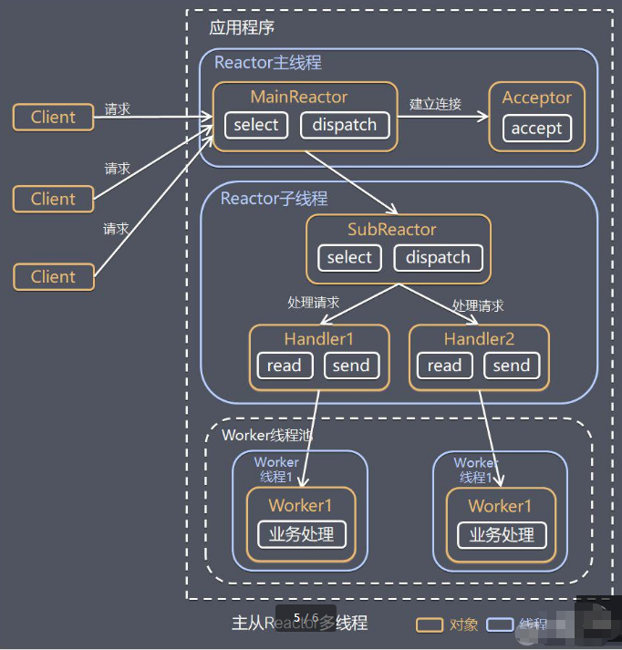
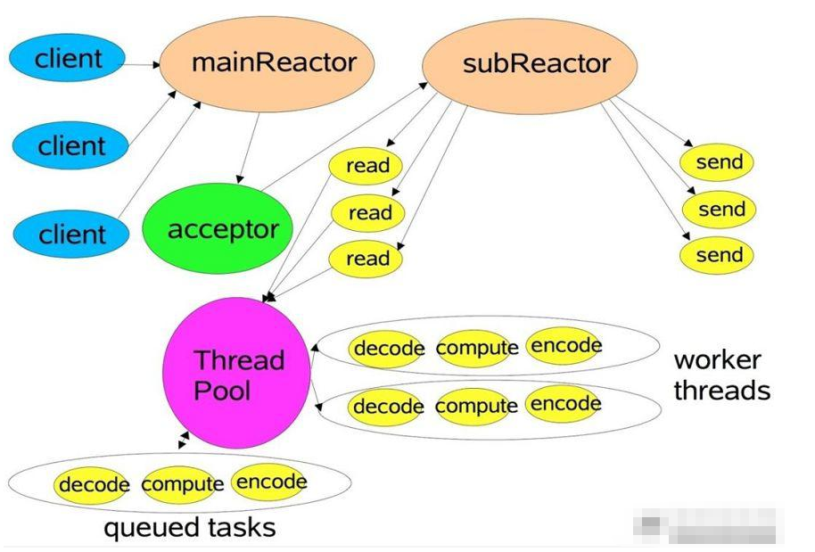
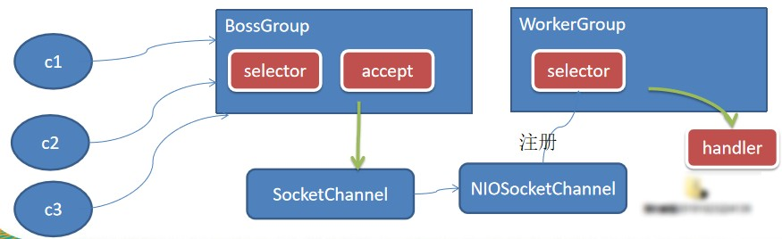
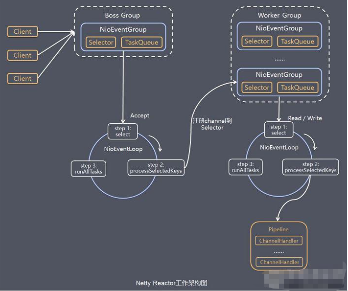

# 笔记

## 传统阻塞I/O的缺点

1. 并发量大时，创建大量线程，占用大量的系统资源。
2. 连接创建后，如果当前线程暂时**没有数据可读**，该线程会阻塞在read操作，造成线程资源浪费。

## Reactor模式

Reactor在一个单独的线程中运行，负责监听和分发事件。

三种模式：

- 单Reactor单线程

    

- 单Reactor多线程

    

- 主从Reactor多线程

    - 
    - 

## 主从Reactor多线程流程说明

1. reactor主线程mainreactor对象通过select监听连接事件，收到连接事件后，通过acceptor处理连接事件。
2. 当acceptor处理连接事件后，mainreactor将连接分配给subreactor。
3. subreactor将连接加入到连接队列进行监听，并创建handler进行各种事件处理。
4. 当有新事件发生时，subreactor就会调用对应的handler处理。
5. handler通过read读取数据，分发给后面的worker线程处理。
6. worker线程池分配独立的worker线程进行业务处理，并返回结果。
7. handler收到响应的结果后，再通过send将结果返回给client。
8. mainreactor可以关联多个subreactor。

## netty模型(简单和进阶)

1. BG线程维护一个selector，关联一个serversocketchannel，只关注accept事件。
2. 当监听到accept事件后，获取对应的socketchannel，封装成niosocketchannel。
3. WG线程也维护一个selector，它接收BG传递过来的niosocketchannel，关联到selector中，确定关注的事件。
4. 当niosocketchannel事件发生时，WG线程将其交给handler进行处理。

所谓进阶版，就是一个BG中有多个线程在轮询，而WG中也有多个线程在轮询。

## netty模型(详细)

(服务端)可以理解为BG和WG实际上工作模式是一致的，只是BG负责处理连接事件，WG负责处理写、读事件。

BG和WG就是一个线程池，而NioEventLoop就是线程池中的线程，它们的做法就是轮询，然后传递channel对象。

pipeline封装了channel，内置了许多的处理器，可以方便地操作channel的读和写。
