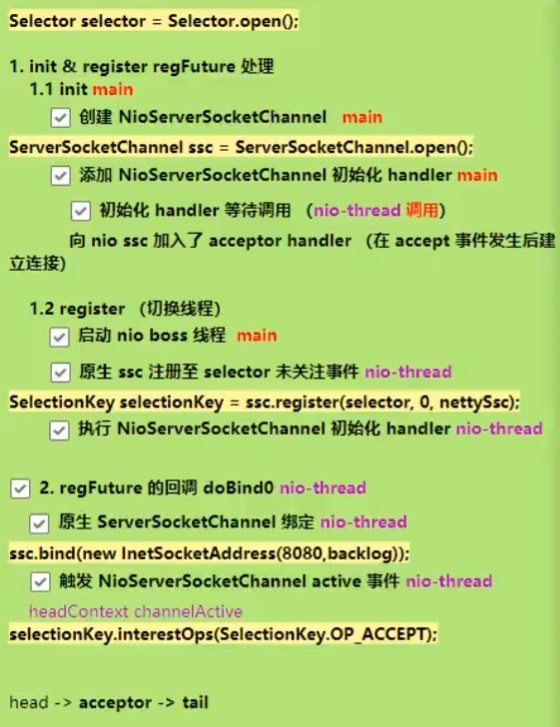
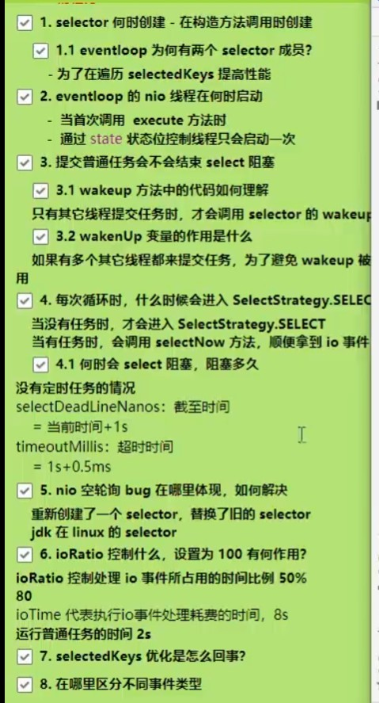

# 笔记

## 启动流程



```java
private ChannelFuture doBind(final SocketAddress localAddress) {
    // 会初始化原生ServerSocketChannel并注册到Selector，注意在方法内部完成了线程切换，因此该方法是一个异步方法，并返回一个promise对象:
    final ChannelFuture regFuture = initAndRegister();
    final Channel channel = regFuture.channel();
    if (regFuture.cause() != null) {
        return regFuture;
    }
    // 如果initAndRegister()执行得快，由主线程来执行绑定监听端口操作，如果执行得慢，由NIO线程来执行绑定监听端口操作:
    if (regFuture.isDone()) {
        // At this point we know that the registration was complete and successful.
        ChannelPromise promise = channel.newPromise();
        // 绑定监听端口(主线程):
        doBind0(regFuture, channel, localAddress, promise);
        return promise;
    } else {
        // Registration future is almost always fulfilled already, but just in case it's not.
        final PendingRegistrationPromise promise = new PendingRegistrationPromise(channel);
        // 由主线程向promise对象添加一个回调对象，将来promise有结果时将调用该回调方法:
        regFuture.addListener(new ChannelFutureListener() {
            @Override
            public void operationComplete(ChannelFuture future) throws Exception {
                Throwable cause = future.cause();
                if (cause != null) {
                    // Registration on the EventLoop failed so fail the ChannelPromise directly to not cause an
                    // IllegalStateException once we try to access the EventLoop of the Channel.
                    promise.setFailure(cause);
                } else {
                    // Registration was successful, so set the correct executor to use.
                    // See https://github.com/netty/netty/issues/2586
                    promise.registered();
                    // 绑定监听端口(NIO线程)，看底下源码:
                    doBind0(regFuture, channel, localAddress, promise);
                }
            }
        });
        return promise;
    }
}

final ChannelFuture initAndRegister() {
    Channel channel = null;
    // init
    try {
        // 实例化NioServerSocketChannel，顺带在内部实例化了ServerSocketChannel:
        channel = channelFactory.newChannel();
        // 看底下源码，为NioServerSocketChannel添加一个初始化handler，初始化handler等待被调用:
        init(channel);
    } catch (Throwable t) {
        if (channel != null) {
            // channel can be null if newChannel crashed (eg SocketException("too many open files"))
            channel.unsafe().closeForcibly();
            // as the Channel is not registered yet we need to force the usage of the GlobalEventExecutor
            return new DefaultChannelPromise(channel, GlobalEventExecutor.INSTANCE).setFailure(t);
        }
        // as the Channel is not registered yet we need to force the usage of the GlobalEventExecutor
        return new DefaultChannelPromise(new FailedChannel(), GlobalEventExecutor.INSTANCE).setFailure(t);
    }
    // register
    // 看底下源码，很重要的一个步骤是切换线程，将方法的执行权从主线程切换到NIO线程:
    ChannelFuture regFuture = config().group().register(channel);
    if (regFuture.cause() != null) {
        if (channel.isRegistered()) {
            channel.close();
        } else {
            channel.unsafe().closeForcibly();
        }
    }

    // If we are here and the promise is not failed, it's one of the following cases:
    // 1) If we attempted registration from the event loop, the registration has been completed at this point.
    //    i.e. It's safe to attempt bind() or connect() now because the channel has been registered.
    // 2) If we attempted registration from the other thread, the registration request has been successfully
    //    added to the event loop's task queue for later execution.
    //    i.e. It's safe to attempt bind() or connect() now:
    //         because bind() or connect() will be executed *after* the scheduled registration task is executed
    //         because register(), bind(), and connect() are all bound to the same thread.

    return regFuture;
}

@Override
void init(Channel channel) {
    setChannelOptions(channel, newOptionsArray(), logger);
    setAttributes(channel, newAttributesArray());

    ChannelPipeline p = channel.pipeline();

    final EventLoopGroup currentChildGroup = childGroup;
    final ChannelHandler currentChildHandler = childHandler;
    final Entry<ChannelOption<?>, Object>[] currentChildOptions = newOptionsArray(childOptions);
    final Entry<AttributeKey<?>, Object>[] currentChildAttrs = newAttributesArray(childAttrs);

    p.addLast(new ChannelInitializer<Channel>() {
        // 为NioServerSocketChannel添加一个初始化handler，初始化方法只会执行一次，刚添加时并不会执行:
        @Override
        public void initChannel(final Channel ch) {
            final ChannelPipeline pipeline = ch.pipeline();
            ChannelHandler handler = config.handler();
            if (handler != null) {
                pipeline.addLast(handler);
            }
            // 为NioServerSocketChannel中添加一个acceptor handler，这个handler负责将来accept事件发生后建立连接:
            ch.eventLoop().execute(new Runnable() {
                @Override
                public void run() {
                    pipeline.addLast(new ServerBootstrapAcceptor(
                            ch, currentChildGroup, currentChildHandler, currentChildOptions, currentChildAttrs));
                }
            });
        }
    });
}

@Override
public final void register(EventLoop eventLoop, final ChannelPromise promise) {
    ObjectUtil.checkNotNull(eventLoop, "eventLoop");
    if (isRegistered()) {
        promise.setFailure(new IllegalStateException("registered to an event loop already"));
        return;
    }
    if (!isCompatible(eventLoop)) {
        promise.setFailure(
                new IllegalStateException("incompatible event loop type: " + eventLoop.getClass().getName()));
        return;
    }

    AbstractChannel.this.eventLoop = eventLoop;
    // 主线程运行到这里需要进行线程切换，切换到NIO线程:
    if (eventLoop.inEventLoop()) {
        register0(promise);
    } else {
        try {
            // 直到execute执行时，才会将eventLoop中包含的线程创建出来(懒加载)，然后执行register0方法:
            eventLoop.execute(new Runnable() {
                @Override
                public void run() {
                    // 看底下源码:
                    register0(promise);
                }
            });
        } catch (Throwable t) {
            logger.warn(
                    "Force-closing a channel whose registration task was not accepted by an event loop: {}",
                    AbstractChannel.this, t);
            closeForcibly();
            closeFuture.setClosed();
            safeSetFailure(promise, t);
        }
    }
}

private void register0(ChannelPromise promise) {
    try {
        // check if the channel is still open as it could be closed in the mean time when the register
        // call was outside of the eventLoop
        if (!promise.setUncancellable() || !ensureOpen(promise)) {
            return;
        }
        boolean firstRegistration = neverRegistered;
        // 看底下源码，将原生的ServerSocketChannel注册到NioEventLoop包含的Selector上，并将NioServerSocketChannel作为附件挂载到selectionKey:
        doRegister();
        neverRegistered = false;
        registered = true;

        // Ensure we call handlerAdded(...) before we actually notify the promise. This is needed as the
        // user may already fire events through the pipeline in the ChannelFutureListener.
        // 执行为NioServerSocketChannel添加的初始化handler中的初始化方法:
        pipeline.invokeHandlerAddedIfNeeded();
        // 为上述所提到的promise对象设置结果:
        safeSetSuccess(promise);
        pipeline.fireChannelRegistered();
        // Only fire a channelActive if the channel has never been registered. This prevents firing
        // multiple channel actives if the channel is deregistered and re-registered.
        if (isActive()) {
            if (firstRegistration) {
                pipeline.fireChannelActive();
            } else if (config().isAutoRead()) {
                // This channel was registered before and autoRead() is set. This means we need to begin read
                // again so that we process inbound data.
                //
                // See https://github.com/netty/netty/issues/4805
                beginRead();
            }
        }
    } catch (Throwable t) {
        // Close the channel directly to avoid FD leak.
        closeForcibly();
        closeFuture.setClosed();
        safeSetFailure(promise, t);
    }
}

@Override
protected void doRegister() throws Exception {
    boolean selected = false;
    for (;;) {
        try {
            // javaChannel()就是拿到原生的ServerSocketChannel，将其注册到当前eventLoop包含的Selector，
            // this对象就是NioServerSocketChannel，将其作为附件添加到selectionKey上:
            selectionKey = javaChannel().register(eventLoop().unwrappedSelector(), 0, this);
            return;
        } catch (CancelledKeyException e) {
            if (!selected) {
                // Force the Selector to select now as the "canceled" SelectionKey may still be
                // cached and not removed because no Select.select(..) operation was called yet.
                eventLoop().selectNow();
                selected = true;
            } else {
                // We forced a select operation on the selector before but the SelectionKey is still cached
                // for whatever reason. JDK bug ?
                throw e;
            }
        }
    }
}

@Override
public final void bind(final SocketAddress localAddress, final ChannelPromise promise) {
    assertEventLoop();

    if (!promise.setUncancellable() || !ensureOpen(promise)) {
        return;
    }

    // See: https://github.com/netty/netty/issues/576
    if (Boolean.TRUE.equals(config().getOption(ChannelOption.SO_BROADCAST)) &&
        localAddress instanceof InetSocketAddress &&
        !((InetSocketAddress) localAddress).getAddress().isAnyLocalAddress() &&
        !PlatformDependent.isWindows() && !PlatformDependent.maybeSuperUser()) {
        // Warn a user about the fact that a non-root user can't receive a
        // broadcast packet on *nix if the socket is bound on non-wildcard address.
        logger.warn(
                "A non-root user can't receive a broadcast packet if the socket " +
                "is not bound to a wildcard address; binding to a non-wildcard " +
                "address (" + localAddress + ") anyway as requested.");
    }

    boolean wasActive = isActive();
    try {
        // 看底下源码，真正执行了原生ServerSocketChannel监听端口的绑定:
        doBind(localAddress);
    } catch (Throwable t) {
        safeSetFailure(promise, t);
        closeIfClosed();
        return;
    }
    // 原生ServerSocketChannel经过前面一系列的事件操作，现在已经处于可用状态了:
    if (!wasActive && isActive()) {
        invokeLater(new Runnable() {
            @Override
            public void run() {
                // 触发所有handler的channelActive方法，channel本身并不具备业务功能，真正执行业务的都是handler，
                // 此处共有 head => acceptor => tail 三个handler，只有head handler中的active方法需要执行，
                // 对上述提到的selectionKey上添加OP_ACCEPT感兴趣事件，可以看下面doBeginRead的源码:
                pipeline.fireChannelActive();
            }
        });
    }

    safeSetSuccess(promise);
}

@SuppressJava6Requirement(reason = "Usage guarded by java version check")
@Override
protected void doBind(SocketAddress localAddress) throws Exception {
    if (PlatformDependent.javaVersion() >= 7) {
        javaChannel().bind(localAddress, config.getBacklog());
    } else {
        javaChannel().socket().bind(localAddress, config.getBacklog());
    }
}

@Override
protected void doBeginRead() throws Exception {
    // Channel.read() or ChannelHandlerContext.read() was called
    final SelectionKey selectionKey = this.selectionKey;
    if (!selectionKey.isValid()) {
        return;
    }

    readPending = true;

    final int interestOps = selectionKey.interestOps();
    if ((interestOps & readInterestOp) == 0) {
        selectionKey.interestOps(interestOps | readInterestOp);
    }
}
```

## NioEventLoop

由selector、thread、任务队列、定时任务队列组成，selector为自身持有，thread和任务队列taskQueue从祖父类SingleThreadEventExecutor中继承过来，然后在其曾祖父类AbstractScheduledEventExecutor中又继承了定时任务队列scheduledTaskQueue。

**注意任务队列是普通任务和定时任务的队列，I/O事件可以直接通过selector的selectedKeys来获取**。



### selector的创建

```java
NioEventLoop(NioEventLoopGroup parent, Executor executor, SelectorProvider selectorProvider,
                SelectStrategy strategy, RejectedExecutionHandler rejectedExecutionHandler,
                EventLoopTaskQueueFactory queueFactory) {
    super(parent, executor, false, newTaskQueue(queueFactory), newTaskQueue(queueFactory),
            rejectedExecutionHandler);
    this.provider = ObjectUtil.checkNotNull(selectorProvider, "selectorProvider");
    this.selectStrategy = ObjectUtil.checkNotNull(strategy, "selectStrategy");
    // 创建selector对象，实际上NIO编程里Selector.open()创建语句，其内部和这里本质上是一样的:
    final SelectorTuple selectorTuple = openSelector();
    this.selector = selectorTuple.selector;
    this.unwrappedSelector = selectorTuple.unwrappedSelector;
}

private SelectorTuple openSelector() {
    final Selector unwrappedSelector;
    try {
        // 这里创建的是底层NIO提供的selector对象:
        unwrappedSelector = provider.openSelector();
    } catch (IOException e) {
        throw new ChannelException("failed to open a new selector", e);
    }

    if (DISABLE_KEY_SET_OPTIMIZATION) {
        return new SelectorTuple(unwrappedSelector);
    }

    Object maybeSelectorImplClass = AccessController.doPrivileged(new PrivilegedAction<Object>() {
        @Override
        public Object run() {
            try {
                return Class.forName(
                        "sun.nio.ch.SelectorImpl",
                        false,
                        PlatformDependent.getSystemClassLoader());
            } catch (Throwable cause) {
                return cause;
            }
        }
    });

    if (!(maybeSelectorImplClass instanceof Class) ||
        // ensure the current selector implementation is what we can instrument.
        !((Class<?>) maybeSelectorImplClass).isAssignableFrom(unwrappedSelector.getClass())) {
        if (maybeSelectorImplClass instanceof Throwable) {
            Throwable t = (Throwable) maybeSelectorImplClass;
            logger.trace("failed to instrument a special java.util.Set into: {}", unwrappedSelector, t);
        }
        return new SelectorTuple(unwrappedSelector);
    }

    final Class<?> selectorImplClass = (Class<?>) maybeSelectorImplClass;
    // netty提供的基于数组的SelectionKey:
    final SelectedSelectionKeySet selectedKeySet = new SelectedSelectionKeySet();

    Object maybeException = AccessController.doPrivileged(new PrivilegedAction<Object>() {
        @Override
        public Object run() {
            try {
                Field selectedKeysField = selectorImplClass.getDeclaredField("selectedKeys");
                Field publicSelectedKeysField = selectorImplClass.getDeclaredField("publicSelectedKeys");

                if (PlatformDependent.javaVersion() >= 9 && PlatformDependent.hasUnsafe()) {
                    // Let us try to use sun.misc.Unsafe to replace the SelectionKeySet.
                    // This allows us to also do this in Java9+ without any extra flags.
                    // 拿到原生selector的selectedKeys和publicSelectedKeys变量:
                    long selectedKeysFieldOffset = PlatformDependent.objectFieldOffset(selectedKeysField);
                    long publicSelectedKeysFieldOffset =
                            PlatformDependent.objectFieldOffset(publicSelectedKeysField);

                    if (selectedKeysFieldOffset != -1 && publicSelectedKeysFieldOffset != -1) {
                        PlatformDependent.putObject(
                                unwrappedSelector, selectedKeysFieldOffset, selectedKeySet);
                        PlatformDependent.putObject(
                                unwrappedSelector, publicSelectedKeysFieldOffset, selectedKeySet);
                        return null;
                    }
                    // We could not retrieve the offset, lets try reflection as last-resort.
                }

                Throwable cause = ReflectionUtil.trySetAccessible(selectedKeysField, true);
                if (cause != null) {
                    return cause;
                }
                cause = ReflectionUtil.trySetAccessible(publicSelectedKeysField, true);
                if (cause != null) {
                    return cause;
                }
                // 用netty提供的基于数组的SelectionKey替换原生selector的selectedKeys和publicSelectedKeys:
                selectedKeysField.set(unwrappedSelector, selectedKeySet);
                publicSelectedKeysField.set(unwrappedSelector, selectedKeySet);
                return null;
            } catch (NoSuchFieldException e) {
                return e;
            } catch (IllegalAccessException e) {
                return e;
            }
        }
    });

    if (maybeException instanceof Exception) {
        selectedKeys = null;
        Exception e = (Exception) maybeException;
        logger.trace("failed to instrument a special java.util.Set into: {}", unwrappedSelector, e);
        return new SelectorTuple(unwrappedSelector);
    }
    selectedKeys = selectedKeySet;
    logger.trace("instrumented a special java.util.Set into: {}", unwrappedSelector);
    return new SelectorTuple(unwrappedSelector,
                                new SelectedSelectionKeySetSelector(unwrappedSelector, selectedKeySet));
}
```

### EventLoop的NIO线程

**NIO线程只有在第一次执行任务时才会被创建(启动)，懒加载机制，并通过一个状态位来保证单线程**。

```java
private void execute(Runnable task, boolean immediate) {
    boolean inEventLoop = inEventLoop();
    // 添加到任务队列:
    addTask(task);
    if (!inEventLoop) {
        startThread();
        if (isShutdown()) {
            boolean reject = false;
            try {
                if (removeTask(task)) {
                    reject = true;
                }
            } catch (UnsupportedOperationException e) {
                // The task queue does not support removal so the best thing we can do is to just move on and
                // hope we will be able to pick-up the task before its completely terminated.
                // In worst case we will log on termination.
            }
            if (reject) {
                reject();
            }
        }
    }
    // 任务被提交，尝试唤醒selector:
    if (!addTaskWakesUp && immediate) {
        wakeup(inEventLoop);
    }
}

private void startThread() {
    if (state == ST_NOT_STARTED) {
        if (STATE_UPDATER.compareAndSet(this, ST_NOT_STARTED, ST_STARTED)) {
            boolean success = false;
            try {
                // 方法内部，thread变量被赋值，并通过一个死循环，不断地查看有没有新的任务(I/O、普通、定时)，如果有则执行，
                // 使用NIO编程中提到的selector.select(timeoutMillis)语句，如果无任务则阻塞，有任务则被唤醒，
                // 更具体一点来讲是，到达超时时间会被唤醒，有普通任务会被唤醒，有I/O事件会被唤醒:
                doStartThread();
                success = true;
            } finally {
                if (!success) {
                    STATE_UPDATER.compareAndSet(this, ST_STARTED, ST_NOT_STARTED);
                }
            }
        }
    }
}

@Override
protected void wakeup(boolean inEventLoop) {
    // !inEventLoop表示只有其它线程提交任务，才会唤醒selector，如果是当前NIO线程自己提交任务，则执行另外的逻辑，
    // nextWakeupNanos.getAndSet(AWAKE) != AWAKE是为了避免wakeup()被频繁调用，该方法是一个重量级操作，
    // 如果同时有多个线程提交任务，只需要一个线程来唤醒，唤醒之后所有线程的任务都会被得到执行:
    if (!inEventLoop && nextWakeupNanos.getAndSet(AWAKE) != AWAKE) {
        selector.wakeup();
    }
}

@Override
protected void run() {
    int selectCnt = 0;
    for (;;) {
        try {
            int strategy;
            try {
                // 无任务时会进入SELECT分支，有任务时还会顺带再查看一次是否有I/O事件发生，尽可能地执行I/O任务:
                strategy = selectStrategy.calculateStrategy(selectNowSupplier, hasTasks());
                switch (strategy) {
                case SelectStrategy.CONTINUE:
                    continue;

                case SelectStrategy.BUSY_WAIT:
                    // fall-through to SELECT since the busy-wait is not supported with NIO

                case SelectStrategy.SELECT:
                    long curDeadlineNanos = nextScheduledTaskDeadlineNanos();
                    if (curDeadlineNanos == -1L) {
                        curDeadlineNanos = NONE; // nothing on the calendar
                    }
                    nextWakeupNanos.set(curDeadlineNanos);
                    try {
                        if (!hasTasks()) {
                            strategy = select(curDeadlineNanos);
                        }
                    } finally {
                        // This update is just to help block unnecessary selector wakeups
                        // so use of lazySet is ok (no race condition)
                        nextWakeupNanos.lazySet(AWAKE);
                    }
                    // fall through
                default:
                }
            } catch (IOException e) {
                // If we receive an IOException here its because the Selector is messed up. Let's rebuild
                // the selector and retry. https://github.com/netty/netty/issues/8566
                rebuildSelector0();
                selectCnt = 0;
                handleLoopException(e);
                continue;
            }
            // NIO空轮询BUG的解决体现，如果select()被异常唤醒，导致不断地进行空轮询，因此对轮询次数进行计时，超过某个阈值(默认512，可以自行设置)可以认为发生了BUG，
            // 发生BUG之后，会重新创建一个selector，将旧的selector上的信息迁移到新的上面，用新的替换旧的:
            selectCnt++;
            cancelledKeys = 0;
            needsToSelectAgain = false;
            final int ioRatio = this.ioRatio;
            boolean ranTasks;
            // ioRatio 控制处理I/O事件的时间比例，因为单线程执行，普通任务会影响到I/O事件的运行:
            if (ioRatio == 100) {
                // 如果ioRatio设置为100，反而会让普通任务尽可能地执行完，影响到I/O事件的运行:
                try {
                    if (strategy > 0) {
                        processSelectedKeys();
                    }
                } finally {
                    // Ensure we always run tasks.
                    ranTasks = runAllTasks();
                }
            } else if (strategy > 0) {
                final long ioStartTime = System.nanoTime();
                try {
                    // 优先处理I/O事件:
                    processSelectedKeys();
                } finally {
                    // Ensure we always run tasks.
                    final long ioTime = System.nanoTime() - ioStartTime;
                    // runAllTasks执行所有提交的任务，
                    // ioTime表示执行I/O事件的时间，按照ioTime来计算普通任务可执行的时间，
                    // 一旦队列中的任务执行时间超过该时间，就不会执行队列中的下一个任务:
                    ranTasks = runAllTasks(ioTime * (100 - ioRatio) / ioRatio);
                }
            } else {
                ranTasks = runAllTasks(0); // This will run the minimum number of tasks
            }

            if (ranTasks || strategy > 0) {
                if (selectCnt > MIN_PREMATURE_SELECTOR_RETURNS && logger.isDebugEnabled()) {
                    logger.debug("Selector.select() returned prematurely {} times in a row for Selector {}.",
                            selectCnt - 1, selector);
                }
                selectCnt = 0;
            } else if (unexpectedSelectorWakeup(selectCnt)) { // Unexpected wakeup (unusual case)
                selectCnt = 0;
            }
        } catch (CancelledKeyException e) {
            // Harmless exception - log anyway
            if (logger.isDebugEnabled()) {
                logger.debug(CancelledKeyException.class.getSimpleName() + " raised by a Selector {} - JDK bug?",
                        selector, e);
            }
        } catch (Error e) {
            throw (Error) e;
        } catch (Throwable t) {
            handleLoopException(t);
        } finally {
            // Always handle shutdown even if the loop processing threw an exception.
            try {
                if (isShuttingDown()) {
                    closeAll();
                    if (confirmShutdown()) {
                        return;
                    }
                }
            } catch (Error e) {
                throw (Error) e;
            } catch (Throwable t) {
                handleLoopException(t);
            }
        }
    }
}
```

### selectedKeys优化

```java
private void processSelectedKeys() {
    if (selectedKeys != null) {
        processSelectedKeysOptimized();
    } else {
        processSelectedKeysPlain(selector.selectedKeys());
    }
}

private void processSelectedKeysOptimized() {
    for (int i = 0; i < selectedKeys.size; ++i) {
        final SelectionKey k = selectedKeys.keys[i];
        // null out entry in the array to allow to have it GC'ed once the Channel close
        // See https://github.com/netty/netty/issues/2363
        selectedKeys.keys[i] = null;
        // 拿到上述提到的NioServerSocketChannel，因为要对事件进行处理，而要处理的handler就在NSSC身上，handler才能处理这些发生了事件的key:
        final Object a = k.attachment();

        if (a instanceof AbstractNioChannel) {
            processSelectedKey(k, (AbstractNioChannel) a);
        } else {
            @SuppressWarnings("unchecked")
            NioTask<SelectableChannel> task = (NioTask<SelectableChannel>) a;
            processSelectedKey(k, task);
        }

        if (needsToSelectAgain) {
            // null out entries in the array to allow to have it GC'ed once the Channel close
            // See https://github.com/netty/netty/issues/2363
            selectedKeys.reset(i + 1);

            selectAgain();
            i = -1;
        }
    }
}

private void processSelectedKey(SelectionKey k, AbstractNioChannel ch) {
    final AbstractNioChannel.NioUnsafe unsafe = ch.unsafe();
    if (!k.isValid()) {
        final EventLoop eventLoop;
        try {
            eventLoop = ch.eventLoop();
        } catch (Throwable ignored) {
            // If the channel implementation throws an exception because there is no event loop, we ignore this
            // because we are only trying to determine if ch is registered to this event loop and thus has authority
            // to close ch.
            return;
        }
        // Only close ch if ch is still registered to this EventLoop. ch could have deregistered from the event loop
        // and thus the SelectionKey could be cancelled as part of the deregistration process, but the channel is
        // still healthy and should not be closed.
        // See https://github.com/netty/netty/issues/5125
        if (eventLoop == this) {
            // close the channel if the key is not valid anymore
            unsafe.close(unsafe.voidPromise());
        }
        return;
    }
    // 各种事件的处理分支，把数据发给pipeline上的handler，让它们去对数据进行处理:
    try {
        int readyOps = k.readyOps();
        // We first need to call finishConnect() before try to trigger a read(...) or write(...) as otherwise
        // the NIO JDK channel implementation may throw a NotYetConnectedException.
        if ((readyOps & SelectionKey.OP_CONNECT) != 0) {
            // remove OP_CONNECT as otherwise Selector.select(..) will always return without blocking
            // See https://github.com/netty/netty/issues/924
            int ops = k.interestOps();
            ops &= ~SelectionKey.OP_CONNECT;
            k.interestOps(ops);

            unsafe.finishConnect();
        }

        // Process OP_WRITE first as we may be able to write some queued buffers and so free memory.
        if ((readyOps & SelectionKey.OP_WRITE) != 0) {
            // Call forceFlush which will also take care of clear the OP_WRITE once there is nothing left to write
            ch.unsafe().forceFlush();
        }

        // Also check for readOps of 0 to workaround possible JDK bug which may otherwise lead
        // to a spin loop
        if ((readyOps & (SelectionKey.OP_READ | SelectionKey.OP_ACCEPT)) != 0 || readyOps == 0) {
            unsafe.read();
        }
    } catch (CancelledKeyException ignored) {
        unsafe.close(unsafe.voidPromise());
    }
}
```

## accept流程

NIO原始的accept流程：

1. selector.select()阻塞直到事件发生。
2. 遍历处理selectedKeys。
3. 拿到一个key，判断事件类型是否为accept。
4. 创建socketchannel，设置非阻塞。
5. 将socketchannel注册至selector。
6. 关注selectionKey的read事件。
