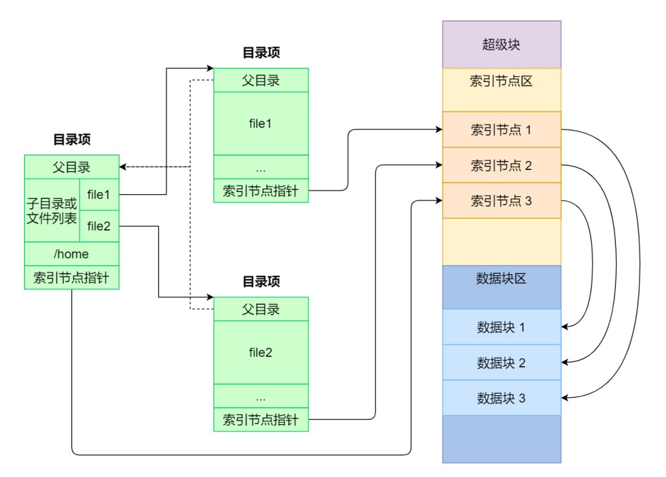

# 笔记

## 文件系统的组成

Linux ⽂件系统会为每个⽂件分配两个数据结构：索引节点（index node）和⽬录项（directory entry），它们主要⽤来记录⽂件的元信息和⽬录层次结构。

- 索引节点，也就是 inode，⽤来记录⽂件的元信息，⽐如 inode 编号、⽂件⼤⼩、访问权限、创建时间、修改时间、数据在磁盘的位置等等。索引节点是⽂件的唯⼀标识，它们之间⼀⼀对应，也同样都会被存储在硬盘中，所以**索引节点同样占⽤磁盘空间**。
- ⽬录项，也就是 dentry，⽤来记录⽂件的**名字**、索引节点指针以及与其他⽬录项的层级关联关系。多个⽬录项关联起来，就会形成⽬录结构，但它与索引节点不同的是，**⽬录项是由内核维护的⼀个数据结构，不存放于磁盘，⽽是缓存在内存**。

由于索引节点唯⼀标识⼀个⽂件，⽽⽬录项记录着⽂件的名，所以⽬录项和索引节点的关系是多对⼀，也就是说，⼀个⽂件可以有多个别名。⽐如，硬链接的实现就是多个⽬录项中的索引节点指向同⼀个⽂件。

磁盘读写的最⼩单位是扇区，扇区的⼤⼩只有 512B ⼤⼩，很明显，如果每次读写都以这么⼩为单位，那这读写的效率会⾮常低。

所以，⽂件系统把多个扇区组成了⼀个逻辑块，每次读写的最⼩单位就是逻辑块（数据块），Linux 中的逻辑块⼤⼩为 4KB ，也就是⼀次性读写 8 个扇区，这将⼤⼤提⾼了磁盘的读写的效率。

- 超级块：当⽂件系统挂载时进⼊内存；
- 索引节点区：当⽂件被访问时进⼊内存；

## 虚拟文件系统

⽂件系统的种类众多，⽽操作系统希望**对⽤户提供⼀个统⼀的接⼝**，于是在⽤户层与⽂件系统层引⼊了中间层，这个中间层就称为虚拟⽂件系统（Virtual File System，VFS）。

在Linux文件系统中，用户空间、系统调用、虚拟机文件系统、缓存、文件系统以及存储之间的关系如下：

用户空间中的应用程序和库函数通过内核空间的系统调用访问虚拟文件系统(包含页缓存、目录项缓存、索引节点缓存)，虚拟文件系统再访问真实文件系统，真实文件系统和外部设备(本地磁盘设备、网络存储等)之间建立起缓冲区加快读写速度。

## 文件的使用

写入一个文件的过程：

- 首先用open系统调用打开文件；
- 使用write系统调用写数据，write使用open返回的文件描述符；
- 使用完文件后，调用close系统调用关闭文件，避免资源泄露。

用户空间write() => 虚拟文件系统sys_write() => 文件系统的写方法 => 磁盘。

我们打开了⼀个⽂件后，操作系统会跟踪进程打开的所有⽂件，所谓的跟踪呢，就是操作系统为每个进程维护⼀个打开⽂件表，⽂件表⾥的每⼀项代表「⽂件描述符」，所以说⽂件描述符是打开⽂件的标识。

在⽤户视⻆⾥，⽂件就是⼀个持久化的数据结构，但操作系统并不会关⼼你想存在磁盘上的任何的数据结构，**操作系统的视⻆是如何把⽂件数据和磁盘块对应起来**。

所以，⽤户和操作系统对⽂件的读写操作是有差异的，⽤户习惯以字节的⽅式读写⽂件，⽽操作系统则是以数据块来读写⽂件，**那屏蔽掉这种差异的⼯作就是⽂件系统了**。

读⽂件和写⽂件的过程：

- 当⽤户进程从⽂件读取 1 个字节⼤⼩的数据时，⽂件系统则需要获取字节所在的数据块，再返回数据块对应的⽤户进程所需的数据部分。
- 当⽤户进程把 1 个字节⼤⼩的数据写进⽂件时，⽂件系统则找到需要写⼊数据的数据块的位置，然后修改数据块中对应的部分，最后再把数据块写回磁盘。

**⽂件系统的基本操作单位是数据块**。

## 文件的存储

连续空间存放：顺序分配

非连续空间存放：链表分配和索引分配

## 空闲空间管理

- 空闲表法
- 空闲链表法
- 位图法(Linux)

## 文件系统的结构

## 目录的存储

## 软链接和硬链接

有时候我们希望给某个⽂件取个别名，那么在 Linux 中可以通过硬链接（Hard Link） 和软链接（Symbolic Link） 的⽅式来实现，它们都是⽐较特殊的⽂件，但是实现⽅式也是不相同的。

硬链接是多个⽬录项中的「索引节点」指向⼀个⽂件，也就是指向同⼀个 inode，但是 inode 是不可能跨越⽂件系统的，每个⽂件系统都有各⾃的 inode 数据结构和列表，所以硬链接是不可⽤于跨⽂件系统的。由于多个⽬录项都是指向⼀个 inode，那么**只有删除⽂件的所有硬链接以及源⽂件时，系统才会彻底删除该⽂件**。

软链接相当于重新创建⼀个⽂件，这个⽂件有**独⽴的 inode**，但是这个**⽂件的内容是另外⼀个⽂件的路径**，所以访问软链接的时候，实际上相当于访问到了另外⼀个⽂件，所以**软链接是可以跨⽂件系统的**，甚⾄**⽬标⽂件被删除了，链接⽂件还是在的，只不过指向的⽂件找不到了⽽已**。

## 文件I/O

### 缓冲与非缓冲I/O

⽂件操作的标准库是可以实现数据的缓存，那么**根据「是否利⽤标准库缓冲」**，可以把⽂件 I/O 分为缓冲I/O 和⾮缓冲 I/O。

这⾥所说的「缓冲」特指**标准库内部实现的缓冲(注意和操作系统的缓存做区别)**。

⽐⽅说，很多程序遇到换⾏时才真正输出，⽽换⾏前的内容，其实就是被标准库暂时缓存了起来，这样做的⽬的是，减少系统调⽤的次数，毕竟系统调⽤是有 CPU 上下⽂切换的开销的。

### 直接与非直接I/O

Linux 内核为了减少磁盘 I/O 次数，在系统调⽤后，会把⽤户数据拷⻉到内核中缓存起来，这个内核缓存空间也就是「⻚缓存」，只有当缓存满⾜某些条件的时候，才发起磁盘 I/O 的请求。

**根据「是否利⽤操作系统的缓存」**，可以把⽂件 I/O 分为直接 I/O 与⾮直接 I/O。

以下⼏种场景会触发内核缓存的数据写⼊磁盘：

- 在调⽤ write 的最后，当发现内核缓存的数据太多的时候，内核会把数据写到磁盘上；
- ⽤户主动调⽤ sync ，内核缓存会刷到磁盘上；
- 当内存⼗分紧张，⽆法再分配⻚⾯时，也会把内核缓存的数据刷到磁盘上；
- 内核缓存的数据的缓存时间超过某个时间时，也会把数据刷到磁盘上；

### 阻塞与非阻塞I/O VS 同步与异步I/O

阻塞 I/O，当⽤户程序执⾏ read ，线程会被阻塞，⼀直等到内核数据准备好，并把数据从内核缓冲区拷⻉到应⽤程序的缓冲区中，当拷⻉过程完成， read 才会返回。

阻塞等待的是「**内核数据准备好**」和「**数据从内核态拷⻉到⽤户态**」这两个过程。

⾮阻塞 I/O，⾮阻塞的 read 请求在**数据未准备好的情况下⽴即返回，可以继续往下执⾏，此时应⽤程序不断轮询内核**，直到数据准备好，内核将数据拷⻉到应⽤程序缓冲区， read 调⽤才可以获取到结果。

**获取数据的过程，是⼀个同步的过程，是需要等待的过程。这⾥的同步指的是内核态的数据拷⻉到⽤户程序的缓存区这个过程**。

了解决这种傻乎乎轮询⽅式，于是 I/O 多路复⽤技术就出来了。

⽆论是阻塞 I/O、⾮阻塞 I/O，还是基于⾮阻塞 I/O 的多路复⽤**都是同步调⽤。因为它们在 read 调⽤时，内核将数据从内核空间拷⻉到应⽤程序空间，过程都是需要等待的，也就是说这个过程是同步的，如果内核实现的拷⻉效率不⾼，read 调⽤就会在这个同步过程中等待⽐较⻓的时间**。

- 阻塞 I/O：等待数据准备好，然后从内核拷贝到用户。
- 非阻塞 I/O：轮询数据是否准备好，然后从内核拷贝到用户。
- 基于⾮阻塞 I/O 的多路复⽤：数据准备好时会进行通知，然后从内核拷贝到用户。

真正的异步 I/O 是「内核数据准备好」和「数据从内核态拷⻉到⽤户态」这两个过程都不⽤等待。

同步 I/O：指将数据从内核拷贝到用户态需要等待
异步 I/O：指将数据从内核拷贝到用户态不需要等待
