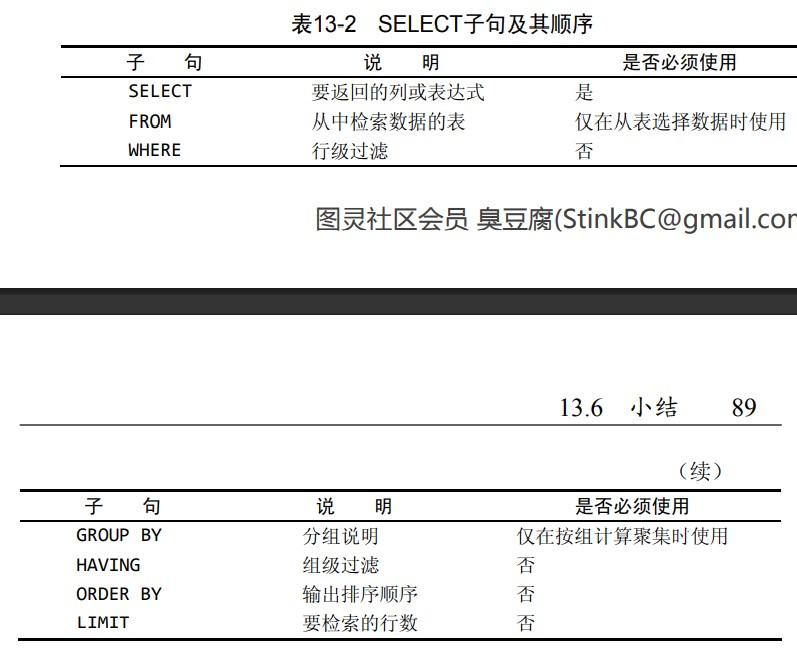

# 读书笔记

## 第3章：使用MySQL

```SQL
# 显示字段信息
SHOW COLUMNS FROM customers;
# MySQL支持用DESCRIBE作为上述的一种快捷方式
DESCRIBE customers;
# 显示广泛的服务器状态信息
SHOW STATUS;
# 显示创建数据库的MySQL语句
SHOW CREATE DATABASE learn_mysql;
# 显示创建表的MySQL语句
SHOW CREATE TABLE customers;
# 显示授予用户的安全权限
SHOW GRANTS;
# 显示服务器错误消息
SHOW ERRORS;
# 显示服务器警告消息
SHOW WARNINGS;
# 在命令行中执行可以显示允许的SHOW语句
HELP SHOW;
```

## 第4章：检索数据

> DISTINCT/LIMIT

```SQL
# 返回不同（唯一）的行
# 无法部分使用DISTINCT关键字，它将应用于所有列而不仅是前置它的列
SELECT DISTINCT vend_id
FROM products;
# 从第1行开始返回5行数据
# 注意数据库行索引从0开始
SELECT prod_name
FROM products
LIMIT 5;
# 从第5行开始返回5行数据
SELECT prod_name
FROM products
LIMIT 5, 5;
# MySQL5支持LIMIT的另一种替代语法
SELECT prod_name
FROM products
LIMIT 5 OFFSET 5;
# 使用完全限定列名以及完全限定表名，有一些情形需要完全限定名
SELECT products.prod_name
FROM learn_mysql.products;
```

## 第5章：排序检索数据

关系数据库设计理论认为，如果不明确规定排序顺序，则不应该假定检索出的数据的顺序有意义。

**MySQL和大多数数据库管理系统默认A被视为与a相同**。数据库管理员能够在需要时改变这种行为，但是你无法依赖ORDER BY子句来改变这种排序顺序。

```SQL
# 通常，ORDER BY子句中使用的列将是为显示所选择的列
# 但是，实际上用非检索的列排序数据是完全合法的
SELECT prod_name
FROM products
ORDER BY prod_name;
# 先按价格再按名称进行排序
SELECT prod_id, prod_price, prod_name
FROM products
ORDER BY prod_price, prod_name;
# 数据排序默认为升序，先按价格进行降序再按名称进行升序
# 如果都要降序，则每个列都需要指定DESC关键字
SELECT prod_id, prod_price, prod_name
FROM products
ORDER BY prod_price DESC, prod_name;
# 使用ORDER BY和LIMIT的组合找出最昂贵物品信息
# ORDER BY必须在FROM之后，LIMIT必须位于ORDER BY之后
SELECT prod_id, prod_price, prod_name
FROM products
ORDER BY prod_price DESC
LIMIT 1;
```

## 第6章：过滤数据

> BETWEEN

注意：MySQL执行匹配时默认不区分大小写，所以fuses与Fuses匹配。

```SQL
# 范围匹配
SELECT prod_name, prod_price
FROM products
WHERE prod_price BETWEEN 5 AND 10;
```

## 第7章：数据过滤

> IN

任何时候使用具有AND和OR操作符的WHERE子句，都应该使用圆括号明确地分组操作符。不要过分依赖默认计算次序，即使它确实是你想要地东西也是如此。使用圆括号没有什么坏处，它能消除歧义。

```SQL
# IN操作符其功能与OR相当，建议优先选用IN操作符
SELECT prod_name, prod_price
FROM products
WHERE vend_id IN (1002, 1003)
ORDER BY prod_name;
```

MySQL支持使用NOT对IN、BETWEEN和EXISTS子句取反，这与多数其它DBMS允许使用NOT对各种条件取反有很大的区别。

## 第8章：用通配符进行过滤

根据MySQL的配置方式，搜索可以是区分大小写的。

```SQL
# %表示任何字符出现的任意次数，在此处将检索任意以jet起头的词：
SELECT prod_id, prod_name
FROM products
WHERE prod_name LIKE 'jet%';
# 匹配任何位置包含文本anvil的值：
SELECT prod_id, prod_name
FROM products
WHERE prod_name LIKE '%anvil%';
# 找出以s起头以e结尾的所有产品：
SELECT prod_name
FROM products
WHERE prod_name LIKE 's%e';
```

%代表搜索模式中给定位置的0个、1个或多个字符，但'%'也不能匹配NULL值。

尾空格可能会干扰通配符匹配。例如，在保存词anvil时，如果它后面有一个或多个空格，则'%anvil'将不会匹配它们，因为在最后的l后有多余的字符。解决这个问题的一个简单的办法是在搜索模式最后附加一个%。一个更好的办法是使用函数去掉首尾空格。

```SQL
# _通配符只匹配单个字符：
SELECT prod_id, prod_name
FROM products
WHERE prod_name LIKE '_ ton anvil';
```

使用通配符要记住的技巧：

- 不要过度使用通配符。如果其它操作符能达到相同的目的，应该使用其它操作符。
- 在确实需要使用通配符时，除非绝对有必要，否则不要把它们用在搜索模式的开始处。把通配符置于搜索模式的开始处，搜索起来是最慢的。
- 仔细注意通配符的位置。如果放错地方，可能不会返回想要的数据。

## 第9章：用正则表达式进行搜索

> REGEXP

MySQL仅支持多数正则表达式实现的一个很小的子集。

```SQL
# .在正则表达式中表示匹配任意一个字符：
SELECT prod_name
FROM products
WHERE prod_name REGEXP '.000'
ORDER BY prod_name;
# REGEXP在列值内进行匹配，只要列值中出现文本'1000'就会返回该行：
SELECT prod_name
FROM products
WHERE prod_name REGEXP '1000'
ORDER BY prod_name;
# LIKE会匹配整个列，即使列值中出现文本'1000'也不会返回该行：
SELECT prod_name
FROM products
WHERE prod_name LIKE '1000'
ORDER BY prod_name;
# 使用BINARY关键为正则表达式匹配区分大小写：
SELECT prod_name
FROM products
WHERE prod_name REGEXP BINARY 'JetPack .000'
ORDER BY prod_name;
# 使用正则表达式进行OR匹配：
SELECT prod_name
FROM products
WHERE prod_name REGEXP '1000|2000'
ORDER BY prod_name;
# 匹配几个字符之一：
SELECT prod_name
FROM products
WHERE prod_name REGEXP '[123] Ton'
ORDER BY prod_name;
# 匹配范围：
SELECT prod_name
FROM products
WHERE prod_name REGEXP '[1-5] Ton'
ORDER BY prod_name;
# 匹配特殊字符需要进行转义，MySQL要求两个反斜杠：
SELECT vend_name
FROM vendors
WHERE vend_name REGEXP '\\.'
ORDER BY vend_name;
# 匹配预定义好的字符集，[:digit:]同[0-9]：
SELECT prod_name
FROM products
WHERE prod_name REGEXP '[[:digit:]] Ton'
ORDER BY prod_name;
# ^匹配串的开始，此处将找出以一个数（包括以小数点开始的数）开始的所有产品：
SELECT prod_name
FROM products
WHERE prod_name REGEXP '^[0-9\\.]'
ORDER BY prod_name;
# 简单的正则表达式测试，匹配返回1，不匹配返回0：
SELECT 'hello' REGEXP '[0-9]';
```


^的双重用途：^有两种用法。在集合中（用`[`和`]`定义），用它来否定该集合，否则，用来指串的开始处。

使REGEXP起类似LIKE的作用：LIKE和REGEXP的不同在于，LIKE匹配整个串而REGEXP匹配子串。利用定位符，通过用^开始每个表达式，用$结束每个表达式，可以使REGEXP的作用与LIKE一样。

## 第10章：创建计算字段

> CONCAT/TRIM/NOW

存储在表中的数据都不是应用程序所需要的。我们需要直接从数据库中检索出转换、计算或格式化过的数据；而不是检索出数据，然后再在客户机应用程序或报告程序中重新格式化。这就是计算字段发挥作用的所在了。计算字段并不实际存在于数据库表中。计算字段是运行时在SELECT语句内创建的。

**能在数据库服务器完成的操作就交给数据库服务器来完成，在数据库服务器上完成这些操作比在客户机应用程序中完成要快得多，因为DBMS是设计来快速有效地完成这种处理的**。

**多数DBMS使用+或||来实现拼接，MySQL则使用Concat()函数来实现。当把SQL语句转换成MySQL语句时一定要把这个区别铭记在心**。

```SQL
# 将两个列拼接起来并返回：
SELECT CONCAT(vend_name, '(', vend_country, ')')
FROM vendors
ORDER BY vend_name;
# 将值去除右空格后再进行拼接：
SELECT CONCAT(RTRIM(vend_name), '(', RTRIM(vend_country), ')')
FROM vendors
ORDER BY vend_name;
# 执行算数计算：
SELECT prod_id,
       quantity,
       item_price,
       quantity * item_price AS expanded_price
FROM orderitems
WHERE order_num = 20005;
# 可以省略FROM子句以便简单地访问和处理表达式，比如利用NOW()函数返回当前日期和时间：
SELECT NOW();
```

## 第11章：使用数据处理函数

> UPPER/DATE/YEAR/MONTH

函数的可移植性没有SQL语句强，如果决定使用函数，应该保证做好代码注释，以便以后能确切地知道所编写SQL代码的含义。

```SQL
# 使用UPPER()函数将文本转换为大写：
SELECT vend_name, UPPER(vend_name) AS vend_name_upcase
FROM vendors
ORDER BY vend_name;
```


**首先需要注意的是MySQL使用的日期格式。无论你什么时候指定一个日期，不管是插入或更新表值还是用WHERE子句进行过滤，日期必须为格式yyyy-mm-dd**。

```SQL
# 基本的日期比较：
SELECT cust_id, order_num
FROM orders
WHERE order_date = '2005-09-01';
# 由于order_date列的类型为datetime，为了明确比较的是日期，请使用DATE()函数：
SELECT cust_id, order_num
FROM orders
WHERE DATE(order_date) = '2005-09-01';
# 检索2005年9月下的所有订单：
SELECT cust_id, order_num
FROM orders
WHERE DATE(order_date) BETWEEN '2005-09-01' AND '2005-09-30';
# 使用YEAR()函数和MONTH()函数替代上述行为是更好的方式：
SELECT cust_id, order_num
FROM orders
WHERE YEAR(order_date) = 2005 AND MONTH(order_date) = 9;
```


## 第12章：汇总数据

> AVG/COUNT/MAX/MIN/SUM

这些函数是高效设计的，它们返回结果一般比你在自己的客户机应用程序中计算要快得多。

```SQL
# 如果指定列名则值为空的行会被忽略，否则就和COUNT(*)没什么区别了：
SELECT COUNT(cust_email) AS num_cust
FROM customers;
# 计算order_num=20005的所有行中的quantity之和：
SELECT SUM(quantity) AS items_ordered
FROM orderitems
WHERE order_num = 20005;
# 统计某个物品订单中所有物品价钱之和：
SELECT SUM(item_price * quantity) AS total_price
FROM orderitems
WHERE order_num = 20005;
# 只考虑不同价格的平均值：
SELECT AVG(DISTINCT prod_price) AS avg_price
FROM products
WHERE vend_id = 1003;
```

## 第13章：分组数据

> GROUP BY/WITH ROLLUP

```SQL
# 按vend_id分组数据：
SELECT vend_id, COUNT(*) AS num_prods
FROM products
GROUP BY vend_id;
# 使用WITH ROLLUP关键字汇总分组值：
SELECT vend_id, COUNT(*) AS num_prods
FROM products
GROUP BY vend_id WITH ROLLUP;
```

在具体使用GROUP BY子句前，需要知道一些重要的规定:

- GROUP BY子句可以包含任意数目的列。这使得能对分组进行嵌套，为数据分组提供更细致的控制。
- 如果在GROUP BY子句中嵌套了分组，数据将在最后规定的分组上进行汇总。换句话说，在建立分组时，指定的所有列都一起计算（所以不能从个别的列取回数据）。
- GROUP BY子句中列出的每个列都必须是检索列或有效的表达式（但不能是聚集函数）。如果在SELECT中使用表达式，则必须在GROUP BY子句中指定相同的表达式。不能使用别名。
- **除聚集计算语句外，SELECT语句中的每个列都必须在GROUP BY子句中给出**。
- 如果分组列中具有NULL值，则NULL将作为一个分组返回。如果列中有多行NULL值，它们将分为一组。
- GROUP BY子句必须出现在WHERE子句之后，ORDER BY子句之前，**先过滤行再分组后排序**。

**WHERE过滤指定的是行而不是分组。事实上，WHERE没有分组的概念**。

MySQL为了过滤分组提供了另外的子句，那就是HAVING子句。HAVING非常类似于WHERE。事实上，目前为止所学过的所有类型的WHERE子句都可以用HAVING来替代（替代指的是和WHERE相关的操作HAVING都适用，比如通配符、操作符）。**唯一的差别是WHERE过滤行，而HAVING过滤分组**。

```SQL
# 过滤出两个以上的订单分组：
SELECT cust_id, COUNT(*) AS orders
FROM orders
GROUP BY cust_id
HAVING COUNT(*) >= 2;
# 列出具有2个含以上、价格为10含以上的产品供应商：
SELECT vend_id, COUNT(*) AS num_prods
FROM products
WHERE prod_price >= 10
GROUP BY vend_id
HAVING COUNT(*) >= 2;
```

**WHERE在数据分组前进行过滤，HAVING在数据分组后进行过滤**。这是一个重要的区别，WHERE排除的行不包括在分组中。这可能会改变计算值，从而影响HAVING子句中基于这些值过滤掉的分组。

一般在使用GROUP BY子句时，应该也给出ORDER BY子句。这是保证数据正确排序的唯一方法。**千万不要仅依赖GROUP BY排序数据**。

```SQL
# 检索总计订单价格大于等于50的订单的订单号和总计订单价格：
SELECT order_num, SUM(quantity * item_price) AS ordertotal
FROM orderitems
GROUP BY order_num
HAVING SUM(quantity * item_price) >= 50;
# 按总计订单价格排序输出：
SELECT order_num, SUM(quantity * item_price) AS ordertotal
FROM orderitems
GROUP BY order_num
HAVING SUM(quantity * item_price) >= 50
ORDER BY ordertotal;
```



## 第14章：使用子查询

子查询最常见的使用是在WHERE子句的IN操作符中，以及用来填充计算列。

```SQL
# 检索订购物品TNT2的所有客户的ID：
SELECT cust_id
FROM orders
WHERE order_num IN (SELECT order_num
                    FROM orderitems
                    WHERE prod_id = 'TNT2');
# 检索上述客户ID的客户信息：
SELECT cust_name, cust_contact
FROM customers
WHERE cust_id IN (SELECT cust_id
                  FROM orders
                  WHERE order_num IN (SELECT order_num
                                      FROM orderitems
                                      WHERE prod_id = 'TNT2'));
# 检索顾客ID为10001的订单数：
SELECT COUNT(*) AS orders
FROM orders
WHERE cust_id = 10001;
# 检索所有顾客的姓名、州、及其所持有的订单数目：
SELECT cust_name,
       cust_state,
       (SELECT COUNT(*)
        FROM orders
        WHERE orders.cust_id = customers.cust_id) AS orders
FROM customers
ORDER BY cust_name;
# 上述圆括号中的子查询对检索出的每个客户执行一次，该子查询执行了5次，因为检索出了5个客户：
SELECT COUNT(*) AS orders
FROM orders
WHERE cust_id = 10001;
...
...
SELECT COUNT(*) AS orders
FROM orders
WHERE cust_id = 10005;
```

**逐渐增加子查询来建立查询**：首先，建立和测试最内层的查询。然后，用硬编码数据建立和测试外层查询，并且仅在确认它正常后才嵌入子查询。这时，再次测试它。对于要增加的每个查询，重复这些步骤。这样做仅给构造查询增加了一点点时间，但节省了以后（找出查询为什么不正常）的大量时间，并且极大地提高了查询一开始就正常工作的可能性。

## 第15章：联结表
