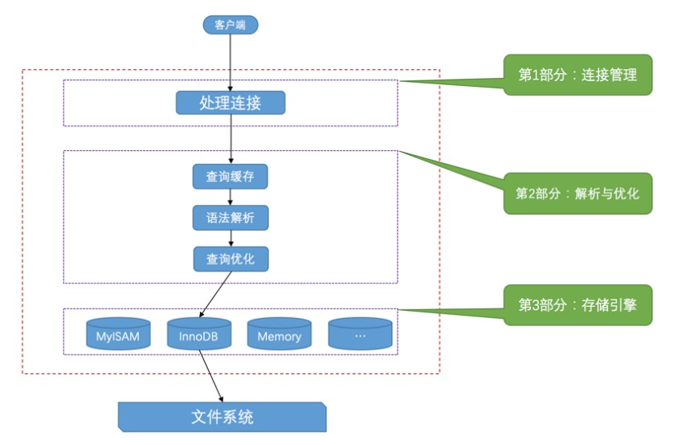
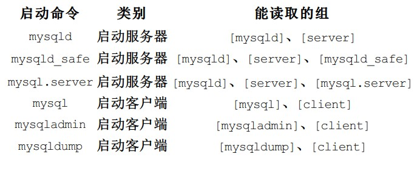

# 读书笔记

## 第1章

我们的MySQL服务器程序和客户端程序本质上都算是计算机上的一个进程，这个代表着MySQL服务器程序的进程也被称为MySQL数据库实例，简称数据库实例。

每个进程都有一个名称，这个名称是编写程序的人自己定义的，比如我们启动的MySQL服务器进程的默认名称为mysqld，而我们常用的MySQL客户端进程的默认名称为mysql。

mysqld这个可执行文件就代表着MySQL服务器程序，运行这个可执行文件就可以直接启动一个服务器进程。

mysqld_safe是一个启动脚本，它会间接调用mysqld，而且还顺便启动了另外一个监控进程，这个监控进程在服务器进程挂了的时候，可以帮助重启它。另外，使用mysqld_safe启动服务器程序时，它会将服务器程序的出错信息和其它诊断信息重定向到某个文件中，产生出错日志，这样可以方便我们找出发生错误的原因。

mysql.server也是一个启动脚本，它会间接调用mysqld_safe，在调用mysql.server时在后边指定start参数就可以启动服务器程序了，就像这样：mysql.server start。

运行着的服务器程序和客户端程序本质上都是计算机上的一个进程，所以客户端进程向服务器进程发送请求并得到回复的过程本质上是一个**进程间通信的过程**！

客户端进程向服务器进程发送一段文本（MySQL语句），服务器进程处理后再向客户端进程发送一段文本（处理结果）。



### 连接管理

每当有一个客户端进程连接到服务器进程时，服务器进程都会创建一个线程来专门处理与这个客户端的交互，当该客户端退出时会与服务器断开连接，服务器并不会立即把与该客户端交互的线程销毁掉，而是把它缓存起来，在另一个新的客户端再进行连接时，把这个缓存的线程分配给该新客户端。这样就起到了不频繁创建和销毁线程的效果，从而节省开销。

### 解析与优化

MySQL服务器程序会把刚刚处理过的**查询**请求和结果缓存起来，如果下一次有一模一样的请求过来，直接从缓存中查找结果就好了，就不用再去底层的表中查找了。这个查询缓存可以在不同客户端之间共享，也就是说如果客户端A刚刚查询了一个语句，而客户端B之后发送了同样的查询请求，那么客户端B的这次查询就可以直接使用查询缓存中的数据。

如果两个查询请求在任何字符上的不同（例如：空格、注释、大小写），都会导致缓存不会命中。另外，如果查询请求中包含某些系统函数、用户自定义变量和函数、一些系统表，如 mysql、information_schema、 performance_schema 数据库中的表，那这个请求就不会被缓存。

MySQL的缓存系统会监测涉及到的每张表，只要该表的结构或者数据被修改，如对该表使用了INSERT、UPDATE、DELETE、TRUNCATE TABLE、ALTER TABLE、DROP TABLE或 DROP DATABASE语句，那使用该表的所有高速缓存查询都将变为无效并从高速缓存中删除！

虽然查询缓存有时可以提升系统性能，但也不得不因维护这块缓存而造成一些开销，比如每次都要去查询缓存中检索，查询请求处理完需要更新查询缓存，维护该查询缓存对应的内存区域。从MySQL 5.7.20开始，不推荐使用查询缓存，并在MySQL 8.0中删除。

因为我们写的MySQL语句执行起来效率可能并不是很高，MySQL的优化程序会对我们的语句做一些优化。

### 存储引擎

**MySQL服务器把数据的存储和提取操作都封装到了一个叫存储引擎的模块里**。我们知道表是由一行一行的记录组成的，但这只是一个逻辑上的概念，物理上如何表示记录，怎么从表中读取数据，怎么把数据写入具体的物理存储器上，这都是存储引擎负责的事情。为了实现不同的功能，MySQL提供了各式各样的存储引擎，不同存储引擎管理的表具体的存储结构可能不同，采用的存取算法也可能不同。

它的功能就是接收上层传下来的指令，然后对表中的数据进行提取或写入操作。

所以在MySQL server完成了查询优化后，只需按照生成的执行计划调用底层存储引擎提供的API，获取到数据后返回给客户端就好了。

## 第2章

在命令行中设置启动选项只对当次启动生效。

与在命令行中指定启动选项不同的是，配置文件中的启动选项被划分为若干个组。

配置文件中不同的选项组是给不同的启动命令使用的，如果选项组名称与程序名称相同，则组中的选项将专门应用于该程序。



如果我们在多个配置文件中设置了相同的启动选项，那以最后一个配置文件中的为准。

同一个配置文件中多个组的优先级将以最后一个出现的组中的启动选项为准。

如果同一个启动选项既出现在命令行中，又出现在配置文件中，那么以命令行中的启动选项为准。

### 系统变量

MySQL服务器程序运行过程中会用到许多影响程序行为的变量，它们被称为MySQL系统变量，比如允许同时连入的客户端数量用系统变量max_connections表示，表的默认存储引擎用系统变量default_storage_engine表示，查询缓存的大小用系统变量query_cache_size表示。

每个系统变量都有一个默认值，我们可以使用命令行或者配置文件中的选项在启动服务器时改变一些系统变量的值。大多数的系统变量的值也可以在程序运行过程中修改，而无需停止并重新启动它。

系统变量的作用范围：

- GLOBAL：全局变量，影响服务器的整体操作。
- SESSION：会话变量，影响某个客户端连接的操作。（注：SESSION有个别名叫LOCAL）

在服务器启动时，会将每个全局变量初始化为其默认值（可以通过命令行或选项文件中指定的选项更改这些默认值）。然后服务器还为每个连接的客户端维护一组会话变量，客户端的会话变量在连接时使用相应全局变量的当前值初始化。

通过启动选项设置的系统变量的作用范围都是GLOBAL的，也就是对所有客户端都有效的，因为在系统启动的时候还没有客户端程序连接进来。

如果某个客户端改变了某个系统变量在GLOBAL作用范围的值，并不会影响该系统变量在当前已经连接的客户端作用范围为SESSION的值，只会影响后续连入的客户端在作用范围为SESSION的值。

## 第3章

同一种字符集可以有多种比较规则，每种字符集都有一种默认的比较规则。

MySQL有4个级别的字符集和比较规则：服务器、数据库、表、列。

character_set_database和collation_database这两个系统变量是只读的，我们不能通过修改这两个变量的值而改变当前数据库的字符集和比较规则。先删除数据库，后续创建时重新指定。

由于字符集和比较规则是互相有联系的，如果我们只修改了字符集，比较规则也会跟着变化，如果只修改了比较规则，字符集也会跟着变化。

我们通常都把character_set_client、character_set_connection、character_set_results这三个系统变量设置成和客户端使用的字符集一致的情况，这样减少了很多无谓的字符集转换。

```sql
SET NAMES 字符集名;
```

如果你使用的是Windows系统，那应该设置成gbk。

以如果以后大家在对字符串做比较或者对某个字符串列做排序操作时没有得到想象中的结果，需要思考一下是不是比较规则的问题。
