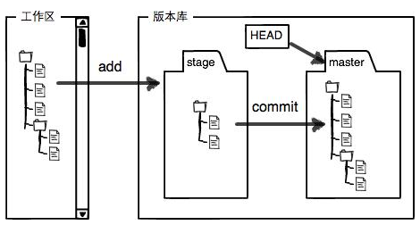

# Git

## Git简介

### 创建版本库

首先这里再明确一下，所有的版本控制系统，其实只能跟踪文本文件的改动，比如TXT文件，网页，所有的程序代码等等，Git也不例外。版本控制系统可以告诉你每次的改动，比如在第5行加了一个单词“Linux”，在第8行删了一个单词“Windows”。**而图片、视频这些二进制文件，虽然也能由版本控制系统管理，但没法跟踪文件的变化，只能把二进制文件每次改动串起来，也就是只知道图片从100KB改成了120KB，但到底改了啥，版本控制系统不知道，也没法知道**。不幸的是，Microsoft的Word格式是二进制格式，因此，版本控制系统是没法跟踪Word文件的改动的，**如果要真正使用版本控制系统，就要以纯文本方式编写文件**。

```bash
# 把这个目录变成Git可以管理的仓库：
git init
# 把文件添加到仓库：
git add <file>
# 把文件提交到仓库：
git commit -m <message>
```

## 时光机穿梭

```bash
# 掌握仓库当前的状态：
git status
# 看看具体修改了什么内容：
git diff <file>
# 查看工作区和版本库里面最新版本的区别：
git diff HEAD -- <file>
```

- 提交过，被修改，未添加：Changes not staged for commit；
- 已添加，未提交：Changes to be committed；
- 从未被添加过：Untracked files。

### 版本回退

每当你觉得文件修改到一定程度的时候，就可以“保存一个快照”，这个快照在Git中被称为commit。一旦你把文件改乱了，或者误删了文件，还可以从最近的一个commit恢复，然后继续工作，而不是把几个月的工作成果全部丢失。

```bash
# 显示从最近到最远的提交日志：
git log
# 简化输出信息：
git log --pretty=oneline
```

一大串类似1094adb...的是commit id（版本号），是一个用SHA1计算出来的一个非常大的数字，用十六进制表示。

在Git中，用HEAD表示当前版本，上一个版本就是HEAD^，上上一个版本就是HEAD^^，当然往上100个版本写100个^比较容易数不过来，所以写成HEAD~100。

```bash
# 回退到上一个版本：
git reset --hard HEAD^
# 指定回到某个版本：
git reset --hard <commit id>
```

Git的版本回退速度非常快，因为Git在内部有个指向当前版本的HEAD指针，当你回退版本的时候，Git仅仅是把HEAD从指向当前版本改为指向目标版本，然后顺便把工作区的文件更新了。

```bash
# 记录你的每一次命令：
git reflog
```

- 穿梭前，用git log可以查看提交历史，以便确定要回退到哪个版本。
- 要重返未来，用git reflog查看命令历史，以便确定要回到未来的哪个版本。

### 工作区和暂存区

*工作区*（Working Directory）：就是你在电脑里能看到的目录。

*版本库*（Repository）：工作区有一个隐藏目录.git，这个不算工作区，而是Git的版本库。Git的版本库里存了很多东西，其中最重要的就是称为stage（或者叫index）的*暂存区*，还有Git为我们自动创建的第一个*分支*master，以及指向master的一个*指针*叫HEAD。



把文件往Git版本库里添加的时候，是分两步执行的：

  1. 用git add把文件添加进去，实际上就是把文件修改添加到暂存区；
  2. 用git commit提交更改，实际上就是把暂存区的所有内容提交到当前分支。

我们创建Git版本库时，Git自动为我们创建了唯一一个master分支，所以，现在，git commit就是往master分支上提交更改。简单理解为，需要提交的文件修改通通放到暂存区，然后，一次性提交暂存区的所有修改。

### 管理修改

Git跟踪并管理的是*修改*，而非文件。**即提交的是暂存区的修改而不是工作区的修改**。

### 撤销修改

```bash
# 丢弃工作区的修改：
git checkout -- <file>
```

如果add过，就回到最近一次add的状态，如果没有add过，就回到最近一次commit的状态。

```bash
# 把暂存区的修改撤销掉：
git reset HEAD <file>
```

如果暂存区的工作都不想要，就先执行上条指令，再执行上上条指令。

场景：

  1. 当你改乱了工作区某个文件的内容，想直接丢弃工作区的修改时，用命令git checkout -- file。
  2. 当你不但改乱了工作区某个文件的内容，还添加到了暂存区时，想丢弃修改，分两步，第一步用命令git reset HEAD file，就回到了场景1，第二步按场景1操作。
  3. 已经提交了不合适的修改到版本库时，想要撤销本次提交，参考版本回退一节，不过前提是没有推送到远程库。

### 删除文件

前提：删除了一个已经提交到版本库的文件，此时git status提示**该文件被修改但未添加**。

```bash
# 确实想从版本库中删除该文件：
git rm <file>
git commit -m <message>
```

实际上，先手动删除文件，然后使用git rm file和git add file效果是一样的。**删除也是一种修改**。

```bash
# 删除了，但是版本库还有，想恢复：
git checkout -- <file>
```

因为此次修改没有被add，因此使用checkout命令会回到最近一次commit的状态，而上一次的版本库里还留存有该文件，因此将该文件从版本库恢复到了工作区。

git checkout其实是用版本库里的版本替换工作区的版本，无论工作区是修改还是删除，都可以“一键还原”。

**注意：从来没有被添加到版本库就被删除的文件，是无法恢复的**！

命令git rm用于删除一个文件。如果一个文件已经被提交到版本库，那么你永远不用担心误删，但是要小心，**你只能恢复文件到最新版本，你会丢失最近一次提交后你修改的内容**。

## 远程仓库

为什么GitHub需要SSH Key。因为GitHub需要识别出你推送的提交确实是你推送的，而不是别人冒充的，而Git支持SSH协议，所以，GitHub只要知道了你的公钥，就可以确认只有你自己才能推送。

当然，GitHub允许你添加多个Key。假定你有若干电脑，你一会儿在公司提交，一会儿在家里提交，只要把每台电脑的Key都添加到GitHub，就可以在每台电脑上往GitHub推送了。

### 添加远程库

```bash
# 关联一个空的仓库：
git remote add origin git@github.com:Mccreo/learngit.git
# 第一次推送：
git push -u origin master
# 后续推送：
git push origin master
```

远程库的名字就是origin，这是Git默认的叫法，也可以改成别的，但是origin这个名字一看就知道是远程库。

把本地库的内容推送到远程，用git push命令，实际上是把当前分支master推送到远程。

由于远程库是空的，我们第一次推送master分支时，加上了-u参数，Git不但会把本地的master分支内容推送给远程新的master分支，还会把本地的master分支和远程的master分支关联起来，在以后的推送或者拉取时就可以简化命令。

### 从远程库克隆
