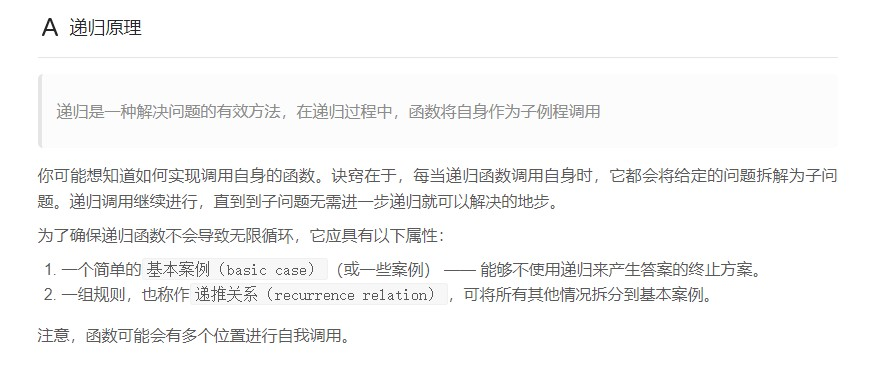
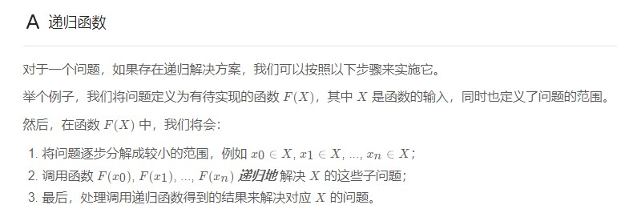

# 递归

## 递归原理



```java
/**
 * 344. 反转字符串
 * 使用递归解决反转字符串。
 */
class Solution {
    public void reverseString(char[] s) {
        this.helper(s, 0, s.length - 1);
    }

    private void helper(char[] s, int left, int right) {
        // basic case:
        if (left > right) {
            return;
        }
        // recurrence relation:
        helper(s, left + 1, right - 1);
        char tmp = s[left];
        s[left] = s[right];
        s[right] = tmp;
    }
}
```



```java
```
