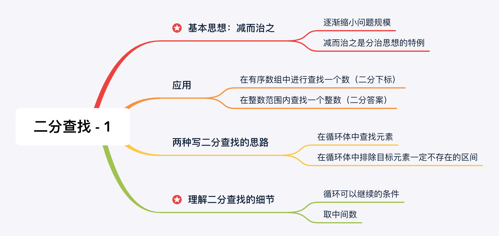
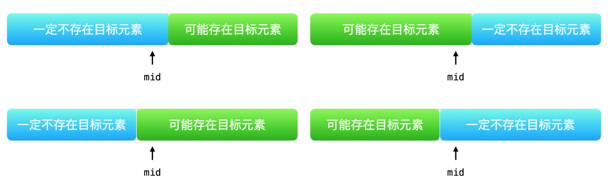

# 笔记

## 二分查找



## 在循环体中查找元素

```java
public class Solution {
    public int search(int[] nums, int target) {
        int len = nums.length;
        int left = 0;
        int right = len - 1;
        // 目标元素可能存在在区间 [left, right]
        while (left <= right) {
            int mid = (left + right) >>> 1;
            if (nums[mid] == target) {
                return mid;
            } else if (nums[mid] < target) {
                // 目标元素可能存在在区间 [mid + 1, right]
                left = mid + 1;
            } else {
                // 目标元素可能存在在区间 [left, mid - 1]
                right = mid - 1;
            }
        }
        return -1;
    }
}
```

细节：

- `while (left <= right)`表示在区间里只剩下一个元素的时候，我们**还需要继续查找**，这一行代码对应了二分查找算法的思路：**在循环体中查找元素**。
- 中间数的取整。`int mid = (left + right) >>> 1`这是向下取整，即区间元素为偶数个时，位于中间位置的元素个数有两个，我们取靠左的元素。而`int mid = (left + right + 1) >>> 1`就是向上取整，取中间靠右的元素。这两种做法都可以通过评测。
    - 因为我们的思路是**根据中间那个位置的数值决定下一轮搜索在哪个区间**，每一轮要看的那个数当然可以不必是位于中间的那个元素，靠左和靠右都是没有问题的。
    - 甚至取到每个区间的三分之一、四分之一、五分之四，都是没有问题的。
    - 一般而言，取位于区间起点二分之一处，首先是因为这样写简单，还有一个更重要的原因是：取中间位置的那个元素在平均意义下效果最好。
    - 在本小节中，选择中间靠左或者靠右元素都不影响结果，为了简单通常选择不加1的写法。

## 在循环体里排除一定不存在目标元素的区间


```java
public class Solution {
    public int search(int[] nums, int target) {
        int len = nums.length;
        int left = 0;
        int right = len - 1;
        // 目标元素可能存在在区间 [left, right]
        while (left < right) {
            int mid = left + (right - left) / 2;
            if (nums[mid] < target) {
                // 下一轮搜索区间是 [mid + 1, right]
                left = mid + 1;
            } else {
                // 下一轮搜索区间是 [left, mid]
                right = mid;
            }
        }
        if (nums[left] == target) {
            return left;
        }
        return -1;
    }
}
```

```java
public class Solution {
    public int search(int[] nums, int target) {
        int len = nums.length;
        int left = 0;
        int right = len - 1;
        while (left < right) {
            // 向上取整
            int mid = left + (right - left + 1) / 2;
            if (nums[mid] > target) {
                // 下一轮搜索区间是 [left, mid - 1]
                right = mid - 1;
            } else {
                // 下一轮搜索区间是 [mid, right]
                left = mid;
            }
        }
        if (nums[left] == target) {
            return left;
        }
        return -1;
    }
}
```

`while (left < right)`即`left`与`right`重合时退出循环，这一点表示区间里只剩下一个元素的时候，有可能这个元素就是我们要找的那个元素，这里与本小节的思路(在循环体中排除元素)是一致的：排除了所有错误的答案，如果题目告诉我们只有`1`个目标元素，那么剩下的这个元素就一定是目标元素。

退出循环后，单独做判断的意义：

- 首先，有些算法问题根据题目的意思，要找的目标元素一定落在题目给的区间里，那么最后的这一步判断可以省略；
- 并且我们看到这个写法只把区间分成了两个部分，其实在我们编写代码的时候要考虑的因素会更少。这两个区间没有交集，并且它们合起来组成了整个当前待搜索的区间。因此，在思考缩小待搜索区间的逻辑的时候，只需要考虑其中一种情况，另一种情况得到的区间就正好是上一个区间的反面区间；
- 那么如何考虑缩小问题的区间呢？通常的思路是：先思考要找的数的性质，然后对这个性质取反，也就是：**先讨论看到的中间位置的元素在什么情况下不是目标元素**，采用这样的思路解决问题会容易一些；
    - 例如本小题，我们就是要找`== target`的元素。对这个性质取反，就是`!= target`，也就是`< target`或者`> target`的时候，这两个条件选择其中一个，都可以缩小问题的区间，于是就有了上面两版代码的写法；
- 第二版代码采用了向上取整，这是必须的，否则会造成死循环。这个注意事项，不用刻意去记。我们在写完一个算法的时候，通常来说都会拿示例中的测试用例去执行一下我们所写的代码，在测试的时候，就能够意识到要调整下取整成为上取整。

### 取中间数可能向上取整的原因

首先本小节二分法的思路是根据中间数的值把区间分为两个部分：

- 一定不存在目标元素的部分；
- 可能存在目标元素的部分。

根据中间元素被分到哪一边，有以下两种可能：



mid被分到左边区间：

此时区间被分为两部分，`[left, mid]`和`[mid+1, right]`，对应设置边界代码为`right=mid`和`left=mid+1`。

mid被分到右边区间:

此时区间被分为两部分，`[mid, right]`和`[left, mid-1]`，对应设置边界代码为`left=mid`和`right=mid-1`。

这种情况下，当搜索区间里只剩下两个元素的时候，一定要将取中间数的行为改成上取整，也就是在括号里加1。

这是因为`[left, right]`区间里只剩下两个元素的时候，如果中间数mid是向下取整，一旦进入`left = mid`这个分支，区间就不会再缩小，下一轮搜索的区间还是`[left, right]`，下一次循环取mid还是看到了left，由于逻辑和上一轮循环一样，因此搜索区间不会缩小，就这样一直下去，这是一个死循环。

根据循环体里，中位数被分到哪个区间，来决定取中间数的时候是否上取整，**如果被分到右区间，我们进行向上取整**。

### 循环体里排除元素编码思路

- 循环终止条件写成：while (left < right) ，表示退出循环的时候只剩下一个元素；
- 在循环体内考虑如何缩减待搜索区间，也可以认为是**在待搜索区间里排除一定不存在目标元素的区间**；
- 根据中间数被分到左边和右边区间，来调整取中间数的行为；
- 如何缩小待搜索区间，一个有效的办法是：从 `nums[mid]` 满足什么条件的时候一定不是目标元素去考虑，进而考虑 mid 的左边元素和右边元素哪一边可能存在目标元素。一个结论是：当看到 left = mid 的时候，取中间数需要上取整，这一点是为了避免死循环；
- 退出循环的时候，根据题意看是否需要单独判断最后剩下的那个数是不是目标元素。

边界设置的两种写法：

- right = mid 和 left = mid + 1 和 int mid = left + (right - left) / 2; 一定是配对出现的；
- right = mid - 1 和 left = mid 和 int mid = left + (right - left + 1) / 2; 一定是配对出现的。

## 总结

- 如果这个二分查找的问题比较简单，在输入数组里不同元素的个数只有 1 个，使用思路 1 ，在循环体内查找这个元素；
- 如果这个二分查找的问题比较复杂，要你找一个可能在数组里不存在，或者是找边界这样的问题，使用思路 2 ，在循环体内排除一定不存在目标元素的区间会更简单一些。
