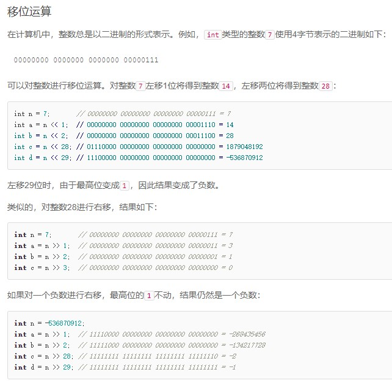
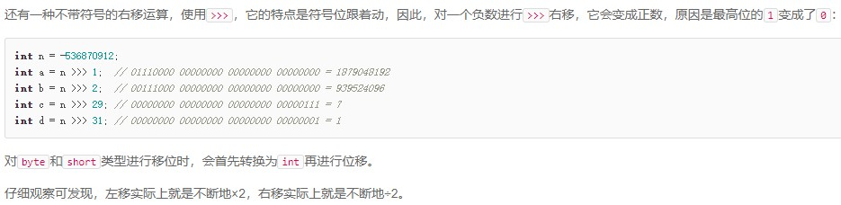
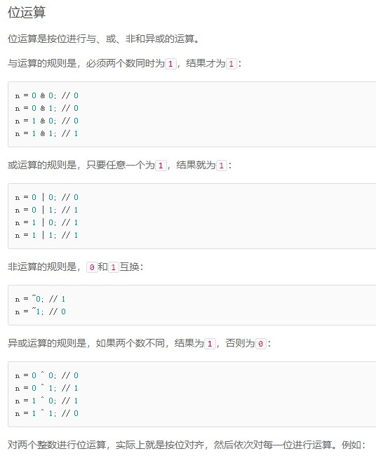
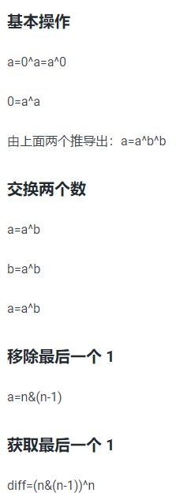

# 二进制

## TIPS









## 136.只出现一次的数字

> 给定一个非空整数数组，除了某个元素只出现一次以外，其余每个元素均出现两次。找出那个只出现了一次的元素。

```Java
// 同一个数字异或两次就变成了0，最后剩下的就是只出现一次的数字
public int singleNumber(int[] nums) {
    int ans = nums[0];
    for (int i = 1; i < nums.length; i++)
        ans ^= nums[i];
    return ans;
}
```

## 137.只出现一次的数字Ⅱ

> 给定一个非空整数数组，除了某个元素只出现一次以外，其余每个元素均出现了三次。找出那个只出现了一次的元素。

```Java
// 转化为二进制后查看每一列1的个数，如果某列1的个数不为3的倍数，是因为只出现1次的数字贡献出了自己的二进制1
// 因此只要对不为3的倍数列写1，对为3的倍数列写0，就得到了这个只出现1次的数字
public int singleNumber(int[] nums) {
    int ans = 0;
    // 整数范围由32位二进制数表示，最高位为符号位
    for (int i = 0; i < 32; i++) {
        int count = 0;
        for (int num : nums) {
            // 统计每列1的个数，将数字右移i列后和1与运算，为1表示该数二进制在该列取值为1
            count += (num >> i) & 1;
        }
        // 取余为1表明该列不为3的倍数，按照i列左移回去后和答案数字取或运算或者异或运算即可得到答案数字
        ans |= (count % 3) << i;
    }
    return ans;
}
```

## 260.只出现一次的数字Ⅲ

> 给定一个整数数组 nums，其中恰好有两个元素只出现一次，其余所有元素均出现两次。找出只出现一次的那两个元素。

```Java
// 通过要找的两个数字的二进制某一位不同，将原数组分为两组，然后组内分别进行异或，最后要找的数字就是两组分别异或的结果
public int[] singleNumber(int[] nums) {
    int diff = 0;
    for (int num : nums)
        diff ^= num;
    // diff = Integer.highestOneBit(diff); // 取最高位1作为不同
    diff = (diff & (diff - 1)) ^ diff;  // 取最低位1作为不同
    int[] ans = {0, 0};
    for (int num : nums) {
        if ((diff & num) == 0)
            ans[0] ^= num; // 当前位是0的组
        else
            ans[1] ^= num; // 当前位是1的组
    }
    return ans;
}
```
