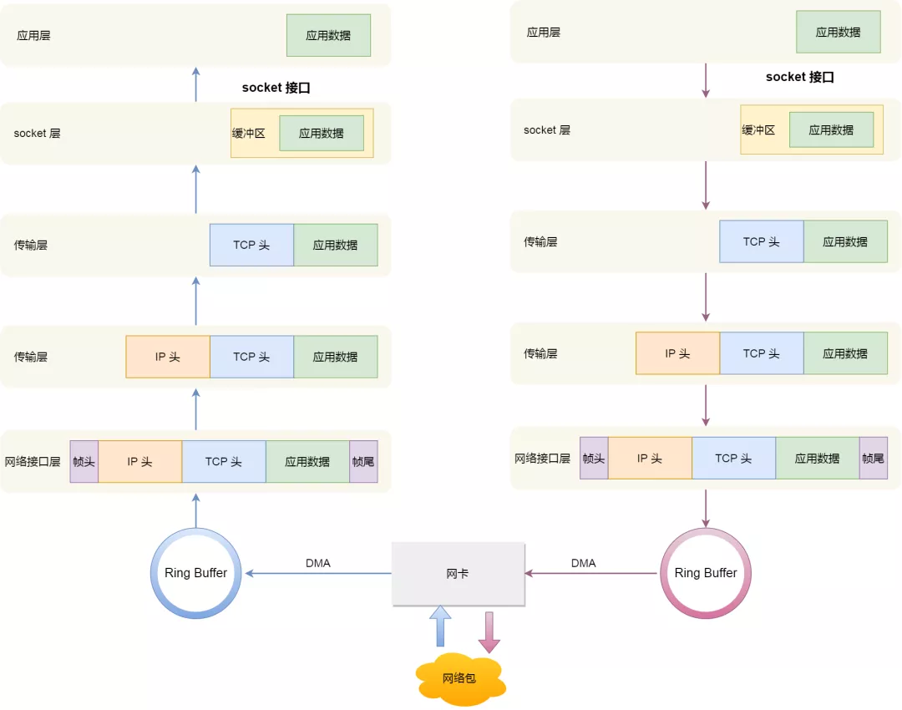

# 笔记

## Linux收发数据包流程

Linux采用应用层-socket层-传输层-网络层-链路层模型来收发数据包。

调用socket接口是一个系统调用，因此会产生中断从用户态转为内核态。

当有网络包到达时，网卡发起硬件中断，执行网卡中断处理函数，**中断处理函数处理完需要「暂时屏蔽中断」，然后唤醒「软中断」来轮询处理数据，直到没有新数据时才恢复中断，这样一次中断处理多个网络包**，于是就可以降低网卡中断带来的性能开销。

否则，连续到达的多个网络包，如果每个都需要发起一次中断的话，会影响系统的运行效率。

Ring Buffer是一个环形缓冲区，位于内核内存中的网卡驱动里，软中断会将Ring Buffer中的数据拷贝到内核struct sk_buff缓冲区中。

