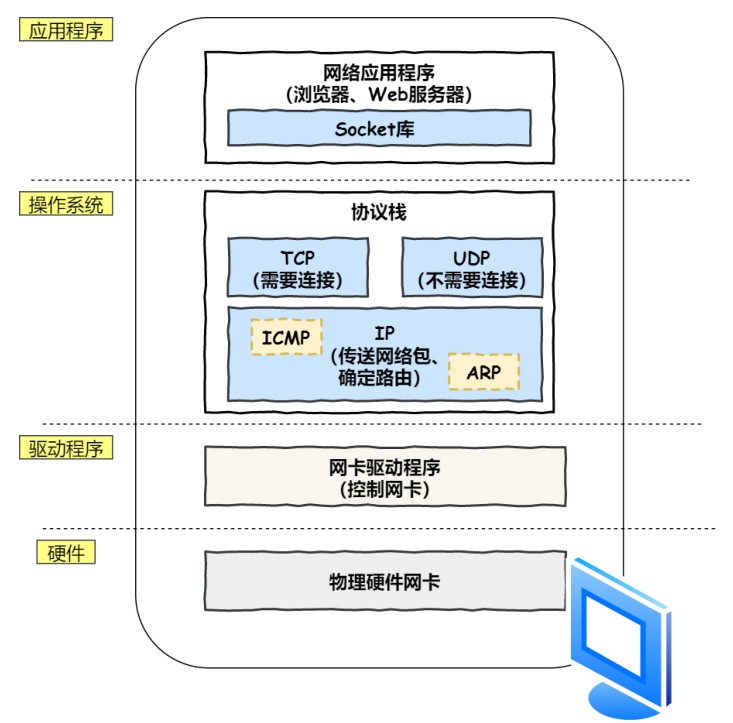

# 网页显示原理

## 孤独小弟-HTTP

解析URL，生成HTTP请求消息。

## 真实地址查询-DNS

1. 客户端查本地域名服务器。
2. 本地域名服务器缓存能找到则直接返回，否则询问根域名服务器，根域名服务器收到后，告诉本地域名服务器一个顶级域名地址。
3. 本地域名服务器查询顶级域名服务器，顶级域名服务器收到后，告诉本地域名服务器一个权限域名地址。
4. 本地域名服务器查询权限域名地址，权限域名服务器收到后，告诉本地域名服务器一个IP。
5. 本地域名服务器将域名和IP缓存，将IP返回给客户端。

## 指南好帮手-协议栈

通过 DNS 获取到 IP 后，就可以把 HTTP 的传输⼯作交给操作系统中的协议栈。

## 可靠传输-TCP

通过三次握手建立TCP连接，生成TCP报文。

## 远程定位-IP

生成IP报文。

## 两点传输-MAC

生成MAC报文。

## 出口-网卡

在头部添加报头和起始帧分节符，在尾部添加FCS。

转为电信号，通过网线发送出去。

## 送别者-交换机

交换机根据MAC地址表查找MAC地址，将信号发送到相应端口。

## 出境大门-路由器

## 互相扒皮-服务器与客户端
